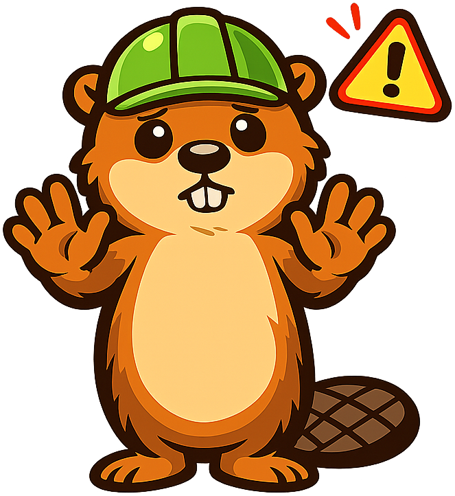

# Chapter 11: Atmospheric Pollution

## Summary

This chapter covers the sources, chemistry, and health effects of air pollution. Students learn about primary and secondary pollutants, the six criteria air pollutants, photochemical smog, thermal inversions, indoor air quality, acid rain, and the Clean Air Act. After completing this chapter, students will be able to trace pollutant pathways from source to impact and evaluate pollution reduction technologies.

## Concepts Covered

This chapter covers the following 20 concepts from the learning graph:

1. Air Pollution
2. Primary Pollutants
3. Secondary Pollutants
4. Criteria Air Pollutants
5. Carbon Monoxide
6. Sulfur Dioxide
7. Nitrogen Oxides
8. Ground-Level Ozone
9. Particulate Matter
10. Lead Pollution
11. Volatile Organic Compounds
12. Photochemical Smog
13. Thermal Inversion
14. Indoor Air Pollutants
15. Radon
16. Asbestos
17. Acid Rain
18. Noise Pollution
19. Clean Air Act
20. Catalytic Converters

## Prerequisites

This chapter builds on concepts from:

- [Chapter 8: Earth Systems and Resources](../08-earth-systems/index.md)

---

!!! mascot-welcome "Bailey Says: Welcome, Builders!"
    
    Welcome to the chapter where we clear the air -- literally! You might think air pollution is just "dirty smoke from factories," but the science is way more interesting (and sneaky) than that. Some of the worst pollutants are invisible. Some are created by sunlight transforming other chemicals. And some are lurking inside your own house right now! Dam, that's a lot to cover. But everything's connected -- from car exhaust to acid rain to the laws that protect your lungs. Let's build on that!

## Introduction: The Invisible Threat

Take a deep breath. You just inhaled about half a liter of air containing roughly 78% nitrogen, 21% oxygen, 0.9% argon, 0.04% carbon dioxide, and trace amounts of dozens of other gases. If you're in a clean environment, that breath was harmless. If you're in a polluted city, it also contained sulfur dioxide, nitrogen oxides, ozone, particulate matter, volatile organic compounds, and carbon monoxide -- all at concentrations high enough to damage your lungs, heart, and brain over time.

**Air pollution** is the presence of substances in the atmosphere at concentrations high enough to harm living organisms, damage materials, or alter climate. It kills an estimated 7 million people per year worldwide, making it the single largest environmental health risk on the planet. That's more than malaria, tuberculosis, and HIV/AIDS combined.

But here's the empowering part: air pollution is a problem we know how to solve. The United States has cut emissions of major air pollutants by over 70% since 1970 while the economy grew by 400%. The science is clear, the technology exists, and the policies work. Let's understand how.

## 11.1 Primary vs. Secondary Pollutants

Air pollutants come in two fundamental categories:

**Primary pollutants** are released directly into the atmosphere from a source. When coal burns and releases sulfur dioxide, that SO\(_2\) is a primary pollutant. When a car's engine produces carbon monoxide from incomplete combustion, that CO is a primary pollutant. What you see leaving the smokestack or tailpipe? Primary.

**Secondary pollutants** are NOT released directly. They form in the atmosphere when primary pollutants react with each other, with sunlight, or with naturally occurring atmospheric chemicals. Ground-level ozone is a classic secondary pollutant -- it doesn't come out of any tailpipe, but it forms when nitrogen oxides and volatile organic compounds react in the presence of sunlight.

This distinction matters enormously for pollution control. To reduce a primary pollutant, you target the source. To reduce a secondary pollutant, you must identify and control the *precursor* chemicals that combine to create it -- a much more complex systems challenge.

| Category | Examples | Source |
|---|---|---|
| Primary Pollutants | CO, SO\(_2\), NO, particulate matter, lead, VOCs | Emitted directly from sources |
| Secondary Pollutants | O\(_3\) (ground-level ozone), H\(_2\)SO\(_4\), HNO\(_3\), photochemical smog | Formed by chemical reactions in atmosphere |

## 11.2 The Six Criteria Air Pollutants

The U.S. Environmental Protection Agency (EPA) designates six **criteria air pollutants** -- substances so widespread and harmful that they are regulated by National Ambient Air Quality Standards (NAAQS) under the **Clean Air Act**. Think of these as the "Big Six" of outdoor air pollution.

### 1. Carbon Monoxide (CO)

**Carbon monoxide** is a colorless, odorless gas produced by incomplete combustion of fossil fuels. Your car's engine, gas stoves, wood fires, and industrial boilers all produce CO. It's dangerous because it binds to hemoglobin in your blood about 200 times more tightly than oxygen does, effectively suffocating your cells from the inside.

- **Primary source:** Vehicle exhaust (especially older vehicles without modern emission controls)
- **Health effects:** Headaches, dizziness, impaired judgment, death at high concentrations
- **Trend:** U.S. CO emissions have dropped about 70% since 1970, primarily due to **catalytic converters**

### 2. Sulfur Dioxide (SO\(_2\))

**Sulfur dioxide** is produced when sulfur-containing fuels (especially coal and heavy oil) are burned. It irritates the respiratory system and is a key precursor to acid rain and fine particulate matter.

- **Primary source:** Coal-fired power plants, industrial processes
- **Health effects:** Bronchoconstriction, aggravated asthma, reduced lung function
- **Trend:** U.S. SO\(_2\) emissions have dropped over 90% since 1970 due to scrubbers and fuel switching

### 3. Nitrogen Oxides (NO\(_x\))

**Nitrogen oxides** -- primarily nitric oxide (NO) and nitrogen dioxide (NO\(_2\)) -- form when fuel burns at high temperatures. Any combustion hot enough to break the triple bond in atmospheric N\(_2\) produces NO\(_x\). These gases contribute to smog, acid rain, and ground-level ozone formation.

- **Primary source:** Vehicle engines, power plants, industrial furnaces
- **Health effects:** Respiratory inflammation, increased susceptibility to infection
- **Trend:** Declining due to catalytic converters and power plant controls

### 4. Ground-Level Ozone (O\(_3\))

**Ground-level ozone** is the primary ingredient in smog. Unlike stratospheric ozone (which protects us from UV radiation), ground-level ozone is a harmful secondary pollutant. It forms when NO\(_x\) and **volatile organic compounds (VOCs)** react in the presence of sunlight:

\[
\text{NO}_2 + \text{UV light} \rightarrow \text{NO} + \text{O}
\]
\[
\text{O} + \text{O}_2 \rightarrow \text{O}_3
\]

VOCs sustain this cycle by converting NO back to NO\(_2\), preventing NO from scavenging the ozone. The result: on hot, sunny, still days, ozone accumulates to harmful levels.

- **Primary precursors:** NO\(_x\) + VOCs + sunlight
- **Health effects:** Chest pain, coughing, throat irritation, worsened asthma, reduced lung function
- **Key fact:** Ozone pollution is worst on hot, sunny afternoons -- exactly when people want to be outside

!!! mascot-thinking "Bailey Says: Think About It!"
    
    Here's an air pollution paradox that blows my mind: ozone in the stratosphere (15-35 km up) is GOOD -- it blocks UV radiation. Ozone at ground level is BAD -- it damages lungs and plants. Same molecule, completely different story depending on WHERE it is! This is why systems thinking matters -- context changes everything. See how it all fits together?

### 5. Particulate Matter (PM)

**Particulate matter** is a mixture of tiny solid particles and liquid droplets suspended in air. It's classified by size:

- **PM\(_{10}\)** -- particles 10 micrometers or smaller (dust, pollen, mold). Can penetrate the upper respiratory system.
- **PM\(_{2.5}\)** -- particles 2.5 micrometers or smaller (combustion byproducts, smoke, haze). Can penetrate deep into the lungs and enter the bloodstream.

PM\(_{2.5}\) is especially dangerous. These particles are so small that about 30 of them could line up across the width of a human hair. They carry toxic chemicals deep into your lungs, trigger inflammation, and increase the risk of heart attacks, strokes, lung cancer, and premature death.

- **Primary sources:** Combustion (vehicles, power plants, fires), dust, construction, agriculture
- **Health effects:** Respiratory disease, cardiovascular disease, premature death
- **Key fact:** PM\(_{2.5}\) is the air pollutant responsible for the most deaths worldwide

### 6. Lead (Pb)

**Lead pollution** in the atmosphere comes primarily from leaded gasoline (now banned in most countries), metal smelters, battery manufacturing, and waste incinerators. Lead is a potent neurotoxin with no safe level of exposure in children.

- **Primary source (historical):** Leaded gasoline -- the single largest source before its phase-out
- **Health effects:** Brain damage, developmental delays in children, kidney damage, reproductive problems
- **Trend:** Atmospheric lead levels dropped over 98% after leaded gasoline was banned in the U.S. (1996)

The leaded gasoline story is one of the most dramatic environmental health victories in history. Lead was added to gasoline in the 1920s despite warnings about toxicity. It took decades of scientific research and political struggle to remove it. Atmospheric lead levels plummeted almost immediately after the ban.

#### Diagram: Criteria Air Pollutants Source-to-Impact Tracker

<iframe src="../../sims/criteria-pollutant-tracker/main.html" width="100%" height="500px" scrolling="no"></iframe>

Criteria Air Pollutants Source-to-Impact Tracker

Type: diagram
**sim-id:** criteria-pollutant-tracker 
**Library:** vis-network 
**Status:** Specified

**Bloom Level:** Analyze
**Bloom Verb:** Trace
**Learning Objective:** Students trace each criteria air pollutant from its source through atmospheric chemistry to its health and environmental impacts.
**Instructional Rationale:** Network visualization reveals that pollutants share sources and interact with each other -- reinforcing that air pollution is a system, not a list of independent chemicals.

Network diagram with three columns. LEFT column: Sources (vehicles, power plants, industry, natural sources). CENTER column: Six criteria pollutants (CO, SO2, NOx, O3, PM, Pb) plus VOCs as a precursor. RIGHT column: Impacts (respiratory disease, cardiovascular disease, acid rain, smog, ecosystem damage, neurological damage). Edges connect sources to pollutants they produce, and pollutants to their impacts. Special dashed edges show secondary formation: NOx + VOCs -> O3, SO2 -> H2SO4 -> acid rain, NOx -> HNO3 -> acid rain. Color coding: sources in gray, primary pollutants in orange, secondary pollutants in red, health impacts in purple, environmental impacts in brown. User can click any node to highlight all connected paths. Hover shows details.

### Volatile Organic Compounds (VOCs)

**Volatile organic compounds** deserve special mention even though they're not one of the "Big Six" criteria pollutants individually. VOCs are carbon-containing chemicals that easily evaporate at room temperature. Sources include:

- Vehicle exhaust and fuel evaporation
- Industrial solvents and paints
- Trees and vegetation (natural VOCs like isoprene)
- Household products (cleaners, air fresheners, new furniture)

VOCs are critical because they're a key precursor to ground-level ozone. Some VOCs are also directly toxic -- benzene, for example, is a known carcinogen.

## 11.3 Photochemical Smog

**Photochemical smog** is a brownish haze that forms over cities when sunlight drives chemical reactions between NO\(_x\) and VOCs. The word "smog" originally meant "smoke + fog" (from London's coal-burning era), but modern photochemical smog is a completely different beast -- produced by vehicle exhaust and sunlight.

The smog cycle follows a daily pattern:

1. **Morning rush hour:** Vehicles release NO\(_x\) and VOCs
2. **Late morning:** Sunlight intensity increases, NO\(_2\) begins breaking down, ozone starts forming
3. **Afternoon:** Ozone and other secondary pollutants peak
4. **Evening:** Sunlight fades, ozone production stops, NO scavenges remaining ozone

Cities most vulnerable to photochemical smog share key features: heavy traffic, abundant sunlight, and geography that traps air (valleys, coastal basins). Los Angeles, Mexico City, and Beijing are classic smog cities.

### Thermal Inversion

A **thermal inversion** occurs when a layer of warm air sits on top of cooler air near the ground, trapping pollutants. Normally, the atmosphere gets cooler with altitude, and warm polluted air near the surface rises and disperses. During an inversion, this vertical mixing stops. Pollutants accumulate at ground level, sometimes for days.

Thermal inversions are responsible for some of the worst air pollution disasters in history:

- **Donora, Pennsylvania (1948):** A thermal inversion trapped industrial pollution for 5 days, killing 20 people and sickening 7,000
- **London Great Smog (1952):** A 5-day inversion combined with coal smoke killed an estimated 4,000-12,000 people
- **Beijing and Delhi** regularly experience multi-day inversions with hazardous air quality

#### Diagram: Thermal Inversion Simulator

<iframe src="../../sims/thermal-inversion/main.html" width="100%" height="500px" scrolling="no"></iframe>

Thermal Inversion Simulator

Type: microsim
**sim-id:** thermal-inversion 
**Library:** p5.js 
**Status:** Specified

**Bloom Level:** Understand
**Bloom Verb:** Explain
**Learning Objective:** Students explain how thermal inversions trap pollutants near the ground by comparing normal and inverted atmospheric temperature profiles.
**Instructional Rationale:** Animated particle simulation makes the invisible (air movement and pollutant trapping) visible, connecting temperature profiles to pollution outcomes.

Split-screen simulation. LEFT: Normal atmospheric conditions -- temperature profile shows decreasing temp with altitude. Animated pollution particles (small gray/brown dots) rise from source at bottom (factory, vehicles) and disperse upward and outward. Air is clear above. RIGHT: Thermal inversion -- temperature profile shows warm layer aloft creating a "lid." Pollution particles rise but hit the inversion layer and accumulate below it, creating visible haze that thickens over time. Toggle button switches between normal and inversion. Slider controls emission rate. Temperature profile graph shown on side of each panel. Time counter shows hours elapsed. Pollution concentration meter (AQI-style green-yellow-orange-red-purple scale) displays below each panel.

!!! mascot-warning "Bailey Says: Watch Out!"
    
    Here's a mistake that trips up a lot of students: thermal inversions do NOT create pollution. They trap pollution that's already being emitted. The inversion is like putting a lid on a pot -- the steam was already there, but now it can't escape. If emissions were zero, an inversion would trap... nothing. Always identify the SOURCE and the CONDITIONS as separate factors!

## 11.4 Indoor Air Pollutants

Here's a fact that surprises most people: indoor air is typically 2-5 times MORE polluted than outdoor air, and sometimes up to 100 times worse. Given that most people spend 85-90% of their time indoors, **indoor air pollutants** are a massive health concern.

Common indoor air pollutants include:

- **Carbon monoxide** -- gas stoves, furnaces, fireplaces, attached garages
- **VOCs** -- new furniture, paint, cleaning products, air fresheners
- **Particulate matter** -- cooking, candles, fireplaces, smoking
- **Biological pollutants** -- mold, dust mites, pet dander, bacteria
- **Formaldehyde** -- pressed wood products, insulation, adhesives

Two indoor pollutants deserve special attention:

### Radon

**Radon** is a colorless, odorless, radioactive gas that seeps into buildings from natural uranium decay in soil and rock. It's the second leading cause of lung cancer after smoking, responsible for an estimated 21,000 deaths per year in the United States alone.

Radon enters buildings through cracks in foundations, gaps around pipes, and porous concrete. It accumulates in basements and lower floors. Testing is simple and inexpensive (hardware store test kits cost about $15), and mitigation systems (sub-slab depressurization) are effective and relatively affordable.

### Asbestos

**Asbestos** is a group of naturally occurring mineral fibers once widely used in insulation, roofing, flooring, and fireproofing. When disturbed, asbestos releases microscopic fibers that, when inhaled, lodge permanently in lung tissue. Decades later, they can cause mesothelioma (a lethal cancer of the lung lining) and asbestosis (scarring of lung tissue).

Asbestos is now banned or restricted in most countries, but millions of buildings constructed before 1980 still contain it. The key safety principle: intact asbestos is not dangerous. Disturbed asbestos is extremely dangerous. That's why asbestos removal is a specialized profession with strict safety protocols.

## 11.5 Acid Rain

**Acid rain** is precipitation with a pH below 5.6 (the natural pH of rain, which is slightly acidic due to dissolved CO\(_2\)). It forms when sulfur dioxide and nitrogen oxides react with water vapor in the atmosphere:

\[
\text{SO}_2 + \text{H}_2\text{O} \rightarrow \text{H}_2\text{SO}_3 \quad \text{(sulfurous acid)}
\]
\[
2\text{SO}_2 + \text{O}_2 + 2\text{H}_2\text{O} \rightarrow 2\text{H}_2\text{SO}_4 \quad \text{(sulfuric acid)}
\]
\[
4\text{NO}_2 + \text{O}_2 + 2\text{H}_2\text{O} \rightarrow 4\text{HNO}_3 \quad \text{(nitric acid)}
\]

Acid rain damages ecosystems in multiple ways:

- **Aquatic ecosystems:** Lowers lake and stream pH, killing fish eggs and invertebrates, dissolving aluminum from soil that poisons fish gills
- **Forests:** Leaches calcium and magnesium from soil, damages leaf surfaces, weakens trees' resistance to disease and cold
- **Buildings and monuments:** Dissolves limestone and marble, corroding culturally irreplaceable structures
- **Soil chemistry:** Disrupts nutrient cycling, mobilizes toxic metals

Acid rain is a powerful example of how pollution in one location affects ecosystems hundreds of miles downwind. Factories in the Ohio Valley produced acid rain that devastated lakes in New England and eastern Canada. This cross-boundary nature made acid rain one of the first pollution problems to require international cooperation.

#### Diagram: Acid Rain Formation and Impact Pathway

<iframe src="../../sims/acid-rain-pathway/main.html" width="100%" height="500px" scrolling="no"></iframe>

Acid Rain Formation and Impact Pathway

Type: diagram
**sim-id:** acid-rain-pathway 
**Library:** vis-network 
**Status:** Specified

**Bloom Level:** Analyze
**Bloom Verb:** Trace
**Learning Objective:** Students trace the pathway from SO2 and NOx emissions through atmospheric chemistry to acid deposition and ecological damage.
**Instructional Rationale:** Multi-step pathway visualization emphasizes that acid rain is a systems problem involving emission sources, atmospheric chemistry, weather patterns, and ecosystem vulnerability.

Landscape-style network diagram flowing left to right. LEFT: Emission sources (coal plant, vehicles, industrial furnace) emit SO2 and NOx nodes. CENTER: Atmospheric reactions zone showing chemical transformation equations: SO2 + H2O -> H2SO4, NOx + H2O -> HNO3. Cloud node represents transport by wind (arrow shows prevailing wind direction). RIGHT: Deposition zone showing acid rain falling on: lake (pH meter showing decline), forest (trees with damaged canopy), building (corroded marble surface), soil (nutrient leaching diagram). pH scale shown at bottom for reference (battery acid through pure water to baking soda). Interactive: click source nodes to increase/decrease emissions and watch downstream pH and damage indicators respond.

The good news: acid rain is a success story. The U.S. Acid Rain Program (part of the 1990 Clean Air Act amendments) used a cap-and-trade system to reduce SO\(_2\) emissions from power plants by over 90%. Eastern lakes and forests are slowly recovering, though full recovery will take decades because acid-damaged soils recover slowly.

## 11.6 Noise Pollution

**Noise pollution** might seem out of place in a chapter about atmospheric pollutants, but sound travels through the atmosphere, and excessive noise causes real ecological and health damage:

- **Human health:** Hearing loss, sleep disruption, increased stress hormones, cardiovascular disease, impaired cognitive performance in children
- **Wildlife:** Disrupted communication (birds, whales), altered foraging behavior, habitat abandonment, reduced reproductive success
- **Measurement:** Sound is measured in decibels (dB). Normal conversation is about 60 dB. Prolonged exposure above 85 dB causes hearing damage. A jet takeoff at 300 meters is about 130 dB.

| Sound Source | Decibel Level | Risk |
|---|---|---|
| Whisper | 30 dB | None |
| Normal conversation | 60 dB | None |
| City traffic | 85 dB | Hearing damage with prolonged exposure |
| Lawn mower | 90 dB | Hearing damage after 2 hours |
| Rock concert | 110 dB | Hearing damage within minutes |
| Jet engine (30 m) | 140 dB | Immediate pain and damage |

Recent research has revealed surprising ecological effects. Traffic noise reduces bird species diversity near highways. Ship noise disrupts whale communication across ocean basins. Even plants respond to sound vibrations, affecting pollination by buzzing insects.

!!! mascot-thinking "Bailey Says: Think About It!"
    
    Wood you believe that noise pollution affects trees? Well, indirectly it does! Studies show that scrub jays avoid noisy areas and stop planting pinyon pine seeds there. Fewer jays means fewer planted seeds means fewer trees. A noise from a gas compressor changes a forest decades later. Now THAT is a connection most people would never see. Everything's connected!

## 11.7 Solutions: The Clean Air Act and Technology

### The Clean Air Act

The **Clean Air Act** (1970, with major amendments in 1977 and 1990) is the foundational U.S. law for controlling air pollution. It:

- Established National Ambient Air Quality Standards (NAAQS) for criteria pollutants
- Required states to develop implementation plans
- Set emission standards for vehicles, power plants, and industry
- Created the Acid Rain Program (cap-and-trade for SO\(_2\))
- Regulated hazardous air pollutants (189 toxic chemicals)
- Required environmental impact assessment for major projects

The results have been remarkable:

| Pollutant | Reduction Since 1970 |
|---|---|
| Carbon Monoxide | -73% |
| Lead | -98% |
| Nitrogen Oxides | -65% |
| Ground-Level Ozone | -25% |
| Particulate Matter (PM\(_{2.5}\)) | -42% (since 2000) |
| Sulfur Dioxide | -92% |

These reductions occurred while U.S. GDP grew by approximately 400%, population grew by 60%, and vehicle miles traveled increased by 200%. The Clean Air Act demonstrates that environmental protection and economic growth are not mutually exclusive.

### Catalytic Converters

**Catalytic converters** are devices installed in vehicle exhaust systems that use platinum, palladium, and rhodium catalysts to convert toxic exhaust gases into less harmful substances:

- CO \(\rightarrow\) CO\(_2\)
- Unburned hydrocarbons \(\rightarrow\) CO\(_2\) + H\(_2\)O
- NO\(_x\) \(\rightarrow\) N\(_2\) + O\(_2\)

Modern three-way catalytic converters reduce these pollutants by over 90%. They are arguably the single most impactful pollution control technology ever deployed on vehicles.

#### Diagram: U.S. Air Quality Trends Dashboard

<iframe src="../../sims/air-quality-trends/main.html" width="100%" height="500px" scrolling="no"></iframe>

U.S. Air Quality Trends Dashboard

Type: chart
**sim-id:** air-quality-trends 
**Library:** Chart.js 
**Status:** Specified

**Bloom Level:** Evaluate
**Bloom Verb:** Assess
**Learning Objective:** Students assess the effectiveness of the Clean Air Act by analyzing emission trends for all six criteria pollutants alongside economic indicators.
**Instructional Rationale:** Dual-axis time series charts powerfully counter the misconception that environmental regulation harms the economy by showing simultaneous pollution decline and economic growth.

Multi-line time series chart spanning 1970-2025. LEFT y-axis: pollutant emissions (indexed to 1970 = 100). Six colored lines for each criteria pollutant, all declining at different rates. RIGHT y-axis: GDP (indexed to 1970 = 100), rising steadily. X-axis: years with key policy milestones marked (1970 Clean Air Act, 1990 Amendments, 1996 leaded gas ban, etc.). Dropdown to toggle individual pollutant lines on/off. Hover shows exact values and year. Annotation callouts at key inflection points explaining what caused changes. GDP line in green, pollutant lines in warm colors (red, orange, amber). Gray shaded areas mark recession years for economic context.

## 11.8 Media Literacy Spotlight: Air Quality Claims

Air quality data is publicly available but often misrepresented. Here's how to be a smart consumer of air pollution information:

**Check the Air Quality Index (AQI):** The EPA's AQI (available at airnow.gov) reports real-time air quality on a 0-500 scale. Values under 50 are good; 51-100 are moderate; 101-150 are unhealthy for sensitive groups; above 150 is unhealthy for everyone.

**Red flags in air quality claims:**

- Cherry-picking time periods ("Air quality has gotten worse since [very clean year]!")
- Comparing measurements from different monitoring methods
- Conflating indoor and outdoor air quality
- Using national averages that hide regional hot spots
- Citing CO\(_2\) as an "air pollutant" in the same context as criteria pollutants (CO\(_2\) is a greenhouse gas but not regulated as a criteria air pollutant under the Clean Air Act)

**Practice exercise:** Find your local air quality data on airnow.gov. What is today's AQI? Which pollutant is the "driver" (the one closest to its threshold)? How does your area compare to the national average?

!!! mascot-tip "Bailey Says: Pro Tip!"
    
    Here's a free tool that turns you into an air quality expert: the EPA's AirNow website (airnow.gov). You can check real-time and forecast AQI for any location in the U.S. On high-ozone days, the site even tells you what time of day is safest for outdoor exercise. Knowledge is power -- and in this case, knowledge is literally lung protection! Let's build on that!

## Chapter Summary

Air pollution encompasses both primary pollutants (emitted directly from sources) and secondary pollutants (formed by atmospheric chemical reactions). The six criteria air pollutants -- carbon monoxide, sulfur dioxide, nitrogen oxides, ground-level ozone, particulate matter, and lead -- are regulated under the Clean Air Act due to their widespread health impacts. Photochemical smog forms when NOx and VOCs react in sunlight, and thermal inversions can trap pollutants near the ground to dangerous levels. Indoor air quality is often worse than outdoor, with radon and asbestos posing particular risks. Acid rain, caused by SO\(_2\) and NO\(_x\) emissions, damages aquatic ecosystems, forests, and structures but has been dramatically reduced by policy action. The Clean Air Act and technologies like catalytic converters demonstrate that air pollution is a solvable problem.

## Key Terms

| Term | Definition |
|---|---|
| Air Pollution | Atmospheric substances at concentrations harmful to living organisms or materials |
| Primary Pollutants | Pollutants emitted directly from a source |
| Secondary Pollutants | Pollutants formed by chemical reactions in the atmosphere |
| Criteria Air Pollutants | Six pollutants regulated by EPA under National Ambient Air Quality Standards |
| Photochemical Smog | Brown haze formed by sunlight-driven reactions between NO\(_x\) and VOCs |
| Thermal Inversion | Warm air layer trapping cool, polluted air near the ground |
| VOCs | Carbon-containing chemicals that easily evaporate and contribute to ozone formation |
| Acid Rain | Precipitation with pH below 5.6, caused by SO\(_2\) and NO\(_x\) emissions |
| Radon | Radioactive gas from uranium decay in soil; second leading cause of lung cancer |
| Catalytic Converter | Vehicle exhaust device using metal catalysts to convert toxic gases to less harmful ones |
| Clean Air Act | U.S. federal law (1970) establishing air quality standards and emission controls |

---

??? question "Self-Test: Check Your Understanding"

    **1.** Classify each as primary or secondary pollutant: (a) SO\(_2\) from a coal plant, (b) ground-level ozone, (c) CO from a car engine, (d) sulfuric acid in acid rain, (e) lead particles from a smelter.

    **2.** Explain why ground-level ozone concentrations peak in the afternoon rather than during morning rush hour when vehicle emissions are highest.

    **3.** A city experiences a thermal inversion lasting 3 days. Describe what happens to air pollutant concentrations and explain why the inversion prevents normal dispersal.

    **4.** Compare the health risks of radon and asbestos. How does the route of exposure differ, and why are both particularly dangerous over long time periods?

    **5.** The Clean Air Act reduced SO\(_2\) emissions by 92% since 1970. Using the acid rain formation equations, explain why this dramatically reduced acid rain.

    **6.** A politician argues that environmental regulations like the Clean Air Act hurt the economy. Using data from this chapter, construct a counter-argument.

    **7.** Design a plan to reduce indoor air pollution in a school building. Address at least three specific pollutants and explain your strategies.

    **8.** Why is PM\(_{2.5}\) more dangerous than PM\(_{10}\)? Explain in terms of particle size, penetration depth, and health effects.

    ??? note "Selected Answers"

        **1.** (a) Primary -- emitted directly from combustion. (b) Secondary -- formed by NOx + VOCs + sunlight reaction. (c) Primary -- emitted from incomplete combustion. (d) Secondary -- formed when SO2 reacts with water vapor. (e) Primary -- emitted directly from industrial source.

        **2.** Morning rush hour produces precursors (NO\(_x\) and VOCs), but ozone formation requires UV sunlight to drive the photochemical reaction. UV intensity peaks at midday-afternoon, so ozone concentrations peak 4-6 hours after the precursor pulse. This time lag between emission and formation is a hallmark of secondary pollutants.

        **6.** Between 1970 and 2025, the Clean Air Act reduced criteria pollutant emissions by 65-98% while U.S. GDP grew approximately 400%. The EPA estimates that the Act's health benefits (reduced medical costs, fewer sick days, longer lives) exceed its compliance costs by a ratio of 30:1. Environmental protection and economic growth occurred simultaneously, disproving the zero-sum assumption.

!!! mascot-celebration "Bailey Says: You Crushed It, Builders!"
    
    Dam, you just navigated 20 concepts about air pollution -- from the chemistry of smog to the policy that cleaned our skies! Here's what I want you to take away: air pollution is one of the clearest examples of a problem that science identified, technology addressed, and policy solved. Not perfectly, not completely, but dramatically. The Clean Air Act proves that when we understand the connections and act on the evidence, we can build a healthier world. Everything's connected, and now you can trace every pollutant from source to solution. That's real power!

[See Annotated References](./references.md)
