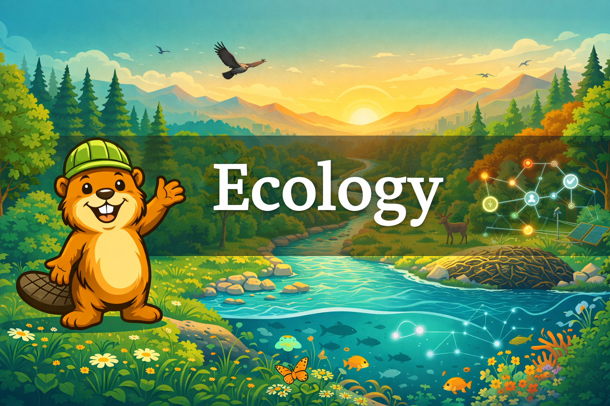

# Ecology: Systems Thinking for a Changing Planet

{ width="100%" }

Welcome to our interactive intelligent textbook on Ecology! This textbook is designed for high school students (grades 9-12) who want to understand how natural systems work and how they are connected together. This course covers topics aligned with introductory college-level ecology and college placement [Environmental Science](./glossary.md#environmental-science) frameworks -- from ecosystems and biodiversity to climate change and environmental policy -- with 81 hands-on simulations, an interactive learning graph, and a focus on systems thinking and scientific literacy throughout.
This course is not associated with The College Board in any way and no endorsement from The College Board is implied.

## What You Will Learn

1. [Foundations of Ecology](chapters/01-foundations-of-ecology/index.md) -- ecosystems, species, energy, matter
2. [Ecosystems and Biomes](chapters/02-ecosystems-and-biomes/index.md) -- terrestrial and aquatic biomes, food webs, trophic levels
3. [Energy Flow](chapters/03-energy-flow/index.md) -- primary productivity, thermodynamics, trophic efficiency
4. [Biogeochemical Cycles](chapters/04-biogeochemical-cycles/index.md) -- carbon, nitrogen, phosphorus, and water cycles
5. [Species Interactions](chapters/05-species-interactions/index.md) -- predation, competition, mutualism, keystone species
6. [Biodiversity and Ecosystem Services](chapters/06-biodiversity-and-services/index.md) -- succession, island biogeography, tolerance
7. [Population Ecology](chapters/07-population-ecology/index.md) -- growth models, carrying capacity, demographics
8. [Earth Systems and Resources](chapters/08-earth-systems/index.md) -- plate tectonics, soils, atmosphere, climate patterns
9. [Sustainability and Energy Resources](chapters/09-sustainability-and-energy/index.md) -- fossil fuels, renewables, nuclear, EROI
10. [Land and Water Use](chapters/10-land-and-water-use/index.md) -- agriculture, mining, urbanization, sustainable practices
11. [Atmospheric Pollution](chapters/11-atmospheric-pollution/index.md) -- smog, acid rain, criteria pollutants, Clean Air Act
12. [Water and Land Pollution](chapters/12-water-and-land-pollution/index.md) -- eutrophication, toxicology, waste management
13. [Systems Thinking](chapters/13-systems-thinking/index.md) -- feedback loops, leverage points, resilience, emergence
14. [Scientific Literacy](chapters/14-scientific-literacy/index.md) -- peer review, logical fallacies, statistical reasoning
15. [Global Climate Change](chapters/15-global-climate-change/index.md) -- greenhouse effect, tipping points, policy responses
16. [Biodiversity Loss and Policy](chapters/16-biodiversity-loss-and-policy/index.md) -- HIPPO framework, endangered species, conservation
17. [Evaluating Environmental Claims](chapters/17-evaluating-environmental-claims/index.md) -- misinformation, greenwashing, fact-checking

## Features

- **81 Interactive MicroSims** -- hands-on simulations for every major concept using p5.js, vis-network, and Chart.js
- **Learning Graph** -- visual map of 360+ course concepts and their dependencies
- **Bailey the Beaver** -- your learning mascot guides you with humor, puns, and systems thinking connections
- **Bloom's Taxonomy Alignment** -- objectives at all six cognitive levels (Remember through Create)
- **Media Literacy Training** -- every chapter includes source-checking and misinformation detection skills
- **Chapter Quizzes** -- self-assessment questions with collapsible answers

## How to Use This Book

Navigate using the sidebar on the left. Start with the [Course Description](course-description.md) for a full overview, then explore the [Learning Graph](learning-graph/index.md) to see how concepts connect before diving into chapters. Try the [MicroSims](sims/index.md) to interact with ecological concepts hands-on.

!!! note
    This course covers topics aligned with the AP Environmental Science framework but is **not affiliated with, endorsed by, or approved by the College Board**. AP and Advanced Placement are registered trademarks of the College Board.
