# An Inconvenient Truth

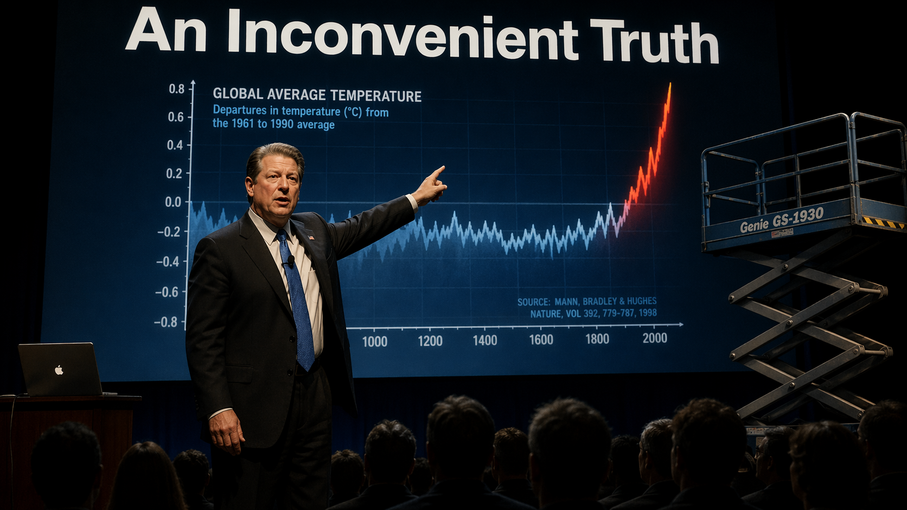

Cover Image Prompt

(This is the Cover Image. Do not include this label in the image.) Please generate a wide-landscape 16:9 cover image for a graphic novel titled "An Inconvenient Truth" in an early 2000s documentary photorealism style with political editorial illustration accents. Show Al Gore in 2005, a tall man in his late fifties with thick silver-streaked dark hair, a broad square face, and a serious but earnest expression. He stands on a darkened auditorium stage in a dark suit with a blue tie, one arm raised to point at a massive projected graph behind him — the famous "hockey stick" curve of global temperature climbing sharply upward at the far right. A mechanical scissor lift is parked stage-right, suggesting the iconic moment when Gore rides it to point at the skyrocketing CO2 line. In the foreground, an unseen audience of silhouetted heads watches in rapt silence. The title text "An Inconvenient Truth" is rendered in clean bold sans-serif type at the top. Color palette: deep navy blues, stage-light white, the vivid red and orange of the rising temperature line, charcoal shadows, warm amber spotlight on Gore. Emotional tone: solemn, urgent, and quietly thunderous. Include: (1) Gore's dark suit, blue tie, and American flag lapel pin, (2) the massive projected hockey-stick graph dominating the background, (3) the scissor lift hinting at the film's most famous visual, (4) silhouetted audience heads in the lower foreground, (5) a small wireless lapel microphone clipped to Gore's tie, (6) a laptop on a small podium running the slideshow. Generate the image immediately without asking clarifying questions.

Narrative Prompt

This is a 12-panel graphic novel about Albert Arnold "Al" Gore Jr. (born 1948), the American politician, environmentalist, and former Vice President whose 2006 documentary film *An Inconvenient Truth* brought climate science to a mainstream global audience and made him a Nobel Peace Prize laureate — while also fueling an intense political backlash that helped entrench climate change as a partisan issue in the United States. The story spans from the late 1960s to the 2020s, moving through Harvard classrooms, Congressional hearing rooms, Kyoto conference halls, the chaotic 2000 Florida recount, hotel conference rooms where Gore delivered his slideshow more than a thousand times, a Los Angeles production studio, the Sundance Film Festival, the Academy Awards stage, Oslo City Hall, and contemporary climate marches. The art style is early 2000s documentary photorealism with political editorial illustration accents — deep blues, stage-light whites, the red of rising temperature lines, and the warm amber of auditorium lighting. Al Gore should be drawn consistently across panels: a tall, broad-shouldered man with thick dark hair that grays steadily through the decades, a square jaw, and an earnest but intense gaze. He ages from a thoughtful 19-year-old college student to a weathered elder statesman in his seventies. Central theme: scientific evidence, once put in front of millions of ordinary people, becomes political — and the messenger pays a price for the message. The story emphasizes Gore's lifelong commitment to climate data, the craft of turning a slideshow into cinema, and the complex dual legacy of a film that both awakened climate awareness and hardened political divisions.

### Prologue -- The Slideshow That Became a Movie

In 2004, Al Gore was giving a slideshow about climate change to a small audience in Los Angeles. He had given this same talk more than a thousand times since losing the 2000 presidential election — in college auditoriums, church basements, corporate boardrooms, and hotel conference rooms. A producer named Laurie David was in that audience. So was an environmentalist named Lawrence Bender. They watched Gore click through graphs of CO2 and temperature, satellite photos of melting glaciers, and charts of rising sea levels. They turned to each other and said, almost at the same time: *This needs to be a movie.* Two years later, that slideshow became an Academy Award-winning documentary, helped win Gore a Nobel Peace Prize — and helped turn climate change from a scientific consensus into a political identity. This is the story of how that happened, and what it cost.

## Panel 1: A Question from a Harvard Professor

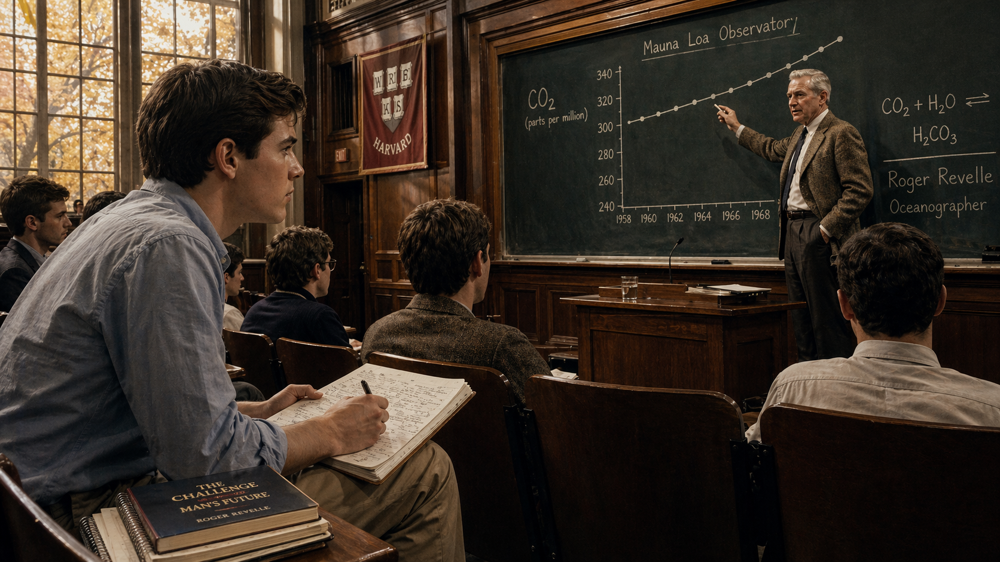

Image Prompt

(This is Panel 1. Do not include the panel number in the image.) I am about to ask you to generate a series of images for a graphic novel. Please make the images have a consistent style and consistent characters. Do not ask any clarifying questions. Just generate the image immediately when asked.

Please generate a 16:9 image in an early 2000s documentary photorealism style with political editorial illustration accents, depicting panel 1 of 12. The scene shows a Harvard University lecture hall in 1968. A young Al Gore, age 20, sits in the third row wearing a simple button-down shirt and khakis, his thick dark hair combed neatly, leaning forward with a focused, earnest expression. At the front of the room, Professor Roger Revelle — a tall, silver-haired oceanographer in his late fifties wearing a tweed jacket — stands at a blackboard on which he has drawn a simple rising graph of atmospheric CO2 from 1958 to 1968. The blackboard also shows the equation and the words "Mauna Loa Observatory." Sunlight streams through tall windows at the back of the hall. A few other students take notes, but Gore is rapt. Color palette: warm late-1960s academic tones, wood paneling, chalk-on-slate greens and whites, the gold of autumn sunlight, muted earth tones on clothing. Emotional tone: a young mind being lit on fire by real data. Specific details: (1) the rising CO2 graph clearly visible on the blackboard, (2) young Gore's intense, almost hungry attention, (3) Revelle gesturing at the graph with a piece of chalk, (4) an open notebook on Gore's lap covered in handwritten notes, (5) a hardcover book titled "The Challenge of Man's Future" peeking from a stack beside him, (6) Harvard crimson banners glimpsed through the lecture hall doorway. Generate the image immediately without asking clarifying questions.

Al Gore did not grow up wanting to be a climate advocate. He grew up wanting to be a senator, like his father. But in 1968, as a sophomore at Harvard, he enrolled in a natural sciences course taught by oceanographer Roger Revelle — the same Roger Revelle who had helped launch the Keeling Curve a decade earlier. Revelle showed his students the first ten years of CO2 data from Mauna Loa and explained what the rising line meant: humans were changing the composition of the atmosphere on a planetary scale. Gore was stunned. He had never heard anyone describe the planet as a single system before. He took notes. He kept them.

## Panel 2: The First Hearings

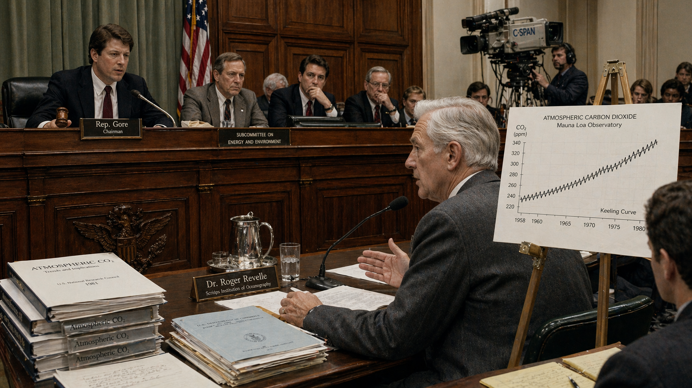

Image Prompt

(This is Panel 2. Do not include the panel number in the image.) Please generate a 16:9 image in an early 2000s documentary photorealism style, depicting panel 2 of 12. Make the characters and style consistent with the prior panel. The scene shows a U.S. House of Representatives subcommittee hearing room in 1981. A young Congressman Al Gore, age 33, sits at the head of the dais in a dark suit with a burgundy tie, gavel in hand, presiding over the first congressional hearings on climate change. Seated at a witness table below him is Roger Revelle — now in his seventies but still tall and dignified — testifying before the subcommittee. A chart showing the Keeling Curve is propped on an easel beside Revelle. Other committee members sit along the curved dais. The room has the worn green carpet and mahogany paneling of a 1980s Congressional hearing room. A few reporters sit in the back. Color palette: institutional greens and browns, mahogany, fluorescent-lit off-whites, muted reds from Gore's tie and the subdued American flag behind him. Emotional tone: a long, slow-building alarm finally being sounded in an official forum. Specific details: (1) the Keeling Curve chart on an easel showing CO2 from 1958 to 1980, (2) Gore in his chairman's seat with a gavel and microphone, (3) Revelle in the witness chair speaking into a desk microphone, (4) a nameplate reading "Rep. Gore" in front of Al Gore, (5) C-SPAN-style television camera mounted at the back, (6) stacks of scientific reports labeled "Atmospheric CO2" on the committee desk. Generate the image immediately without asking clarifying questions.

Gore won his first House seat in 1976 and immediately started pushing his colleagues to take climate change seriously. In 1981, he convened one of the first-ever Congressional hearings on global warming and invited his old professor Roger Revelle to testify. The hearings barely made the news. Most politicians considered the topic too academic, too slow-moving, too uncertain to bother with. But Gore kept holding hearings — year after year, through two decades in the House and Senate. He wrote speeches about it. He gave interviews about it. And he started building his own slideshow — a carefully curated set of graphs, maps, and satellite images that he used to explain climate science to anyone who would listen.

## Panel 3: Earth in the Balance

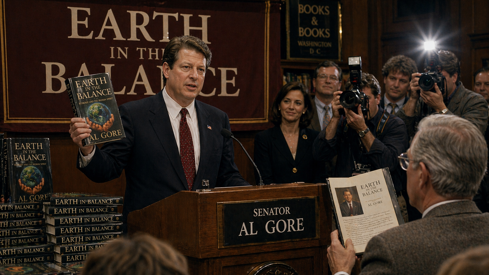

Image Prompt

(This is Panel 3. Do not include the panel number in the image.) Please generate a 16:9 image in an early 2000s documentary photorealism style with editorial illustration accents, depicting panel 3 of 12. Make the characters and style consistent with the prior panels. The scene shows Senator Al Gore, now age 44, in 1992, standing at a podium at a book launch event for his best-selling book *Earth in the Balance*. He holds up a hardcover copy of the book — its cover showing a green Earth cradled in human hands. Behind him, a large backdrop reads "EARTH IN THE BALANCE" in bold letters. A modest crowd of supporters and press photographers are gathered, with cameras flashing. Gore wears a well-tailored dark navy suit; his hair is thicker and more styled than in earlier panels, showing early gray at the temples. Color palette: 1990s book-tour aesthetics — warm bookstore browns, the forest-green and blue of the book's cover, camera-flash whites, Senate-chamber burgundy in the backdrop. Emotional tone: cautious optimism and public ambition. Specific details: (1) the book cover clearly visible in Gore's raised hand, (2) a banner reading "EARTH IN THE BALANCE" behind him, (3) press photographers with 1990s cameras flashing, (4) a stack of the book on a display table beside the podium, (5) a small American flag pin on Gore's lapel, (6) an audience member in the front row holding a copy of the book open to the inside flap. Generate the image immediately without asking clarifying questions.

In 1992, Senator Gore published *Earth in the Balance*, a 400-page book arguing that environmental protection should be the "central organizing principle" of modern civilization. It spent weeks on the New York Times bestseller list. Critics loved it; some colleagues called it naïve. That same year, Bill Clinton picked Gore as his running mate — in part because Gore's environmental credentials balanced the ticket. When Clinton won, Gore became the highest-ranking environmentalist ever to serve in the White House. He brought his slideshow with him.

## Panel 4: Kyoto

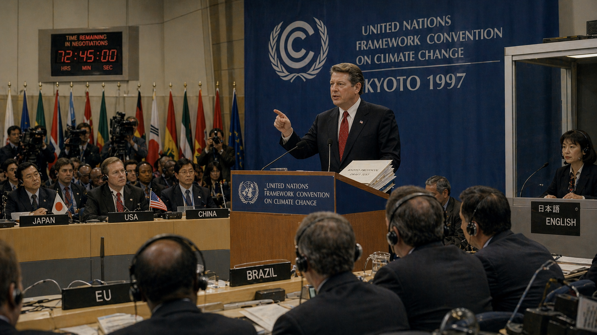

Image Prompt

(This is Panel 4. Do not include the panel number in the image.) Please generate a 16:9 image in an early 2000s documentary photorealism style, depicting panel 4 of 12. Make the characters and style consistent with the prior panels. The scene shows Vice President Al Gore, age 49, in December 1997 at the Kyoto Protocol climate conference in Kyoto, Japan. He stands at an international podium addressing delegates from nations around the world. Behind him, a large blue United Nations Framework Convention on Climate Change banner hangs with the conference logo and the words "KYOTO 1997." Delegates from many countries sit at long curved desks with nameplates and wearing translation headsets. Gore wears a dark suit with a red tie; his hair is now noticeably streaked with gray. A Japanese-English interpreter sits at a small glass booth nearby. Color palette: UN conference blues, red accents on Gore's tie and various national flags, pale wood and cream desks, bright overhead lighting. Emotional tone: diplomatic gravity and the fragile hope of international cooperation. Specific details: (1) the UN climate conference banner behind Gore, (2) delegates wearing translation headsets, (3) country nameplates visible on the desks (Japan, USA, China, EU, Brazil), (4) a stack of the Kyoto Protocol draft document on the podium, (5) camera crews and press photographers at the perimeter, (6) a digital countdown clock on the wall showing remaining negotiation time. Generate the image immediately without asking clarifying questions.

In December 1997, Vice President Gore flew to Kyoto, Japan, to try to save a stalled international climate treaty. Negotiators had been deadlocked for days. Gore delivered a speech urging flexibility, then personally intervened in the final negotiations. The Kyoto Protocol was signed — the first legally binding international agreement to cut greenhouse gas emissions. Back home, the U.S. Senate voted 95 to 0 against ratifying it. Gore had helped write the treaty, but his own country refused to honor it. The moment foreshadowed what was coming: climate policy was about to become one of the most bitterly partisan issues in American politics.

## Panel 5: The Election That Cracked in Half

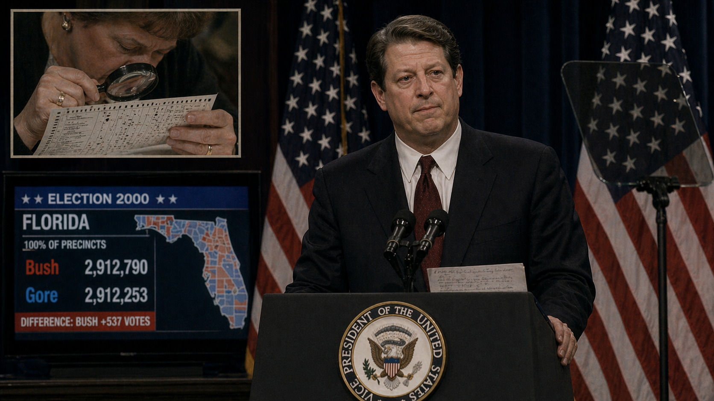

Image Prompt

(This is Panel 5. Do not include the panel number in the image.) Please generate a 16:9 image in an early 2000s documentary photorealism style with a melancholy editorial tone, depicting panel 5 of 12. Make the characters and style consistent with the prior panels. The scene shows Al Gore, age 52, on the evening of December 13, 2000, delivering his televised concession speech after the U.S. Supreme Court halted the Florida recount. He stands at a podium in front of American flags, wearing a dark suit, his face composed but visibly exhausted, heavy shadows under his eyes. A teleprompter is visible beside the podium. In a smaller inset in the upper corner, a Florida election worker is shown peering through a magnifying glass at a paper ballot looking for "hanging chads." A television screen beside the podium shows a split-screen electoral map — Florida's margin listed as "Bush +537 votes." Color palette: somber blues and grays, American flag red and white, television-screen white light on Gore's weary face. Emotional tone: profound loss absorbed in public with dignity. Specific details: (1) Gore's composed but exhausted expression, (2) a podium with the Vice Presidential seal, (3) the inset image of a Florida election worker examining a chad-laden ballot, (4) the TV screen showing "Florida: Bush 2,912,790 Gore 2,912,253", (5) American flags flanking the podium, (6) a single sheet of speech notes on the podium. Generate the image immediately without asking clarifying questions.

Gore ran for president in 2000 and won the national popular vote by more than half a million ballots. But the election came down to Florida, where the margin was just 537 votes and the ballots were riddled with "hanging chads" — tiny paper bits that made it impossible to tell which candidate some voters had chosen. Recounts began. Lawsuits followed. On December 12, 2000, the U.S. Supreme Court ordered the recounts halted. The next night, Gore conceded to George W. Bush. He could have kept fighting. He chose not to. A few weeks later, climate change lost its highest-ranking advocate in Washington — and the new Bush administration withdrew the United States from the Kyoto Protocol.

## Panel 6: A Thousand Slideshows

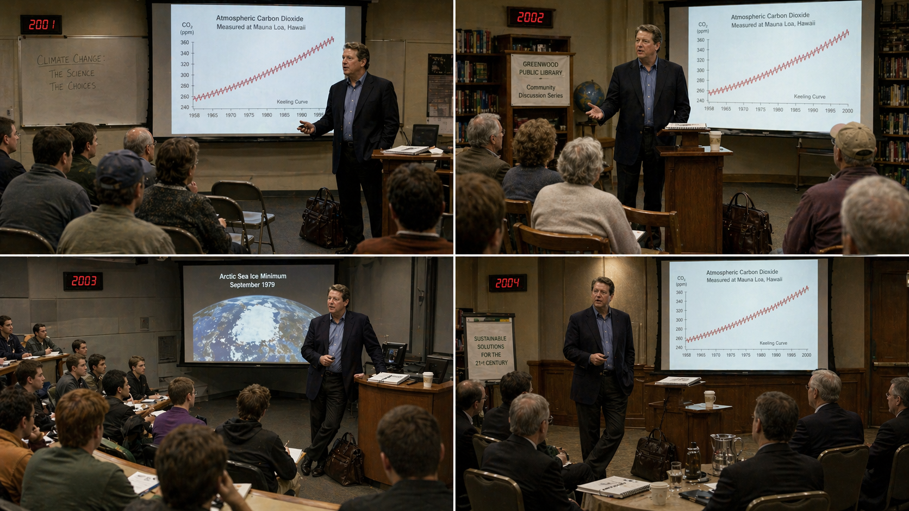

Image Prompt

(This is Panel 6. Do not include the panel number in the image.) Please generate a 16:9 image in an early 2000s documentary photorealism style, depicting panel 6 of 12. Make the characters and style consistent with the prior panels. The scene is a montage of four smaller images arranged in a 2x2 grid within a single wide 16:9 panel. Each small image shows Al Gore, age 53-55, giving the same slideshow in a different modest venue between 2001 and 2004: (top-left) a community college classroom with folding chairs; (top-right) a small-town library meeting room; (bottom-left) a college lecture hall with earnest students; (bottom-right) a hotel conference room with a dozen businesspeople. In each image, Gore is the same — slightly weathered, wearing a dark blazer without a tie, standing beside a projection screen showing the same Keeling Curve or a satellite image of shrinking Arctic sea ice. He carries his laptop bag in each scene. Color palette: muted earth tones, fluorescent-lit interiors, the vivid red-and-blue of the projected graphs, the warm gold of lower-stakes venues. Emotional tone: quiet, grinding persistence — a former vice president refusing to give up. Specific details across the four panels: (1) the same Keeling Curve or Arctic ice slide projected in every scene, (2) a well-worn leather laptop bag at Gore's feet in each image, (3) a half-full coffee cup on a side table in each scene, (4) small audiences that vary in size and dress, (5) a spiral-bound notebook on Gore's podium with handwritten speaker notes, (6) a digital clock somewhere in each image showing different years (2001, 2002, 2003, 2004). Generate the image immediately without asking clarifying questions.

Out of office and out of the spotlight, Gore did something unusual for a defeated presidential candidate: he did not stop working. He took his climate slideshow on the road. From 2001 through 2005, he gave the same talk more than a thousand times. Community colleges. Church basements. Business luncheons. High school gymnasiums. Each time, he updated the graphs with the latest data — and each time the red line crept higher. He paid for his own travel. He carried his own laptop. He kept meticulous notes on which slides worked and which did not. He was, as one friend put it, "running for Recycler-in-Chief."

## Panel 7: The Pitch in Los Angeles

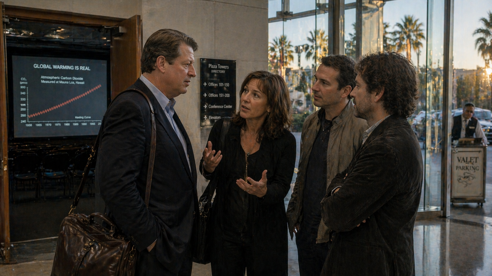

Image Prompt

(This is Panel 7. Do not include the panel number in the image.) Please generate a 16:9 image in an early 2000s documentary photorealism style, depicting panel 7 of 12. Make the characters and style consistent with the prior panels. The scene shows the lobby of a modern Los Angeles office building in 2004, just after one of Gore's slideshows ended. Al Gore, age 56, stands in a dark suit, his laptop bag over his shoulder, in conversation with three people: Laurie David, a Hollywood producer and environmental activist in her late forties with shoulder-length brown hair and a direct, animated expression; Lawrence Bender, a lean film producer in a casual jacket; and Davis Guggenheim, a documentary filmmaker in his early forties with thoughtful eyes and a day's stubble. Laurie David is speaking emphatically, hands gesturing toward Gore, while Guggenheim nods thoughtfully. Through tall glass windows behind them, palm trees sway in afternoon Los Angeles light. Color palette: California golden-hour warmth, glass-and-steel cool tones, the muted professional colors of creative-class Los Angeles. Emotional tone: the electric moment when an idea finds its messengers. Specific details: (1) Gore's slightly tired but attentive posture after giving the full talk, (2) Laurie David's animated expression and gesturing hands, (3) Davis Guggenheim's thoughtful, considering nod, (4) Lawrence Bender listening intently, (5) a projection screen visible through an open doorway still showing the final slide of Gore's presentation, (6) a valet parking stand outside the glass doors in the sunset light. Generate the image immediately without asking clarifying questions.

In May 2004, producer Laurie David — an environmental activist and Hollywood insider — attended a Gore slideshow in Los Angeles with producer Lawrence Bender. They were floored. They approached Gore afterward: *This needs to be a film. Not a speech. A real movie.* Gore was skeptical at first. He had spent his career being told he was stiff on camera. But David kept pushing. She brought in documentary director Davis Guggenheim, who had just finished a political film and was hungry for a bigger subject. Guggenheim watched the slideshow and came away convinced: the movie was not about the science. The movie was about a man who could not let go of the science. Pre-production began in early 2005.

## Panel 8: The Hockey Stick on the Lift

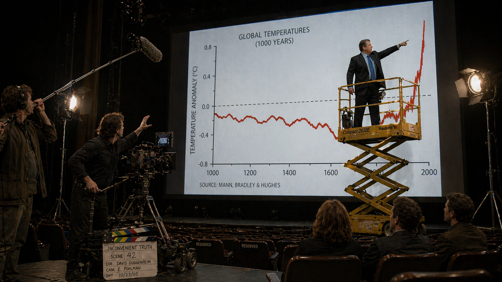

Image Prompt

(This is Panel 8. Do not include the panel number in the image.) Please generate a 16:9 image in an early 2000s documentary photorealism style, depicting panel 8 of 12. Make the characters and style consistent with the prior panels. The scene recreates the iconic moment from the documentary: Al Gore, age 57, in a dark suit and blue tie, stands on a yellow mechanical scissor lift that has elevated him ten feet above the stage. He points with one arm at the top of a massive projected graph behind him — the sharp spike at the far right of the global temperature / CO2 "hockey stick" curve. The lift tracks the rising red line into the air. Below him, Davis Guggenheim stands beside a film camera on a dolly, directing the shot. A crew member operates a boom microphone. Several film lights on stands illuminate the stage. The auditorium seats are dark and empty except for a few reserved seats where Laurie David and Lawrence Bender watch intently. Color palette: deep stage-black, the bright yellow of the scissor lift, the vivid red-orange of the rising temperature line, the crisp white of the slide background, amber spotlight warmth on Gore. Emotional tone: theatrical, almost operatic, as dry data becomes visual drama. Specific details: (1) the yellow scissor lift clearly visible under Gore, (2) the hockey-stick graph with its dramatic upward spike at the right edge, (3) Davis Guggenheim directing from beside a professional film camera, (4) a boom microphone operator at the edge of the stage, (5) a film slate on the floor reading "Inconvenient Truth - Scene 42", (6) Gore's pointing arm perfectly aligned with the top of the red line. Generate the image immediately without asking clarifying questions.

The most famous moment in the film was almost an accident. Guggenheim wanted to capture the sheer scale of the temperature spike in the final years of the Keeling Curve. Someone on the crew joked that the red line was climbing so high Gore would need a ladder to point at it. Guggenheim took the joke seriously. The next day, a mechanical scissor lift was rolled onto the stage. Gore stepped on, rode it up as the line climbed, and pointed at the spike. The shot became the visual centerpiece of the film — and one of the most iconic images in environmental storytelling. Gore had delivered the same data a thousand times in conference rooms. Now he was a character in a movie.

## Panel 9: Sundance

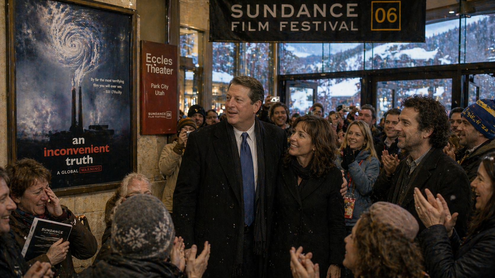

Image Prompt

(This is Panel 9. Do not include the panel number in the image.) Please generate a 16:9 image in an early 2000s documentary photorealism style, depicting panel 9 of 12. Make the characters and style consistent with the prior panels. The scene shows the lobby of the Eccles Theater in Park City, Utah, at the Sundance Film Festival in January 2006. Al Gore, age 57, stands in a warm winter overcoat outside the theater after the premiere of *An Inconvenient Truth*, surrounded by an enthusiastic crowd applauding as he exits. Laurie David stands beside him, beaming. Snow falls lightly outside the glass doors. Inside the lobby, a large movie poster for the film is displayed — showing a factory smokestack whose smoke curls into the shape of a hurricane, with the title "AN INCONVENIENT TRUTH" below. Festival-goers in ski jackets and winter hats clap and take photos. A few people wipe tears from their eyes. Color palette: Sundance winter palette — snow-white, pine green, warm interior gold, the bold blue-and-orange of the film poster. Emotional tone: the unexpected electricity of a documentary that moved people. Specific details: (1) the film poster with the hurricane-smokestack imagery and title, (2) Laurie David's delighted expression beside Gore, (3) falling snow visible through the glass lobby doors, (4) a Sundance Film Festival banner overhead, (5) an audience member with tears in her eyes and a program clutched to her chest, (6) Davis Guggenheim visible at the edge of the crowd looking both relieved and stunned. Generate the image immediately without asking clarifying questions.

*An Inconvenient Truth* premiered at the Sundance Film Festival on January 24, 2006. The audience gave it a standing ovation. Some people cried. Paramount Classics bought distribution rights on the spot. When the film opened in theaters that May, something unexpected happened — it became a hit. On a production budget of about one and a half million dollars, the documentary earned nearly fifty million dollars worldwide. Schools showed it in classrooms. Countries screened it on public television. It became, at the time, one of the highest-grossing documentaries in history. The slideshow Gore had given a thousand times for free was now reaching millions at ten dollars a ticket.

## Panel 10: The Backlash

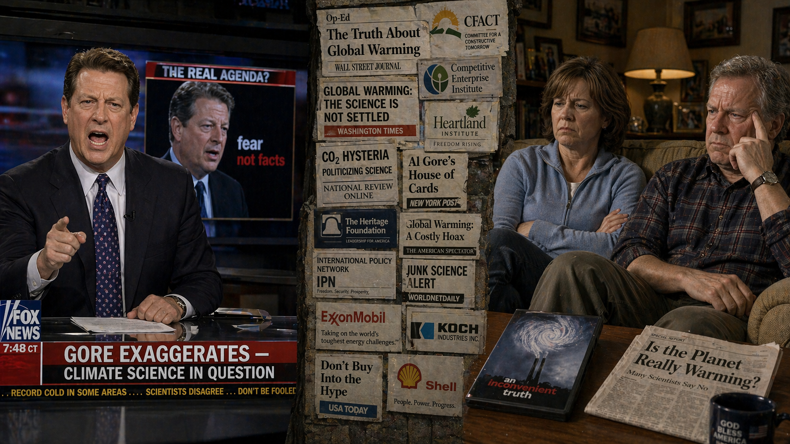

Image Prompt

(This is Panel 10. Do not include the panel number in the image.) Please generate a 16:9 image in an early 2000s documentary photorealism style with sharp editorial cartoon overtones, depicting panel 10 of 12. Make the characters and style consistent with the prior panels. The scene is a split composition. On the left half: a TV studio where a cable news commentator — a well-dressed man in a dark suit — sits at an anchor desk shouting into the camera, with a lower-third graphic reading "GORE EXAGGERATES — CLIMATE SCIENCE IN QUESTION." Behind him, a screen shows an unflattering still of Gore from the film. On the right half: a modest suburban living room where a middle-aged couple watches the same TV broadcast, expressions skeptical and frustrated. A DVD copy of "An Inconvenient Truth" sits on a coffee table between them, unopened. In the narrow gap between the two halves, a stylized visual "wall" rises — representing the growing polarization — made of newspaper headlines, Op-Ed fragments, and think-tank report covers, many of which show logos subtly linked to fossil fuel industries. Color palette: cable-news reds and blues, suburban beiges and browns, the sharp contrast of TV-screen white on a dim living room. Emotional tone: the moment scientific evidence becomes tribal identity. Specific details: (1) the cable news host in mid-shout with a stern expression, (2) the chyron graphic visible on the TV, (3) the couple's skeptical expressions, (4) the unopened DVD on the coffee table, (5) the collaged "wall" of headlines and fossil-fuel-linked think tank logos in the center seam, (6) a newspaper on the couch with a headline reading "Is the Planet Really Warming?". Generate the image immediately without asking clarifying questions.

As the film succeeded, a counter-campaign organized against it. Think tanks funded by fossil fuel companies produced reports attacking Gore's data. Cable news networks ran segments questioning his credibility. A British judge ruled in 2007 that schools showing the film should present it alongside "nine inaccuracies" — most of which turned out to be disagreements about how strongly Gore had phrased uncertainties. The scientific consensus underlying the film was not seriously challenged; the IPCC's next major report in 2007 reinforced nearly all of Gore's claims. But something deeper was happening. Climate change was no longer just a scientific issue. In the United States, it was becoming a badge of political identity. Conservatives who had previously supported environmental action — from Teddy Roosevelt's parks to Nixon's EPA to George H. W. Bush's Clean Air Act — began polling against climate policy for the first time. The line on Keeling's graph kept climbing. So did the walls between the two sides of the debate.

## Panel 11: The Oscar and the Nobel

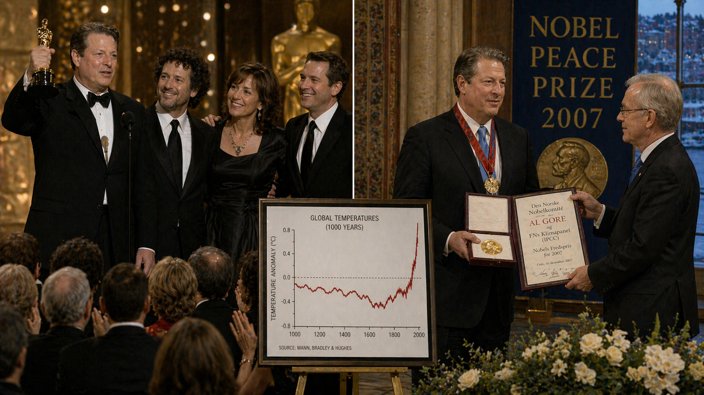

Image Prompt

(This is Panel 11. Do not include the panel number in the image.) Please generate a 16:9 image in an early 2000s documentary photorealism style with elegant ceremonial tones, depicting panel 11 of 12. Make the characters and style consistent with the prior panels. The scene is a split composition. On the left half: the Kodak Theatre in Hollywood, February 2007, at the 79th Academy Awards. Al Gore, age 58, in a tuxedo, stands on stage holding the gold Oscar statuette for Best Documentary Feature alongside director Davis Guggenheim, while producers Laurie David and Lawrence Bender beam beside them. A glittering audience of Hollywood luminaries applauds. On the right half: the ornate Oslo City Hall in Norway, December 2007. Al Gore stands in formal dress beside a distinguished Norwegian Nobel Committee chairman, receiving the Nobel Peace Prize medal and diploma, which he shares jointly with the Intergovernmental Panel on Climate Change. Behind him, a banner reads "Nobel Peace Prize 2007." Through tall windows, winter Oslo is visible. Color palette: Hollywood gold and black on the left, Nordic gold-and-ivory ceremonial tones on the right, the crimson red of both prize ribbons, formal blacks and whites. Emotional tone: the quiet vindication of a long journey. Specific details: (1) the Oscar statuette held aloft on the left, (2) Guggenheim, David, and Bender visible beside Gore at the Oscars, (3) the Nobel medal and diploma on the right, (4) a large Nobel Peace Prize banner in the Oslo hall, (5) Gore's slightly graying hair visible in both scenes, (6) an inset photograph on a press easel showing the film's hockey-stick image as the connecting visual thread between both ceremonies. Generate the image immediately without asking clarifying questions.

In February 2007, *An Inconvenient Truth* won two Academy Awards — Best Documentary Feature and Best Original Song for Melissa Etheridge's "I Need to Wake Up." Eight months later, the Nobel Committee announced that Al Gore and the Intergovernmental Panel on Climate Change would share the 2007 Nobel Peace Prize "for their efforts to build up and disseminate greater knowledge about man-made climate change." In his Nobel lecture in Oslo that December, Gore said: *"We, the human species, are confronting a planetary emergency — a threat to the survival of our civilization that is gathering ominous and destructive potential even as we gather here."* The line sounded like a prophecy to some and an exaggeration to others. Both interpretations still echo today.

## Panel 12: The Long Tail

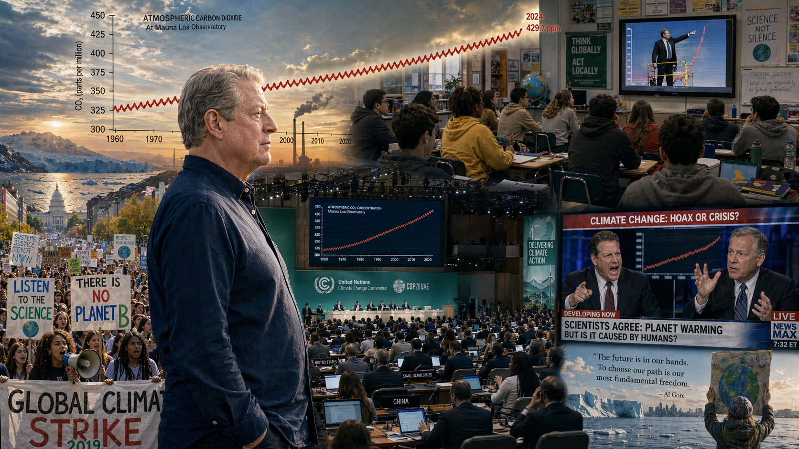

Image Prompt

(This is Panel 12. Do not include the panel number in the image.) Please generate a 16:9 image in a bold modern documentary-illustration style that is a culmination of the visual evolution across all panels, depicting panel 12 of 12. Make the characters consistent with the prior panels. The scene is a wide, layered montage. In the center-left, a contemporary Al Gore, now in his seventies with fully silver hair, stands quietly in profile looking at the horizon — an elder statesman in a simple open-collar shirt. Spreading out from him across the image are multiple scenes showing the film's long tail: (a) a large outdoor climate march in 2019 with thousands of young people carrying handmade signs that read "Listen to the Science" and "There Is No Planet B"; (b) a high school classroom where students watch the scissor-lift scene from the documentary on a large monitor, taking notes; (c) a United Nations COP conference hall where modern delegates debate climate policy beneath a huge Keeling Curve display; (d) a cable news split-screen showing pundits still arguing about the same graphs. Across the top of the image, a contemporary Keeling Curve reaches past 425 ppm. Color palette: bold contemporary blues, protest-sign reds and yellows, classroom whites, UN conference teals, and the ever-present red line of the Keeling Curve. Emotional tone: complicated legacy — a film that woke millions and polarized millions, while the data marched on. Specific details: (1) contemporary Gore in profile looking toward the horizon, older and quieter, (2) a massive climate march with diverse young marchers and handmade signs, (3) a high school classroom watching the film, (4) a UN COP conference hall, (5) a cable news split-screen still showing heated debate, (6) the Keeling Curve arcing across the top of the image reaching past 425 ppm. Generate the image immediately without asking clarifying questions.

Nearly twenty years after the film's release, the world Gore helped awaken is still arguing over what to do. *An Inconvenient Truth* has been shown in tens of thousands of classrooms worldwide. It helped inspire a generation of young climate activists — from Greta Thunberg to the Sunrise Movement to the students who organize school strikes for climate. It contributed to the passage of the Paris Agreement in 2015 and helped make climate a top-tier global issue. But in the United States, the political polarization it helped catalyze has not healed. Polls still show climate opinion splitting sharply along party lines — a pattern that barely existed before the 1990s. The Keeling Curve, meanwhile, kept climbing: past 400 parts per million in 2013, past 420 in the 2020s. Gore himself, now in his seventies, still gives the slideshow. The data, he likes to say, does not care about the polls.

### Epilogue -- What Made Al Gore Different?

Gore was neither the first climate scientist nor the most technically sophisticated. He was, however, one of the very few people in public life who combined three rare abilities: he understood the science well enough to explain it accurately, he had the political platform to be heard, and he refused to stop talking about it even after losing the most powerful job in the world. A thousand quiet slideshows turned into a film. The film turned into a global conversation. The global conversation turned — at least in America — into a partisan battle. Gore did not create the partisan divide on climate change, but he became its most visible face, which meant opponents attacked him personally to avoid debating the data. That is a recurring pattern in the history of science communication: when the evidence cannot be refuted, the messenger becomes the target.

| Challenge | How Gore Responded | Lesson for Today |
|-----------|--------------------|------------------|
| Losing the 2000 election by 537 votes | Kept his climate message alive by traveling the country with his slideshow for free | Platforms can vanish overnight — commitment cannot |
| Being told climate science was "too boring for TV" | Partnered with professional filmmakers who turned data into cinema | Great science communication is a craft; find collaborators who have it |
| Fossil fuel-funded attacks on his credibility | Kept publishing updated data and let the measurements speak for themselves | Argue the science, not the insults |
| Political backlash turning climate into a partisan issue | Continued to brief Republican, Democratic, and independent audiences alike | The atmosphere does not check party registration — neither should advocates |

### Call to Action

The next time you watch a film, a talk, or a viral video about climate change, ask Bailey's questions: *Who is speaking? Where did the data come from? Can I find the original source?* Then ask the harder question: *Why do I believe it, or disbelieve it?* If your answer is "because of who said it" rather than "because of what the measurements show," you are thinking politically, not scientifically. Al Gore's story proves that even airtight evidence can be twisted into a political weapon — but it also proves that one person, armed with careful data and the courage to stand in front of an audience, can change how millions of people see the world. The slideshow is still running. The red line is still climbing. What will you do with what you now know?

---

*"We, the human species, are confronting a planetary emergency — a threat to the survival of our civilization that is gathering ominous and destructive potential even as we gather here."*
-- Al Gore, Nobel Peace Prize lecture, Oslo, December 10, 2007

*"The truth about the climate crisis is an inconvenient one that means we are going to have to change the way we live our lives."*
-- Al Gore, *An Inconvenient Truth*, 2006

*"You know, the decision to go forward with the lift was maybe the best creative decision we made. It took what had been a lecture and turned it into a movie."*
-- Davis Guggenheim, director

---

## References

1. [Wikipedia: Al Gore](https://en.wikipedia.org/wiki/Al_Gore) - Biography of the American politician, environmentalist, and former Vice President
2. [Wikipedia: An Inconvenient Truth](https://en.wikipedia.org/wiki/An_Inconvenient_Truth) - The 2006 American documentary film directed by Davis Guggenheim about Al Gore's campaign to educate the public about global warming
3. [Wikipedia: 2007 Nobel Peace Prize](https://en.wikipedia.org/wiki/2007_Nobel_Peace_Prize) - Jointly awarded to Al Gore and the Intergovernmental Panel on Climate Change for their efforts on climate change awareness
4. [Nobel Prize: Al Gore - Facts](https://www.nobelprize.org/prizes/peace/2007/gore/facts/) - The official Nobel Prize biographical page for Al Gore
5. [Encyclopaedia Britannica: Al Gore](https://www.britannica.com/biography/Al-Gore) - Curated reference overview of Gore's political career and environmental advocacy
