# Thinking Like a Mountain

Cover Image Prompt

Please generate a wide-landscape 16:9 cover image for a graphic novel titled "Thinking Like a Mountain" in an American wilderness painting style — Frederic Remington meets Winslow Homer. Bold Western landscapes with desert orange, pine green, and sky blue. Show Aldo Leopold, a tall, lean man in his late 30s with a weathered face, trim dark mustache, and a wide-brimmed felt hat, standing on a high rimrock overlooking a vast, forested mountain valley in the American Southwest. He wears a worn canvas jacket, leather boots, and carries a field notebook in one hand. Behind him, the landscape tells the story: on the left, a lush pine-covered slope with a wolf pack running along a river below; on the right, a stripped, eroded hillside dotted with starving deer and bare, skeletal aspens. The title text "Thinking Like a Mountain" is rendered in bold serif typeface at the top. Color palette: desert orange, pine green, sky blue, sandstone gold, shadow purple, river silver. Emotional tone: reckoning, transformation, and hard-won wisdom. Include: (1) Leopold's contemplative posture as he gazes across the valley, (2) the contrast between the healthy wolf-side and the degraded deer-side, (3) wolves running along the river on the left, (4) starving deer on the barren right slope, (5) a field notebook and pencil in his hand, (6) the vast Southwest sky with late-afternoon thunderheads building above the rimrock. Generate the image immediately without asking clarifying questions.

Narrative Prompt

This is a 12-panel graphic novel about Aldo Leopold (1887–1948), the American forester, ecologist, and author who transformed from a government wolf-killer into the father of wildlife ecology and the philosopher of the land ethic. The story spans from 1909 to the present day, set in the Apache National Forest of Arizona Territory, the mountains of New Mexico, a worn-out farm in central Wisconsin, and the broader American conservation landscape. The art style throughout is American wilderness painting — Frederic Remington meets Winslow Homer for the early Western panels (bold landscapes in desert orange, pine green, sky blue), transitioning to a quieter Wisconsin marshland palette for the later panels (golden grasses, pewter water, soft dawn colors) — think Ansel Adams meets watercolor field journal. Aldo Leopold should be drawn consistently across panels: a tall, lean, weathered outdoorsman with a wide-brimmed felt hat, worn leather boots, and a field notebook always somewhere on his person. In early panels he has a trim dark mustache and the confident bearing of a young forester; in later panels his face is kind and lined, his hair graying, and he carries a walking stick. Central themes: the catastrophic consequences of managing nature without understanding it, the moment of ecological awakening, and the radical idea that humans are members of — not masters over — the ecological community. This is a redemption story about a man who killed wolves and then spent the rest of his life trying to atone for what he had not understood.

### Prologue – The Wolf-Killer's Confession

In the mountains of the American Southwest, young forest rangers carried rifles and a simple equation: fewer wolves meant more deer, and more deer meant better hunting. The U.S. government paid them to shoot every wolf and mountain lion they found. It was science, they believed — game management, they called it. One of those young rangers was Aldo Leopold, a Yale-educated idealist who arrived in Arizona Territory in 1909 with a new diploma, a sharp mind, and absolute confidence that he understood how nature worked. He did not. It would take a dying wolf, a ruined mountain, and thirty years of watching to teach him what the mountain had always known: that you cannot pull one thread from the web of life without unraveling the whole cloth. His confession, written near the end of his life, became one of the most important essays in the history of ecology.

## Panel 1: The Young Forester

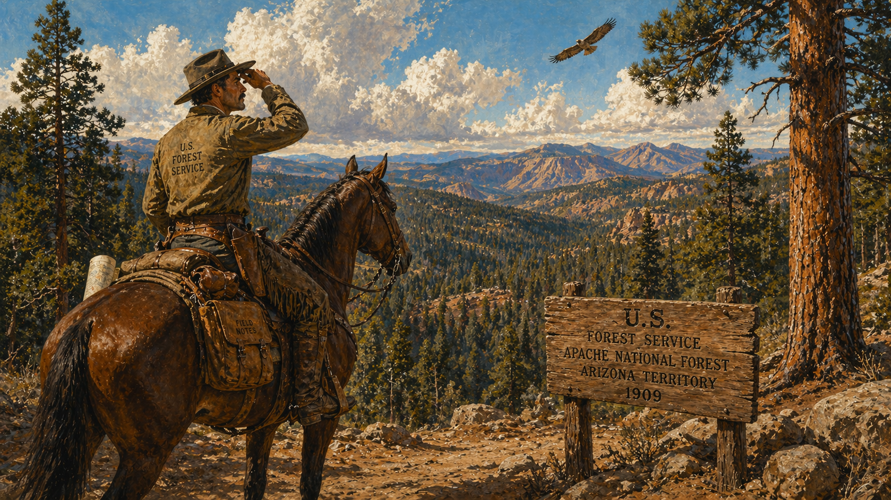

Image Prompt

I am about to ask you to generate a series of images for a graphic novel. Please make the images have a consistent style and consistent characters. Do not ask any clarifying questions. Just generate the image immediately when asked.

Please generate a 16:9 image in American wilderness painting style — Frederic Remington meets Winslow Homer, bold Western landscapes with desert orange, pine green, sky blue — depicting panel 1 of 12. The scene shows young Aldo Leopold, age 22, arriving on horseback at the Apache National Forest in Arizona Territory in 1909. He is tall and lean with a trim dark mustache, wearing a wide-brimmed felt hat, a canvas U.S. Forest Service jacket, worn leather boots, and leather chaps. He sits straight in the saddle, one hand shading his eyes as he surveys a vast ponderosa pine forest stretching across mountain ridges under an enormous Southwest sky. His saddlebag holds a field notebook and a rolled map. A wooden U.S. Forest Service sign marks the trail entrance. Color palette: desert orange rock, deep pine green, enormous sky blue, sandstone gold, warm leather brown. Emotional tone: youthful ambition and awe. Specific details: (1) Leopold's confident, eager expression as he scans the wilderness, (2) the massive ponderosa pines with their orange-barked trunks, (3) the Forest Service sign at the trailhead, (4) his horse — a sturdy bay — loaded with field gear, (5) a distant ridgeline of blue-shadowed mountains, (6) a red-tailed hawk circling overhead in the vast sky. Generate the image immediately without asking clarifying questions.

Aldo Leopold rode into the Apache National Forest in the fall of 1909, twenty-two years old and fresh from Yale's brand-new School of Forestry. The Southwest hit him like a revelation — ponderosa pines so tall the wind sang through them like a cathedral organ, rimrock canyons glowing orange at sunset, and a sky so wide it made a man feel both tiny and immortal. Leopold loved it with the ferocity of a convert. He had come to manage this wilderness, to make it productive, to apply the rational science of forestry to the wild frontier. He carried a rifle, a notebook, and the unshakable conviction that nature was a machine and he was the mechanic.

## Panel 2: The Government's Orders

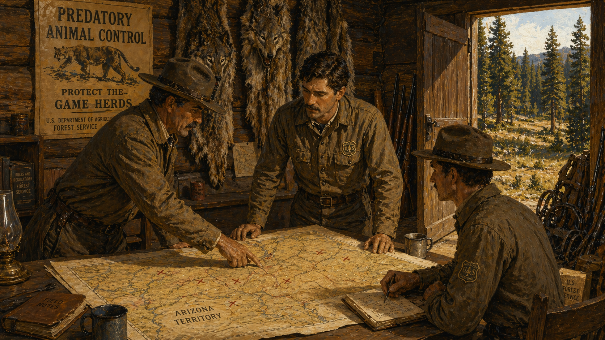

Image Prompt

Please generate a 16:9 image in American wilderness painting style — bold Western landscapes, desert orange, pine green, sky blue — depicting panel 2 of 12. Make the characters and style consistent with the prior panel. The scene shows a U.S. Forest Service ranger station in a mountain clearing in Arizona Territory, circa 1910. Young Aldo Leopold, in his Forest Service uniform with a badge on his chest, stands at a planning table with two other rangers. A large map of the territory is spread on the table, marked with red X's where wolves and mountain lions have been spotted. A senior ranger points at the map while Leopold listens intently. On the wall behind them hang a government poster reading "PREDATORY ANIMAL CONTROL — PROTECT THE GAME HERDS" and several wolf pelts. Rifles lean against the wall. Through the open door, a sunlit forest clearing is visible. Color palette: warm wood interior, sun-bleached government poster, shadow and lamplight, pine green forest visible through the door, red X's on the yellowed map. Emotional tone: institutional certainty, chain of command, unquestioned authority. Specific details: (1) Leopold attentive and serious at the table, (2) the map marked with predator sightings, (3) the government propaganda poster about predator control, (4) wolf pelts hanging on the wall, (5) rifles and traps stacked near the door, (6) the bright forest visible through the doorway, still intact and teeming. Generate the image immediately without asking clarifying questions.

Leopold's assignment was clear: kill the wolves. Kill the mountain lions. Kill anything with fangs that ate deer or elk. This was not cruelty — it was official U.S. Forest Service policy, backed by the best thinking of the day. The logic seemed bulletproof: ranchers needed livestock protected, hunters wanted more deer, and predators were the obstacle. A dead wolf equaled more venison on the table and more cattle on the range. Leopold did not question it. Nobody did. The government printed pamphlets, hired hunters, set traps, and distributed poison. Across the American West, the great extermination was underway — and bright young foresters like Leopold were its eager foot soldiers.

## Panel 3: The Rifles on the Rimrock

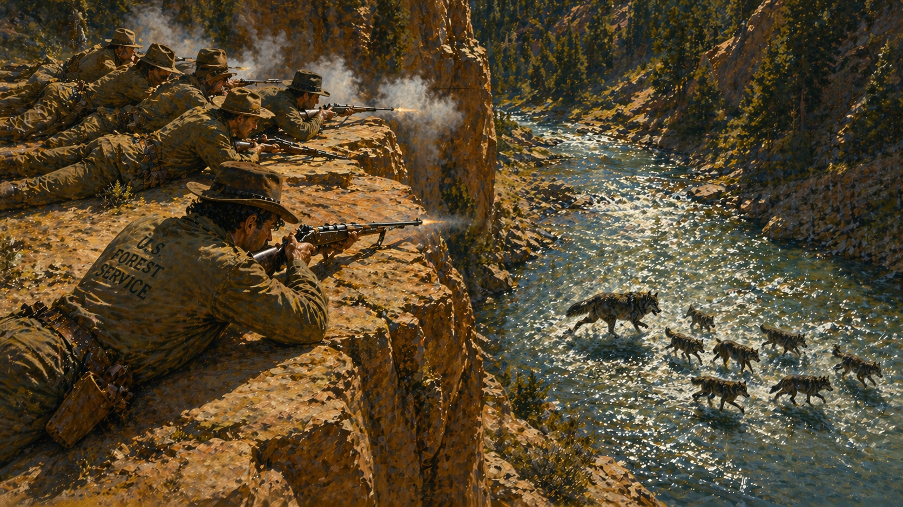

Image Prompt

Please generate a 16:9 image in American wilderness painting style — bold Western landscapes, desert orange, pine green, sky blue — depicting panel 3 of 12. Make the characters and style consistent with the prior panels. The scene shows the pivotal moment: Aldo Leopold and five other rangers lie on their stomachs on a high rimrock ledge above a river in the mountains of New Mexico. Below them, a mother wolf and six half-grown pups are fording the shallow river, water splashing around their legs. Leopold raises his rifle. The other men are already firing — puffs of smoke from their rifle barrels. The river glitters in the afternoon sun. The wolves are caught mid-stride, unaware of the ambush above. Color palette: warm sandstone rimrock in orange and gold, blue-green river water, dark wolf fur against the bright water, gun-smoke gray, deep pine forest on the far bank. Emotional tone: violent action, the terrible precision of the ambush, a moment that cannot be taken back. Specific details: (1) Leopold prone on the rimrock, rifle raised, taking aim, (2) the other rangers firing beside him, (3) the mother wolf — large, gray, magnificent — mid-stride in the river, (4) the pups splashing around her, (5) puffs of rifle smoke against the blue sky, (6) the wild river and forested canyon below, still beautiful despite what is happening. Generate the image immediately without asking clarifying questions.

They saw the wolf from a high rimrock — a mother and her grown pups fording the river below, tumbling over each other in the shallow water. "We reached for our rifles with the excitement of a pile of steer horns," Leopold wrote decades later, still ashamed. They opened fire. In those days, young rangers shot first and thought never. The wolves did not have a chance — caught in the open water, fired on from above. The pups scattered and fell. The mother went down. It was over in seconds. Leopold and his men scrambled down the steep slope to count their kill, expecting to feel nothing but satisfaction. Leopold was about to feel something that would haunt him for the rest of his life.

## Panel 4: The Fierce Green Fire

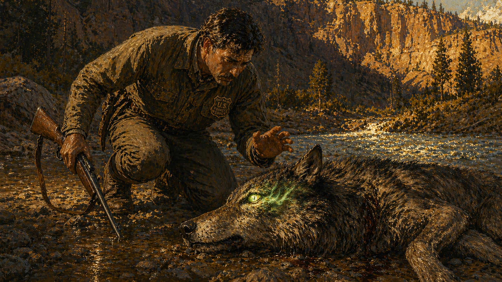

Image Prompt

Please generate a 16:9 image in American wilderness painting style — this is the visual climax of the entire graphic novel. Dramatic, emotional, painterly. Depicting panel 4 of 12. Make the characters and style consistent with the prior panels. The scene shows the most famous moment in American conservation history: Aldo Leopold kneeling beside the dying mother wolf on the riverbank. The wolf lies on her side, her body powerful even in death. Her amber eye is open and fixed on Leopold. In that eye burns a fierce, unearthly green fire — a glow of wild intelligence and ancient knowing that pierces Leopold to his core. Leopold's expression is stricken — his rifle hangs forgotten in one hand, his other hand is half-raised as if reaching toward the wolf but frozen. The light in the scene should be dramatic — late afternoon golden light on the sandstone, the river glinting behind them, but the green fire in the wolf's eye is the brightest thing in the painting. Color palette: the entire palette converges here — warm sandstone gold, deep shadow, river silver, dark wolf fur — but dominated by the supernatural green fire in the wolf's dying eye. Emotional tone: profound reckoning, the death of certainty, a man's worldview cracking open. Specific details: (1) Leopold kneeling close to the wolf, his face transformed by what he sees, (2) the wolf's amber eye with the fierce green fire burning in it, (3) Leopold's rifle hanging loose and forgotten, (4) the wolf's powerful body on the wet river stones, (5) the river and rimrock behind them in golden light, (6) the shadow of the canyon closing in, as if the mountain itself is watching. Generate the image immediately without asking clarifying questions.

"We reached the old wolf in time to watch a fierce green fire dying in her eyes," Leopold wrote. "I realized then, and have known ever since, that there was something new to me in those eyes — something known only to her and to the mountain." He knelt on the wet river stones beside the dying wolf and looked into an intelligence older than his government, deeper than his Yale education, and more complex than anything his textbooks described. The green fire faded. The wolf died. And Aldo Leopold began the long, painful process of understanding what he had destroyed. He did not become a different man that afternoon — transformation is slower than a bullet — but the crack had opened, and the mountain would spend the next thirty years widening it.

## Panel 5: The Deer Inherit the Mountain

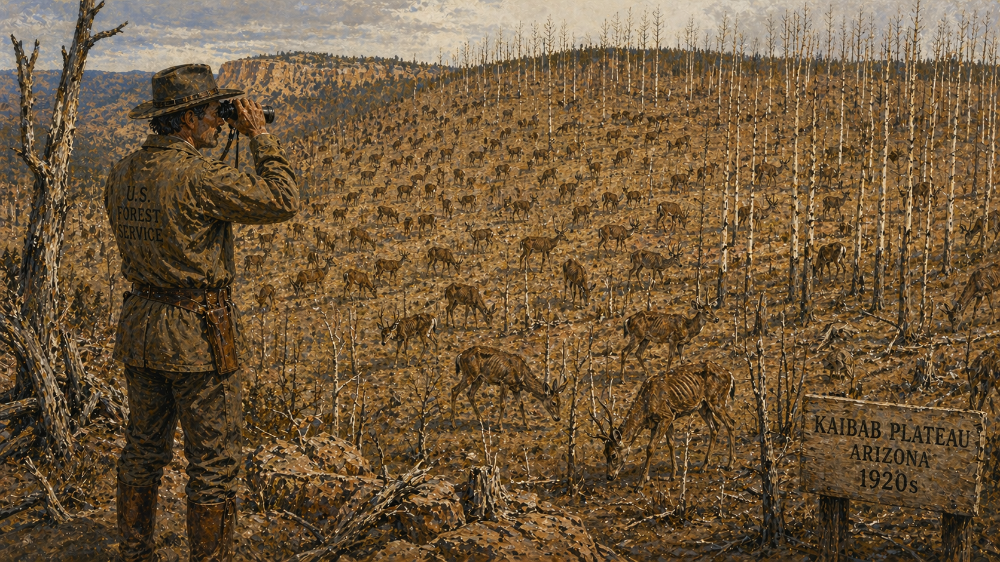

Image Prompt

Please generate a 16:9 image in American wilderness painting style — bold Western landscapes, but now the palette shifts to convey ecological damage — depicting panel 5 of 12. Make the characters and style consistent with the prior panels. The scene shows the Kaibab Plateau in Arizona in the 1920s, a decade after the wolves were removed. The landscape is overrun with deer — hundreds of them visible on a single mountainside, far too many for the land to support. Every tree has a sharp "browse line" — the foliage is eaten bare up to exactly the height a deer can reach, leaving each tree looking like a trimmed hedge. Young aspen and willow saplings are stripped to bare sticks. The deer themselves are thin, ribs showing, their coats dull. Leopold, now in his mid-30s with a weathered face, stands on a ridge watching through binoculars, his expression grim. Color palette: sickly yellow-brown of overgrazed grass, bare gray tree trunks, pale sky, the deer a mass of dull brown — the vibrant greens of earlier panels are gone. Emotional tone: ecological catastrophe in slow motion. Specific details: (1) the overwhelming number of deer covering the hillside, (2) the sharp browse line on every tree, (3) stripped and dying saplings, (4) deer with visible ribs and dull coats, (5) Leopold on the ridge, binoculars in hand, his face showing dawning horror, (6) bare, compacted soil where grass once grew. Generate the image immediately without asking clarifying questions.

Without wolves, the deer multiplied beyond anything the hunters had imagined — not a paradise, but a plague. On the Kaibab Plateau north of the Grand Canyon, the deer herd exploded from four thousand to a hundred thousand in less than two decades. They ate everything: every seedling, every shrub, every blade of grass within reach. Trees developed a grotesque "browse line" — stripped bare to exactly the height a deer could stretch its neck. Leopold watched it happen and began taking notes. The hunters' paradise had become a biological disaster. The deer were not thriving — they were starving in the midst of their own abundance, their bodies thin, their coats dull, their fawns dying in the snow. The mountain was being eaten alive.

## Panel 6: The Mountain Stripped Bare

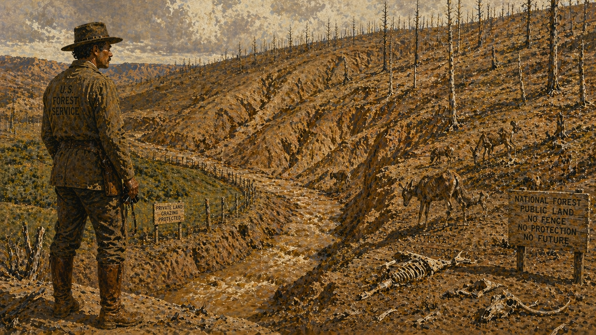

Image Prompt

Please generate a 16:9 image in American wilderness painting style — the palette is now harsh and damaged, conveying devastation — depicting panel 6 of 12. Make the characters and style consistent with the prior panels. The scene shows the long-term consequence of wolf removal: a mountainside in the American Southwest, once forested, now stripped to bare earth. Deep erosion gullies carve the hillside like wounds. A stream that once ran clear now runs thick brown with sediment. Dead tree snags stand like skeletons on the ridge. A few surviving deer — emaciated, hollow-eyed — pick at bare dirt. In the valley below, a rancher's fence line shows the contrast: the overgrazed public land is brown and gullied; behind the fence, a small patch of ungrazed brush still clings to green. Color palette: raw sienna and burnt umber erosion, muddy brown water, dead gray snags, pale washed-out sky, no green except the tiny fenced patch. Emotional tone: environmental ruin, the mountain's suffering made visible. Specific details: (1) deep erosion gullies carving the bare hillside, (2) the brown, sediment-choked stream, (3) dead standing snags where pines once grew, (4) emaciated deer on the barren slope, (5) the fence-line contrast showing what protected land looks like, (6) deer bones visible on the ground — starvation has begun. Generate the image immediately without asking clarifying questions.

The consequences cascaded like dominoes falling down a mountainside. Without browse, the soil lost its roots. Without roots, the rain carved gullies into the hillsides. The streams, once clear and cold, ran brown with sediment. Trout disappeared. Songbirds lost their nesting shrubs. The entire mountain ecosystem — soil, water, plants, insects, birds, mammals — was unraveling because one species had been removed from the top of the food chain. Leopold saw what no government report acknowledged: the wolves had not been the enemy of the mountain. They had been its immune system. Remove the predator, and the whole body sickens.

## Panel 7: The Mountain's Lesson

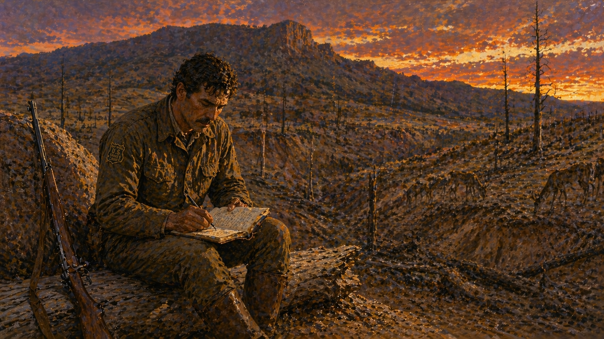

Image Prompt

Please generate a 16:9 image in American wilderness painting style — contemplative, philosophical, with the landscape as teacher — depicting panel 7 of 12. Make the characters and style consistent with the prior panels. The scene shows Aldo Leopold in his early 40s, sitting alone on a fallen log on a bare, damaged mountainside at dusk, writing in his field notebook by the last light. His rifle leans against a rock nearby — he no longer carries it with the old eagerness. The ruined landscape stretches behind him: eroded gullies, stripped browse lines, a few gaunt deer in the distance. But the sky is vast and beautiful — sunset colors of orange, purple, and gold — and the mountain itself looms above, ancient and patient. Leopold's expression is pensive, inward, a man rebuilding his understanding from the ground up. Color palette: warm sunset colors (orange, purple, gold) against the damaged browns and grays of the landscape, creating a tension between beauty and ruin. Emotional tone: solitary reckoning, intellectual transformation, humility before nature. Specific details: (1) Leopold writing intently in his notebook, (2) the field notebook filling with observations, (3) his rifle set aside — symbolically distanced, (4) the damaged landscape as backdrop, (5) the vast, beautiful sunset sky — nature's indifference to human error, (6) the mountain's silhouette above, ancient and enduring. Generate the image immediately without asking clarifying questions.

"I thought that because fewer wolves meant more deer, that no wolves would mean hunters' paradise," Leopold wrote years later. "But after seeing the green fire die, I sensed that neither the wolf nor the mountain agreed with such a view." The lesson came slowly, built from years of field observation, ruined landscapes, and the growing weight of evidence that nature was not a machine with interchangeable parts. It was a community — ancient, intricate, and self-regulating — and the wolf was as essential to the mountain as the roots of the pines. Leopold began to understand something radical for his era: that managing individual species was like tuning a single instrument while ignoring the orchestra. You had to think like the mountain — in centuries, in connections, in whole systems.

## Panel 8: The First Textbook

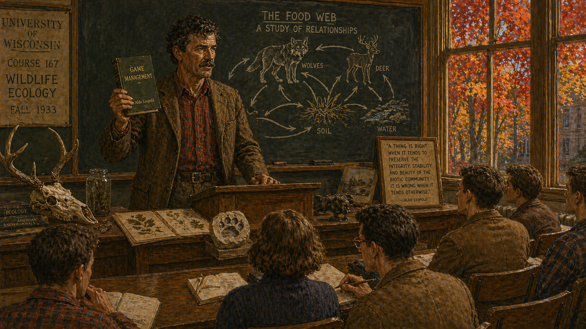

Image Prompt

Please generate a 16:9 image in American wilderness painting style — transitioning now toward a more academic, indoor setting but retaining the painterly quality — depicting panel 8 of 12. Make the characters and style consistent with the prior panels. The scene shows Aldo Leopold in 1933, now 46, standing at the front of a University of Wisconsin lecture hall, teaching the nation's first course in wildlife ecology. He is lean and weathered, his mustache now flecked with gray, wearing a tweed jacket over a flannel shirt — the outdoorsman in academia. On the chalkboard behind him is a hand-drawn food web diagram showing wolves, deer, plants, soil, and water all connected by arrows. He holds up a copy of his new book Game Management — the first textbook of wildlife ecology. Students in the lecture hall lean forward, engaged. Through the tall windows, Wisconsin's autumn maples blaze red and gold. Color palette: warm wood and chalkboard green of the lecture hall, tweed brown and flannel red on Leopold, autumn colors through the windows, white chalk lines of the food web diagram. Emotional tone: intellectual breakthrough, knowledge being transmitted, the birth of a new science. Specific details: (1) Leopold at the lectern with quiet authority, (2) the food web diagram on the chalkboard with wolves prominently connected, (3) the book Game Management in his hand, (4) attentive students in the lecture hall, (5) autumn maples visible through the windows, (6) field specimens — a deer skull, pressed plants, a wolf track cast — arranged on the demonstration table. Generate the image immediately without asking clarifying questions.

In 1933, Aldo Leopold published *Game Management*, the first textbook of wildlife ecology ever written. It was a revolution disguised as a textbook. Where previous game managers had asked "How do we produce more deer?", Leopold asked "How does the whole system work?" He argued that wildlife could not be managed species by species — you had to manage habitats, food webs, predator-prey relationships, and the soil itself. The University of Wisconsin hired him to teach the nation's first professorship in game management, and students arrived to find that Professor Leopold's lectures were not about killing animals efficiently. They were about understanding why every piece of the puzzle mattered — including the pieces that had teeth.

## Panel 9: The Shack

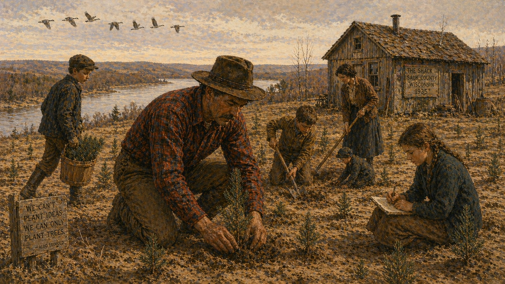

Image Prompt

Please generate a 16:9 image in American wilderness painting style — now shifting to the quieter Wisconsin marshland palette: golden grasses, pewter water, soft dawn colors, watercolor field journal quality — depicting panel 9 of 12. Make the characters and style consistent with the prior panels. The scene shows Aldo Leopold in 1935, now 48, with his family at "the Shack" — a converted chicken coop on a worn-out, abandoned farm along the Wisconsin River in Sauk County. Leopold, wearing a plaid wool shirt and his felt hat, kneels planting a small pine seedling in sandy soil. His wife Estella and several of their children (ages ranging from young to teenage) work nearby — one carries a bucket of seedlings, another digs a hole, another records plantings in a notebook. The Shack itself is a humble, weathered wooden building behind them. The surrounding land is bare and exhausted — sand barrens and sparse grass — but the family is transforming it, one tree at a time. Color palette: sandy gold, pewter gray, soft green of seedlings, warm plaid reds and blues, pale winter sky. Emotional tone: humble labor, family devotion, restoration beginning from nothing. Specific details: (1) Leopold kneeling with a seedling, his hands in the sand, (2) the weathered Shack in the background, (3) family members helping with planting, (4) rows of newly planted seedlings on the bare land, (5) the Wisconsin River visible in the middle distance as a pewter ribbon, (6) a flock of geese flying overhead in V-formation against the pale sky. Generate the image immediately without asking clarifying questions.

In 1935, Leopold bought eighty acres of exhausted farmland along the Wisconsin River — sandy, depleted soil surrounding a derelict chicken coop his family nicknamed "the Shack." Other professors might have seen a wasteland. Leopold saw a laboratory. Every weekend, the Leopold family drove from Madison to the Shack and worked: planting pines, restoring prairie grasses, rebuilding the soil one wheelbarrow of compost at a time. Leopold kept meticulous records of every bird that arrived, every plant that returned, every sign that the land was healing. The Shack became his observatory, his confessional, and his writing desk. Here, with his hands in the sand and his notebook on his knee, he began to write the essays that would change how humanity thinks about its place in nature.

## Panel 10: The Land Ethic

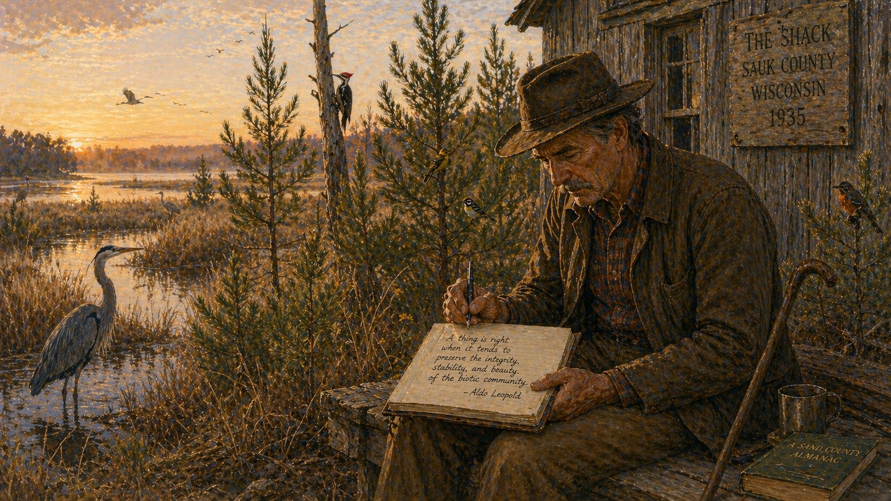

Image Prompt

Please generate a 16:9 image in American wilderness painting style — Wisconsin marshland palette: golden grasses, pewter water, soft dawn colors — depicting panel 10 of 12. Make the characters and style consistent with the prior panels. The scene shows Aldo Leopold in his early 60s on a soft spring dawn at the Shack, sitting on a rough wooden bench outside the door, writing in a large manuscript notebook. His face is deeply lined but kind, his hair gray under the felt hat, a walking stick leaning against the bench beside him. The landscape around the Shack has transformed from the barren sand of Panel 9: young pines now stand six feet tall, prairie grasses wave in the breeze, and the marsh is alive with birdsong. A great blue heron stands in the nearby marsh. The manuscript page visible in his notebook shows the famous words: "A thing is right when it tends to preserve the integrity, stability, and beauty of the biotic community." Color palette: soft golden dawn light, green pines against pewter marsh, warm wood tones, blue-gray heron, the handwritten text on cream paper. Emotional tone: quiet wisdom, a life's work reaching its culmination, dawn as metaphor. Specific details: (1) Leopold writing with focused intensity, his face serene, (2) the manuscript page with visible handwritten text, (3) the restored landscape — young pines, prairie grass, marsh — around the Shack, (4) the great blue heron in the marsh, (5) a chorus of birds implied by multiple species visible — woodpecker on a snag, warblers in the pines, sandhill crane in the distance, (6) the first light of dawn breaking over the Wisconsin River marshland. Generate the image immediately without asking clarifying questions.

In the quiet of the Shack, with sandhill cranes calling from the marsh and the pines he had planted whispering in the wind, Leopold wrote the essays that became *A Sand County Almanac*. The book's final section introduced the "land ethic" — an idea so radical it still makes some people uncomfortable: "A thing is right when it tends to preserve the integrity, stability, and beauty of the biotic community. It is wrong when it tends otherwise." Leopold was not writing about parks or preserves. He was arguing that every farmer, every logger, every hunter, and every citizen had an ethical obligation to the land itself. Humans were not conquerors of the community of life. They were plain members and citizens of it. The wolf, the deer, the pine, the soil, the river, and the rancher were all part of one system — and the system had rights.

## Panel 11: The Fire on the Marsh

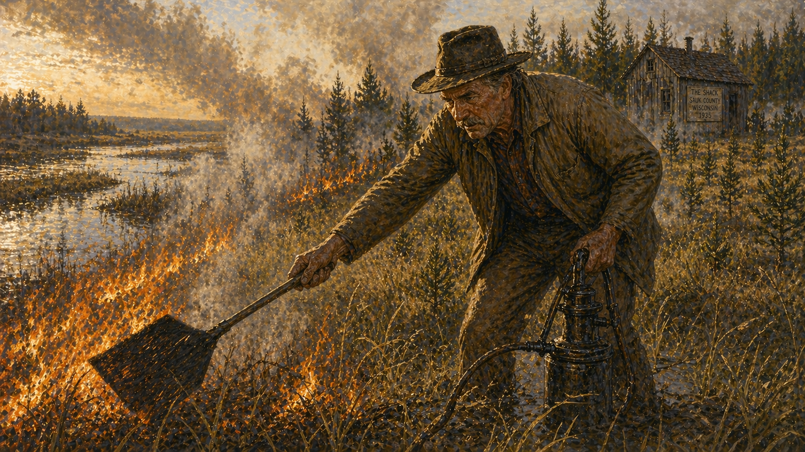

Image Prompt

Please generate a 16:9 image in American wilderness painting style — Wisconsin marshland palette, but now with fire and loss — depicting panel 11 of 12. Make the characters and style consistent with the prior panels. The scene shows a grass fire burning along the Wisconsin River marsh in April 1948. Aldo Leopold, now 61, works with a hand pump and fire swatter to fight the brush fire that has spread from a neighbor's property toward the Shack. He wears his old felt hat and a canvas jacket, his face red with exertion and heat. Smoke billows across the marsh. The fire line glows orange against the spring green grass. In the background, the Shack and his young pine plantation are visible — the trees he spent thirteen years planting now threatened by the flames. The scene should convey both heroic effort and human frailty — a man in his sixties fighting fire alone. Color palette: orange fire glow, gray-white smoke, spring green grass, pewter water reflecting firelight, dark silhouette of the pines. Emotional tone: urgency, physical struggle, devotion to the land even at personal cost. Specific details: (1) Leopold swinging a fire swatter at the blaze, (2) smoke obscuring parts of the scene, (3) the fire line advancing through dry marsh grass, (4) the Shack and pine plantation in the background, (5) Leopold's exhausted but determined expression, (6) the Wisconsin River marsh stretching away into smoky haze. Generate the image immediately without asking clarifying questions.

On April 21, 1948, a neighbor's brush fire escaped and burned toward the Shack. Leopold grabbed a fire pump and ran. He was sixty-one years old and had a history of heart trouble, but those were his pines — planted by his own hands, nurtured through thirteen Wisconsin winters. He fought the fire along the marsh edge, beating at the flames, pumping water onto the grass. His family found him later, lying face-down in the burned grass, his hands still gripping the pump. His heart had given out. One week later — one week — a New York publisher accepted the manuscript of *A Sand County Almanac*. Leopold never knew his book would be published. He never knew it would change the world.

## Panel 12: The Legacy That Grew

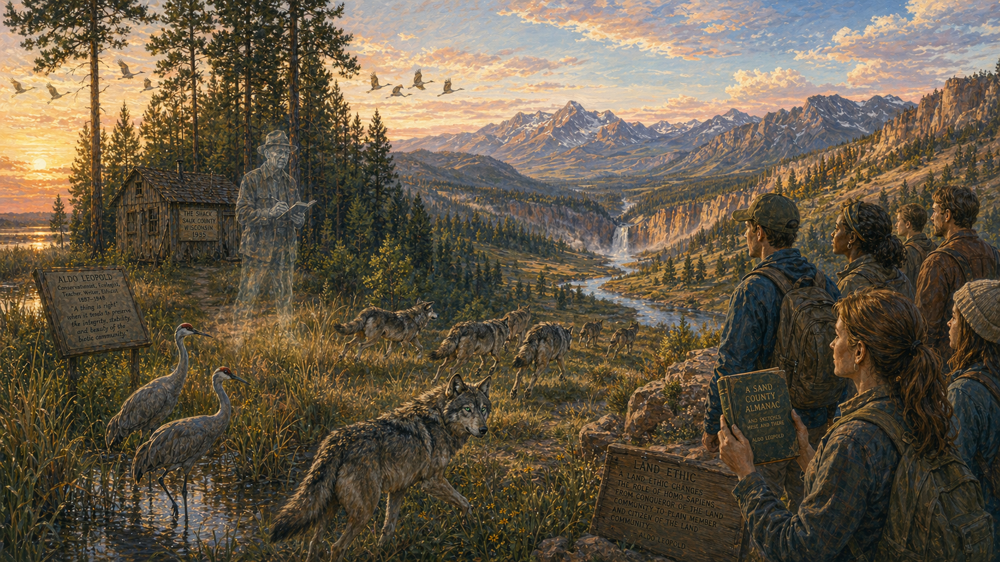

Image Prompt

Please generate a 16:9 image in American wilderness painting style — returning to the full vibrant palette, American wilderness at its most alive — depicting panel 12 of 12. Make the characters and style consistent with the prior panels. The scene shows a wide, luminous panorama spanning time: on the left, the Leopold Shack stands preserved as a historic site, surrounded by the now-mature pine forest Leopold planted — the trees are sixty feet tall. In the center, a pack of gray wolves runs through a restored mountain landscape in the American West — Yellowstone perhaps — evoking the wolves Leopold once killed, now returned. On the right, a diverse group of modern students and conservationists stand on a rimrock overlook, one holding a well-worn copy of A Sand County Almanac, gazing out at a healthy, wolf-managed landscape below. A ghostly, translucent figure of Leopold stands among the pines near the Shack, notebook in hand, watching the scene with quiet satisfaction. Color palette: the full spectrum reunited — pine green, sky blue, golden grass, desert orange, river silver, dawn pink — all the colors of a healthy ecosystem. Emotional tone: living legacy, the long arc of ecological redemption, hope earned through understanding. Specific details: (1) the mature pine forest Leopold planted around the Shack, (2) the wolf pack running free through a restored Western landscape, (3) modern students with A Sand County Almanac on the overlook, (4) the ghostly figure of Leopold near the Shack, (5) sandhill cranes flying over the Wisconsin marsh, (6) a single wolf looking back toward the viewer — the green fire alive in its eyes once more. Generate the image immediately without asking clarifying questions.

*A Sand County Almanac* was published in 1949, a year after Leopold's death. It sold modestly at first — and then it kept selling, and teaching, and spreading, and growing. Today it has sold over two million copies and stands beside *Silent Spring* and *Walden* as one of the most important environmental books ever written. Leopold's land ethic became the philosophical foundation of the Endangered Species Act, the Wilderness Act, and the modern conservation movement. In 1995, wolves were reintroduced to Yellowstone National Park — and the mountains began to heal, exactly as Leopold had predicted. The aspens grew back. The streams cleared. The songbirds returned. The fierce green fire burns again in wild eyes across the American West, and every one of those wolves is a living testament to a man who watched one die and spent a lifetime learning why it mattered.

### Epilogue – What Made Aldo Leopold Different?

Aldo Leopold was not the first person to love nature. He was the first to build a science and an ethics around the insight that every part of an ecosystem is connected to every other part. Other conservationists of his era wanted to save beautiful places or charismatic animals. Leopold wanted to save the relationships between them — the invisible web of interactions that makes a forest a forest and a marsh a marsh. His greatness was not that he never made mistakes. His greatness was that he let his mistakes teach him.

| Challenge | How Aldo Leopold Responded | Lesson for Today |
|-----------|---------------------------|-------------------|
| Government policy demanded wolf extermination | Killed wolves as ordered, then spent decades documenting the catastrophic consequences | Even official "scientific" policy can be catastrophically wrong when it ignores systems thinking |
| Deer populations exploded without predators, destroying vegetation | Published research proving that predator removal destabilized entire ecosystems | Trophic cascades are real — removing a top predator affects every level below it |
| Wildlife management focused on single species | Wrote *Game Management*, the first textbook of wildlife ecology, arguing for whole-system management | You cannot manage what you do not understand, and you cannot understand a part without understanding the whole |
| Humans saw themselves as masters of nature | Proposed the "land ethic" — that humans are members of, not conquerors of, the ecological community | Ethics must extend beyond human relationships to include the land, water, plants, and animals |

### Call to Action

Leopold's transformation began with a willingness to look at what he had done and admit he was wrong. That is harder than it sounds. How many of us, confronted with evidence that our habits are damaging the systems we depend on, choose to look away? The land ethic starts with observation: go outside, sit quietly, and pay attention to the relationships around you. Which birds depend on which trees? Where does the water flow, and what lives in it? What has been removed from this place, and what has changed as a result? You do not need a Yale degree to think like a mountain. You need patience, humility, and the courage to let the evidence change your mind.

---

*"A thing is right when it tends to preserve the integrity, stability, and beauty of the biotic community. It is wrong when it tends otherwise."*
— Aldo Leopold, A Sand County Almanac

*"We reached the old wolf in time to watch a fierce green fire dying in her eyes. I realized then, and have known ever since, that there was something new to me in those eyes — something known only to her and to the mountain."*
— Aldo Leopold, "Thinking Like a Mountain"

*"One of the penalties of an ecological education is that one lives alone in a world of wounds."*
— Aldo Leopold, A Sand County Almanac

*"We abuse land because we regard it as a commodity belonging to us. When we see land as a community to which we belong, we may begin to use it with love and respect."*
— Aldo Leopold, A Sand County Almanac

---

## References

1. [Wikipedia: Aldo Leopold](https://en.wikipedia.org/wiki/Aldo_Leopold) — Biography of the American forester, ecologist, and author who shaped modern conservation
2. [Wikipedia: A Sand County Almanac](https://en.wikipedia.org/wiki/A_Sand_County_Almanac) — Leopold's posthumous masterwork on ecology, ethics, and the land
3. [Wikipedia: Land ethic](https://en.wikipedia.org/wiki/Land_ethic) — Leopold's philosophical framework for humanity's relationship with the natural world
4. [Aldo Leopold Foundation](https://www.aldoleopold.org/) — The organization preserving Leopold's legacy and the Shack, with educational resources
5. [Encyclopaedia Britannica: Aldo Leopold](https://www.britannica.com/biography/Aldo-Leopold) — Curated reference overview of Leopold's life, career, and enduring influence
