# Measuring the Invisible

Cover Image Prompt

Please generate a wide-landscape 16:9 cover image for a graphic novel titled "Measuring the Invisible" in a mid-century scientific illustration style reminiscent of 1950s Scientific American covers transitioning into modern data visualization aesthetics. Show Charles David Keeling, a lean, bespectacled man in his early thirties with a thin, precise face and neatly combed dark hair, standing on the volcanic slope of Mauna Loa, Hawaii at dawn in 1958. He stands beside a boxy, hand-built infrared gas analyzer mounted on a metal frame, gazing out over a sea of clouds below the summit. Behind him, the iconic Keeling Curve — a red sawtooth line on a white graph — rises ghostlike into the salmon-pink sky, as if the data itself is written on the atmosphere. The title text "Measuring the Invisible" is rendered in clean sans-serif type at the top. Color palette: warm 1950s cream, rust, sage green, volcanic charcoal, with the Keeling Curve's signature red as a visual accent. Emotional tone: solitary precision and quiet obsession. Include: (1) Keeling's black-rimmed glasses and white short-sleeve button-down shirt, (2) the boxy silver CO2 analyzer with dials and tubes, (3) the barren lava rock of Mauna Loa's summit, (4) a spectacular cloud layer far below, (5) the ghostly red Keeling Curve rising through the sky, (6) a leather-bound field notebook tucked under his arm. Generate the image immediately without asking clarifying questions.

Narrative Prompt

This is a 12-panel graphic novel about Charles David Keeling (1928-2005), the American geochemist whose continuous measurements of atmospheric carbon dioxide at the Mauna Loa Observatory in Hawaii produced the Keeling Curve — the single most important dataset in climate science. The story spans from the early 1950s through the present day, moving through settings including Caltech labs, California campgrounds, the Mauna Loa Observatory, Washington D.C. funding offices, and Scripps Institution of Oceanography. The art style begins as warm mid-century scientific illustration (cream, rust, sage — evoking 1950s Scientific American) and gradually transitions to a modern data visualization aesthetic as the decades pass, with the Keeling Curve's iconic red sawtooth line becoming a recurring visual motif in later panels. Charles David Keeling should be drawn consistently across panels: a lean, thin-faced man with black-rimmed glasses, neatly combed hair (darkening to gray over the decades), a precise and slightly intense manner, always looking like he is measuring something. He ages from an energetic young researcher in his late twenties to a distinguished but weary elder scientist. Central theme: the power of patient, precise, long-term measurement — and the drama of fighting for "boring" work that turned out to change the world. The story emphasizes Keeling's obsessive precision, his lifelong battle for funding, and the slow, undeniable power of data accumulated year after year.

### Prologue -- The Most Important Number Nobody Was Measuring

In the early 1950s, nobody knew exactly how much carbon dioxide was in Earth's atmosphere. Scientists had rough estimates — somewhere around 300 parts per million — but the measurements bounced around so wildly that most researchers assumed CO2 was too variable to track precisely. Then a young postdoctoral chemist named Charles David Keeling became obsessed with a simple question: *What if the measurements aren't bad because CO2 is chaotic — what if the measurements are bad because nobody is measuring carefully enough?* That question, and his stubborn refusal to stop asking it, would produce the most important graph in the history of climate science.

## Panel 1: The Chemist Who Camped

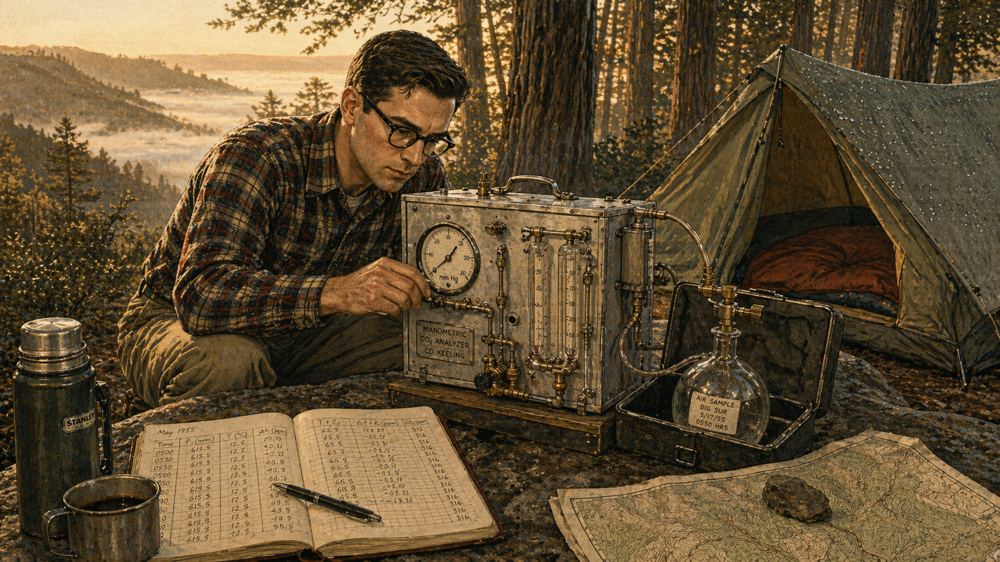

Image Prompt

I am about to ask you to generate a series of images for a graphic novel. Please make the images have a consistent style and consistent characters. Do not ask any clarifying questions. Just generate the image immediately when asked.

Please generate a 16:9 image in mid-century scientific illustration style depicting panel 1 of 12. The scene shows a young Charles David Keeling, age 27, crouching beside a hand-built CO2 gas analyzer at a remote campsite in the mountains of Big Sur, California, at dawn in 1955. He is a lean, thin-faced man with black-rimmed glasses and neatly combed dark hair, wearing a plaid flannel shirt and khaki trousers. He carefully adjusts a valve on a silver metal instrument box while a glass flask of captured air sits in a padded case beside him. A small tent and a sleeping bag are visible behind him. The forest is misty with first light filtering through redwood trees. Color palette: warm cream, rust, sage green, forest brown, pale gold dawn light. Emotional tone: solitary obsession and the joy of precision. Specific details: (1) the homemade manometric gas analyzer with brass fittings and glass tubes, (2) a leather-bound field notebook open to a page of meticulous handwritten numbers, (3) a thermos of coffee on a flat rock, (4) Keeling's intense, focused expression as he reads a dial, (5) dew on the tent fabric, (6) a topographic map weighted down with a stone. Generate the image immediately without asking clarifying questions.

Other scientists relaxed on camping trips. Charles David Keeling brought a gas analyzer. As a postdoc at Caltech in the early 1950s, he had built his own manometric instrument — a device that could measure CO2 in air with a precision nobody had achieved before. He hauled it into the California mountains and collected samples at dawn, at noon, at midnight. While other researchers dismissed the bouncing numbers as noise, Keeling saw a pattern. CO2 levels dropped during the day when plants were photosynthesizing and rose at night when they were only respiring. The "noise" wasn't random. It was the planet breathing.

## Panel 2: The International Geophysical Year

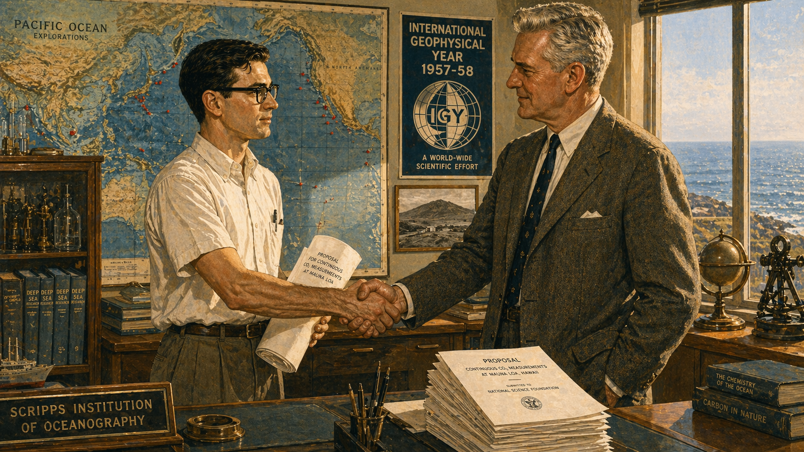

Image Prompt

Please generate a 16:9 image in mid-century scientific illustration style depicting panel 2 of 12. Make the characters and style consistent with the prior panel. The scene shows Charles David Keeling, now age 29, standing in an office at the Scripps Institution of Oceanography in La Jolla, California in 1957, shaking hands with Roger Revelle, a tall, broad-shouldered, silver-haired oceanographer in his fifties. Behind them, a large wall map of the Pacific Ocean is marked with red pins, and a poster reads "International Geophysical Year 1957-58." Keeling holds a rolled-up proposal document. Through the window, the Pacific Ocean sparkles under bright California sun. Color palette: warm cream, ocean blue, sunlit gold, institutional green, rust accents. Emotional tone: hopeful ambition and the excitement of a young scientist given his chance. Specific details: (1) Revelle's large, confident handshake and welcoming expression, (2) Keeling's thinner frame and precise posture, glasses glinting, (3) the IGY poster with its globe logo, (4) scientific instruments on shelves behind glass, (5) a framed photograph of Mauna Loa volcano on the wall, (6) a stack of funding proposal copies on Revelle's desk. Generate the image immediately without asking clarifying questions.

In 1957, the world's scientists organized the International Geophysical Year — a massive coordinated push to study Earth's physical systems. Oceanographer Roger Revelle at the Scripps Institution of Oceanography had recently co-authored a paper warning that "human beings are now carrying out a large-scale geophysical experiment" by burning fossil fuels. He needed someone obsessive enough to measure CO2 with real precision. He found Keeling. With IGY funding, Keeling was given money to set up continuous monitoring stations — including one at the top of Mauna Loa, Hawaii, far above the trees and cities that muddied measurements at lower elevations.

## Panel 3: The Breathing Planet

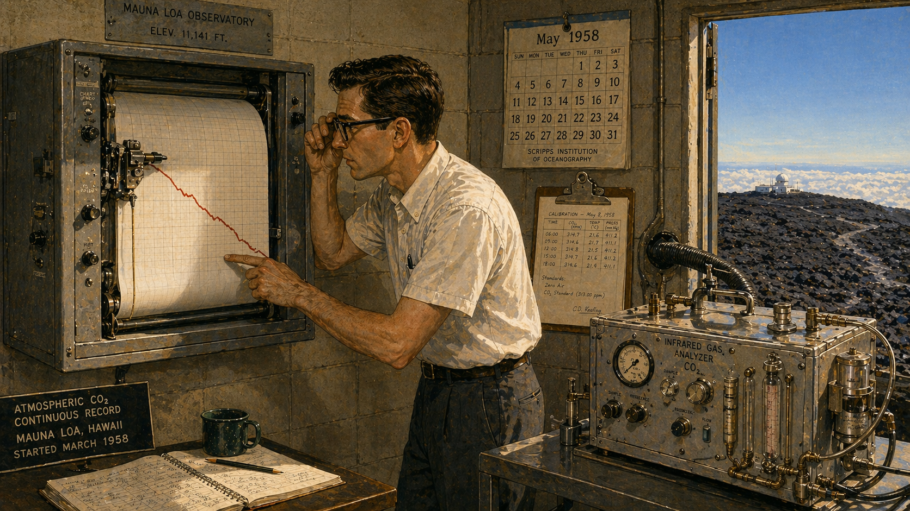

Image Prompt

Please generate a 16:9 image in mid-century scientific illustration style depicting panel 3 of 12. Make the characters and style consistent with the prior panel. The scene shows the interior of the Mauna Loa Observatory in 1958: a small, sparse concrete-block building at 11,141 feet elevation. Keeling, age 30, stands before a wall-mounted chart recorder that is slowly drawing a line on graph paper with a mechanical pen. He leans close, one hand adjusting his glasses, the other pointing to the line as it dips downward. Outside the open door, black lava rock stretches to the horizon under a brilliant blue sky. An infrared gas analyzer hums on a metal table, connected to an air intake pipe that runs through the wall. Color palette: instrument silver, graph-paper white with red ink, volcanic black, sky blue, cream interior walls. Emotional tone: the thrill of discovery in real time. Specific details: (1) the chart recorder's mechanical pen tracing a descending red line, (2) the infrared gas analyzer — a large metal box with dials, gauges, and tubes, (3) a wall calendar showing "May 1958", (4) Keeling's white short-sleeve shirt and dark trousers, (5) a clipboard with handwritten calibration notes, (6) the stark lava landscape visible through the doorway. Generate the image immediately without asking clarifying questions.

The first year of data from Mauna Loa was electric. As spring turned to summer in the Northern Hemisphere, CO2 levels dropped — billions of trees and plants were pulling carbon from the air through photosynthesis. When autumn came and the leaves fell, CO2 rose again as decomposition released carbon back. Keeling was watching the entire planet inhale and exhale. No one had ever seen it before, because no one had ever measured carefully enough. The seasonal cycle was roughly five parts per million — a tiny signal that Keeling's instruments captured with exquisite clarity.

## Panel 4: The Sawtooth Rises

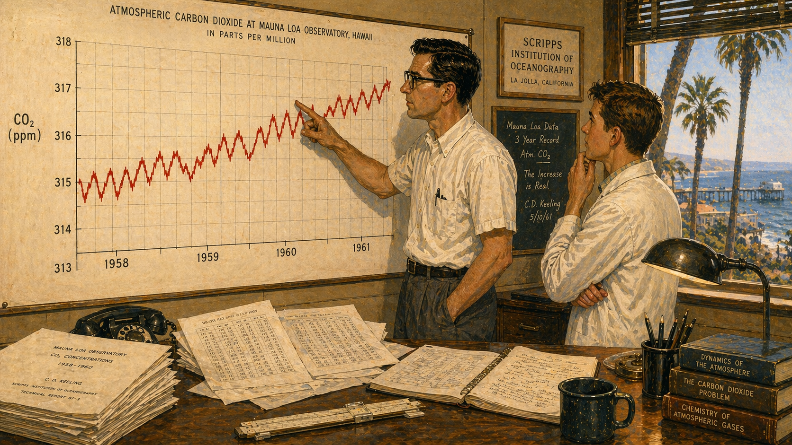

Image Prompt

Please generate a 16:9 image in mid-century scientific illustration style transitioning slightly toward data visualization aesthetics, depicting panel 4 of 12. Make the characters and style consistent with the prior panel. The scene shows Keeling in 1961, now age 33, standing before a large wall-mounted graph in his office at Scripps Institution of Oceanography. The graph shows three full years of CO2 data: a red sawtooth line that oscillates seasonally but whose baseline is unmistakably climbing upward year over year. Keeling traces the upward trend with his finger while a younger colleague — a graduate student in a white lab coat — watches with wide eyes. The graph dominates the composition. Color palette: cream wall, the red line of the curve standing out vividly, institutional green, warm wood desk tones, amber desk lamp. Emotional tone: dawning realization and the weight of what the data means. Specific details: (1) the wall graph clearly showing three sawtooth cycles with the baseline rising from about 315 to 317 ppm, (2) axis labels reading "CO2 (ppm)" and years "1958 1959 1960 1961", (3) Keeling's expression — intense, almost reverent, (4) scattered data printouts on the desk, (5) a slide rule beside a coffee cup, (6) through the window, palm trees and the Scripps pier in afternoon light. Generate the image immediately without asking clarifying questions.

By the end of the third year, Keeling had enough data to see something far more significant than the seasonal breathing. The sawtooth pattern was climbing. Each year's peak was higher than the last. Each year's trough was higher than the last. The baseline — the minimum CO2 concentration after a full summer of photosynthesis — was rising by roughly one part per million per year. The planet's vegetation was absorbing as much carbon as it always had, but something was adding more CO2 than the biosphere could remove. That something was the combustion of coal, oil, and gas. The Keeling Curve was born.

## Panel 5: The Budget Axe

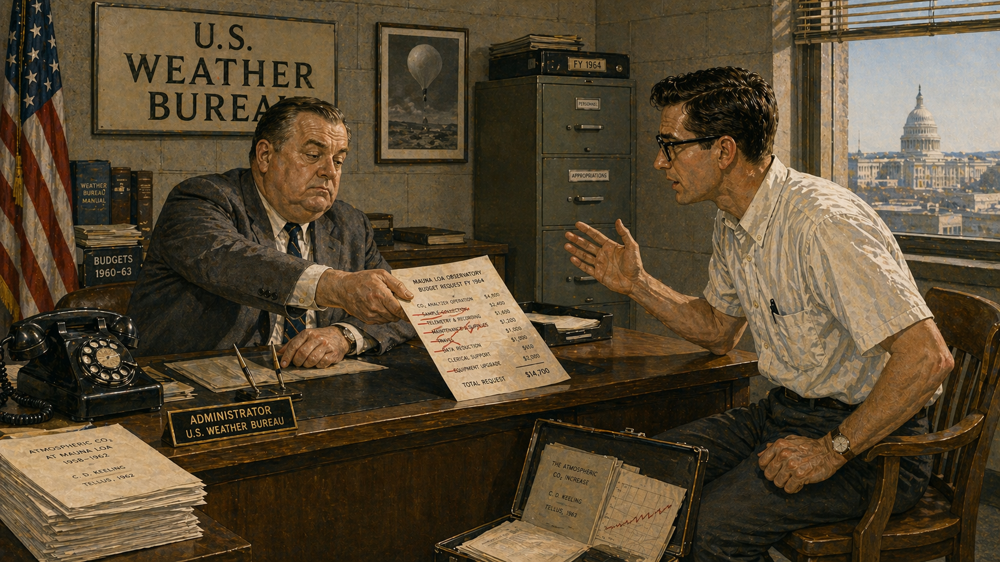

Image Prompt

Please generate a 16:9 image in mid-century scientific illustration style depicting panel 5 of 12. Make the characters and style consistent with the prior panel. The scene shows a 1963 government office in Washington, D.C., where a U.S. Weather Bureau administrator — a heavyset man in a gray suit with a flat bureaucratic expression — sits behind a large desk and pushes a budget document across the table toward Keeling, who sits opposite in a wooden chair, visibly tense. The document has red lines through several budget items. A sign on the wall reads "U.S. Weather Bureau." The office is drab, fluorescent-lit, with filing cabinets and an American flag. Color palette: institutional gray, fluorescent white, drab olive, the red of the budget cuts contrasting with Keeling's earnest intensity. Emotional tone: the collision between visionary science and bureaucratic indifference. Specific details: (1) the budget document with items crossed out in red, (2) Keeling leaning forward, glasses pushed up, making his case with one hand raised, (3) the administrator's bored, dismissive posture, (4) a framed photograph of a weather balloon on the wall, (5) a heavy black rotary telephone, (6) Keeling's briefcase open on the floor with copies of his published data. Generate the image immediately without asking clarifying questions.

In 1963, the U.S. Weather Bureau reviewed Keeling's program and called it "routine monitoring" — not real research. They recommended cutting his funding. To bureaucrats who measured success by new discoveries and published breakthroughs, simply recording the same number at the same place year after year looked like the opposite of science. Keeling was furious. He argued that the value of continuous measurement was precisely its continuity — that gaps in the record could never be filled. The administrators shrugged. Continuous monitoring was boring, and boring programs got cut.

## Panel 6: The Gap That Haunts

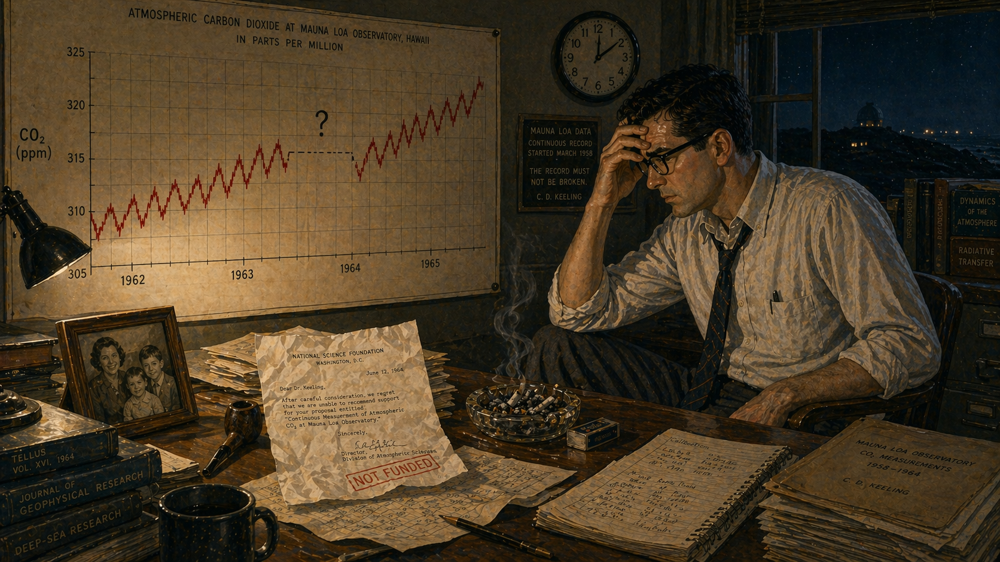

Image Prompt

Please generate a 16:9 image in mid-century scientific illustration style depicting panel 6 of 12. Make the characters and style consistent with the prior panel. The scene shows Keeling, age 36, alone in his Scripps office late at night in 1964, slumped in his desk chair staring at a wall graph of the Keeling Curve that now has a conspicuous gap — a section of the red line is replaced by a dashed line and a question mark where data is missing from several months. His expression is anguished. A rejection letter from a funding agency lies crumpled on the desk. A single desk lamp casts harsh shadows. Color palette: dark blues and shadows dominating, harsh amber from the desk lamp, the red curve line broken by a white gap, institutional gray walls. Emotional tone: frustration, loss, and the pain of watching irreplaceable data disappear. Specific details: (1) the wall graph showing the Keeling Curve with a visible gap in the data around mid-1964 marked by dashes, (2) the crumpled rejection letter, (3) Keeling's loosened tie and rumpled appearance — unusual for this precise man, (4) an overflowing ashtray (he was a pipe smoker), (5) a framed family photo of his wife and children on the desk, (6) a clock showing past midnight. Generate the image immediately without asking clarifying questions.

The cuts left a wound in the data. For several months in 1964, the Mauna Loa record was interrupted, creating a gap that climate scientists would lament for decades. You cannot go back in time and measure the atmosphere of last Tuesday. Every month without data was gone forever. Keeling scrambled to piece together funding from multiple agencies — the National Science Foundation, the Department of Energy, the Weather Bureau — fighting for every dollar, writing endless proposals that all said the same thing: *this measurement matters, and if we stop, we lose something we can never recover.*

## Panel 7: The Vast Geophysical Experiment

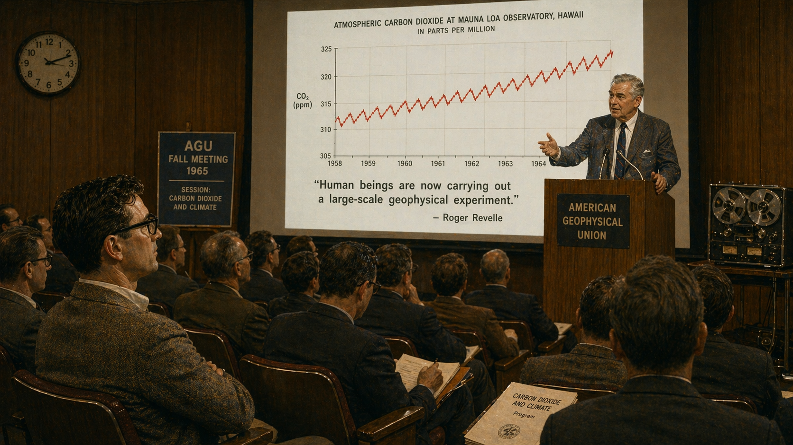

Image Prompt

Please generate a 16:9 image depicting panel 7 of 12, transitioning from mid-century illustration toward a 1970s scientific documentary aesthetic. Make the characters and style consistent with the prior panels. The scene shows a 1965 scientific conference hall where Roger Revelle, now in his early sixties with distinguished silver hair, stands at a podium beneath a projected slide showing the Keeling Curve from 1958 to 1965 — the red sawtooth line climbing unmistakably upward. The slide also shows Revelle's famous quote: "Human beings are now carrying out a large-scale geophysical experiment." Keeling sits in the front row of the audience, arms folded, watching intently. The audience of scientists fills the hall. Color palette: warm wood paneling, projected light on a white screen, the vivid red of the Keeling Curve, 1960s tweed and dark suits in the audience. Emotional tone: a prophetic warning beginning to be heard. Specific details: (1) the projected Keeling Curve graph large and clear on the screen, (2) Revelle's commanding presence at the podium, (3) Keeling in the front row with a slight, vindicated expression, (4) scientists in the audience taking notes, (5) a conference program on the seats reading "Carbon Dioxide and Climate", (6) a reel-to-reel tape recorder at the side of the stage. Generate the image immediately without asking clarifying questions.

Roger Revelle had warned in 1957 that humanity was conducting "a large-scale geophysical experiment" by dumping billions of tons of CO2 into the atmosphere. But warnings without data are just speculation. What made Revelle's insight powerful was Keeling's curve. Year after year, the red line climbed. It was not a model. It was not a projection. It was a measurement — a record of what was actually in the air, captured by instruments calibrated with obsessive precision. By the mid-1960s, the Keeling Curve had turned a theoretical concern into an observable fact: atmospheric CO2 was rising, and it was rising because of us.

## Panel 8: The Unstoppable Line

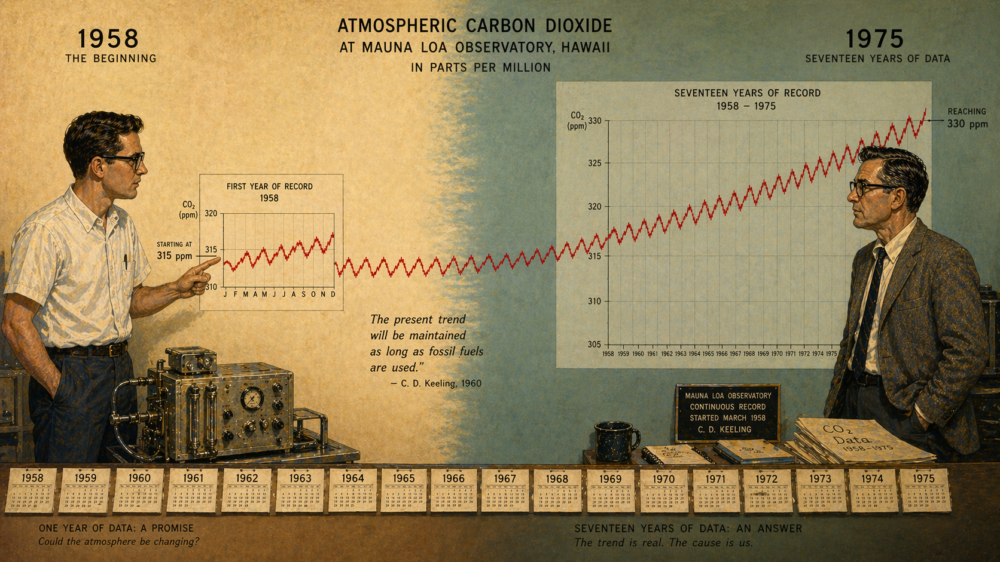

Image Prompt

Please generate a 16:9 image in a style that blends 1970s scientific illustration with emerging data visualization aesthetics, depicting panel 8 of 12. Make the characters and style consistent with the prior panels. The scene shows a split composition spanning two decades. On the left, Keeling in 1958, young and eager, stands beside a small graph showing a single year of data starting at 315 ppm. On the right, Keeling in 1975, now middle-aged with graying hair and deeper lines on his face, stands beside a much larger graph showing seventeen years of data reaching 330 ppm. The red line of the Keeling Curve connects the two halves of the image, physically bridging the gap between the younger and older man. The background transitions from the warm cream 1950s palette on the left to cooler 1970s tones of teal and olive on the right. Emotional tone: the relentless accumulation of evidence over time. Specific details: (1) young Keeling in white short-sleeve shirt, older Keeling in a tweed jacket, (2) the red curve line connecting both graphs across the panel, (3) clearly labeled Y-axis showing 315 ppm on the left and 330 ppm on the right, (4) the sawtooth oscillations visible along the entire curve, (5) calendar pages or year markers along the bottom edge, (6) Keeling's expression shifting from excitement on the left to grim determination on the right. Generate the image immediately without asking clarifying questions.

Three hundred and fifteen parts per million in 1958. Three hundred and twenty in 1965. Three hundred and twenty-five by 1970. Three hundred and thirty by 1975. The curve did not pause. It did not plateau. It did not care about oil crises, economic recessions, or changes in government. Every year, Keeling's instruments recorded more CO2 than the year before. The seasonal sawtooth kept oscillating — the planet kept breathing — but the breath was getting heavier. Each exhale left more carbon in the air than the last. The Keeling Curve was becoming the vital sign of a planet running a fever, and only the man with the thermometer seemed to be paying attention.

## Panel 9: The Evidence the World Needed

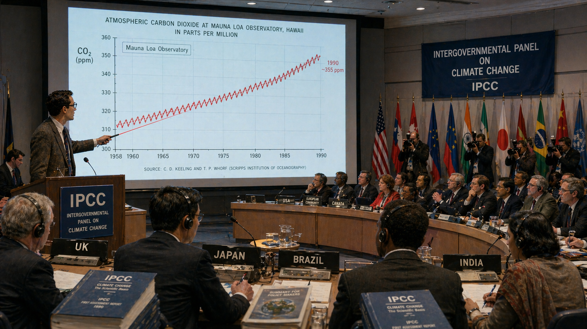

Image Prompt

Please generate a 16:9 image in a modern scientific illustration and data visualization style, depicting panel 9 of 12. Make the characters and style consistent with the prior panels. The scene shows a large 1990 IPCC (Intergovernmental Panel on Climate Change) meeting room in a modern conference center. On a large projection screen, the Keeling Curve is displayed prominently — now stretching from 1958 to 1990, the red sawtooth line reaching approximately 355 ppm. Delegates from many nations sit at long curved desks with country name plates and translation headsets. In the foreground, a scientist gestures toward the screen with a laser pointer. The room is modern, international, urgent. Color palette: modern conference blues, white projection light, the ever-present red of the Keeling Curve, international flags adding color accents. Emotional tone: the moment when one man's lonely measurement becomes the foundation of global policy. Specific details: (1) the Keeling Curve graph large and unmistakable on the screen with "Mauna Loa Observatory" labeled, (2) country nameplates visible (USA, UK, Japan, Brazil, India), (3) delegates wearing translation headsets, (4) thick IPCC report documents on the desks, (5) press photographers with cameras in the back, (6) a banner reading "Intergovernmental Panel on Climate Change" along the wall. Generate the image immediately without asking clarifying questions.

By the late 1980s, the Keeling Curve had become the single most cited piece of evidence in the climate change debate. When the Intergovernmental Panel on Climate Change published its first assessment report in 1990, the Keeling Curve was front and center — the undeniable visual proof that CO2 was accumulating. Computer models could be questioned. Satellite data could be disputed. But Keeling's curve was just a measurement. It said nothing about causes or consequences — it simply showed what was in the air. And what was in the air was more CO2 than at any point in hundreds of thousands of years. Every IPCC report that followed — 1995, 2001, 2007 — used Keeling's data as its foundation.

## Panel 10: A Medal and a Begging Letter

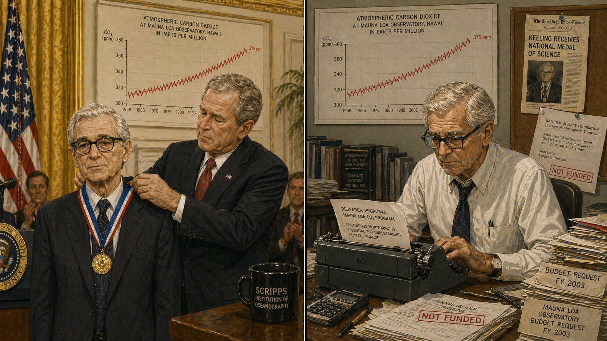

Image Prompt

Please generate a 16:9 image in modern scientific illustration style, depicting panel 10 of 12. Make the characters and style consistent with the prior panels. The scene is a split composition. On the left half, an elderly Charles David Keeling, now 74, thin-faced and white-haired but still wearing his signature black-rimmed glasses, stands in formal attire at the White House in 2002 as President George W. Bush places the National Medal of Science around his neck. The setting is elegant, patriotic, ceremonial. On the right half — separated by a thin vertical line — the same Keeling sits at his cluttered Scripps office desk the following week, hunched over a typewriter composing yet another grant proposal, surrounded by budget documents and rejection letters. The Keeling Curve hangs on the wall behind him in both halves, now reaching nearly 375 ppm. Color palette: left half — presidential gold, navy, white marble; right half — harsh fluorescent light, paper white, institutional gray. Emotional tone: the bitter irony of being honored and underfunded at the same time. Specific details: (1) the National Medal of Science on its ribbon being placed around Keeling's neck, (2) Keeling's dignified but slightly uncomfortable expression at the ceremony, (3) the grant proposal in the typewriter on the right, (4) stacks of budget documents and a calculator, (5) the Keeling Curve poster visible in both halves of the image, (6) a small newspaper clipping about the medal pinned to a corkboard beside a funding rejection letter. Generate the image immediately without asking clarifying questions.

In 2002, President George W. Bush awarded Charles David Keeling the National Medal of Science — the nation's highest scientific honor. The citation praised the Keeling Curve as "a series of measurements that have become one of the most important in modern science." The following week, Keeling was back at his desk writing grant proposals. The monitoring program still lacked stable, long-term funding. He had spent forty-four years producing the most important dataset in climate science, and he still had to beg for every dollar to keep the instruments running. The irony was bitter, but Keeling did not complain. He wrote the proposals, calibrated the instruments, and kept measuring.

## Panel 11: Passing the Torch

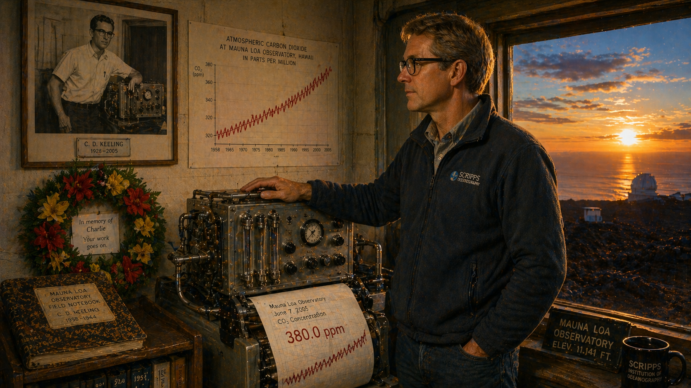

Image Prompt

Please generate a 16:9 image in modern scientific illustration style with warm, elegiac tones, depicting panel 11 of 12. Make the characters and style consistent with the prior panels. The scene shows the Mauna Loa Observatory in June 2005. Ralph Keeling, a man in his mid-forties who resembles his father — same lean build and glasses, but with lighter hair — stands before the CO2 monitoring equipment, his hand resting on the same type of instrument his father first installed decades ago. Through the observatory window, the sun sets over the Pacific, casting long golden light across the lava field. On the wall behind Ralph, a framed photograph shows Charles David Keeling in his younger days beside the original analyzer. A small memorial wreath of tropical flowers sits below the photograph. The latest printout from the analyzer shows 380 ppm. Color palette: warm sunset gold, volcanic umber, deep indigo sky, the red line on the printout, tender greens from the wreath. Emotional tone: grief, continuity, and quiet resolve. Specific details: (1) Ralph Keeling's hand on the instrument, a gesture of inheritance, (2) the framed photo of the elder Keeling as a young man, (3) the memorial wreath with a small card, (4) the analyzer printout clearly showing 380 ppm, (5) the sunset through the observatory window, (6) a worn copy of one of Charles Keeling's original field notebooks on a shelf. Generate the image immediately without asking clarifying questions.

Charles David Keeling died on June 20, 2005, at the age of seventy-seven. He had measured CO2 for forty-seven years without interruption — through funding crises, bureaucratic indifference, and the slow heartbreak of watching his own data confirm humanity's most dangerous experiment. When he started, CO2 stood at 315 parts per million. When he died, it had reached 380. His son Ralph, also a scientist at Scripps, took over the program without hesitation. The instruments kept running. The red line kept climbing. The measurement continued, because the Keelings understood what the funding agencies never fully grasped: some things are too important to stop counting.

## Panel 12: The Planet's Vital Sign

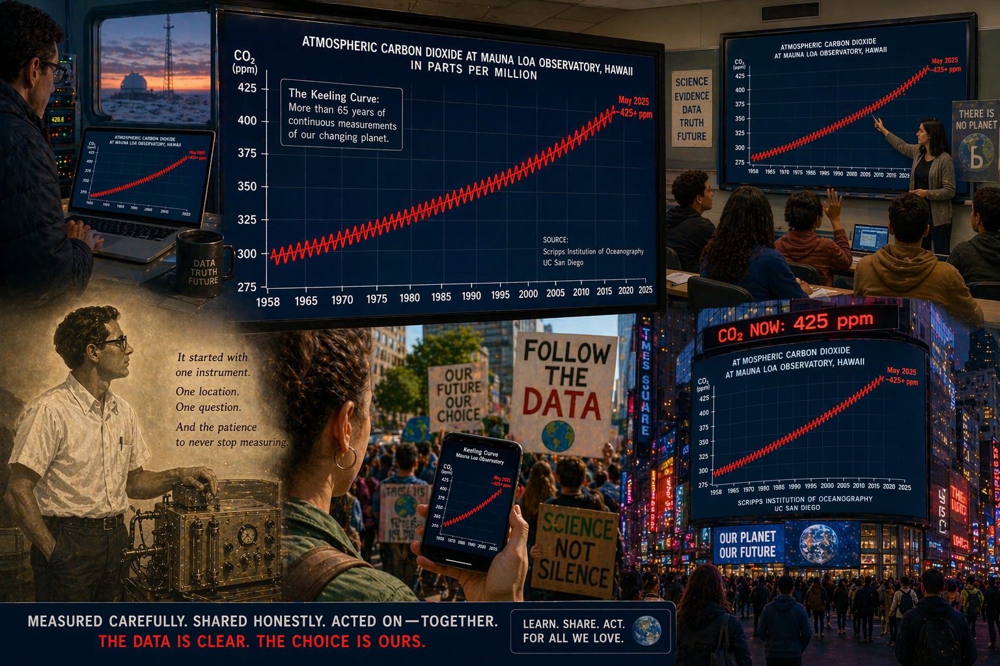

Image Prompt

Please generate a 16:9 image in a bold modern data visualization and infographic style, depicting panel 12 of 12. Make the style a culmination of the visual transition across all panels — fully modern, vivid, and urgent. The scene shows a wide montage. In the center, the complete Keeling Curve from 1958 to 2025 is displayed on a massive digital screen — the red sawtooth line now reaching past 420 ppm, its upward trajectory steeper than ever. The screen appears simultaneously on: a scientist's laptop at a research station, a classroom smartboard where a teacher points it out to students, a smartphone held by a young climate activist at a march, and a giant LED display on the side of a building in Times Square. In the lower corner, small but clear, a ghostly silhouette of young Keeling with his original analyzer gazes up at the enormous curve his lonely measurements created. Color palette: vivid digital blues, the signature red of the Keeling Curve bolder than ever, screen-glow white, urban neon, with the ghostly Keeling silhouette in warm vintage cream. Emotional tone: the awesome and terrifying power of patient data — one man's measurements now visible to the entire world. Specific details: (1) the full Keeling Curve from 315 to 425+ ppm, unmistakable and steep, (2) the multiple screens showing the same graph in different contexts, (3) the classroom scene with engaged students, (4) the climate march with signs reading "Follow the Data", (5) the ghostly vintage silhouette of young Keeling in the corner, (6) a digital counter at the top of the Times Square display reading "CO2 NOW: 425 ppm". Generate the image immediately without asking clarifying questions.

Today, the Keeling Curve passes 425 parts per million and keeps climbing. It is displayed on screens in classrooms, research labs, newsrooms, and United Nations conference halls around the world. It has appeared in every major climate report for three decades. It is printed on protest signs and projected on buildings. It is the most important graph in climate science — and it exists because one man with a homemade gas analyzer drove to the top of a volcano in 1958 and refused to stop measuring. The curve does not argue. It does not predict. It does not persuade. It simply shows what is there. And what is there, year after year, is more carbon dioxide than the year before. Charles David Keeling taught the world that the most revolutionary act in science is sometimes the simplest: measure carefully, measure continuously, and never, ever stop.

### Epilogue -- What Made Charles David Keeling Different?

Keeling did not make a dramatic discovery in a flash of insight. He made the same measurement, at the same place, with the same obsessive precision, for forty-seven years. In an era when science rewarded novelty and breakthroughs, Keeling insisted that the most valuable thing a scientist could do was show up, calibrate the instruments, and record the number. His genius was not in asking a new question — it was in answering an old one with such relentless accuracy that the answer became undeniable. The Keeling Curve works because it is boring. It is the same measurement, repeated thousands of times, and that repetition is what makes it unassailable.

| Challenge | How Keeling Responded | Lesson for Today |
|-----------|-----------------------|------------------|
| Funding agencies calling his work "routine" | Fought for every dollar while maintaining unbroken data collection | Long-term monitoring is not boring — it is foundational |
| The 1964 data gap from budget cuts | Used it as evidence that continuity matters — the gap could never be filled | Some losses are permanent; you cannot go back and measure yesterday's atmosphere |
| Pressure to do "real research" instead of monitoring | Published landmark papers showing CO2 was rising, while never stopping the measurements | Patient data collection IS real research — it just takes decades to prove it |
| A scientific culture that rewards novelty over persistence | Kept measuring anyway, letting the curve speak for itself | The most important data in the world came from the most repetitive work |

### Call to Action

The Keeling Curve is updated daily at [scrippsco2.ucsd.edu](https://scrippsco2.ucsd.edu). Check it. Watch the sawtooth rise and fall with the seasons. Watch the baseline climb, year after year. Then ask yourself: What measurements in your community are not being made because someone thinks they are too boring to fund? What data are we losing right now because nobody wants to do the unglamorous work of simply counting, recording, and showing up again tomorrow? Charles David Keeling showed that the most powerful thing in science is not a brilliant theory — it is a number, measured precisely, over and over, until the truth becomes impossible to ignore.

---

*"The rise of CO2 from fossil fuel burning is essentially an irreversible experiment on the Earth's atmosphere. We are simply not in a position to stop it."*
-- Charles David Keeling

*"Human beings are now carrying out a large scale geophysical experiment of a kind that could not have happened in the past nor be reproduced in the future."*
-- Roger Revelle and Hans Suess, 1957

*"Keeling's measurements are the single most important environmental data set taken in the twentieth century."*
-- Spencer Weart, historian of science

---

## References

1. [Wikipedia: Charles David Keeling](https://en.wikipedia.org/wiki/Charles_David_Keeling) - Biography of the American geochemist who created the continuous CO2 measurement program at Mauna Loa
2. [Wikipedia: Keeling Curve](https://en.wikipedia.org/wiki/Keeling_Curve) - The iconic graph of atmospheric CO2 concentration measured at Mauna Loa Observatory since 1958
3. [Wikipedia: Mauna Loa Observatory](https://en.wikipedia.org/wiki/Mauna_Loa_Observatory) - The atmospheric research station on Hawaii where Keeling began his measurements
4. [Scripps CO2 Program: The Keeling Curve](https://scrippsco2.ucsd.edu/) - The official Scripps Institution of Oceanography page with daily updated Keeling Curve data
5. [Encyclopaedia Britannica: Charles David Keeling](https://www.britannica.com/biography/Charles-David-Keeling) - Curated reference overview of Keeling's life, career, and scientific legacy
