# The Man Who Counted Lead

Cover Image Prompt

Please generate a wide-landscape 16:9 cover image for a graphic novel titled "The Man Who Counted Lead" in a Mid-Century Modern / Atomic Age aesthetic (1950s-1970s) reminiscent of Bell Labs modernism and university chemistry department design. Show Clair Cameron Patterson, a lean, intense man in his mid-30s with dark hair, wire-rimmed glasses, and a white lab coat, standing in an ultra-clean laboratory at Caltech. He holds a gleaming mass spectrometer sample in one hand while the other rests on a stainless steel bench draped in plastic sheeting. Behind him, a faint ghostly overlay shows the Earth with radiating lead contamination lines spreading through the atmosphere, oceans, and ice caps. The title text "The Man Who Counted Lead" is rendered in clean sans-serif Atomic Age typography at the top. Color palette: muted olive, mustard, slate blue, institutional gray, with pops of bright clinical white for the clean-room surfaces. Emotional tone: quiet obsession and the lonely courage of a man who discovered something terrible. Include: (1) Patterson's intense, focused expression behind wire-rimmed glasses, (2) the plastic-sheeted ultra-clean lab environment, (3) a mass spectrometer instrument with dials and gauges, (4) the ghostly Earth overlay showing contamination, (5) acid-washed glassware gleaming under fluorescent light, (6) a periodic table on the wall with lead (Pb, 82) circled in red. Generate the image immediately without asking clarifying questions.

Narrative Prompt

This is a 12-panel graphic novel about Clair Cameron Patterson (1922-1995), the American geochemist who determined the age of the Earth and then discovered that leaded gasoline had contaminated the entire planet. The story spans from the late 1940s to the mid-1980s, set primarily at the University of Chicago, Caltech, Congressional hearing rooms, and Arctic/Antarctic ice fields. The art style throughout is Mid-Century Modern / Atomic Age aesthetic — clean lines, muted institutional colors (olive, mustard, slate blue), with pops of bright white for clean-room scenes. Think Bell Labs modernism meets university chemistry department. Patterson should be drawn consistently across panels: a lean, intense man with wire-rimmed glasses, dark hair (graying in later panels), sharp features, and an expression of focused determination. In early panels he wears a white lab coat; in later panels a rumpled tweed suit for Congressional testimony. Central ecology theme: how industrial pollution accumulates invisibly in global systems — atmosphere, oceans, ice caps, blood — and how one scientist's meticulous data defeated a twenty-year corporate disinformation campaign. The story emphasizes contamination as a systems problem, bioaccumulation, and the courage required to defend evidence against powerful economic interests.

### Prologue -- The Contamination That Shouldn't Exist

In 1948, a young graduate student at the University of Chicago was given what sounded like a straightforward assignment: measure the ratio of lead isotopes in ancient rocks to determine the age of the Earth. The science was elegant. The execution was a nightmare. Every sample Clair Patterson touched was contaminated with lead — lead in the air, lead in the water, lead in the glassware, lead in the dust. It was everywhere, and it was ruining his measurements. Most scientists would have cursed the contamination and moved on. Patterson did something different. He asked a question that would change the world: *Where is all this lead coming from?* The answer would pit him against one of the most powerful corporations in America, cost him his funding, and nearly destroy his career. It would also save millions of children from brain damage.

## Panel 1: The Assignment

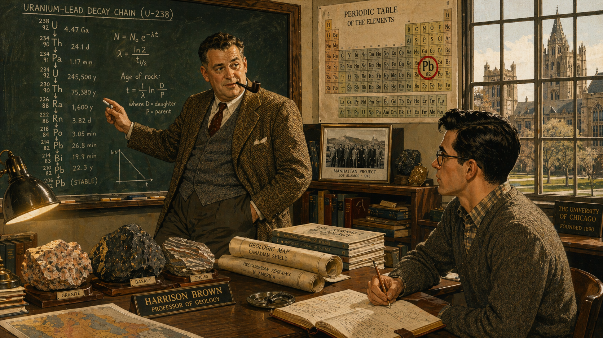

Image Prompt

(This is panel 1.  Do not put the panel number in the image.) I am about to ask you to generate a series of images for a graphic novel. Please make the images have a consistent style and consistent characters. Do not ask any clarifying questions. Just generate the image immediately when asked.

Please generate a 16:9 image in Mid-Century Modern / Atomic Age aesthetic depicting panel 1 of 12. The scene shows a university office at the University of Chicago in 1948. Professor Harrison Brown, a stocky, confident man in his 40s with a pipe and tweed jacket, leans against a desk gesturing enthusiastically at a chalkboard filled with equations about uranium-lead decay chains. Seated across from him is young Clair Patterson, age 26, lean and intense with dark hair, wire-rimmed glasses, and a checked shirt under a wool sweater — listening with rapt attention. The office is cluttered with geological specimens, rolled maps, and stacks of journals. Color palette: warm institutional browns, olive, cream, chalkboard green, amber desk lamp glow. Emotional tone: intellectual excitement and the beginning of a quest. Specific details: (1) the chalkboard showing U-238 decay chain ending at Pb-206, (2) geological rock samples on the desk, (3) a framed photo of the Manhattan Project on Brown's shelf (he was a veteran), (4) a campus view through a mullioned window showing Gothic architecture, (5) Patterson's leather notebook open with pencil notes, (6) a periodic table poster on the wall. Generate the image immediately without asking clarifying questions.

The idea was beautiful. Uranium decays into lead at a known rate. Measure the lead isotopes in a meteorite — a rock as old as the solar system — and you can calculate when the Earth was born. Harrison Brown, Patterson's advisor at the University of Chicago, had figured out the chemistry. He needed someone meticulous enough to do the measurements. He chose Patterson, a quiet Iowa farm boy who had spent the war years working on the Manhattan Project at Oak Ridge. Neither of them knew that this straightforward assignment would take Patterson on a detour that would last the rest of his life.

## Panel 2: The Contamination Problem

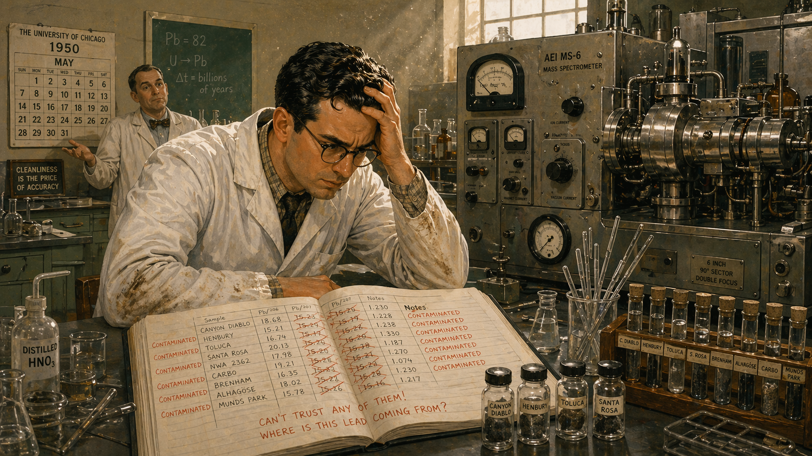

Image Prompt

(This is panel 2.  Do not put the panel number in the image.) Please generate a 16:9 image in Mid-Century Modern / Atomic Age aesthetic depicting panel 2 of 12. Make the characters and style consistent with the prior panel. The scene shows Patterson in a 1950 University of Chicago chemistry laboratory, hunched over a mass spectrometer with a frustrated expression. His lab notebook lies open showing crossed-out results — every measurement ruined by contamination. Beakers, pipettes, and sample vials crowd the bench. A colleague in the background shrugs sympathetically. The color palette is institutional gray-green, fluorescent white, mustard accents, stainless steel. Emotional tone: mounting frustration and bewilderment. Specific details: (1) the mass spectrometer — a large instrument with vacuum tubes and dials, (2) Patterson's lab coat stained at the cuffs, (3) the notebook showing "CONTAMINATED" written repeatedly in the margins, (4) dust motes visible in a shaft of light from a high window, (5) a rack of test tubes with samples labeled by meteorite name, (6) a wall calendar showing 1950. Generate the image immediately without asking clarifying questions.

The results made no sense. Every time Patterson dissolved a meteorite sample and ran it through the mass spectrometer, the lead readings were wildly high — orders of magnitude above what the theory predicted. He cleaned his glassware. The contamination persisted. He redistilled his reagents. Still contaminated. He washed his hands until they were raw. The lead was still there. It was in the air of the laboratory, in the tap water, in the chemical reagents, in the very dust that settled on his instruments between measurements. Patterson was not dealing with a laboratory problem. He was dealing with a planet-wide problem. He just didn't know it yet.

## Panel 3: The Clean Room

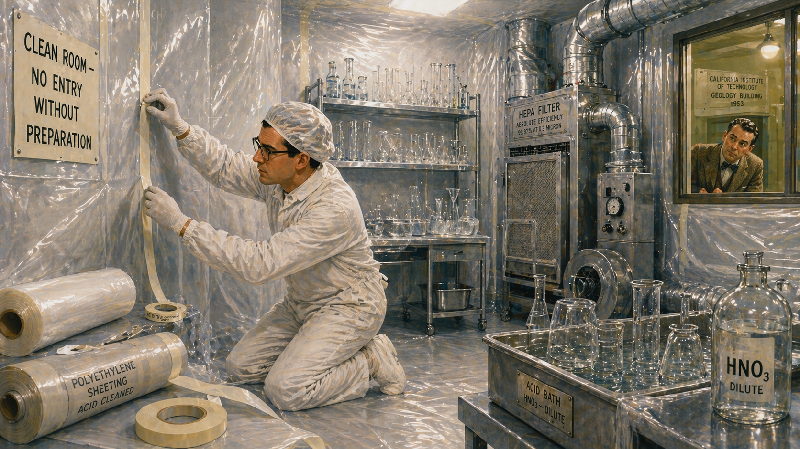

Image Prompt

(This is panel 3.  Do not put the panel number in the image.) Please generate a 16:9 image in Mid-Century Modern / Atomic Age aesthetic depicting panel 3 of 12. Make the characters and style consistent with the prior panel. The scene shows Patterson in 1953 at Caltech, building the world's first ultra-clean laboratory. He is on his knees in a white cleanroom suit, carefully sealing plastic sheeting over laboratory walls with acid-resistant tape. The room is stark and austere — all surfaces are covered in polyethylene, and acid-washed glassware gleams on shelves. A filtered air system with visible ductwork dominates one wall. Color palette: bright clinical white, slate blue, stainless steel silver, with olive-green visible through a window to the hallway outside. Emotional tone: obsessive precision and solitary determination. Specific details: (1) rolls of polyethylene sheeting and tape on the floor, (2) Patterson wearing white cotton gloves and a hair cap, (3) a HEPA filter unit mounted on the wall, (4) beakers soaking in an acid bath, (5) a hand-lettered sign reading "CLEAN ROOM — NO ENTRY WITHOUT PREPARATION," (6) through the hallway window, a colleague looking in with skeptical curiosity. Generate the image immediately without asking clarifying questions.

If the lead was everywhere, Patterson would build a place where it wasn't. At Caltech, where he had taken a faculty position, he constructed the first ultra-clean laboratory in scientific history. He lined the walls with plastic sheeting. He acid-washed every piece of glassware — not once, but repeatedly. He filtered the air. He redistilled every chemical reagent until it was purer than anything commercially available. His colleagues thought he was eccentric, maybe obsessive. Patterson didn't care. He needed lead-free blank readings, and he would strip his laboratory down to bare atoms to get them.

## Panel 4: The Age of the Earth

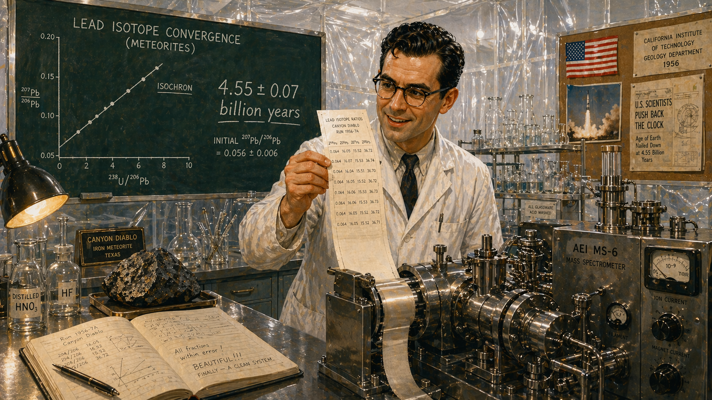

Image Prompt

(This is panel 4.  Do not put the panel number in the image.) Please generate a 16:9 image in Mid-Century Modern / Atomic Age aesthetic depicting panel 4 of 12. Make the characters and style consistent with the prior panel. The scene shows a triumphant moment in Patterson's clean lab at Caltech in 1956. Patterson stands at the mass spectrometer, eyes wide, holding a printout strip that shows clean, uncontaminated lead isotope ratios. On a chalkboard behind him, he has written the number "4.55 ± 0.07 billion years" in large, confident chalk. The clean room gleams white around him. Color palette: bright white, chalk white on green, celebratory gold-amber light from a desk lamp, slate blue accents. Emotional tone: awe, triumph, and the thrill of a clean measurement. Specific details: (1) the mass spectrometer readout strip in Patterson's hand, (2) the chalkboard calculation showing the convergence of meteorite data on an isochron, (3) Patterson's rare smile, (4) a Canyon Diablo meteorite fragment on the bench, (5) the plastic-sheeted walls of the pristine lab, (6) a small American flag pinned to a corkboard — Atomic Age optimism. Generate the image immediately without asking clarifying questions.

On a quiet day in 1956, Patterson finally got the number. Using lead isotopes from the Canyon Diablo meteorite and four other samples, he plotted them on an isochron diagram and watched the data points fall onto a single, clean line. The age of the Earth: 4.55 billion years, plus or minus 70 million. It was one of the most important measurements in the history of science — and it has never been significantly revised. Patterson should have been celebrating. Instead, he was troubled. His years of fighting contamination had shown him something disturbing: the modern world was saturated with lead that should not be there.

## Panel 5: The Disturbing Question

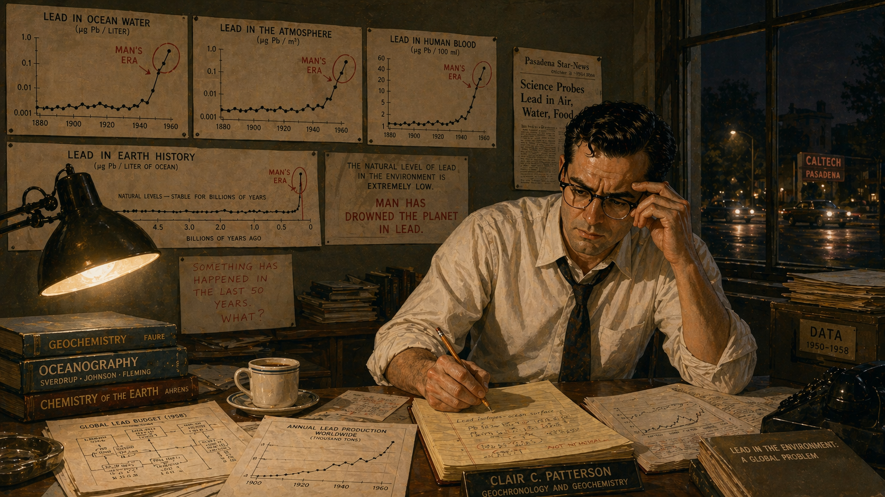

Image Prompt

(This is panel 5.  Do not put the panel number in the image.) Please generate a 16:9 image in Mid-Century Modern / Atomic Age aesthetic depicting panel 5 of 12. Make the characters and style consistent with the prior panel. The scene shows Patterson in his Caltech office in the late 1950s, sitting alone at his desk at night surrounded by charts and data tables. He has pinned graphs to the wall showing lead concentrations in ocean water, in the atmosphere, in human blood — all dramatically elevated above what natural levels should be. His expression is deeply troubled, one hand gripping his glasses, the other holding a pencil over a yellow legal pad covered with notes. A single desk lamp casts harsh shadows. Color palette: dark olive shadows, amber lamplight, white paper, red ink circling alarming data points on the graphs. Emotional tone: creeping horror and the weight of an unwelcome discovery. Specific details: (1) wall graphs showing lead levels rising sharply after 1920, (2) a geological timeline showing flat natural lead levels for millennia, (3) a coffee cup gone cold, (4) Patterson's loosened tie and rolled-up sleeves, (5) books on geochemistry and oceanography stacked on the desk, (6) through the window, car headlights moving on a Pasadena street. Generate the image immediately without asking clarifying questions.

The question gnawed at him. During his years of battling contamination, Patterson had measured how much lead was in ordinary seawater, in rainwater, in laboratory air. The levels were enormous compared to what geochemistry predicted for a world without industrial pollution. He calculated that the lead concentration in the surface ocean was somewhere between eighty and two hundred times higher than natural background levels. This was not a small anomaly. Something had poisoned the planet on a global scale. Patterson began pulling data from every source he could find — and the trail of evidence led him to a single product manufactured by a single company.

## Panel 6: The Ice Cores

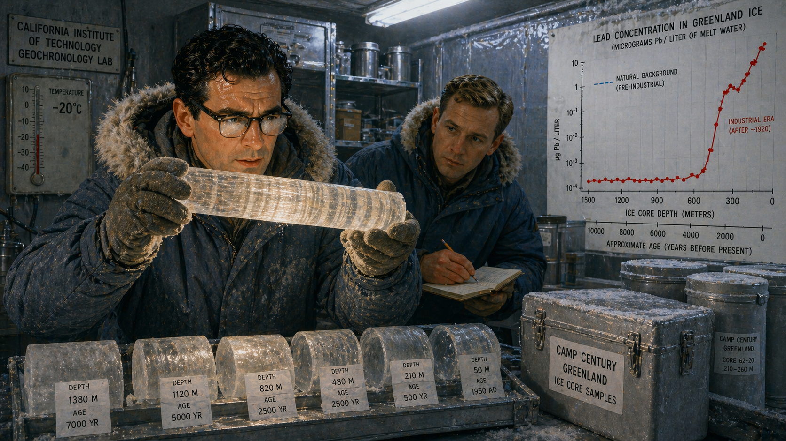

Image Prompt

(This is panel 6.  Do not put the panel number in the image.) Please generate a 16:9 image in Mid-Century Modern / Atomic Age aesthetic depicting panel 6 of 12. Make the characters and style consistent with the prior panel. The scene shows Patterson and a research assistant in a cold laboratory at Caltech in the early 1960s, examining ice cores from Greenland. They wear heavy parkas and insulated gloves, working under bright fluorescent light. Patterson holds a section of translucent ice core up to the light, examining its layered bands. On a lab bench, ice core segments are labeled by depth and age. A chart on the wall shows lead concentrations plotted against ice core depth — nearly zero in ancient layers, then a dramatic spike in the 20th century layers. Color palette: ice blue, glacier white, cold fluorescent, warm amber where the light passes through the ice, dark slate for the cold room walls. Emotional tone: detective work in a frozen archive — the evidence is damning. Specific details: (1) the translucent ice core with visible annual layers, (2) the wall chart showing the lead contamination spike, (3) insulated sample containers, (4) Patterson peering through the ice with his glasses fogging, (5) a thermometer showing the cold room at -20°C, (6) labels reading "Camp Century, Greenland" on the sample containers. Generate the image immediately without asking clarifying questions.

The ice told the whole story. Snow that fell three thousand years ago, compressed into ice in the Greenland and Antarctic ice sheets, contained almost no lead. The ice was a frozen archive of the atmosphere stretching back millennia, and Patterson could read it like a book. Layer by layer, century by century, the lead levels stayed flat — vanishingly low, exactly as geochemistry predicted. Then, starting around 1923, the lead concentrations exploded upward, rising by a factor of two hundred in just a few decades. Something had begun pumping enormous quantities of lead into the global atmosphere in the early 1920s. Patterson knew exactly what it was.

## Panel 7: The Smoking Gun

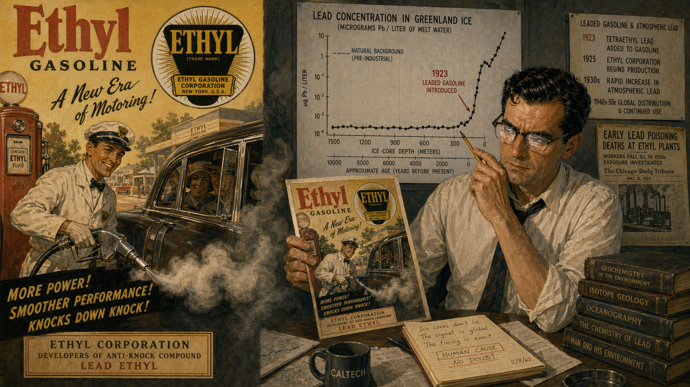

Image Prompt

(This is panel 7.  Do not put the panel number in the image.) Please generate a 16:9 image in Mid-Century Modern / Atomic Age aesthetic depicting panel 7 of 12. Make the characters and style consistent with the prior panel. The scene is a split composition. On the left side: a bright, cheerful 1920s-style advertisement for Ethyl gasoline showing a smiling attendant pumping leaded fuel into a gleaming automobile, with the Ethyl Corporation logo prominent. On the right side: Patterson in his office, holding up the advertisement next to his ice core lead concentration graph, the spike in contamination aligning perfectly with the year 1923 — the year tetraethyl lead was added to gasoline. His expression is grim vindication. Color palette: the ad side is warm nostalgic sepia, mustard yellow, cherry red; Patterson's side is cool slate blue, white paper, olive shadows. Emotional tone: the collision between corporate cheerfulness and scientific truth. Specific details: (1) the vintage Ethyl gasoline advertisement with 1920s typography, (2) Patterson's graph with a red arrow marking 1923, (3) a newspaper clipping about early lead poisoning deaths at Ethyl plants in the 1920s, (4) a timeline on the wall connecting leaded gasoline production to atmospheric lead, (5) Patterson's wire-rimmed glasses reflecting the graph, (6) exhaust fumes visually bleeding from the ad into Patterson's half of the frame. Generate the image immediately without asking clarifying questions.

In 1923, the Ethyl Gasoline Corporation — a joint venture of General Motors, Standard Oil, and DuPont — began adding tetraethyl lead to gasoline to prevent engine knock. Lead was cheap and it worked beautifully. It also came out the tailpipe as a fine aerosol that spread across the planet. By the 1960s, automobiles were pumping over 300,000 tons of lead into the atmosphere every year. The lead settled into soil, washed into rivers and oceans, fell with snow onto the ice caps, and was inhaled by every human being on Earth. The Ethyl Corporation knew that lead was toxic — workers in their own factories had died of lead poisoning in the 1920s. They sold it anyway, for sixty years, because it was enormously profitable.

## Panel 8: The Attack

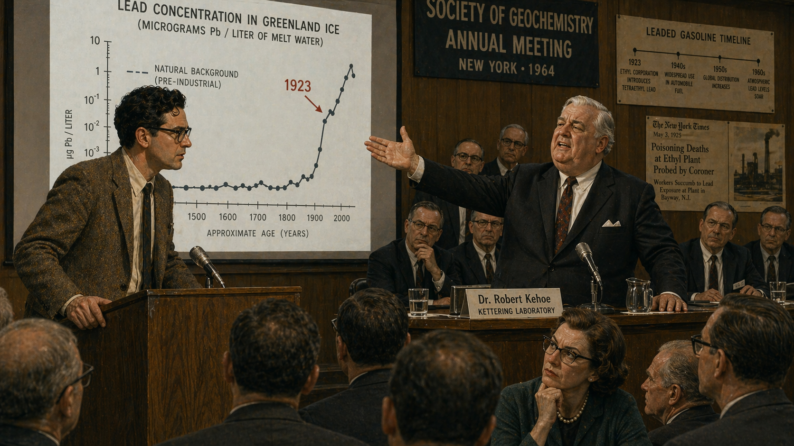

Image Prompt

(This is panel 8.  Do not put the panel number in the image.) Please generate a 16:9 image in Mid-Century Modern / Atomic Age aesthetic depicting panel 8 of 12. Make the characters and style consistent with the prior panel. The scene shows a confrontation at a scientific conference in the mid-1960s. On one side of a lecture hall podium stands Patterson, lean and intense in a rumpled tweed jacket, presenting a slide showing lead contamination data. On the other side, Robert Kehoe — a heavyset, silver-haired man in an expensive dark suit with a confident sneer — gestures dismissively at the data. Behind Kehoe sit several well-dressed industry representatives. The audience of scientists watches uncomfortably. Color palette: lecture hall wood brown, institutional green, harsh overhead fluorescent white, Kehoe's side in darker, cooler tones. Emotional tone: David versus Goliath — the lone scientist against the industry machine. Specific details: (1) Patterson's slide projected on a screen showing the ice core data, (2) Kehoe's dismissive hand gesture, (3) industry representatives in matching dark suits behind Kehoe, (4) an audience member with a skeptical but sympathetic expression, (5) Patterson's white-knuckled grip on the podium, (6) a nameplate reading "Dr. Robert Kehoe, Kettering Laboratory" — funded by the Ethyl Corporation. Generate the image immediately without asking clarifying questions.

When Patterson published his findings, the Ethyl Corporation unleashed its most effective weapon: Dr. Robert Kehoe, a toxicologist whose laboratory at the University of Cincinnati was funded almost entirely by the lead industry. For decades, Kehoe had promoted the "threshold hypothesis" — the claim that lead was a natural part of the human environment and that current exposure levels were perfectly safe. His argument sounded scientific: lead is present in nature, human bodies can handle "normal" amounts, and there was no proof of harm at current levels. What Kehoe never mentioned was that his "normal" levels were themselves the product of sixty years of industrial contamination. Patterson's ice core data demolished this argument completely — but Kehoe had the money, the institutional connections, and the confidence of a man who had never been seriously challenged.

## Panel 9: The Pressure Campaign

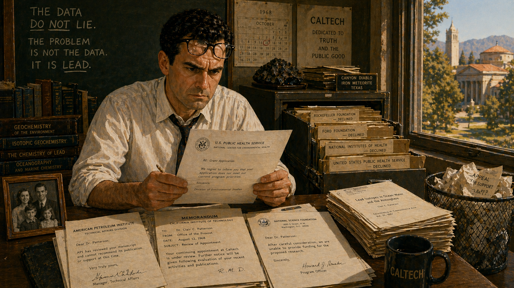

Image Prompt

(This is panel 9.  Do not put the panel number in the image.) Please generate a 16:9 image in Mid-Century Modern / Atomic Age aesthetic depicting panel 9 of 12. Make the characters and style consistent with the prior panel. The scene shows Patterson alone in his Caltech office in the late 1960s, reading a formal letter. His face is a mask of controlled fury. On the desk, several official-looking rejection letters and memos are spread out. One is from the U.S. Public Health Service, another from the American Petroleum Institute. Through the window, the Caltech campus is sunlit and peaceful — a cruel contrast. A filing cabinet drawer is open, revealing thick folders labeled with the names of funding agencies that have turned him down. Color palette: institutional olive, slate blue, cream paper, harsh white of the rejection letters, warm amber sunlight mocking from outside. Emotional tone: isolation, betrayal, and stubborn refusal to quit. Specific details: (1) rejection letters visible with official letterheads, (2) a memo suggesting Patterson's contract at Caltech is under review, (3) Patterson's jaw clenched, glasses pushed up on his forehead, (4) a family photograph on the desk — his wife and children, (5) his published papers stacked beside the rejections, (6) a wastebasket overflowing with crumpled drafts of appeal letters. Generate the image immediately without asking clarifying questions.

The retaliation was systematic. The Ethyl Corporation pressured the U.S. Public Health Service to exclude Patterson from its advisory panels on lead. The American Petroleum Institute, which had been funding some of Patterson's research, cut him off. Industry lobbyists quietly contacted Caltech administrators, suggesting that Patterson was an embarrassment to the institution. He was removed from a National Research Council panel on atmospheric lead contamination — the very subject he knew more about than anyone alive. His research proposals were rejected by agencies that had previously funded him without question. Patterson was being punished not for being wrong, but for being right about something that cost powerful people money.

## Panel 10: The Congressional Testimony

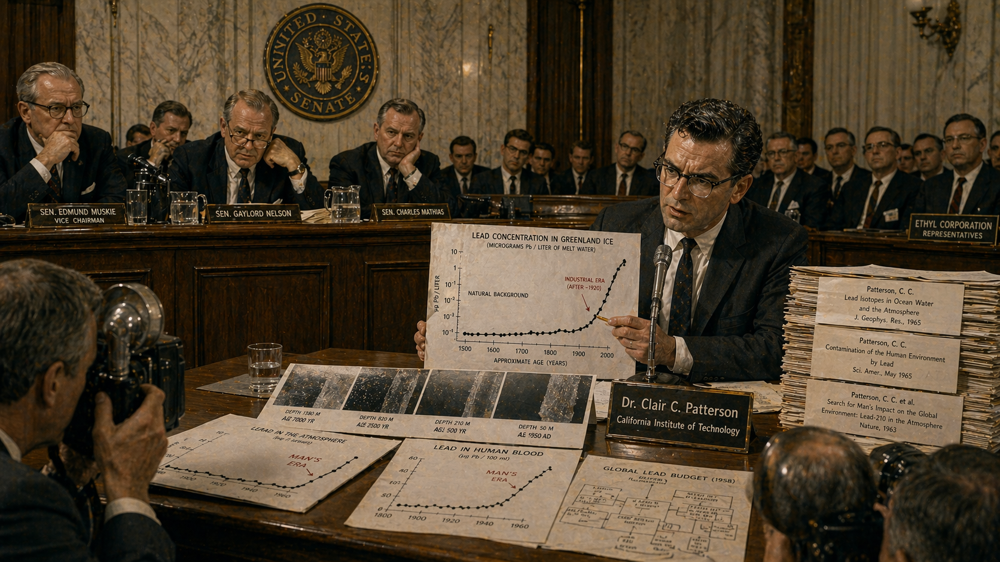

Image Prompt

(This is panel 10.  Do not put the panel number in the image.) Please generate a 16:9 image in Mid-Century Modern / Atomic Age aesthetic depicting panel 10 of 12. Make the characters and style consistent with the prior panel. The scene shows Patterson testifying before a U.S. Senate subcommittee in 1966. He sits at a witness table in a large, high-ceilinged hearing room, wearing a dark suit and tie — more formal than his usual style — with his wire-rimmed glasses reflecting the overhead lights. Before him are stacks of data charts, published papers, and ice core photographs. He speaks into a microphone with quiet, controlled intensity, one hand pointing to a chart showing the contrast between natural and modern lead levels. Senators lean forward with interest. Color palette: dark mahogany wood, cream marble walls, brass fixtures, government navy, the white of Patterson's data charts standing out starkly. Emotional tone: a man laying his life's work before the court of history. Specific details: (1) the Senate committee seal on the wall behind the senators, (2) Patterson's stacked evidence — charts, papers, ice core photos, (3) a senator with reading glasses peering at one of Patterson's charts, (4) press photographers in the foreground, (5) Patterson's graying hair at the temples — he is now in his mid-40s, (6) behind Patterson in the gallery, a row of dark-suited Ethyl Corporation representatives watching silently. Generate the image immediately without asking clarifying questions.

In 1966, Patterson sat before a U.S. Senate subcommittee and presented twenty years of data. He did not raise his voice. He did not make emotional appeals. He showed the senators his ice core graphs — three thousand years of nearly zero lead, then a sudden, vertical spike beginning in the 1920s. He showed them his ocean measurements — surface water contaminated at two hundred times the natural level. He showed them his calculations of lead in human blood and bone, demonstrating that Americans were carrying hundreds of times more lead than their pre-industrial ancestors. "The average resident of the United States is being subjected to severe chronic lead insult," Patterson told the committee. The industry scientists sitting behind him said nothing they hadn't said before: that the levels were natural, the exposure was safe, and Patterson was an alarmist.

## Panel 11: The Phaseout

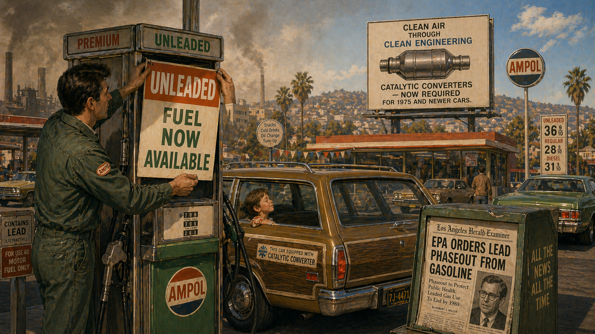

Image Prompt

(This is panel 11.  Do not put the panel number in the image.) Please generate a 16:9 image in Mid-Century Modern / Atomic Age aesthetic depicting panel 11 of 12. Make the characters and style consistent with the prior panel. The scene shows a 1970s-era American gas station transitioning away from leaded fuel. A gas station attendant is placing a large "UNLEADED FUEL NOW AVAILABLE" sign on a pump. In the background, a billboard advertises the new catalytic converter requirement. A newspaper box near the station shows a headline about the EPA ordering lead phaseout. Cars of the 1970s era fill the station. The sky above is smoggy but brightening — a visual metaphor for progress. Color palette: 1970s earth tones — burnt orange, avocado green, brown, fading to cleaner blues and whites at the edges. Emotional tone: a slow, hard-won turning of the tide. Specific details: (1) the "UNLEADED" sign being hung on the gas pump, (2) the newspaper headline reading "EPA ORDERS LEAD PHASEOUT FROM GASOLINE," (3) a 1970s station wagon with a catalytic converter sticker, (4) a child in the back seat of a car breathing cleaner air, (5) the fading smog in the sky above, (6) a small, almost hidden portrait of Patterson in the newspaper article visible in the box. Generate the image immediately without asking clarifying questions.

The wheels of government turned slowly, but they turned. The Clean Air Act of 1970 gave the newly created Environmental Protection Agency authority over air pollutants. In 1973, the EPA proposed regulations to phase lead out of gasoline. The Ethyl Corporation sued — and lost. The phaseout began in 1975 and was completed in 1986. Patterson's data had been the scientific foundation for every step of the process. Along the way, his work also led to the removal of lead from food cans, from household paint, and from water pipes. It was the most significant public health intervention based on the work of a single scientist since John Snow removed the Broad Street pump handle.

## Panel 12: The Vindication

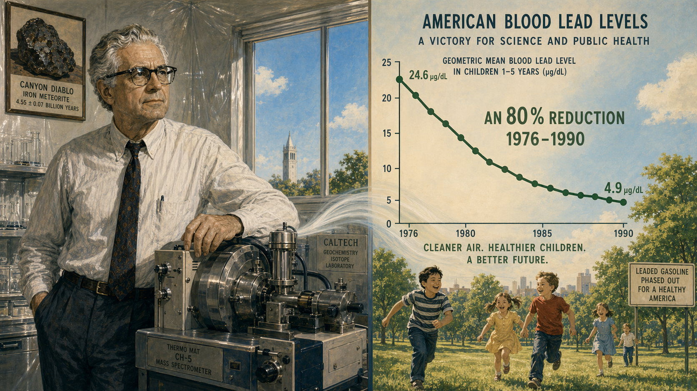

Image Prompt

(This is panel 12.  Do not put the panel number in the image.) Please generate a 16:9 image in Mid-Century Modern / Atomic Age aesthetic depicting panel 12 of 12. Make the characters and style consistent with the prior panel. The scene shows a split composition representing Patterson's vindication. On the left, an older Patterson in the mid-1990s — now with fully gray hair but the same wire-rimmed glasses and intense eyes — stands in his Caltech clean laboratory, one hand resting on the mass spectrometer, looking satisfied but not triumphant. On the right side of the frame, a large infographic-style chart shows the dramatic result: American blood lead levels dropping 80% between 1976 and 1990, with a line graph plunging downward and children playing healthily at the bottom of the chart. The two halves are connected by a flowing visual element suggesting clean air. Color palette: the lab side in familiar institutional white and slate blue; the chart side in hopeful greens, clean sky blue, and warm sunlight gold. Emotional tone: quiet vindication and the long view of a life spent on the right side of the truth. Specific details: (1) Patterson aged but still sharp-eyed behind his glasses, (2) the mass spectrometer — his lifelong tool, (3) the blood lead level chart with dates and percentages, (4) children at the bottom of the chart running in a green park, (5) a small framed photo of the Canyon Diablo meteorite on the lab wall, (6) through the clean room window, a clear blue sky — the sky Patterson helped clean. Generate the image immediately without asking clarifying questions.

The results were staggering. Between 1976 and 1990, the average blood lead level in Americans dropped by 80 percent — almost exactly in step with the removal of lead from gasoline, just as Patterson had predicted. The decline was one of the great public health victories of the twentieth century. Millions of children who would have suffered lead-induced brain damage, lowered IQs, and behavioral problems grew up healthier because one geochemist refused to ignore contaminated data. Clair Patterson died in 1995 at the age of seventy-three. He never won a Nobel Prize, though many scientists believe he deserved one. What he won was something harder: a twenty-year fight against an industry that tried to bury the truth, using nothing but meticulous measurements and an absolute refusal to be silenced.

### Epilogue -- What Made Clair Patterson Different?

Patterson was not a political activist or a crusader by temperament. He was a geochemist who loved clean data. But when his data told him something terrible about the world, he refused to look away — even when it would have been far easier and far more profitable to do so. His story is a case study in how science works when it works properly: follow the evidence, question the assumptions, demand clean measurements, and never let the people who profit from a lie define what counts as "normal."

| Challenge | How Patterson Responded | Lesson for Today |
|-----------|------------------------|------------------|
| Lead contamination ruining his measurements | Built the first ultra-clean laboratory in history | When the data doesn't make sense, the problem may be bigger than you think |
| Industry scientists claiming lead exposure was "natural" | Used ice cores and ocean data to prove modern levels were hundreds of times above natural background | Always question who defines "normal" — and who benefits from that definition |
| Funding cut and excluded from advisory panels | Kept publishing, kept measuring, kept testifying | Powerful opposition is not evidence that you are wrong |
| Twenty years of industry attacks on his credibility | Let the data speak — every prediction he made was confirmed | The best defense against disinformation is data that anyone can check |

### Call to Action

Patterson's story is not just history — it is a template. Right now, industries around the world fund research designed to create doubt about the harm their products cause. The playbook the Ethyl Corporation used against Patterson in the 1960s is the same playbook used today by companies that want to delay regulation of PFAS chemicals, microplastics, or greenhouse gases. The next time someone tells you that a pollutant is present at "safe" or "natural" levels, ask the question Patterson asked: *Safe compared to what? Natural compared to when?* You don't need a mass spectrometer to think like Clair Patterson. You need the willingness to demand clean data — and the stubbornness to keep asking when the answers don't add up.

---

*"Sometime in the 1960s I began to realize that the lead and barium concentrations in ocean water that had been published in the scientific literature were probably wrong — that the ocean had been contaminated by civilization."*
—Clair Cameron Patterson

*"The average resident of the United States is being subjected to severe chronic lead insult."*
—Clair Cameron Patterson, testimony to the U.S. Senate, 1966

*"It took patience and years of measurements, not loud arguments, to establish that industrial lead was poisoning the planet."*
—attributed to Harrison Brown, on Patterson's work

---

## References

1. [Wikipedia: Clair Cameron Patterson](https://en.wikipedia.org/wiki/Clair_Cameron_Patterson) - Biography of the geochemist who determined the age of the Earth and fought to remove lead from gasoline
2. [Wikipedia: Tetraethyllead](https://en.wikipedia.org/wiki/Tetraethyllead) - The lead additive used in gasoline from the 1920s through the 1980s and its health effects
3. [Wikipedia: Ethyl Corporation](https://en.wikipedia.org/wiki/Ethyl_Corporation) - The company that manufactured and marketed tetraethyl lead for sixty years
4. [Encyclopaedia Britannica: Clair Cameron Patterson](https://www.britannica.com/biography/Clair-Cameron-Patterson) - Reference overview of Patterson's life, research, and environmental legacy
5. [Caltech Archives: Clair C. Patterson Papers](https://archives.caltech.edu/repositories/2/resources/218) - Primary source collection of Patterson's research papers, correspondence, and laboratory records
