# The River That Caught Fire

Cover Image Prompt

Please generate a wide-landscape 16:9 cover image for a graphic novel titled "The River That Caught Fire" in an American industrial realism style transitioning from Dorothea Lange documentary photography to 1970s protest poster art. Show the Cuyahoga River in Cleveland, Ohio, ablaze — orange and yellow flames leaping from the oily surface of a dark, sludge-covered waterway, with a railroad trestle bridge burning overhead. Steel mills and smokestacks line both banks, belching black smoke into a rust-orange sky. In the foreground, a single firefighter on a tugboat aims a hose at the burning water. The title text "The River That Caught Fire" is rendered in bold, industrial stencil typeface at the top. Color palette: rust orange, charcoal black, muddy brown, industrial gray, flame yellow, with a single hopeful sliver of blue sky at the horizon. Emotional tone: outrage and disbelief — water should not burn. Include: (1) flames reflecting off the oily river surface, (2) the silhouette of Cleveland's industrial skyline, (3) a railroad bridge with charred timbers, (4) thick oil slicks visible on the water, (5) a firefighter's determined expression, (6) smokestacks trailing dark plumes against the sky. Generate the image immediately without asking clarifying questions.

Narrative Prompt

This is a 12-panel graphic novel about the Cuyahoga River fires (1868-1969) and the birth of the Environmental Protection Agency. The story is an ensemble/location narrative — the river itself is the main character, with key human figures including Cleveland Mayor Carl Stokes, Wisconsin Senator Gaylord Nelson, unnamed factory workers, journalists, and activists. The story is set in Cleveland, Ohio and Washington D.C. between 1868 and the present day. The art style transitions from dark American industrial realism (early panels: rust, charcoal, muddy brown, industrial gray) through 1960s-70s journalistic photography style (mid panels) to hopeful recovery colors (final panels: clean blue, green banks). Think Dorothea Lange documentary style meets 1970s protest poster art. The Cuyahoga River should appear in every panel, changing from a polluted industrial sewer to a recovering waterway. Central theme: how a river that burned at least thirteen times became the catalyst for America's environmental regulatory framework — not because the pollution was new, but because the nation finally paid attention.

### Prologue – A River That Burns

Here is a sentence that should be impossible: the river is on fire. Not a building beside a river. Not a boat on a river. The river itself — the water — is burning. For over a hundred years, Cleveland's Cuyahoga River was so choked with oil, industrial sludge, and chemical waste that it caught fire at least thirteen times. The flames destroyed bridges, killed fish that were already dead, and barely made the evening news. A burning river had become normal. Then, in 1969, a thirty-minute fire on the Cuyahoga became a photograph, then a magazine story, then a national scandal — and nothing about American environmental law was ever the same again. This is the story of how a river had to burn before a nation would listen.

## Panel 1: The First Fire — 1868

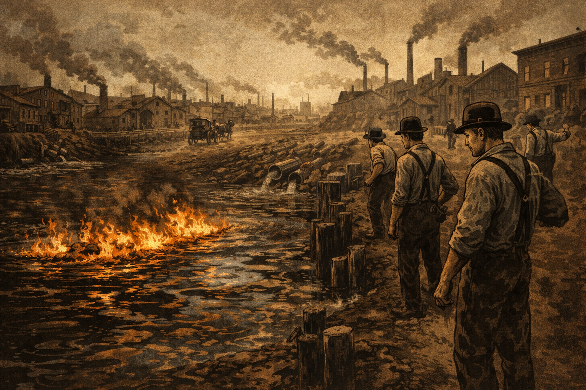

Image Prompt

I am about to ask you to generate a series of images for a graphic novel. Please make the images have a consistent style and consistent characters. Do not ask any clarifying questions. Just generate the image immediately when asked.

Please generate a 16:9 image in dark American industrial realism style depicting panel 1 of 12. The scene shows the Cuyahoga River in Cleveland, Ohio in 1868, catching fire for the first time on record. Oil and industrial waste float on the river's surface, burning with low orange flames. Wooden buildings and early factories line both muddy banks. Workers in suspenders and bowler hats stand on the riverbank, watching the fire with more annoyance than alarm — this is an inconvenience, not a crisis. A horse-drawn fire wagon approaches on a dirt road. The color palette is dark sepia, rust brown, charcoal, muddy amber, and pale soot-gray sky. Emotional tone: grim normality — pollution as the cost of progress. Specific details: (1) oil sheens reflecting the firelight on the river surface, (2) raw sewage pipes visibly emptying into the water, (3) smokestacks from iron foundries in the background, (4) wooden pilings coated in black grime, (5) a worker shrugging and turning back to his shift, (6) the skyline of young, industrializing Cleveland in the distance. Generate the image immediately without asking clarifying questions.

The year was 1868, and the Cuyahoga River caught fire. Nobody wrote an editorial. Nobody called for reform. The river burned because it was full of oil, and it was full of oil because Cleveland was booming. Iron foundries, steel mills, chemical plants, and oil refineries lined both banks, and every one of them dumped their waste straight into the water. The river wasn't a river anymore — it was an open sewer with a current. And sewers, as it turned out, could burn.

## Panel 2: Cleveland's Industrial Powerhouse — Early 1900s

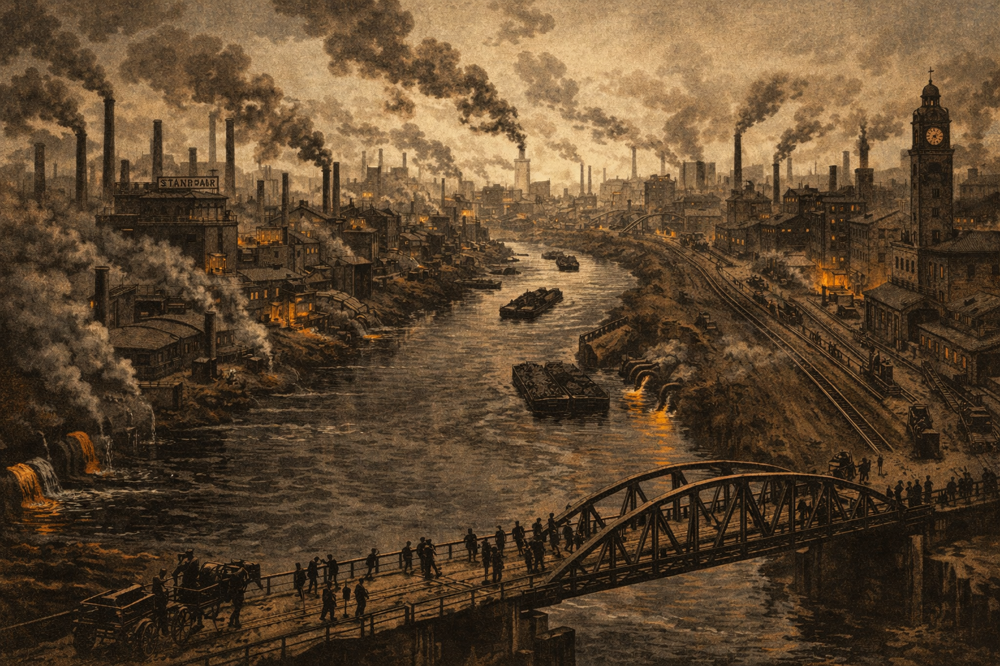

Image Prompt

Please generate a 16:9 image in dark American industrial realism style depicting panel 2 of 12. Make the style consistent with the prior panel. The scene shows the Cuyahoga River valley in the early 1900s, viewed from a high vantage point. The river snakes through a dense corridor of steel mills, oil refineries, and manufacturing plants stretching to the horizon. Thick smoke pours from dozens of smokestacks, blotting out the sky. The river itself is dark, oily, and devoid of life — a black ribbon threading through an industrial canyon. Workers stream across bridges on their way to shift changes. The color palette is charcoal gray, soot black, rust orange from furnace glow, muddy brown water, and pale industrial haze. Emotional tone: terrible grandeur — prosperity built on poison. Specific details: (1) Standard Oil Company signage on a refinery, (2) railroad tracks running parallel to the river, (3) barges loaded with coal and iron ore, (4) discharge pipes pouring colored effluent directly into the water, (5) no trees or vegetation visible anywhere along the banks, (6) a clock tower reading early morning on a factory building. Generate the image immediately without asking clarifying questions.

By the early twentieth century, Cleveland was one of the great industrial cities of the world. John D. Rockefeller had built Standard Oil on the Cuyahoga's banks. Steel mills ran day and night. The city's population doubled, then doubled again. And the river? The river was whatever the factories needed it to be — a coolant, a solvent, a dump. Between 1868 and 1969, it caught fire at least thirteen times. Thirteen. Most of those fires never made the front page. A river on fire was just the price of a paycheck.

## Panel 3: The Big One — 1952

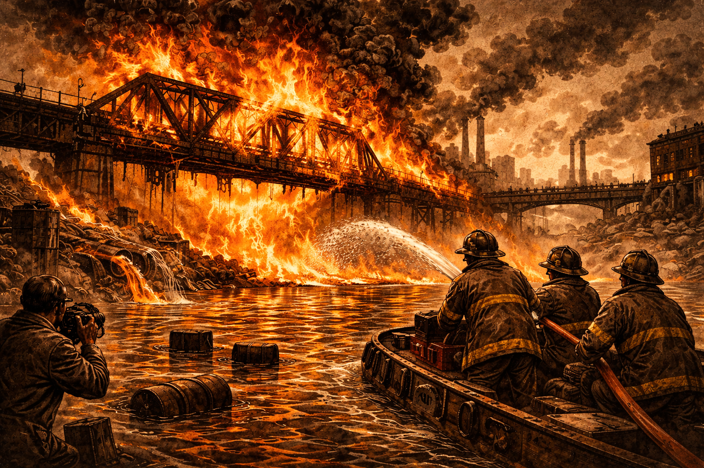

Image Prompt

Please generate a 16:9 image in dark American industrial realism style depicting panel 3 of 12. Make the style consistent with the prior panels. The scene shows the catastrophic 1952 Cuyahoga River fire — the worst fire in the river's history. A massive railroad bridge is engulfed in flames, with fire rising thirty feet above the river surface. The river itself is a sheet of burning oil and chemical waste. Firefighters on a fireboat spray water at the blaze, their faces lit by the inferno. Thick black smoke billows into the sky. The color palette is intense — fire orange, blood red, black smoke, charcoal water — against a sky turned brown by heat haze. Emotional tone: apocalyptic destruction that the nation somehow ignores. Specific details: (1) the steel framework of the railroad bridge warping in the heat, (2) a fireboat with firefighters silhouetted against the flames, (3) oil drums and industrial debris floating on the river surface, feeding the fire, (4) spectators watching from a bridge in the background, (5) a newspaper photographer shooting the blaze, (6) damage already visible to a second nearby structure. Generate the image immediately without asking clarifying questions.

On November 1, 1952, the Cuyahoga burned so badly it caused $1.3 million in damage — roughly $15 million in today's money. The fire destroyed a railroad trestle bridge and a ship repair yard. Flames climbed five stories high. And the story ran on page 11 of the Cleveland papers and nowhere else. That's the part that should make you stop and think. A river burned badly enough to melt steel, and the nation shrugged. Burning rivers were not news. They were infrastructure.

## Panel 4: The Dead River — 1960s

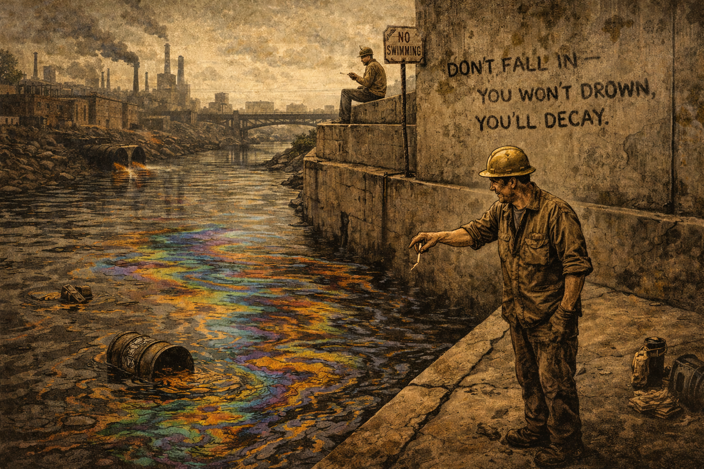

Image Prompt

Please generate a 16:9 image in American industrial realism style depicting panel 4 of 12. Make the style consistent with the prior panels. The scene shows the Cuyahoga River in the mid-1960s at its ecological nadir. The river is a lifeless channel of dark, viscous water coated with a rainbow-sheen oil slick. No fish, no birds, no insects — nothing alive touches this water. A man in a hard hat stands on a concrete embankment, tossing a cigarette butt into the river without a second thought. Faded joke graffiti on a concrete wall reads "Don't Fall In — You Won't Drown, You'll Decay." The color palette is sickly — olive brown, petroleum rainbow, concrete gray, muddy yellow-green, with a washed-out overcast sky. Emotional tone: dark humor masking despair — a city that has accepted the unacceptable. Specific details: (1) thick oil slick with iridescent rainbow patterns on the water surface, (2) no visible aquatic or shoreline life of any kind, (3) a drainage pipe oozing orange-brown chemical effluent, (4) the graffiti joke on the concrete wall, (5) a rusted "No Swimming" sign that looks decades old, (6) a factory worker on his lunch break eating a sandwich near the river as if this is completely normal. Generate the image immediately without asking clarifying questions.

By the 1960s, the Cuyahoga River was biologically dead. Not struggling. Not declining. Dead. Scientists who tested the water found no fish, no aquatic insects, no life of any kind. The river oozed more than it flowed — a thick slurry of oil, solvents, heavy metals, and sewage that changed color depending on which factory was dumping what that day. Clevelanders told jokes about it. "Anyone who falls into the Cuyahoga does not drown," the saying went. "He decays." It was funny because it was true, and because laughing was easier than doing something about it.

## Panel 5: The Fire of 1969 — June 22

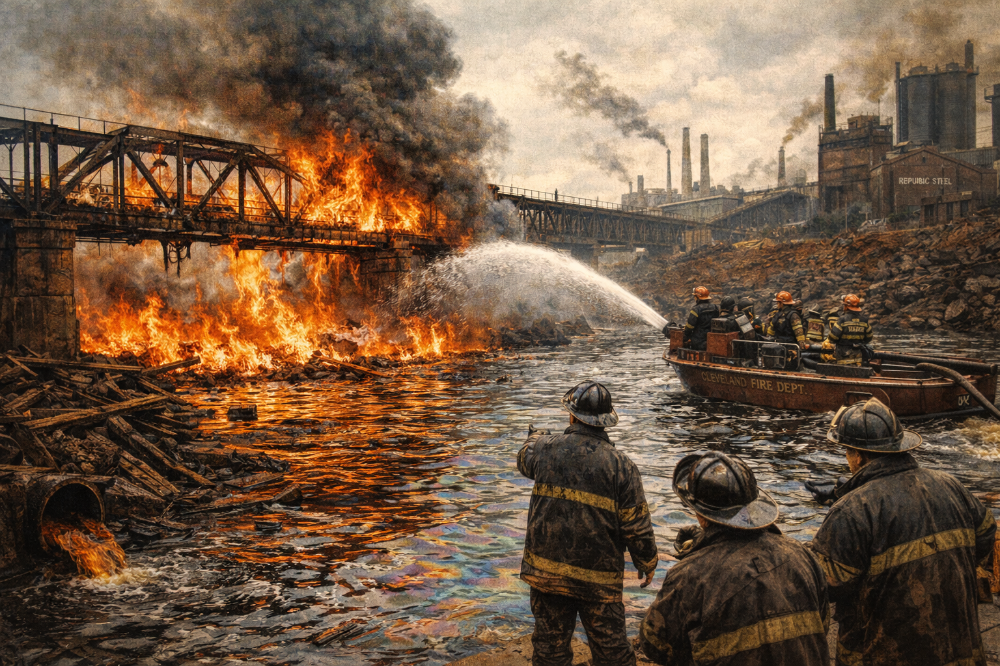

Image Prompt

Please generate a 16:9 image in American industrial realism transitioning to 1960s journalistic photography style, depicting panel 5 of 12. Make the style consistent with the prior panels. The scene shows the June 22, 1969 Cuyahoga River fire. Oil-soaked debris and a railroad bridge trestle are burning on the river near Republic Steel. The fire is actually modest — flames about four to five feet high — and firefighters from three fire battalions are already bringing it under control from boats and the riverbank. The irony is visible: this is a small fire by Cuyahoga standards. The color palette transitions slightly from the dark earlier panels — still dominated by rust, charcoal, and flame orange, but with a slightly more photojournalistic quality, like a color photograph from a 1969 newspaper. Emotional tone: a routine emergency that is about to become historic. Specific details: (1) the burning railroad trestle with modest but visible flames, (2) a Cleveland fire department boat spraying water, (3) firefighters in late-1960s gear working efficiently, (4) oil-soaked wooden debris feeding the flames, (5) the Republic Steel plant visible in the background, (6) a clock or calendar detail suggesting the date — June 22, 1969. Generate the image immediately without asking clarifying questions.

On the morning of June 22, 1969, the Cuyahoga caught fire again. A spark — probably from a passing train — ignited oil-soaked debris near a railroad trestle. The fire burned for about thirty minutes before three fire battalions put it out. By Cuyahoga standards, it was nothing. The 1952 fire had been fifty times worse. No one was killed. The damage was minor. The fire was out before any photographer arrived to document it. And yet this unremarkable little fire on an already-dead river was about to change the history of American environmental law.

## Panel 6: Time Magazine — August 1969

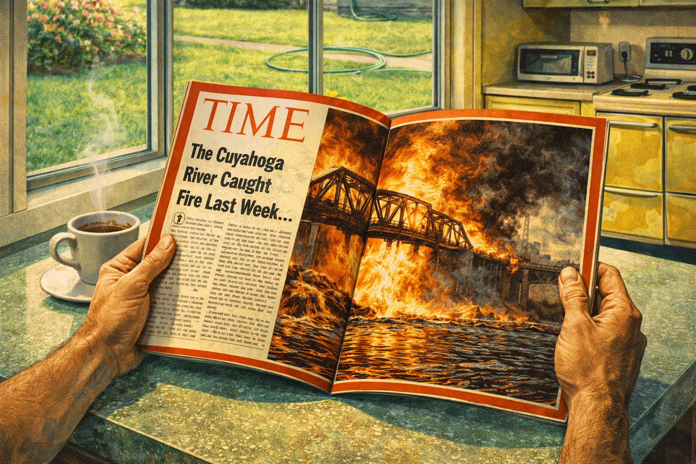

Image Prompt

Please generate a 16:9 image in late-1960s journalistic editorial style depicting panel 6 of 12. Make the style consistent with the prior panels but shifting toward a more photojournalistic quality. The scene shows a Time magazine being read at a kitchen table in a middle-class American home in August 1969. The magazine is open to a dramatic spread about the Cuyahoga River fire, featuring a large photograph of flames on a river (actually the 1952 fire, not the 1969 one — but the reader doesn't know that). The reader's hands grip the magazine in shock. A coffee cup sits nearby. Through a window, a clean suburban lawn and a garden hose are visible — the irony of clean water outside and burning water in the magazine. The color palette shifts: the magazine pages show the dark fire colors (orange, black, rust), while the kitchen is bright 1960s pastels (avocado green, harvest gold, white). Emotional tone: the collision between comfortable American life and an ugly truth they can no longer ignore. Specific details: (1) the Time magazine logo and red border clearly visible, (2) the dramatic fire photograph dominating the spread, (3) the headline referencing the Cuyahoga River, (4) a coffee cup with steam rising, (5) a clean suburban kitchen with period appliances, (6) the reader's shocked expression reflected faintly in a window. Generate the image immediately without asking clarifying questions.

Two months later, *Time* magazine published a story about America's polluted waterways. They needed a dramatic photograph, and the only fire photo they could find was actually from the 1952 blaze — the 1969 fire had been extinguished too quickly for any camera to capture it. But the photo didn't need a correct date to do its work. Americans opened their magazines and saw a river on fire. Water. Burning. The image seared itself into the national consciousness. For a hundred years, Cleveland had lived with a burning river. Now the rest of the country had to look at it too — and they could not look away.

## Panel 7: A City's Shame Becomes a Nation's Wake-Up Call

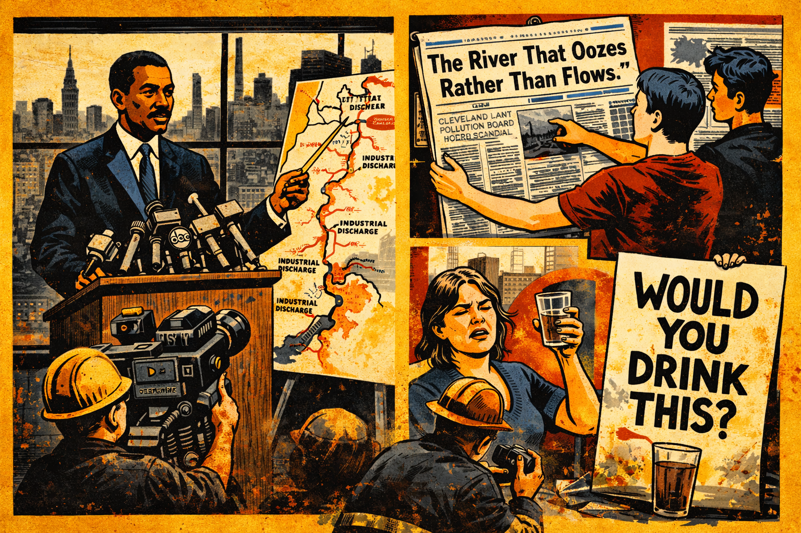

Image Prompt

Please generate a 16:9 image in late-1960s editorial illustration and protest poster style depicting panel 7 of 12. Make the style consistent with the prior panels but shifting further toward bold graphic design. The scene is a montage showing the national reaction to the Cuyahoga fire story. On the left, Cleveland Mayor Carl Stokes — a tall, dignified Black man in his late 30s wearing a dark suit — stands at a podium before television cameras, pointing at a map of the Cuyahoga's pollution sources. On the right, ordinary Americans are shown reacting: a college student pinning a newspaper clipping to a dorm wall, a mother holding up a glass of tap water and frowning, a protestor painting a sign that reads "WOULD YOU DRINK THIS?" The color palette is transitional — the dark industrial tones are fading, replaced by the bold graphic colors of the late 1960s protest movement (red, black, white, yellow). Emotional tone: outrage crystallizing into action. Specific details: (1) Mayor Carl Stokes at the podium, composed and determined, (2) television cameras from multiple networks, (3) a newspaper headline reading "The River That Oozes Rather Than Flows," (4) a college student with a protest sign, (5) a map showing industrial discharge points along the river, (6) the iconic Cleveland skyline visible through a window behind Stokes. Generate the image immediately without asking clarifying questions.

Cleveland's mayor, Carl Stokes — the first Black mayor of a major American city — turned shame into action. Stokes had grown up poor on Cleveland's East Side. He knew the Cuyahoga wasn't just an environmental problem; it was a justice problem. The factories poisoned the river, and the people who lived closest to the poison were the ones who could least afford to move. Stokes went on national television and demanded federal help. Across the country, the Cuyahoga became a symbol — not of Cleveland's failure, but of America's. If a river could catch fire and no one cared for a hundred years, what else were we ignoring?

## Panel 8: Earth Day — April 22, 1970

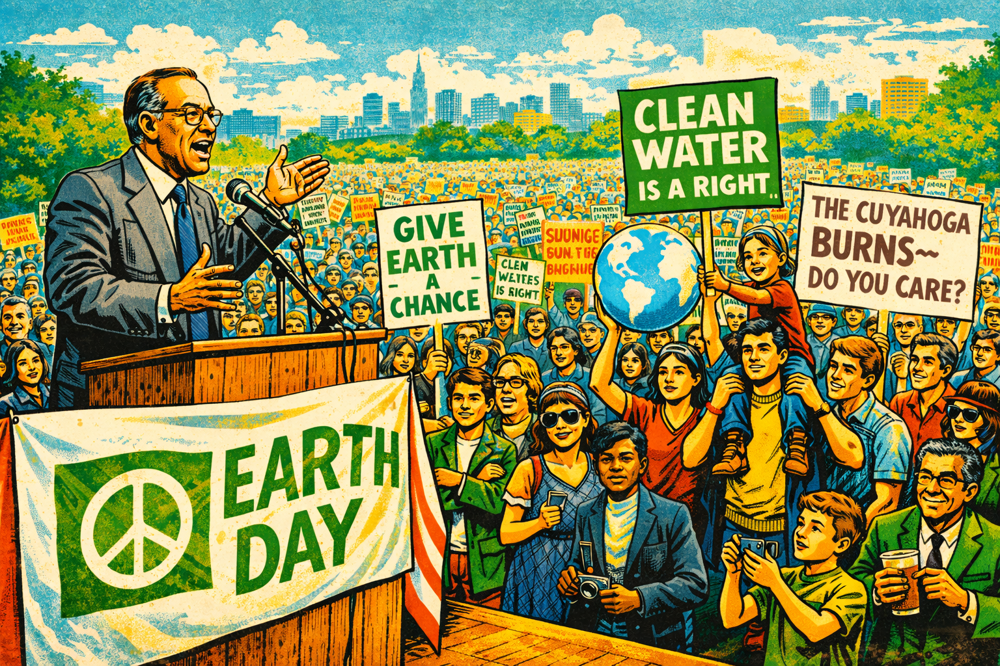

Image Prompt

Please generate a 16:9 image in bold 1970s protest poster and editorial illustration style depicting panel 8 of 12. Make the style consistent with the evolving art direction — now firmly in the bright, graphic, screen-printed aesthetic of the early 1970s environmental movement. The scene shows a massive Earth Day rally on April 22, 1970. Thousands of people — college students, families, children, and elderly citizens — fill a city park, carrying signs with slogans like "GIVE EARTH A CHANCE," "CLEAN WATER IS A RIGHT," and "THE CUYAHOGA BURNS — DO YOU CARE?" In the foreground, Senator Gaylord Nelson — a middle-aged man with glasses and a warm, professorial manner, wearing a rumpled suit — speaks from a wooden platform draped with an early Earth Day banner. The color palette is vibrant and hopeful: grass green, sky blue, sunshine yellow, with pops of protest-sign red and white. Emotional tone: the electric energy of a mass movement being born. Specific details: (1) Senator Gaylord Nelson at the microphone, gesturing passionately, (2) protest signs referencing clean water and the Cuyahoga, (3) twenty million Americans demonstrated that day — the crowd should feel enormous, (4) college students in early 1970s clothing (bell-bottoms, headbands, army jackets), (5) a child sitting on a parent's shoulders holding a hand-drawn Earth, (6) the early Earth Day ecology flag or logo visible on a banner. Generate the image immediately without asking clarifying questions.

Wisconsin Senator Gaylord Nelson had been worrying about the environment for years, but he couldn't get anyone to care. Then the Cuyahoga burned, oil spilled off Santa Barbara, and suddenly the country was ready to listen. Nelson proposed a national teach-in — a day for environmental awareness modeled on the anti-war movement. On April 22, 1970, twenty million Americans walked out of their classrooms, their offices, and their homes to demand clean air, clean water, and a government that would protect both. It was the largest single-day demonstration in American history. They called it Earth Day.

## Panel 9: The EPA Is Born — December 1970

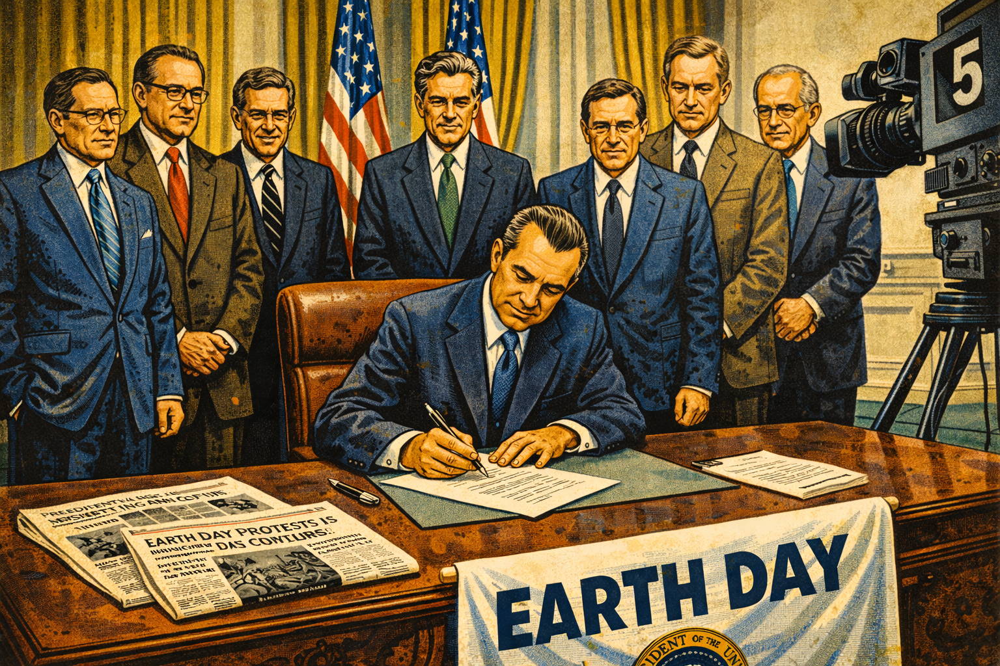

Image Prompt

Please generate a 16:9 image in early-1970s institutional and editorial illustration style depicting panel 9 of 12. Make the style consistent with the prior panels. The scene shows President Richard Nixon at a signing ceremony in December 1970, creating the Environmental Protection Agency by executive order. Nixon sits at a large desk in a formal government setting, pen in hand, surrounded by aides and legislators. The mood is complex — Nixon is not an environmentalist, but the political pressure is overwhelming. On the desk: the executive order, a fountain pen, and newspapers with headlines about Earth Day and the Cuyahoga. The color palette is institutional: presidential navy, cream, dark wood, gold accents, with documents in crisp white. Emotional tone: grudging historic achievement — the right thing done for political reasons, which doesn't make it any less important. Specific details: (1) Nixon at the desk with a pen poised over the executive order, (2) aides and legislators standing behind him, (3) newspapers visible on the desk referencing environmental protest, (4) the presidential seal, (5) American flags, (6) a television camera recording the moment for the evening news. Generate the image immediately without asking clarifying questions.

Richard Nixon was not an environmentalist. But Richard Nixon could read a poll. Twenty million Americans had just demanded environmental protection, and midterm elections were coming. In December 1970, Nixon signed an executive order creating the Environmental Protection Agency — a single federal agency with the power to set and enforce pollution standards for air, water, and land. The EPA was born not from presidential conviction but from public pressure so enormous that even a reluctant president could not resist it. Sometimes that is exactly how democracy is supposed to work.

## Panel 10: The Clean Water Act — 1972

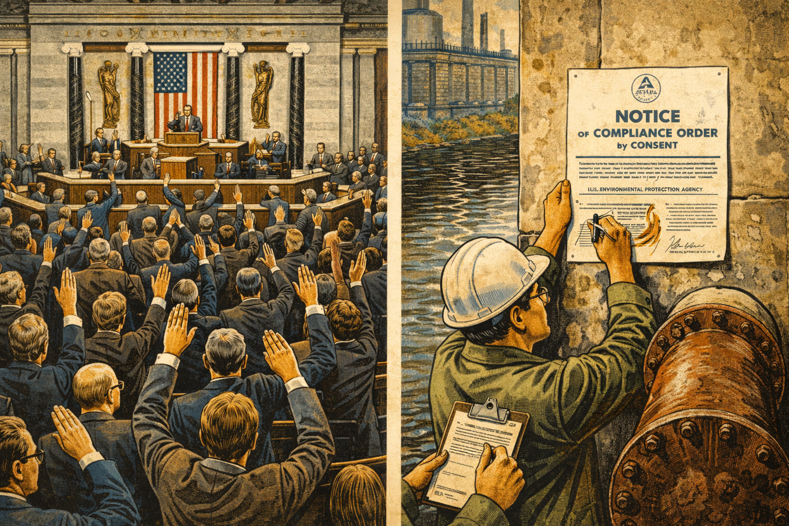

Image Prompt

Please generate a 16:9 image in early-1970s editorial and documentary style depicting panel 10 of 12. Make the style consistent with the prior panels. The scene shows a split composition. On the left: the floor of the U.S. Congress during the vote to override President Nixon's veto of the Clean Water Act in October 1972 — legislators on their feet, arms raised in votes, the chamber packed and electric. On the right: an industrial discharge pipe that has been capped and sealed, with an EPA inspector in a hard hat affixing an official compliance notice to a factory wall beside the river. The color palette bridges institutional Washington (navy, marble white, brass) and industrial Cleveland (concrete gray, pipe rust, river brown — but the water is very slightly less dark than before). Emotional tone: the force of law meeting the reality of pollution for the first time. Specific details: (1) the Congressional chamber during a dramatic vote, (2) legislators standing to vote yes, (3) an EPA compliance notice being posted, (4) a sealed discharge pipe, (5) an inspector with a clipboard, (6) the beginning of change — the river water slightly less oily than in earlier panels. Generate the image immediately without asking clarifying questions.

In 1972, Congress passed the Clean Water Act — the most ambitious water pollution law in American history. For the first time, every factory, every sewage plant, every point source of pollution in the United States needed a federal permit to discharge anything into any waterway. Nixon vetoed the bill, calling it too expensive. Congress overrode his veto the same day by overwhelming margins in both chambers. The message was clear: the era of dumping whatever you wanted into America's rivers and hoping nobody noticed was over. The Cuyahoga had made sure of that.

## Panel 11: The Long Recovery

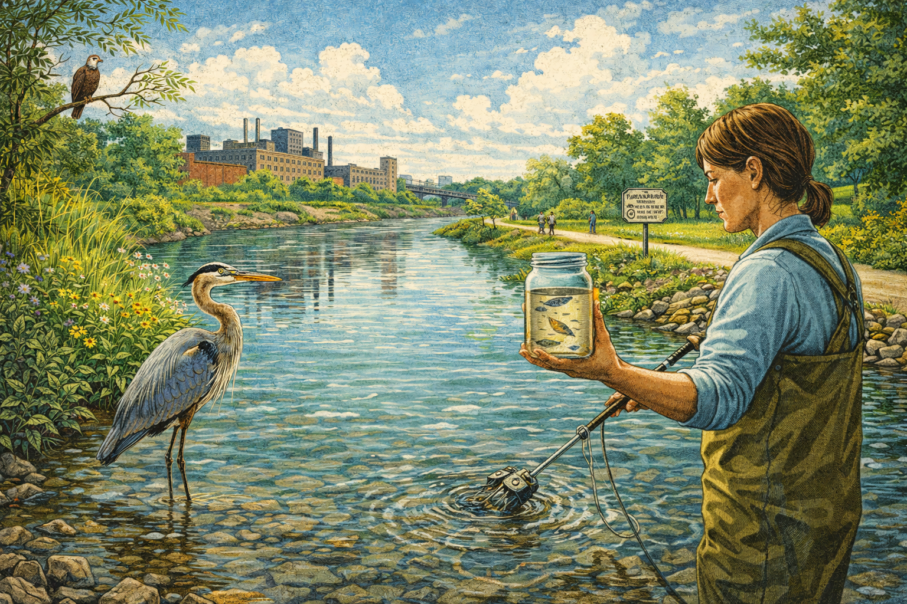

Image Prompt

Please generate a 16:9 image in a style transitioning from 1970s documentary to contemporary nature illustration, depicting panel 11 of 12. Make the style consistent with the evolving art direction. The scene shows the Cuyahoga River in the early 2000s during its long recovery. The water is cleaner — still not pristine, but visibly improved, with light penetrating the surface for the first time in decades. A great blue heron stands in the shallows. Along the bank, native vegetation has returned — willows, rushes, wildflowers. In the background, some factories remain but many have been converted to parks and trails. A biologist in waders takes a water sample, and a jar in her hand shows small fish swimming inside. The color palette has transformed: river blue-green (not sparkling, but alive), bank greens, sky blue with clouds, warm earth tones. Some industrial gray remains in the background as a reminder. Emotional tone: cautious hope — life is returning, but healing takes decades. Specific details: (1) a great blue heron standing in the river shallows, (2) fish visible in a sample jar held by a biologist, (3) native plants growing along the restored riverbank, (4) old factory buildings converted to a riverside park with walking paths, (5) a bald eagle perched in a tree overlooking the river, (6) a historical marker or interpretive sign about the river fires visible along a trail. Generate the image immediately without asking clarifying questions.

Recovery is not a headline. Recovery is decades of work that nobody puts on a magazine cover. Year by year, permit by permit, cleanup by cleanup, the Cuyahoga came back. The first fish returned in the 1980s — tough, pollution-tolerant species, but alive. By the 2000s, biologists had counted over sixty species of fish in the river. Great blue herons waded in water that had once dissolved paint. Bald eagles — the national symbol that DDT had nearly destroyed — nested in trees along the Cuyahoga's banks. The river was not pristine. But it was alive, and alive was something no one had dared to hope for in 1969.

## Panel 12: The River Today

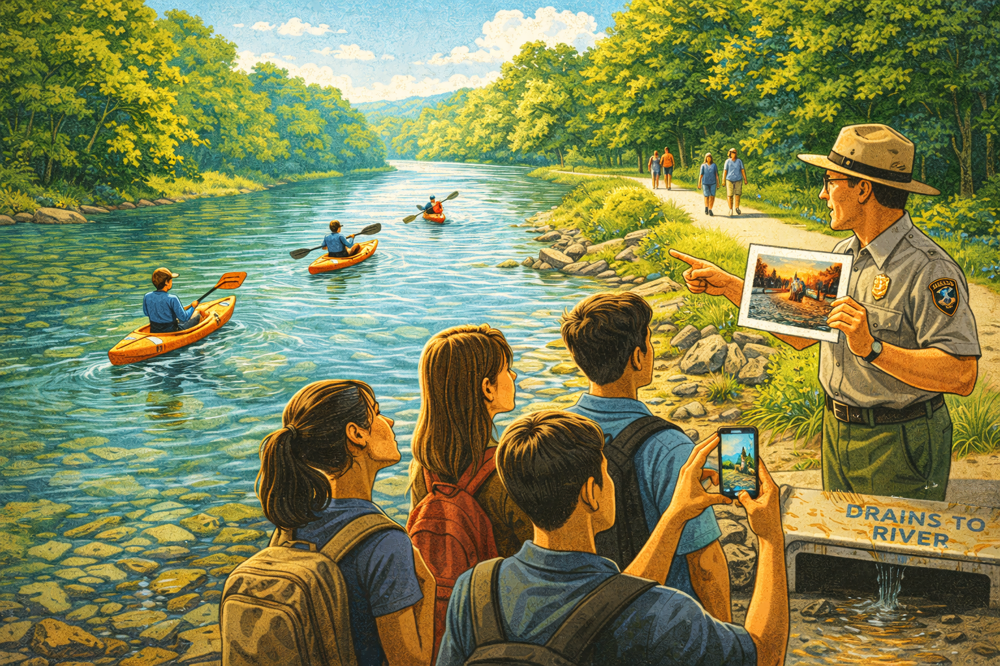

Image Prompt

Please generate a 16:9 image in contemporary editorial illustration style with warm, hopeful tones depicting panel 12 of 12. Make the style consistent with the evolving art direction — this final panel should feel like the resolution of the visual journey from dark industrial realism to bright, living color. The scene shows the Cuyahoga River today. Kayakers paddle down a clean, sunlit stretch of the river through Cuyahoga Valley National Park. The water is clear enough to see the rocky bottom. Green trees line both banks. Families walk along a towpath trail. In the foreground, a park ranger speaks to a group of high school students, pointing at the river and holding up a laminated photograph of the 1952 fire. One student takes a photo with her phone. But in the background, a subtle detail: a storm drain marked "Drains to River" with a faint sheen of runoff — a reminder that nonpoint source pollution is the next challenge. The color palette is fully transformed: clean river blue, lush green, warm sunlight gold, blue sky — but with that one gray-brown hint of storm drain runoff. Emotional tone: earned hope tempered by unfinished work. Specific details: (1) kayakers on clean blue-green water, (2) the rocky river bottom visible through the water, (3) families on a tree-lined towpath trail, (4) a park ranger showing students a historical fire photograph, (5) a student photographing the river with a smartphone, (6) a storm drain in the foreground with a slight sheen of runoff — the next battle. Generate the image immediately without asking clarifying questions.

Today, you can kayak the Cuyahoga. You can paddle through stretches of water that once burned hot enough to buckle steel. Cuyahoga Valley National Park draws over two million visitors a year to hike, bike, and fish along the same river that was declared biologically dead in the 1960s. It is one of the great environmental recovery stories in American history. But the story is not over. The Clean Water Act targeted point-source pollution — the pipes you can see and cap. The next challenge is nonpoint-source pollution: fertilizer runoff from farms, pesticides from lawns, microplastics from roads, pharmaceuticals from drains. The sources you cannot plug with a permit. The Cuyahoga taught America that ignoring pollution does not make it disappear. The question now is whether we remember that lesson before the next river catches fire — or the next one simply dies quietly, without any flames to catch our attention.

### Epilogue – What the Burning River Taught Us

The Cuyahoga River fire of 1969 did not change America because it was the worst fire. It was not. It changed America because it happened at the right moment — when a photograph, a magazine article, and a growing sense of environmental unease converged into something that could no longer be ignored. For a hundred years, the evidence had been burning on the surface of that river, and no one with the power to act had cared enough to look. The lesson is not just about water pollution. It is about the difference between knowing something is wrong and deciding to do something about it.

| What Happened | What It Teaches | Connection to Today |
|---|---|---|
| A river caught fire thirteen times over a century | Pollution that becomes "normal" is the most dangerous kind | Climate change, microplastic contamination, and PFAS chemicals are today's "burning rivers" — widespread harms we have normalized |
| The 1952 fire caused $1.3 million in damage and nobody cared | Economic damage alone does not drive environmental reform — public awareness does | Data without a story rarely changes policy |
| *Time* used a photo from the wrong fire | A powerful image can catalyze change even when the details are imperfect | Visual evidence and storytelling remain essential tools for environmental communication |
| Earth Day mobilized twenty million Americans | Mass public pressure can force even reluctant politicians to act | Collective action remains the most powerful force for environmental policy change |
| The Clean Water Act required permits for point-source pollution | Regulation works — the Cuyahoga and hundreds of other rivers have recovered | Nonpoint-source pollution is now the bigger challenge, and it requires new regulatory approaches |

### Call to Action

The Cuyahoga burned because everyone assumed someone else would fix it. For a hundred years, factory owners said it was the cost of doing business, politicians said it was not their problem, and ordinary citizens said there was nothing they could do. The river burned thirteen times before a single magazine photograph turned "somebody else's problem" into "everybody's emergency." Look around your own community. What is your local burning river — the environmental harm that everyone knows about and no one is addressing? Find the data. Tell the story. Do not wait for the fire.

---

*"The ultimate test of a moral society is the kind of world that it leaves to its children."*
— Dietrich Bonhoeffer, quoted by Senator Gaylord Nelson in his Earth Day speeches

*"What a terrible thing it is to lose one's river."*
— Carl Stokes, Mayor of Cleveland, speaking about the Cuyahoga in 1969

*"The most common way people give up their power is by thinking they don't have any."*
— Alice Walker, frequently cited by Gaylord Nelson in environmental advocacy

---

## References

1. [Wikipedia: Cuyahoga River](https://en.wikipedia.org/wiki/Cuyahoga_River) — History of the river, its pollution, and the fires that made it infamous
2. [Wikipedia: Clean Water Act](https://en.wikipedia.org/wiki/Clean_Water_Act) — The landmark 1972 federal law regulating water pollution in the United States
3. [Wikipedia: Earth Day](https://en.wikipedia.org/wiki/Earth_Day) — The annual environmental demonstration founded by Senator Gaylord Nelson in 1970
4. [U.S. EPA: The Birth of EPA](https://www.epa.gov/history/origins-epa) — The Environmental Protection Agency's own account of its creation in 1970
5. [Encyclopaedia Britannica: Cuyahoga River Fire](https://www.britannica.com/event/Cuyahoga-River-fire) — Reference overview of the 1969 fire and its environmental legacy
