# The Man Who Watched Worms

Cover Image Prompt

Please generate a wide-landscape 16:9 cover image for a graphic novel titled "The Man Who Watched Worms" in a Victorian naturalist illustration style reminiscent of Pre-Raphaelite botanical art blended with the warm, meticulous engravings from Darwin's own published works. Show Charles Darwin, an elderly man in his early 70s with a long white beard, bald dome, kind deep-set eyes, and a dark Victorian frock coat, kneeling in a lush English garden at Down House. He peers through a magnifying glass at the soil where several earthworms are visible among leaf litter and freshly cast earth. The title text "The Man Who Watched Worms" is rendered in an elegant Victorian serif typeface at the top. Color palette: warm sepia, rich earth browns, cream, moss green, amber lamplight. Emotional tone: intimate wonder, the beauty of the small. Include: (1) Darwin's weathered hands gently parting the soil, (2) a half-buried flat stone visible in the background lawn — his famous "worm stone," (3) the ivy-covered facade of Down House behind him, (4) a leather-bound notebook open on the grass beside him, (5) a robin perched on a nearby garden fork, (6) soft golden afternoon light filtering through old English oaks. Generate the image immediately without asking clarifying questions.

Narrative Prompt

This is a 12-panel graphic novel about Charles Darwin (1809-1882) and his final book, *The Formation of Vegetable Mould through the Action of Worms* (1881). The story follows Darwin's forty-year fascination with earthworms — from an ignored paper in 1837 to a bestseller that outsold *On the Origin of Species* in its first year. The art style throughout is Victorian naturalist illustration — Pre-Raphaelite attention to botanical detail, warm sepia and earth tones (brown, cream, moss green, amber), the look of Darwin's own notebooks and the engravings from his published works. Cozy, intimate, garden-scale. Darwin should be drawn consistently across panels: an elderly man with a long white beard, bald dome, kind deep-set eyes, a slightly hunched posture, wearing a dark Victorian frock coat; in earlier panels (1837-1842) he is younger with dark hair and sideburns. His wife Emma (dark hair, gentle face, practical Victorian dress) and their children appear in several panels. Central ecological theme: the power of slow, small processes — how tiny organisms, given enough time, literally build the world. The story emphasizes patient observation, the joy of backyard science, and Darwin's radical insight that the most important forces in nature are the ones nobody notices.

### Prologue — The Great Man's Secret Passion

Everyone remembers Charles Darwin for evolution. The Beagle. The finches. The most dangerous idea in the history of biology. But when Darwin was old and famous, when he could have written about anything in the world, he chose to write about worms. Not exotic worms from some distant island — the ordinary, pink, blind earthworms wriggling through the soil of his own backyard in Kent. He had been watching them for forty years. He had measured their castings, timed their burrowings, and played them music on a bassoon. And when he finally published his findings, something astonishing happened: the book about worms outsold the book about evolution. Because Darwin had discovered something that changes how you see the ground beneath your feet — the most powerful forces on Earth are often the smallest and the slowest.

## Panel 1: The Paper Nobody Wanted

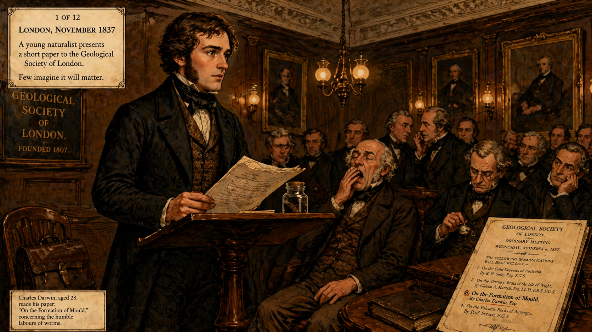

Image Prompt

(This is panel 1.  Do not put the panel number in the image.) Please generate a 16:9 image in Victorian naturalist illustration style depicting panel 1 of 12. The scene shows a young Charles Darwin, aged 28, with dark brown hair, long sideburns, a clean-shaven chin, and an earnest expression, standing nervously at a lectern before the Geological Society of London in November 1837. He reads from a short paper about earthworms and soil. The audience of older gentlemen in dark frock coats and high collars looks politely bored — some whisper to each other, one checks his pocket watch. The room is a formal Georgian meeting hall with dark wood paneling, oil paintings of geologists on the walls, and gas lamps casting warm amber light. Color palette: dark walnut brown, cream, deep burgundy, amber gaslight. Emotional tone: youthful earnestness meeting institutional indifference. Include: (1) Darwin's trembling hand on his manuscript pages, (2) a small glass jar of soil on the lectern beside him, (3) an older gentleman in the front row suppressing a yawn, (4) ornate plaster ceiling moldings, (5) Darwin's leather satchel on a chair behind him, (6) a printed program listing his talk as "On the Formation of Mould." Generate the image immediately without asking clarifying questions.

It was November 1837, and twenty-eight-year-old Charles Darwin was fresh off the voyage of the Beagle, his head still buzzing with finches and fossils and the secret theory he was not yet brave enough to publish. But the paper he read that evening to the Geological Society of London was not about evolution. It was about dirt. Specifically, it was about how earthworms turn dead leaves into soil and slowly bury objects on the surface. The audience listened politely. Nobody asked a question. Nobody wrote about it in the papers. Darwin tucked his notes away and went home — but he did not forget the worms.

## Panel 2: A Quiet Life at Down House

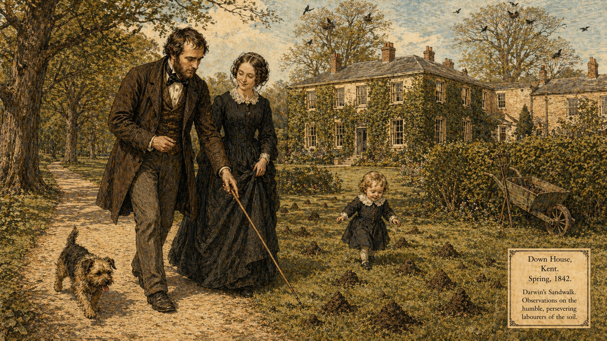

Image Prompt

(This is panel 2.  Do not put the panel number in the image.) Please generate a 16:9 image in Victorian naturalist illustration style depicting panel 2 of 12. Make the characters and style consistent with the prior panel. The scene shows Charles Darwin, now in his early 30s with dark hair beginning to thin and a short brown beard emerging, walking with his young wife Emma Darwin through the grounds of Down House in Kent, circa 1842. Emma is a gentle-featured woman in her early 30s wearing a practical dark Victorian dress with a white lace collar. They stroll along Darwin's famous "Sandwalk" — a gravel path lined with trees — while Darwin gestures at the ground with his walking stick, pointing out worm castings in the grass. The house is visible in the background: a large, comfortable Georgian home covered in ivy. Color palette: soft moss green, cream, warm brown, pale blue English sky. Emotional tone: domestic contentment and quiet curiosity. Include: (1) small conical worm castings dotting the lawn, (2) a young child (their first son William) toddling nearby, (3) a terrier dog trotting ahead on the path, (4) Darwin's walking stick pointing at the ground, (5) a garden wheelbarrow leaning against a hedge, (6) rooks nesting in the tall elms behind the house. Generate the image immediately without asking clarifying questions.

In 1842, Darwin moved his growing family to Down House in the Kent countryside, sixteen miles from London and a world away from its noise. The house had a large garden, old trees, and a gravel path called the Sandwalk where Darwin took daily walks to think. It was here, pacing his quiet loop, that he noticed what most people step over without a thought: tiny conical mounds of earth, freshly pushed up overnight by earthworms. He began to count them. He began to measure them. He never really stopped.

## Panel 3: The Worm Stone

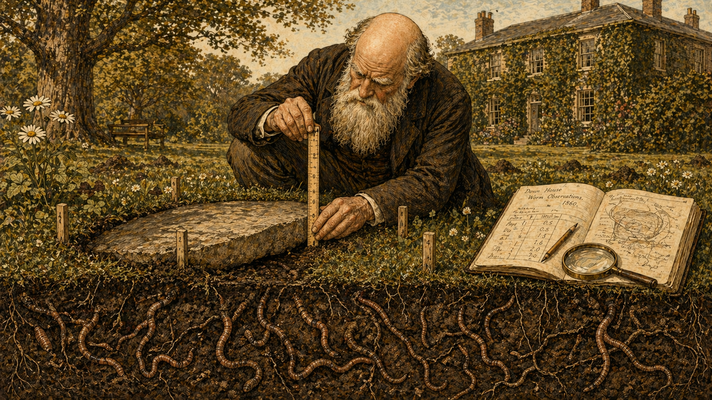

Image Prompt

(This is panel 3.  Do not put the panel number in the image.) Please generate a 16:9 image in Victorian naturalist illustration style depicting panel 3 of 12. Make the characters and style consistent with the prior panel. The scene shows Darwin, now in his 50s with a mostly bald head and a long graying beard, crouching beside a large flat stone set into the lawn at Down House, circa 1860. He holds a wooden ruler against the edge of the stone, carefully measuring how much the stone has sunk below the surface of the grass as worms have cast soil upward around it over years. A cross-section cutaway view along the bottom of the image reveals the underground scene: dozens of earthworms tunneling through dark soil beneath and beside the stone, depositing castings on the surface. Color palette: rich earth brown, moss green, cream, amber. Emotional tone: the thrill of patient measurement revealing hidden truths. Include: (1) the flat stone partially sunken and tilted in the turf, (2) Darwin's notebook open on the grass with pencil sketches of measurements, (3) the cross-section showing worm burrows and root systems in the soil, (4) small measurement pegs Darwin has driven into the ground around the stone, (5) a magnifying glass resting on the notebook, (6) daisies and clover growing in the lawn around the experiment. Generate the image immediately without asking clarifying questions.

Darwin was a man who thought in decades. In 1842, he placed a large flat stone on his lawn and simply waited. Year after year, he returned to measure it. The stone was sinking — not because it was heavy, but because worms were carrying soil up from below and depositing it on the surface around the stone's edges. Grain by grain, casting by casting, the worms were burying it. It was geology happening in a garden, and it was happening so slowly that no one had ever bothered to watch. Darwin watched. He measured the stone's descent in fractions of an inch per year, and he kept measuring for more than thirty years.

## Panel 4: The Bassoon Experiment

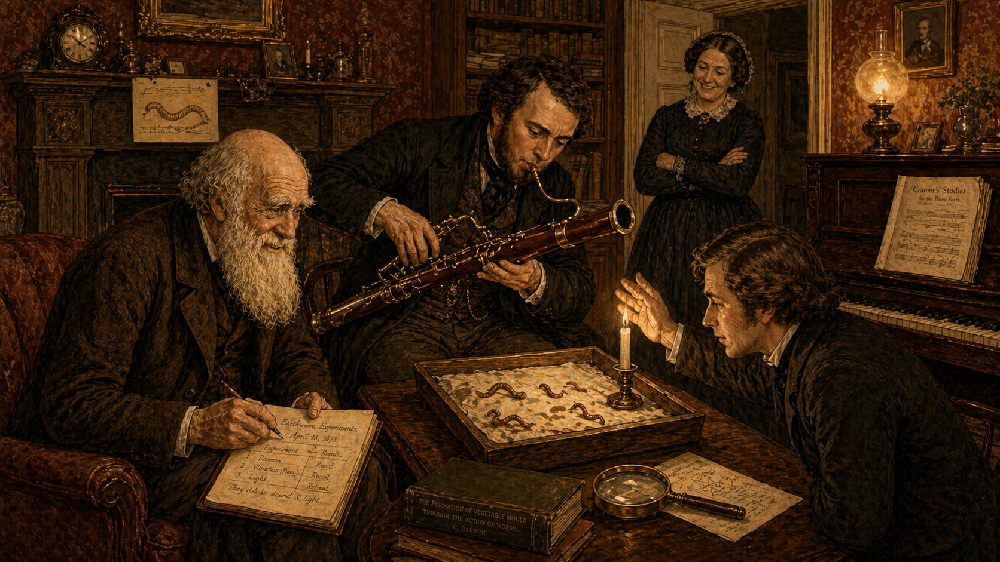

Image Prompt

(This is panel 4.  Do not put the panel number in the image.) Please generate a 16:9 image in Victorian naturalist illustration style depicting panel 4 of 12. Make the characters and style consistent with the prior panel. The scene shows a warmly lit parlor at Down House in the 1870s. Darwin, now elderly with his famous long white beard, sits in an armchair watching with delighted curiosity as his adult son Francis plays a bassoon directly at a table where several earthworms rest on damp paper in a shallow tray. Another of Darwin's children holds a candle near the worms to test their sensitivity to light, shielding it with a hand. Emma Darwin stands in the doorway, arms folded, smiling with amused tolerance. The room is cozy Victorian: patterned wallpaper, a fireplace, heavy curtains, books everywhere. Color palette: warm amber lamplight, deep red wallpaper, cream, brown, brass instrument gold. Emotional tone: delightful domestic science, playful curiosity, family fun. Include: (1) Francis leaning forward with the bassoon pointed at the worms, (2) the worms visibly recoiling on their damp paper, (3) Darwin leaning forward with bright eyes and a slight grin, (4) a notebook on his lap where he records results, (5) a piano in the corner (also used in experiments), (6) a child's drawing of a worm pinned to the mantelpiece. Generate the image immediately without asking clarifying questions.

Darwin recruited his children as research assistants, and together they devised experiments that would have looked absurd to anyone who did not understand the question being asked. Do worms respond to sound? Francis played the bassoon at them — nothing. They placed worms on the piano and struck keys — the worms felt the vibrations through the wood and recoiled. Do worms respond to light? The children held candles close, then shielded them. The worms shrank from brightness but ignored red light. Do worms have preferences? Darwin was beginning to suspect that these brainless, eyeless tubes of muscle were far more sophisticated than anyone imagined.

## Panel 5: The Worm Jars

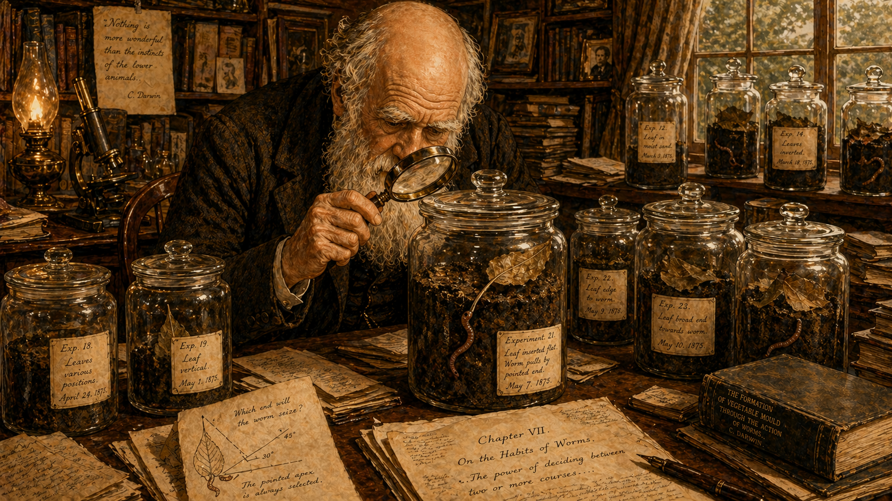

Image Prompt

(This is panel 5.  Do not put the panel number in the image.) Please generate a 16:9 image in Victorian naturalist illustration style depicting panel 5 of 12. Make the characters and style consistent with the prior panel. The scene shows Darwin's private study at Down House, a cluttered, cozy room with books piled everywhere. Darwin sits at his large wooden desk, hunched forward with a magnifying glass, peering intently into one of several large glass jars filled with dark earth and leaf litter. Inside the jar, an earthworm is caught mid-action, pulling a leaf by its pointed tip down into a burrow — demonstrating the worm's ability to "solve" the geometric problem of which end to grab. Other jars line the desk and windowsill, each with different experimental setups. Color palette: warm sepia, glass-jar clarity, dark study browns, green leaf accents, amber lamplight. Emotional tone: intimate scientific wonder, the joy of close observation. Include: (1) the worm gripping the leaf by its narrow apex, (2) Darwin's magnifying glass catching the light, (3) labels in Darwin's handwriting on the jars, (4) scattered papers and a half-written manuscript page, (5) a microscope on a side table, (6) a small sketch Darwin has made of the leaf-pulling angles. Generate the image immediately without asking clarifying questions.

Darwin kept earthworms in glass jars in his study, right there among his manuscripts and microscopes. Night after night, by candlelight, he watched them work. And he noticed something remarkable: when worms pulled leaves into their burrows, they almost always grabbed the leaf by its narrow tip — the most efficient angle for dragging it underground. Darwin tested this with cut paper triangles of different shapes. The worms consistently chose the pointed end. They were solving a geometry problem without a brain. "It is a marvel," Darwin wrote, "that so lowly a creature should have the capacity for so much judgment."

## Panel 6: The Mathematics of Tiny Actions

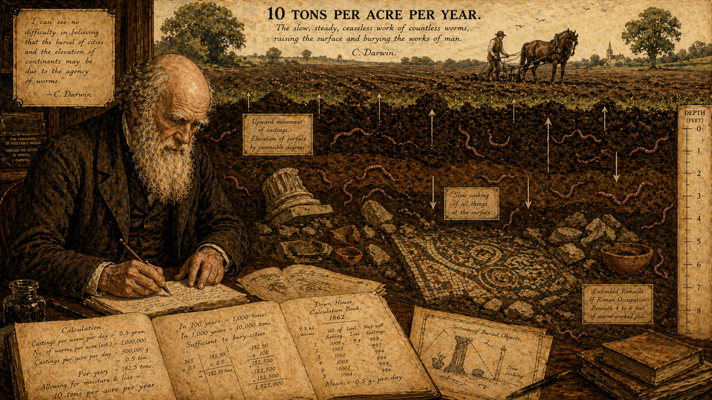

Image Prompt

(This is panel 6.  Do not put the panel number in the image.) Please generate a 16:9 image in Victorian naturalist illustration style depicting panel 6 of 12. Make the characters and style consistent with the prior panel. The scene is a conceptual illustration showing Darwin's grand calculation. In the foreground, Darwin sits at his desk surrounded by notebooks filled with figures, working out sums with a pen. Behind him, the image expands into a sweeping panoramic vision: a cross-section of an English field showing the cumulative work of millions of worms over centuries. Roman-era ruins — a mosaic floor, a broken column, pottery shards — lie buried several feet below the modern surface, completely entombed in worm-processed soil. Arrows show the upward movement of castings and the slow sinking of objects. Numbers float in the air: "10 tons per acre per year." Color palette: sepia manuscript tones in the foreground transitioning to rich earth cross-section browns, greens, and the pale cream of buried Roman stonework. Emotional tone: the sublime power of accumulation, awe at deep time. Include: (1) Darwin's handwritten calculations visible on his desk, (2) the buried Roman mosaic clearly visible in cross-section, (3) arrows indicating the direction of soil movement, (4) earthworms throughout the soil layers, (5) a modern plowed field at the surface with a farmer and horse, (6) a scale bar showing depth in feet. Generate the image immediately without asking clarifying questions.

Then Darwin did what Darwin always did — he did the math. He weighed the worm castings on measured plots of his lawn. He counted burrows. He calculated rates. And the numbers were staggering: earthworms in a single English acre move roughly ten tons of soil to the surface every year. Over centuries, that means the worms literally bury the past. Roman ruins in England lie several feet underground not because humans buried them, but because worms did — one tiny casting at a time, year after year, for two thousand years. The most powerful geological force in the English countryside was not wind or rain. It was worms.

## Panel 7: Death into Life

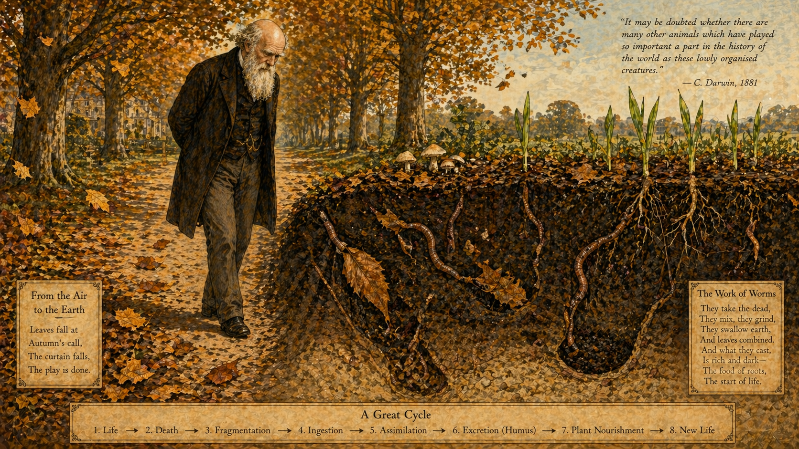

Image Prompt

(This is panel 7.  Do not put the panel number in the image.) Please generate a 16:9 image in Victorian naturalist illustration style depicting panel 7 of 12. Make the characters and style consistent with the prior panel. The scene shows Darwin walking slowly along the Sandwalk in autumn, deep in thought, surrounded by falling leaves. The image uses a visual metaphor: on the left side of the path, autumn leaves drift down from the trees and land on the ground. On the right side, a cutaway reveals the underground world where earthworms pull those same leaves into their burrows, mix them with mineral soil, and excrete rich dark humus. Roots of living plants reach into this worm-processed soil and new green shoots emerge at the surface — a visual cycle of death becoming life. Darwin walks between these two worlds, connecting them with his gaze. Color palette: autumn gold, russet, deep brown earth, vivid green new growth, cream. Emotional tone: profound ecological insight, the beauty of cycles. Include: (1) golden and russet leaves falling from beech trees, (2) worms actively pulling leaves underground in the cutaway, (3) dark humus-rich soil contrasting with pale subsoil, (4) green shoots emerging from worm-enriched earth, (5) Darwin's contemplative expression as he connects the pieces, (6) mushrooms growing on the boundary between surface and soil. Generate the image immediately without asking clarifying questions.

Walking the Sandwalk in autumn, watching the leaves fall and disappear into the earth, Darwin arrived at the insight that would frame his final book. Earthworms are the planet's great recyclers. They eat dead leaves, digest them, mix them with mineral particles from deep underground, and excrete the result as rich, dark humus — the living skin of the Earth. Without worms, dead plant matter would pile up on the surface and nutrients would stay locked away. With worms, death becomes life. The forest feeds itself through the bodies of creatures that never see the sun. "It may be doubted," Darwin would write, "whether there are many other animals which have played so important a part in the history of the world."

## Panel 8: The Great Darwin, Reduced to Worms

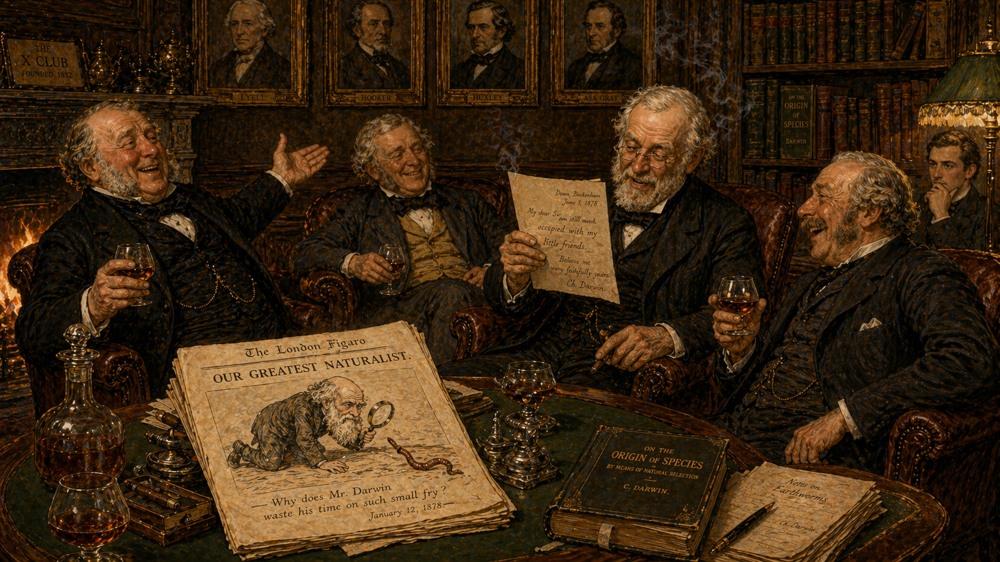

Image Prompt

(This is panel 8.  Do not put the panel number in the image.) Please generate a 16:9 image in Victorian naturalist illustration style depicting panel 8 of 12. Make the characters and style consistent with the prior panel. The scene shows a gentlemen's club in London, circa 1878. Several distinguished Victorian scientists sit in leather armchairs around a fireplace, brandies in hand, laughing and shaking their heads. One holds up a letter from Darwin and reads aloud with exaggerated amusement. A caricature in a newspaper on the side table shows Darwin on his hands and knees examining a worm through a magnifying glass, with the caption "Our Greatest Naturalist." The mood is affectionate mockery — these are Darwin's friends, not his enemies, but they genuinely cannot understand why the man who explained the origin of species is spending his twilight years watching worms. Color palette: rich leather brown, deep green baize, amber brandy, warm firelight, cream newspaper. Emotional tone: affectionate bewilderment, gentle comedy. Include: (1) the caricature clearly visible on the newspaper, (2) a gentleman gesturing incredulously with his brandy glass, (3) portraits of eminent Victorians on the wood-paneled walls, (4) cigar smoke curling in the lamplight, (5) a copy of On the Origin of Species on a bookshelf behind them, (6) one younger scientist in the corner who looks thoughtful rather than amused. Generate the image immediately without asking clarifying questions.

Darwin's scientific friends thought he had lost the plot. The great naturalist — the man who had explained the origin of every living species — was spending his final years on his hands and knees in a garden, measuring worm droppings. "The subject may appear an insignificant one," Darwin admitted cheerfully in his introduction. His colleagues were less charitable. The whispers at scientific clubs were affectionate but bewildered: had old Darwin finally gone soft? What could worms possibly tell us that mattered? They would find out soon enough.

## Panel 9: The Bestseller Nobody Expected

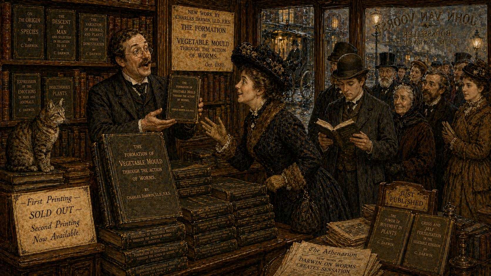

Image Prompt

(This is panel 9.  Do not put the panel number in the image.) Please generate a 16:9 image in Victorian naturalist illustration style depicting panel 9 of 12. Make the characters and style consistent with the prior panel. The scene shows the interior of a London bookshop in October 1881. Stacks of Darwin's new book, "The Formation of Vegetable Mould through the Action of Worms," fill a prominent display table near the entrance. The book has a simple dark cover with gold lettering. A queue of well-dressed Victorian customers — men and women, young and old — stretches from the counter toward the door. A bookseller holds up a copy with a look of pleased astonishment. Through the shop window, a hansom cab and gaslit street are visible. Color palette: warm bookshop browns, gold lettering, cream pages, gaslight amber, street gray-blue. Emotional tone: surprised delight, the thrill of unexpected success. Include: (1) the book's title clearly legible on the stack, (2) a woman in a fashionable hat reaching eagerly for a copy, (3) a young man reading the first page while standing in line, (4) a handwritten sign reading "First Printing — SOLD OUT — Second Printing Now Available," (5) other Darwin titles visible on nearby shelves, (6) a shop cat sitting atop a stack of books. Generate the image immediately without asking clarifying questions.

On October 10, 1881, John Murray published *The Formation of Vegetable Mould through the Action of Worms, with Observations on their Habits*. Darwin was seventy-two years old and in failing health. He expected modest sales — a quiet capstone to a long career. Instead, the book sold 3,500 copies in its first month, faster than *On the Origin of Species* had sold in its first year. By the end of its first year, it had outsold every other book Darwin had ever written. Readers who had never picked up a science book were suddenly fascinated by earthworms. Something about the subject — the smallness, the patience, the revelation hiding in plain sight — captured the Victorian imagination.

## Panel 10: A Nation Charmed by Worms

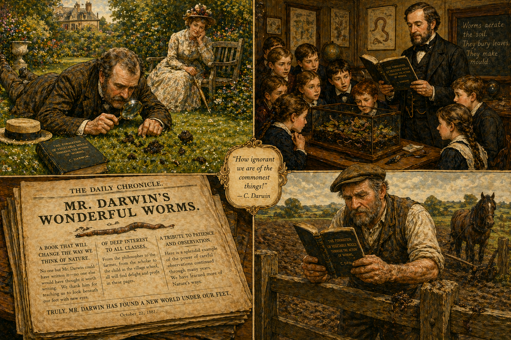

Image Prompt

(This is panel 10.  Do not put the panel number in the image.) Please generate a 16:9 image in Victorian naturalist illustration style depicting panel 10 of 12. Make the characters and style consistent with the prior panel. The scene is a montage of Victorian readers engaging with Darwin's worm book. Top left: a country gentleman lies on his stomach on a manicured lawn, peering at worm castings with a magnifying glass while his bemused wife watches from a garden bench. Top right: schoolchildren in a Victorian classroom gather around a terrarium of worms while their teacher reads from the book. Bottom left: a newspaper review page with the headline "MR. DARWIN'S WONDERFUL WORMS" surrounded by enthusiastic text. Bottom right: a farmer in muddy boots leans on a fence, reading the book with a dawning expression of respect for his soil. Color palette: varied but unified — garden greens, classroom browns, newsprint cream, farmyard earth tones, all in warm Victorian tones. Emotional tone: widespread delight and newfound wonder at the ordinary. Include: (1) the gentleman's magnifying glass reflecting light, (2) children's faces lit with curiosity, (3) the newspaper headline clearly legible, (4) the farmer holding the book in rough hands, (5) worm castings visible in each outdoor scene, (6) a general sense of people looking down at the ground for the first time. Generate the image immediately without asking clarifying questions.

Across England, people got down on their knees and looked at worms for the first time. Newspapers reviewed the book with delight — "Mr. Darwin's Wonderful Worms," one headline read. Country gentlemen measured castings on their lawns. Schoolteachers brought jars of soil into classrooms. Farmers who had spent their lives cursing moles suddenly looked at their wormy fields with new respect. Darwin had done something rare and beautiful: he had taken the most ordinary creature in England and revealed it as extraordinary. He had taught an entire nation to see what had always been beneath their feet.

## Panel 11: The Last Spring at Down House

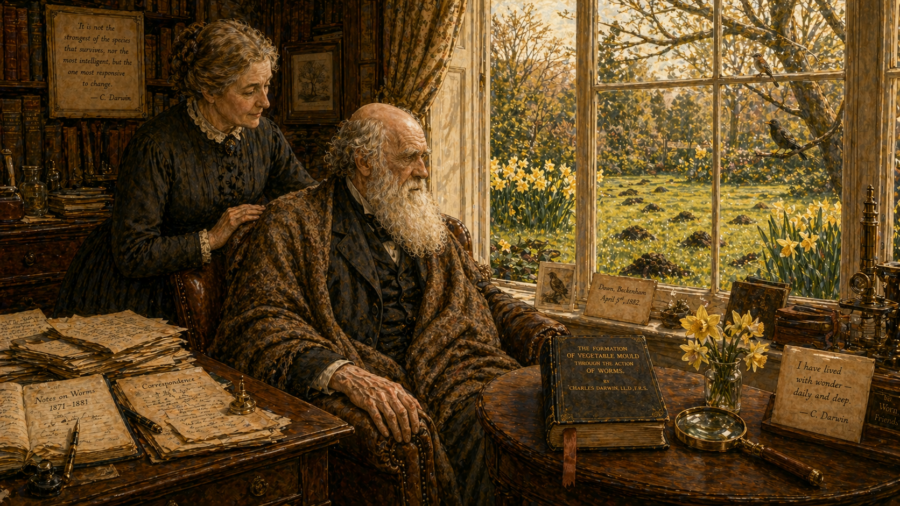

Image Prompt

(This is panel 11.  Do not put the panel number in the image.) Please generate a 16:9 image in Victorian naturalist illustration style depicting panel 11 of 12. Make the characters and style consistent with the prior panel. The scene shows the interior of Darwin's study at Down House in early April 1882. Darwin, visibly frail and aged, sits in his worn armchair wrapped in a shawl, looking out through a window at his garden where spring is arriving — daffodils bloom, birds perch on branches, and the lawn shows fresh worm castings in the morning dew. Emma Darwin stands beside him, her hand resting gently on his shoulder. His desk is cluttered with a lifetime of notebooks and correspondence. A copy of the worm book sits on a small table beside him. The light is soft, golden, tender. Color palette: pale spring green, daffodil yellow, soft gold light, warm brown interior, cream and ivory. Emotional tone: peaceful farewell, a life well spent, the quiet dignity of a man who found wonder in the smallest things. Include: (1) Darwin's thin hand resting on the arm of his chair, (2) Emma's gentle, caring expression, (3) fresh worm castings visible on the lawn through the window, (4) daffodils blooming in the garden, (5) the worm book with a ribbon bookmark on the side table, (6) Darwin's old magnifying glass beside the book. Generate the image immediately without asking clarifying questions.

Charles Darwin died on April 19, 1882, at Down House, with Emma beside him. He was seventy-three. His last months had been spent exactly as his best years had been — observing, wondering, writing letters to other scientists about whatever caught his attention. He had asked to be buried in the churchyard at Downe village, near the worms and the soil he had spent his life studying. But the nation had other plans. Within days, a petition signed by members of Parliament and the Royal Society requested that Darwin be buried in Westminster Abbey, among kings, poets, and Newton himself. The quiet gardener of Down House would rest in the most famous floor in England.

## Panel 12: The Legacy Beneath Our Feet

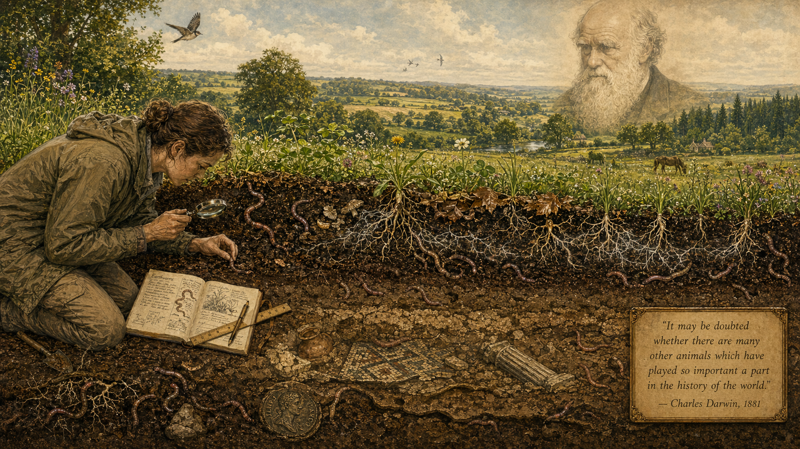

Image Prompt

(This is panel 12.  Do not put the panel number in the image.) Please generate a 16:9 image in Victorian naturalist illustration style depicting panel 12 of 12. Make the characters and style consistent with the prior panel. The scene is a layered, timeless composition connecting Darwin's work to the modern world. In the foreground, a modern soil scientist in field clothes kneels in rich earth, examining earthworms with instruments Darwin would recognize — a magnifying lens, a notebook, a simple ruler. Behind her, the image transitions through layers: the rich dark topsoil teems with earthworms, mycorrhizal networks, and decomposing leaves; deeper, the cross-section reveals centuries of worm-processed soil burying ancient artifacts; and at the very top of the image, a healthy green landscape stretches to the horizon — forests, fields, meadows — all built on the foundation the worms created. A translucent portrait of elderly Darwin hovers faintly in the sky like a benevolent ghost, looking down with approval. A small plaque in the bottom corner reads: "It may be doubted whether there are many other animals which have played so important a part in the history of the world. — Charles Darwin, 1881." Color palette: rich earth browns, vibrant greens, warm golden light, cream, the faint sepia of Darwin's portrait. Emotional tone: wonder, continuity, the enduring power of patient observation. Include: (1) the modern scientist mirroring Darwin's posture, (2) earthworms visible at multiple soil depths, (3) mycorrhizal fungal threads connecting plant roots, (4) a buried Roman coin deep in the soil, (5) the healthy green landscape above, (6) Darwin's translucent portrait watching from above. Generate the image immediately without asking clarifying questions.

Modern soil science has confirmed everything Darwin suspected and more. Earthworms are now recognized as keystone ecosystem engineers — organisms that physically reshape their environment for every other species. They aerate soil, improve drainage, accelerate decomposition, and cycle nutrients that feed the roots of every plant on Earth. Without them, terrestrial ecosystems as we know them would collapse. And we know this because a man who could have rested on the greatest laurels in biology chose instead to spend his final decades watching, measuring, and marveling at the small things underfoot. Darwin's worm book is not a footnote to his career — it is its deepest lesson. The world is built by the slow and the small. The forces that matter most are the ones nobody notices. And the only instrument you truly need is patience.

### Epilogue — What Darwin's Worms Teach Us

Darwin's last book is really about how to see. Most people walk over earthworms without a thought. Darwin walked over them for forty years and each time stopped to wonder. His worm research is a masterclass in the kind of thinking ecology demands: slow observation, careful measurement, and the willingness to take small things seriously. Every major insight in the book — that worms bury stones, process tons of soil, make intelligent choices about leaf-pulling — came not from expensive equipment or exotic expeditions, but from a man paying attention in his own backyard.

| Insight | What Darwin Found | Why It Matters for Ecology |
|---------|-------------------|---------------------------|
| Small actions accumulate | 10 tons of soil moved per acre per year | Ecosystem processes operate on timescales we rarely see; patience reveals hidden power |
| Worms are ecosystem engineers | They mix organic and mineral matter, create soil structure, bury the past | Keystone species are not always large or charismatic — some are blind and boneless |
| Simple organisms show complex behavior | Worms choose the optimal angle to pull leaves into burrows | Intelligence and adaptation exist at every level of life; do not underestimate the small |
| Decomposition drives the living world | Worms turn death into fertile humus | Nutrient cycling is the invisible engine of every ecosystem on Earth |

### Call to Action

Find a patch of soil. Any soil — a garden, a park, a crack in a sidewalk where weeds are growing. Get down and look. Really look. Are there worm castings? Tiny holes where something has burrowed? Decomposing leaves being pulled underground? You are watching the same process Darwin watched: the slow, patient construction of the living world by creatures almost no one notices. You do not need a laboratory. You do not need a grant. You need what Darwin had — curiosity, a notebook, and the willingness to take the small things seriously. Everything you see above the ground depends on what is happening below it.

---

*"It may be doubted whether there are many other animals which have played so important a part in the history of the world, as have these lowly organised creatures."*
— Charles Darwin, *The Formation of Vegetable Mould* (1881)

*"The subject may appear an insignificant one, but we shall see that it possesses some interest."*
— Charles Darwin, opening line of *The Formation of Vegetable Mould* (1881)

*"Worms have played a more important part in the history of the world than most persons would at first suppose."*
— Charles Darwin, *The Formation of Vegetable Mould* (1881)

---

## References

1. [Wikipedia: The Formation of Vegetable Mould](https://en.wikipedia.org/wiki/The_Formation_of_Vegetable_Mould) — Article on Darwin's 1881 book about earthworms and soil formation
2. [Wikipedia: Charles Darwin](https://en.wikipedia.org/wiki/Charles_Darwin) — Biography of the English naturalist who developed the theory of evolution
3. [Wikipedia: Earthworm](https://en.wikipedia.org/wiki/Earthworm) — Overview of earthworm biology, ecology, and role as ecosystem engineers
4. [Darwin Online: *The Formation of Vegetable Mould* (full text)](http://darwin-online.org.uk/content/frameset?itemID=F1357&viewtype=text&pageseq=1) — Complete digitized text of Darwin's 1881 book from John van Wyhe's Darwin Online project
5. [Encyclopaedia Britannica: Charles Darwin](https://www.britannica.com/biography/Charles-Darwin) — Curated reference overview of Darwin's life, works, and legacy
