# The Ant Man Who Tried to Save the World

Cover Image Prompt

Please generate a wide-landscape 16:9 cover image for a graphic novel titled "The Ant Man Who Tried to Save the World" in a naturalist illustration style that blends Southern American warmth with scientific precision — think E.O. Wilson's own field sketches crossed with ecological art. Show Edward O. Wilson, a lean, energetic American man in his late 60s with thinning silver hair, wire-rimmed glasses, and a boyish grin that makes him look decades younger. He wears a khaki field shirt with rolled sleeves and crouches at the edge of a tropical rainforest floor, one hand extended toward a column of leafcutter ants marching across a mossy log. Behind him, the scene expands outward in concentric layers of biodiversity: the rainforest canopy alive with birds and epiphytes, a coral reef visible through a gap in the trees, and a misty globe of Earth floating in the sky above, with green protected zones covering half its surface. The title text "The Ant Man Who Tried to Save the World" is rendered in bold serif typeface at the top. Color palette: warm Alabama red clay and humid gold in the foreground soil, Harvard brick red on a tiny book spine visible in his shirt pocket, tropical jungle greens and coral reef blues radiating outward, soft golden light filtering through the canopy. Emotional tone: wonder, devotion, and the urgent beauty of a world worth saving. Include: (1) Wilson's boyish enthusiasm visible in his expression despite his age, (2) his right eye subtly different — slightly clouded, a reminder of the childhood accident, (3) the leafcutter ant column in extraordinary detail on the log, (4) the layered biodiversity expanding behind him from forest floor to canopy to reef to globe, (5) a field notebook and hand lens clipped to his belt, (6) the Half-Earth globe hovering above with green-shaded protected zones. Generate the image immediately without asking clarifying questions.

Narrative Prompt

This is a 12-panel graphic novel about Edward O. Wilson (1929–2021), the American biologist, naturalist, and writer who transformed our understanding of ants, island biogeography, social behavior, and biodiversity — and who spent his final decades as the most passionate and influential advocate for the preservation of life on Earth. The story spans from the 1940s through 2021, set in Mobile, Alabama; the pine forests and bayous of the Gulf Coast; Harvard University; tropical islands in the Florida Keys and Pacific; and the rainforests, coral reefs, and wild places of the planet. The art style evolves across the panels: early panels use warm Southern naturalist colors (red clay, Spanish moss green, humid gold, bayou brown); mid-career panels shift to a Harvard Ivy League aesthetic (brick red, dark green, leather brown, library gold); and late-career panels open into a sweeping global biodiversity palette (tropical jungle greens, coral reef blues, rainforest canopy golds, savanna amber). Wilson should be drawn consistently across all panels: a lean, energetic man with an unmistakable boyish enthusiasm that never fades. As a boy, he has sandy hair, freckles, and a magnifying glass perpetually in hand. As a young professor, he is clean-shaven with sharp features and intense focus. In later years, he has thinning silver hair, wire-rimmed glasses, and a grin that radiates delight at the natural world. In every panel, his right eye is subtly different — slightly narrowed or clouded — the lasting mark of a childhood fishing accident that took the sight in that eye and turned his attention to the tiny creatures he could study up close. Central themes: the power of focused obsession, the journey from small questions (how do ants communicate?) to the biggest question of all (how do we save life on Earth?), and the idea that loving any part of nature deeply enough will eventually lead you to love — and fight for — all of it.

### Prologue – The Boy Who Looked Down

Most children look up — at birds, at clouds, at stars. Edward Osborne Wilson looked down. An accident with a fishing hook at age seven cost him the sight in his right eye, and the world of the large and the distant grew blurry and unreachable. But the world of the small — the world at his feet, in the leaf litter, under the bark — that world was razor-sharp. Ants, beetles, butterflies, the secret civilizations that built empires in a square foot of Alabama soil. He did not know it yet, but that accident gave him something priceless: a reason to pay attention to the creatures most people step on. And from those tiny creatures, he would build the biggest idea in modern conservation biology — that every living thing matters, that the web of life is more complex and more fragile than we ever imagined, and that saving it is the defining challenge of our species.

## Panel 1: The Boy in the Alabama Woods

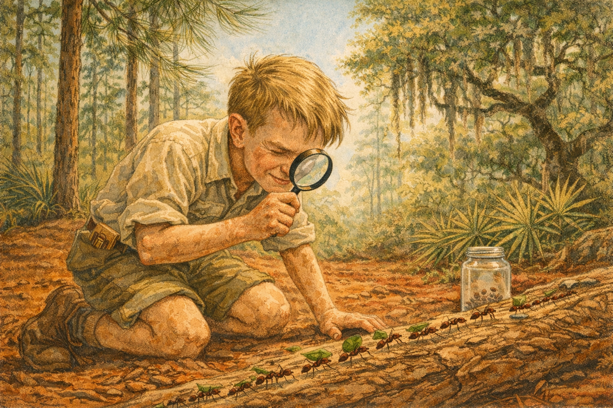

Image Prompt

I am about to ask you to generate a series of images for a graphic novel. Please make the images have a consistent style and consistent characters. Do not ask any clarifying questions. Just generate the image immediately when asked.

Please generate a 16:9 image in a warm Southern naturalist illustration style — red clay earth, Spanish moss greens, humid gold light, bayou browns — depicting panel 1 of 12. The scene shows young Edward O. Wilson, around age 11, in the pine forests outside Mobile, Alabama, in the early 1940s. He is a skinny, freckled boy with sandy hair and oversized curiosity, kneeling on the forest floor with a magnifying glass pressed to his good left eye, studying a column of ants streaming across a fallen longleaf pine log. His right eye is slightly squinted shut — the blind eye, a subtle but consistent detail. He wears a rumpled cotton shirt, short pants, and scuffed shoes. The forest around him is thick with longleaf pines, Spanish moss draping from live oaks, and palmetto fronds. A glass jar with holes punched in the lid sits beside him, already containing a few captured ant specimens. Color palette: warm red-clay soil, deep green pine needles, silvery Spanish moss, golden humid light filtering through the canopy, pale blue sky glimpsed above. Emotional tone: total absorption, a child discovering his calling. Specific details: (1) young Wilson's magnifying glass held to his left eye, right eye subtly squinted, (2) ants in vivid detail on the pine log — a clear trail with workers carrying leaf fragments, (3) longleaf pines towering above with characteristic long needles, (4) Spanish moss hanging from a live oak in the background, (5) the glass collection jar with tiny specimens visible inside, (6) a dog-eared field guide to insects poking out of his back pocket. Generate the image immediately without asking clarifying questions.

Ed Wilson was not a normal kid. While other boys in Mobile, Alabama threw baseballs and chased each other through the streets, Ed lay on his belly in the pine woods and watched ants. Hours. Whole afternoons. He had lost the sight in his right eye when a fish spine pierced it during a casting accident at age seven — a freak injury that closed the world of birds and big game to him forever. But the world of insects, the world you study with your face six inches from the ground, was clearer than ever. He could see individual hairs on an ant's leg. He could follow a column of fire ants for a hundred yards without losing his place. He did not know that the fire ants he was tracking were an invasive species that would reshape the ecology of the American South. He did not know that his obsession would reshape the science of ecology itself. He just knew he could not stop watching.

## Panel 2: The Teenage Myrmecologist

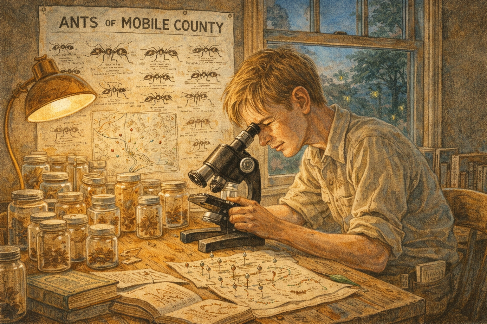

Image Prompt

Please generate a 16:9 image in warm Southern naturalist illustration style — red clay, Spanish moss greens, humid gold, bayou browns — depicting panel 2 of 12. Make the characters and style consistent with the prior panel. The scene shows teenage Edward O. Wilson, around age 16, in the late 1940s, at a rough wooden desk in his bedroom in Mobile, Alabama. The desk is covered with specimen jars, pinned ant specimens mounted on cards, a battered microscope, hand-drawn maps of ant colony locations, and stacks of entomology books. Wilson, now a lanky teenager with sandy hair falling across his forehead and his right eye still subtly different, bends over the microscope with complete focus. On the wall behind him, he has pinned a hand-drawn poster titled "ANTS OF MOBILE COUNTY" with careful sketches of different species. A window shows the humid Alabama evening outside, fireflies glowing in the dusk. Color palette: warm lamp-light gold on the desk, deep browns of the wooden furniture, green of the Alabama evening through the window, amber specimen jars, pale parchment of his drawings. Emotional tone: obsessive dedication, the birth of a scientist. Specific details: (1) Wilson at the microscope, his good left eye pressed to the eyepiece, (2) dozens of specimen jars covering the desk, (3) the hand-drawn "ANTS OF MOBILE COUNTY" poster showing meticulous species sketches, (4) a well-worn copy of a field guide or entomology text, (5) hand-drawn maps with colored pins marking colony locations, (6) fireflies visible through the window in the Alabama twilight. Generate the image immediately without asking clarifying questions.

By sixteen, Ed Wilson had become the most thorough ant surveyor in the state of Alabama, though no one in the state knew it yet. He bicycled through swamps and forests, collecting specimens in glass jars, pinning them on cards, and cataloging every species he could find. He taught himself taxonomy from library books and corresponded with entomologists at the Smithsonian who had no idea their pen pal was a high school student. He discovered that the red imported fire ant — *Solenopsis invicta* — had invaded Mobile through the port and was spreading across the South with terrifying speed. It was his first brush with the ecology of invasive species, and the first hint of a pattern that would define his career: pay attention to the small things, and they will tell you something enormous about how the world works.

## Panel 3: Harvard and the Language of Ants

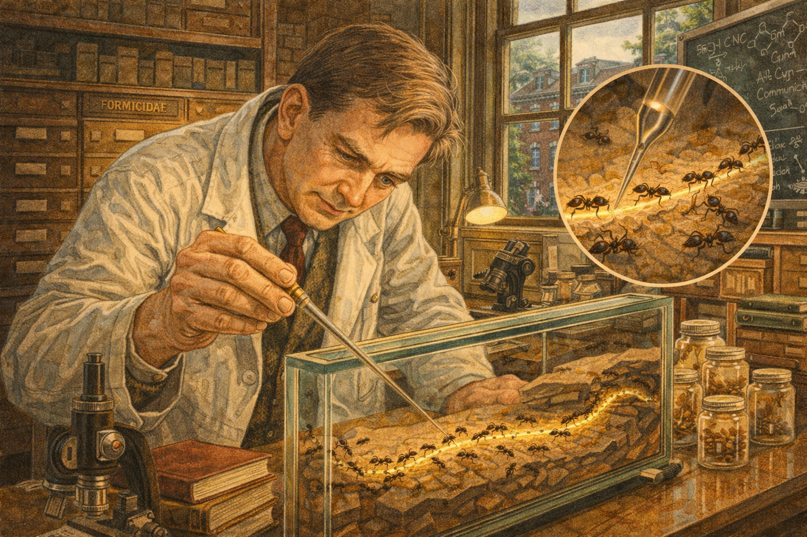

Image Prompt

Please generate a 16:9 image shifting from Southern naturalist warmth to a Harvard Ivy League aesthetic — brick red, dark green, leather brown, library gold — depicting panel 3 of 12. Make the characters and style consistent with the prior panels. The scene shows Edward O. Wilson, now in his late 20s, in his laboratory at Harvard University's Museum of Comparative Zoology in the early 1960s. He is lean and clean-shaven with sharp, focused features, wearing a white lab coat over a tweed jacket. He leans over a large glass ant farm — a formicarium — watching ants respond to a chemical trail he has laid with a fine glass pipette. A magnified view (as an inset or visual emphasis) shows the chemical pheromone trail glowing faintly along the ants' path. The lab is cluttered with Harvard grandeur: dark wooden shelves lined with specimen drawers, leather-bound journals, brass microscopes, and ant colony terrariums of various sizes. Color palette: Harvard brick red visible through the window, dark green ivy on the building exterior, warm library gold from desk lamps, brown leather book spines, the white of his lab coat, amber glass of the formicarium. Emotional tone: intellectual intensity, the thrill of discovery. Specific details: (1) Wilson with the glass pipette laying a pheromone trail, his left eye intent on the ants' response, (2) the formicarium showing a cross-section of tunnels and chambers, (3) a visual emphasis on the pheromone trail — perhaps shown as a glowing line, (4) dark wood specimen cabinets labeled "FORMICIDAE" in gold lettering, (5) Harvard's brick buildings and ivy visible through the lab window, (6) a chalkboard in the background covered with chemical formulas and ant communication diagrams. Generate the image immediately without asking clarifying questions.

Wilson arrived at Harvard and never left. He joined the faculty at the Museum of Comparative Zoology and began asking a question that no one had answered: *How do ants talk to each other?* The answer, he discovered, was chemistry. Ants communicate through pheromones — chemical signals that say "food this way," "danger here," "follow me," "I am the queen." Wilson and his colleagues identified the specific glands, the specific chemicals, and the specific behaviors they triggered. It was a complete language, written in molecules instead of words. The work made him famous in entomology, but Wilson was already thinking bigger. If chemical signals could organize a colony of a million ants into a superorganism, what else could evolution build? What were the rules?

## Panel 4: Islands of Life

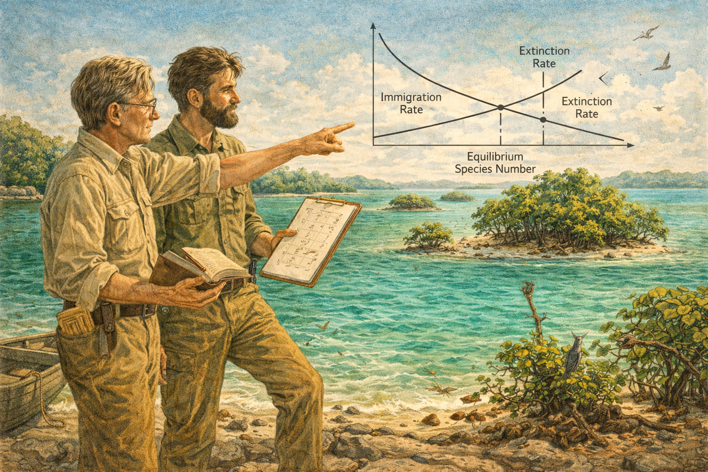

Image Prompt

Please generate a 16:9 image blending Harvard academic aesthetic with tropical field-science energy — depicting panel 4 of 12. Make the characters and style consistent with the prior panels. The scene shows Edward O. Wilson, early 30s, and Robert MacArthur, a tall, bearded, charismatic young ecologist, standing together on a rocky shore in the Florida Keys in the mid-1960s. They look out at a chain of small mangrove islands stretching across turquoise water. Wilson holds a field notebook and points toward the islands; MacArthur holds a clipboard with mathematical curves sketched on it. Between them, a visual overlay (like a scientific diagram superimposed on the landscape) shows the core concept: two curves crossing — an "Immigration Rate" curve descending and an "Extinction Rate" curve ascending, with the intersection labeled "Equilibrium Species Number." The islands vary in size and distance from the mainland. Color palette: turquoise and cerulean ocean water, deep green mangrove islands, white sand, warm golden sunlight, the academic overlay in clean black-and-white line art. Emotional tone: intellectual partnership, the excitement of a theory taking shape. Specific details: (1) Wilson and MacArthur in khaki field clothes, deep in discussion, (2) the chain of mangrove islands in varying sizes, (3) the superimposed equilibrium diagram with labeled curves, (4) Wilson's field notebook open with ant tallies from different islands, (5) a small boat tied to the shore — their transport between islands, (6) birds, crabs, and insects visible on the nearest island showing its living community. Generate the image immediately without asking clarifying questions.

In the early 1960s, Wilson found his intellectual soulmate: Robert MacArthur, a brilliant young ecologist with a gift for mathematics. Together, they asked a deceptively simple question: *Why do big islands have more species than small ones?* The answer became the Theory of Island Biogeography — one of the most important ideas in the history of ecology. Species richness on any island, they argued, is a dynamic equilibrium between two forces: the rate at which new species arrive (immigration) and the rate at which existing species disappear (extinction). Big islands, close to the mainland, accumulate more species. Small islands, far away, lose them. It was elegant, mathematical, and testable. Wilson even tested it himself, hiring an exterminator to fumigate tiny mangrove islands in the Florida Keys and then watching which species recolonized first. The theory worked.

## Panel 5: Every Forest Is an Island

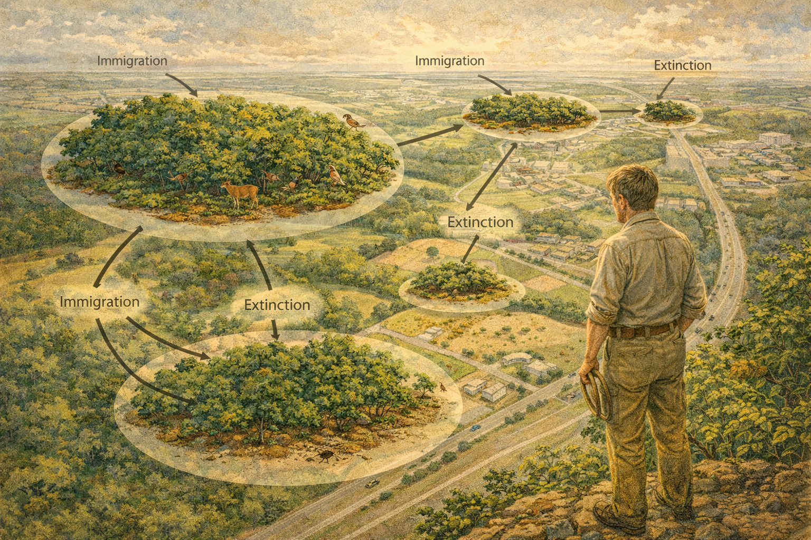

Image Prompt

Please generate a 16:9 image in an ecological diagram style blended with naturalist illustration — depicting panel 5 of 12. Make the characters and style consistent with the prior panels. The scene is a dramatic aerial-perspective view showing the explosive implications of island biogeography for mainland habitats. The landscape shows a once-continuous forest being fragmented by roads, farms, and suburban development — each remaining forest patch is visually rendered as an "island" surrounded by a "sea" of agriculture and concrete. Some patches are large and green with diverse wildlife visible; smaller patches are brown-edged and sparse. Wilson, now in his mid-30s in khaki field clothes, stands at the edge of the largest forest fragment, looking out at the fragmented landscape with a troubled expression. A visual overlay connects the forest fragments to island diagrams: arrows show "immigration" between patches and "extinction" within isolated ones. Color palette: rich forest greens for the intact patches, agricultural tan and suburban gray for the matrix, fading browns at the edges of shrinking fragments, warm but troubled golden light. Emotional tone: dawning alarm, the moment theory becomes prophecy. Specific details: (1) the aerial perspective showing forest fragmentation as islands in a human-altered sea, (2) Wilson standing at the forest edge looking outward, (3) the visual overlay connecting fragments with biogeographic arrows, (4) wildlife visible in the large fragment — deer, birds, butterflies, (5) the smallest fragments visibly degraded with fewer species, (6) a highway cutting through the landscape like a river separating islands. Generate the image immediately without asking clarifying questions.

The theory had consequences that kept Wilson awake at night. Because it was not really about islands — it was about *any* isolated habitat. A forest surrounded by farmland is an island. A nature reserve surrounded by suburbs is an island. A mountaintop meadow in a warming climate is an island. And the math was merciless: as habitat patches shrink and become more isolated, species disappear. Not randomly, but predictably. Cut a forest to one-tenth its original size, and you will eventually lose roughly half its species. This was not speculation — it was a mathematical relationship confirmed by data from islands around the world. Wilson had built a tool for predicting extinction. And everywhere he looked, the prediction was the same: the islands were shrinking.

## Panel 6: Sociobiology and the Storm

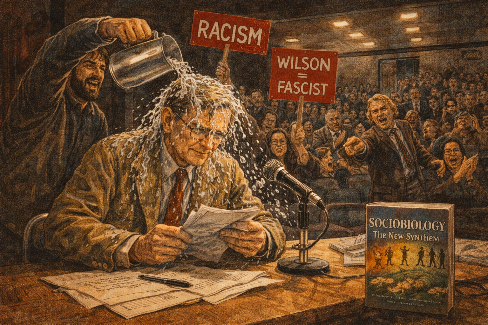

Image Prompt

Please generate a 16:9 image in Harvard academic style with dramatic tension — brick reds, dark shadows, confrontation energy — depicting panel 6 of 12. Make the characters and style consistent with the prior panels. The scene shows the infamous 1978 incident at the American Association for the Advancement of Science meeting. Edward O. Wilson, now in his late 40s with thinning hair and wire-rimmed glasses, sits on a stage behind a conference table with a microphone, about to give a lecture on sociobiology. A protester has just rushed the stage and is dumping a pitcher of ice water over Wilson's head. Water cascades over his hair and glasses. Wilson's expression is one of shock but not defeat — his jaw is set, his hands still grip his lecture notes. Other protesters hold signs reading "RACISM" and "WILSON = FASCIST." The audience in the auditorium shows a mix of horror, anger, and support. His book "Sociobiology: The New Synthesis" is visible on the table, its cover showing a spectrum from ants to humans. Color palette: harsh fluorescent auditorium light, dark institutional browns and grays, the splash of water catching the light, the bright red of protest signs, Wilson's tan jacket darkened with water. Emotional tone: intellectual courage under literal attack. Specific details: (1) water cascading over Wilson's head and glasses, (2) his hands gripping the lecture notes — he will not stop, (3) the protester with the empty pitcher, (4) protest signs with inflammatory accusations, (5) the Sociobiology book on the table, (6) audience members on their feet — some appalled, some cheering the protest. Generate the image immediately without asking clarifying questions.

In 1975, Wilson published *Sociobiology: The New Synthesis*, a monumental book arguing that social behavior — in ants, in wolves, in primates, and yes, in humans — has an evolutionary basis shaped by natural selection. The science was meticulous. The reaction was volcanic. Critics accused him of genetic determinism, of justifying racism and sexism, of resurrecting Social Darwinism. At a 1978 conference, a protester stormed the stage and dumped a pitcher of ice water over his head, shouting "Wilson, you're all wet!" Wilson sat there, dripping, and then gave his lecture anyway. He had been called a racist for suggesting that human nature has a biological component. The irony was bitter — this was a man whose life's work was devoted to showing that all life is interconnected, that no species is expendable, that the diversity of life is sacred. The controversy wounded him. But it also pushed him toward the cause that would define his final decades.

## Panel 7: The Conservation Pivot

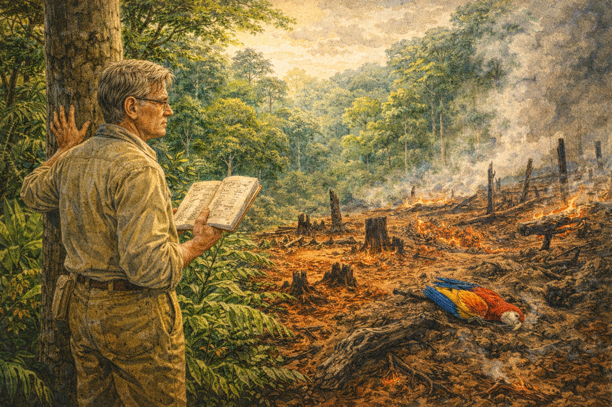

Image Prompt

Please generate a 16:9 image transitioning from Harvard academic to global conservation aesthetic — the palette warming and expanding toward tropical greens and urgent reds — depicting panel 7 of 12. Make the characters and style consistent with the prior panels. The scene shows Wilson, now in his early 50s, standing at the edge of a clearing in a tropical rainforest — probably the Amazon or Borneo — in the early 1980s. Behind him, intact rainforest rises in magnificent layers of green. Before him, the forest has been slashed and burned — charred stumps, red exposed soil, smoke still rising from smoldering logs. He holds his field notebook in one hand, the other hand pressed against a surviving tree trunk as if steadying himself against the scale of the destruction. His expression is grief mixed with fierce determination. Color palette: lush tropical greens behind him (emerald, jade, lime), devastation colors before him (charcoal black, raw sienna, smoke gray, angry red of exposed laterite soil), golden light breaking through the canopy behind, harsh flat light over the cleared area. Emotional tone: the turning point — from pure science to urgent advocacy. Specific details: (1) Wilson at the boundary between intact forest and destruction, (2) the magnificent layered rainforest canopy behind him, (3) charred stumps and smoldering ground before him, (4) his hand touching the trunk of the last standing tree at the edge, (5) a dead bird — a tropical parrot or toucan — lying in the ash, (6) his field notebook open to a page listing species observed, some now crossed out. Generate the image immediately without asking clarifying questions.

Wilson had spent decades building the theory that predicted how species disappear. Now he watched the prediction come true in real time. Tropical rainforests — the most species-rich ecosystems on Earth — were being burned and bulldozed at a rate of tens of millions of acres per year. Coral reefs were bleaching. Wetlands were being drained. And Wilson, who had spent more time looking at the small and overlooked creatures of the world than perhaps any living scientist, understood something that the big-picture people missed: it was not just the charismatic species — the tigers, the whales, the pandas — that were vanishing. It was the insects, the fungi, the soil microbes, the tiny organisms that hold ecosystems together. The fabric of life was unraveling thread by thread, and most people could not see it because they had never learned to look down.

## Panel 8: Biophilia

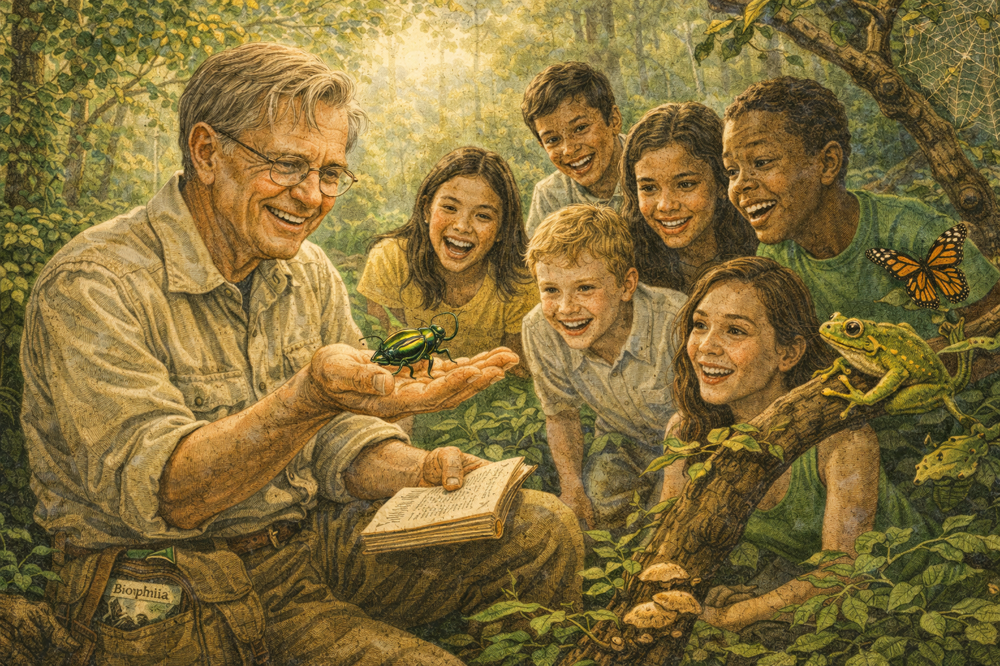

Image Prompt

Please generate a 16:9 image in a warm, luminous style that conveys the emotional and psychological connection between humans and nature — depicting panel 8 of 12. Make the characters and style consistent with the prior panels. The scene shows Wilson, mid-50s, sitting in a sun-dappled forest clearing, surrounded by a diverse group of children and young adults of different ethnicities who are utterly captivated as he holds up a large tropical beetle on his open palm. The beetle is iridescent green and gold. The students lean in, some with expressions of wonder, some with delighted surprise. Wilson's face shows pure joy — this is his biophilia concept made visible: the innate human attraction to other living things. The forest around them is alive with detail: butterflies, a tree frog on a nearby branch, mushrooms on a log, a spider web catching sunlight. Color palette: warm dappled golden light through green canopy, rich browns of forest floor, iridescent greens and golds of the beetle, warm skin tones of the diverse group, soft emerald of surrounding foliage. Emotional tone: enchantment, connection, the deep human need for nature. Specific details: (1) Wilson holding the iridescent beetle on his open palm with visible delight, (2) the diverse group of young people leaning in with wonder, (3) the sun-dappled forest setting alive with organisms, (4) a butterfly landing on a student's shoulder unnoticed, (5) a tree frog on a branch at eye level, (6) Wilson's book "Biophilia" visible tucked under his field bag on the ground. Generate the image immediately without asking clarifying questions.

In 1984, Wilson published *Biophilia*, and in it he made an argument that was radical in its simplicity: humans need nature. Not just for food, fiber, and clean water — but for our minds, our emotions, our sanity. He called it the "biophilia hypothesis": the idea that hundreds of thousands of years of evolution have hardwired us to respond to the living world. We are calmed by green landscapes. We are drawn to water. We are fascinated by other animals. We feel something profound in the presence of an old-growth forest that no shopping mall can replicate. Wilson was saying something that poets had always known but scientists had been afraid to claim: that the destruction of nature is not just an economic problem or an ethical problem — it is a psychological wound, a severing of a bond as old as our species.

## Panel 9: The Word That Changed Everything

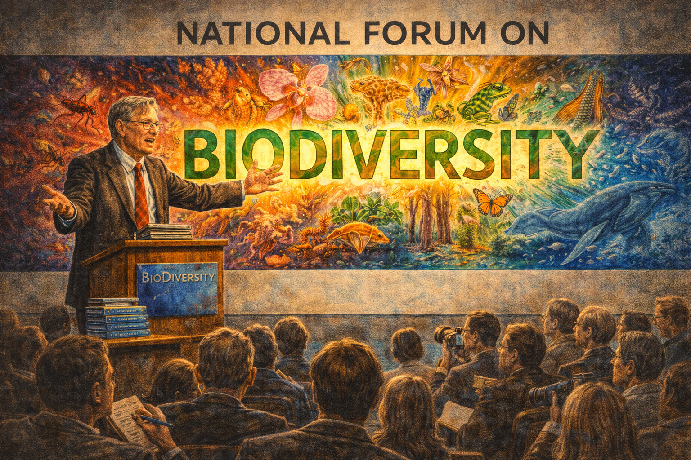

Image Prompt

Please generate a 16:9 image in a bold, visually striking style that captures the power of naming — depicting panel 9 of 12. Make the characters and style consistent with the prior panels. The scene shows Wilson, late 50s, at a podium in a grand conference hall in Washington, D.C., in 1988, at the National Forum on BioDiversity. He stands at a podium with a large banner behind him reading "NATIONAL FORUM ON BIODIVERSITY." The word "BIODIVERSITY" is rendered enormous on the banner, glowing with significance. Wilson gestures broadly as he speaks to an audience of scientists, policymakers, and journalists. Behind the text, a montage of life forms radiates outward: ants, orchids, coral, frogs, fungi, bacteria, sequoias, butterflies, whales — the full spectrum of Earth's living diversity. Color palette: institutional conference-hall neutrals (gray, beige) contrasted with the explosion of color in the biodiversity montage — every color in nature represented. The word BIODIVERSITY in bold green and gold. Emotional tone: the christening of a movement, the moment a concept gets a name and becomes unstoppable. Specific details: (1) Wilson at the podium, passionate and commanding, (2) the banner with BIODIVERSITY prominent, (3) the montage of life forms radiating from the word, (4) the mixed audience of scientists and policymakers, (5) journalists with notebooks and cameras in the front rows, (6) a stack of the forum's proceedings visible on the podium — the book that would be titled "BioDiversity." Generate the image immediately without asking clarifying questions.

Before 1988, the concept existed but had no name. Scientists talked about "species richness" and "biological diversity," but those phrases were academic, clinical, forgettable. Then Wilson organized the National Forum on BioDiversity in Washington, D.C., and the shortened word — *biodiversity* — entered the language like a seed finding soil. It was perfect: scientific enough to be taken seriously, simple enough for a newspaper headline, emotional enough to rally a movement. Wilson edited the proceedings into a book, and suddenly every environmental organization, every policy debate, every school textbook had a new word and a new urgency. Biodiversity was not just a list of species — it was the living infrastructure of the planet, the result of 3.8 billion years of evolution, and it was disappearing faster than at any time since the asteroid that killed the dinosaurs.

## Panel 10: The Sixth Extinction

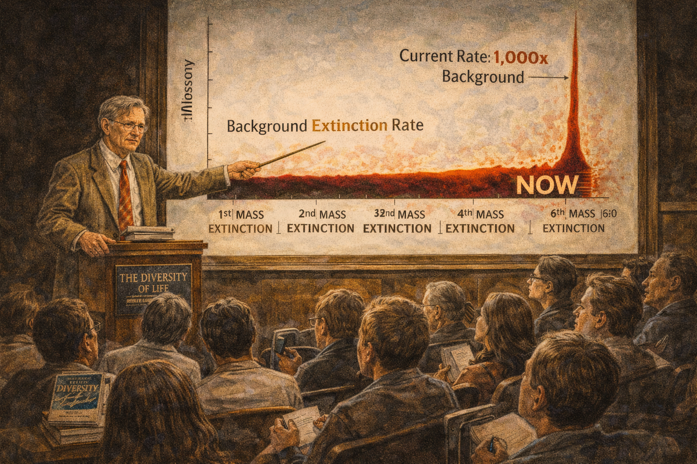

Image Prompt

Please generate a 16:9 image in a dramatic, data-driven ecological illustration style — depicting panel 10 of 12. Make the characters and style consistent with the prior panels. The scene shows Wilson, now in his early 60s with silver hair and wire-rimmed glasses, standing before a massive chalkboard or presentation screen in a Harvard lecture hall in the early 1990s. On the screen is a dramatic graph showing extinction rates: a flat baseline labeled "Background Extinction Rate" stretching across geological time, and then a nearly vertical spike at the present day labeled "Current Rate: 1,000x Background." Below the graph, a timeline shows the five previous mass extinctions as dips in biodiversity, with the sixth — labeled "NOW" in red — just beginning. Wilson points to the spike with a pointer, his expression grave but resolute. The lecture hall is packed with students and faculty. Color palette: dark lecture-hall atmosphere with warm wood tones, the graph glowing in stark reds and blacks against a white screen, Wilson illuminated by the projector light, the audience in shadow. Emotional tone: scientific alarm delivered with professorial authority. Specific details: (1) Wilson pointing at the extinction rate spike, (2) the graph clearly showing the 1,000x increase, (3) the five previous mass extinctions marked on the timeline, (4) the word "NOW" in red at the present-day spike, (5) a copy of "The Diversity of Life" on the lectern, (6) students in the packed hall — some taking furious notes, some visibly shaken. Generate the image immediately without asking clarifying questions.

In 1992, Wilson published *The Diversity of Life*, and the numbers he assembled were staggering. Species were going extinct at roughly one thousand times the natural background rate — the rate that had prevailed for millions of years between mass extinction events. This was not a gradual decline. This was a catastrophe with a speed that rivaled the asteroid impact that ended the Cretaceous. Wilson did the math: if tropical deforestation continued at its current pace, half of all species on Earth could be gone within a century. He called it the "sixth extinction," and unlike the first five — caused by volcanism, glaciation, and asteroid impacts — this one had a single cause: *us*. Habitat destruction, invasive species, pollution, population growth, overharvesting. Wilson gave these threats an acronym that would become a teaching tool for a generation of conservation biologists: HIPPO.

## Panel 11: Half-Earth

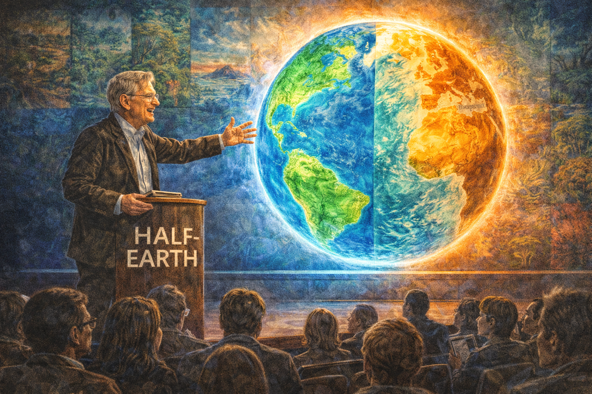

Image Prompt

Please generate a 16:9 image in a sweeping, visionary global style — the fullest expression of the biodiversity palette — depicting panel 11 of 12. Make the characters and style consistent with the prior panels. The scene shows Wilson, now in his mid-80s, silver-haired and slightly stooped but still radiating fierce energy, standing before a massive illuminated globe — either a physical model or a projection — that shows his Half-Earth vision. Exactly half of the globe's land and ocean surface is shaded in vibrant green and blue, representing protected areas. The other half shows human-modified landscapes in warm amber and brown. Wilson reaches toward the globe with one hand, as if offering it to the viewer. The setting is a modern conference stage or TED-talk-style platform, with a large audience visible in silhouette. Behind the globe, a mosaic of ecosystems is faintly visible: rainforest, coral reef, tundra, savanna, deep ocean, mangrove, wetland. Color palette: vivid protected-area greens and ocean blues covering half the globe, warm amber and brown for human landscapes, stage lighting in cool blue and warm gold, the globe luminous at center. Emotional tone: audacious hope, the biggest conservation proposal in history. Specific details: (1) Wilson reaching toward the Half-Earth globe with passion, (2) the globe clearly showing 50% protected in green and blue, (3) ecosystem mosaic faintly visible behind the globe, (4) the modern stage setting with dramatic lighting, (5) the audience in silhouette — a mix of young and old, (6) the words "HALF-EARTH" visible on the screen or stage backdrop. Generate the image immediately without asking clarifying questions.

Wilson's most audacious idea came near the end of his life. In 2016, at the age of eighty-six, he published *Half-Earth: Our Planet's Fight for Life*. The proposal was breathtaking in its simplicity and its ambition: protect half the surface of the Earth — land and ocean — and you save approximately eighty-five percent of all species. Anything less, and the extinction cascade continues until the biosphere is impoverished beyond recognition. It was not a guess. It was island biogeography applied to the entire planet — the same species-area relationship he and MacArthur had worked out on mangrove islands in the Florida Keys, scaled up to the globe. Critics called it unrealistic. Wilson called it necessary. "We are needlessly turning the Earth into a permanent desert," he wrote. "Half-Earth is the goal, but it is how we get there — and the way we will be changed by the effort — that counts."

## Panel 12: The Legacy of the Ant Man

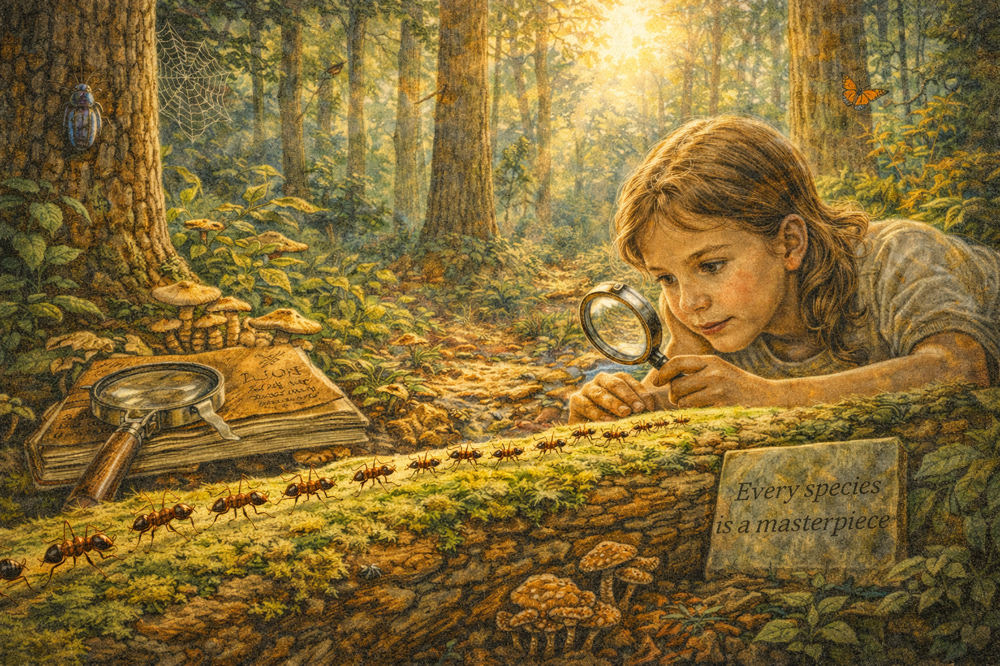

Image Prompt

Please generate a 16:9 image in a luminous, elegiac naturalist style that unifies all the visual themes of the previous panels — depicting panel 12 of 12. Make the characters and style consistent with the prior panels. The scene shows a sunlit forest floor — it could be Alabama longleaf pine forest or tropical rainforest; the trees are majestic and ancient. Wilson is not physically present, but his presence pervades the image. In the foreground, a column of ants — the same species from Panel 1 — marches across a mossy log in perfect formation. Beside the log, a magnifying glass rests on a weathered field notebook, as if Wilson has just set them down and stepped away. A young girl, about the same age as Wilson in Panel 1, lies on her belly on the forest floor, her face inches from the ant column, studying them with the same intensity that defined Wilson's boyhood. She holds a modern hand lens. The forest around them is alive: beetles on bark, butterflies in shafts of light, a spider web jeweled with dew, fungi on a fallen trunk, birdsong implied by small birds in the canopy. Color palette: the full spectrum — warm Alabama golds and reds of the soil, lush tropical greens of the canopy, soft morning light, the iridescent detail of insects, the golden patina of the old field notebook. Emotional tone: continuity, reverence, the endless fascination of the living world. Specific details: (1) the ant column crossing the mossy log, echoing Panel 1, (2) Wilson's magnifying glass and field notebook resting on the log, (3) the young girl studying the ants with intense focus, (4) the diverse forest teeming with life at every scale, (5) a small plaque or carved text on a nearby stone reading "Every species is a masterpiece," (6) morning light filtering through the canopy like a cathedral. Generate the image immediately without asking clarifying questions.

Edward Osborne Wilson died on December 26, 2021, at the age of ninety-two. He had published over four hundred scientific papers, written more than thirty books, won two Pulitzer Prizes, discovered hundreds of ant species, co-created the theory of island biogeography, ignited and survived the sociobiology wars, coined the word that gave conservation its rallying cry, and proposed the most ambitious plan to save life on Earth ever put forward by a single scientist. But the throughline of his life was simpler than any of that. A boy lost the sight in one eye and learned to look at what was right in front of him. He looked at ants. He fell in love. And that love — patient, obsessive, precise, overflowing — expanded outward from a single colony in Alabama to encompass every living thing on the planet. Wilson proved that you do not have to start with the big picture. You can start with a single ant on a single log, and if you pay close enough attention, it will lead you to the whole world.

### Epilogue – Why E.O. Wilson Matters for Ecology

Wilson's life is a masterclass in how deep knowledge of one small part of nature leads to understanding the whole. He did not start by trying to save the planet. He started by trying to understand how ants communicate. But because he followed the questions wherever they led — from pheromones to island biogeography, from social behavior to biodiversity, from species counts to the moral imperative of conservation — he ended up articulating the most compelling case for protecting life on Earth that science has ever produced.

| Contribution | What Wilson Did | Why It Matters |
|---|---|---|
| Myrmecology and chemical ecology | Discovered that ants communicate through pheromone signals, decoding an entire chemical language | Revealed the hidden complexity of organisms most people ignore — the foundation of his life's argument that every species matters |
| Theory of Island Biogeography | With MacArthur, showed that species richness is a predictable equilibrium between immigration and extinction | Gave conservation biology its most powerful predictive tool: the species-area relationship that forecasts extinction from habitat loss |
| Sociobiology | Argued that social behavior in all animals, including humans, has evolutionary roots | Opened an entire field of inquiry and forced biology to grapple with the evolution of cooperation, altruism, and social organization |
| Biophilia | Proposed that humans have an innate, evolved need to connect with other living things | Gave the conservation movement a psychological and emotional argument to complement the economic and ecological ones |
| Biodiversity as concept and word | Coined and popularized the term, making it the central concept of conservation biology | Gave the world a word — and a framework — for understanding what we stand to lose |
| Half-Earth | Proposed protecting 50% of Earth's surface to save 85% of species | Set an ambitious, science-based target that reshaped the global conservation agenda |

### Call to Action

You do not need to travel to the Amazon to follow Wilson's example. You need to get on your belly and look at what lives in the nearest patch of soil. Turn over a rock. Watch an ant trail. Learn the names of five insects in your neighborhood. Wilson's life proves that the path to caring about biodiversity starts with caring about one species — any species — deeply enough to learn its story. Once you know one story well, you begin to see how all the stories are connected. And once you see the connections, you cannot look away.

---

*"If all mankind were to disappear, the world would regenerate back to the rich state of equilibrium that existed ten thousand years ago. If insects were to vanish, the environment would collapse into chaos."*
— E.O. Wilson

*"The one process now going on that will take millions of years to correct is the loss of genetic and species diversity by the destruction of natural habitats. This is the folly our descendants are least likely to forgive us."*
— E.O. Wilson, *The Diversity of Life*

*"Every species is a masterpiece, exquisitely adapted to the particular environment in which it has survived."*
— E.O. Wilson

*"Look closely at nature. Every species is a masterpiece of evolution. Those still surviving are the masterpieces of masterpieces."*
— E.O. Wilson

---

## References

1. [Wikipedia: E.O. Wilson](https://en.wikipedia.org/wiki/E._O._Wilson) — Biography of the American biologist, naturalist, and writer known as the father of biodiversity
2. [Wikipedia: The Theory of Island Biogeography](https://en.wikipedia.org/wiki/The_Theory_of_Island_Biogeography) — The foundational 1967 work by Wilson and MacArthur on species-area relationships
3. [Wikipedia: Biodiversity](https://en.wikipedia.org/wiki/Biodiversity) — The concept Wilson named and championed, now central to conservation biology worldwide
4. [E.O. Wilson Biodiversity Foundation](https://eowilsonfoundation.org/) — The foundation continuing Wilson's mission to promote biodiversity education and the Half-Earth vision
5. [Encyclopaedia Britannica: E.O. Wilson](https://www.britannica.com/biography/Edward-O-Wilson) — Curated reference overview of Wilson's life, career, and contributions to biology and conservation
