# Stories of Ecologists and Earth Defenders

> *"Everything's connected!"* — Bailey the Beaver

This collection of illustrated short stories introduces the real people behind some of the most important moments in the history of ecology and environmental science. Each story is a 12-panel graphic novel that dramatizes a moment when one person's careful observation, stubborn data collection, or sheer courage changed how we understand — and protect — the living world.

These are not just biographies. They are case studies in systems thinking — in how ecosystems work, how pollution hides in plain sight, and how evidence can defeat even the most powerful industries.

## Stories from Theory of Knowledge

The following stories were originally written for our companion textbook, [Theory of Knowledge](https://dmccreary.github.io/theory-of-knowledge/), and are directly relevant to ecology. Each one connects to multiple chapters in this textbook.

*Clicking a card below will take you to the Theory of Knowledge site, where the full story and all 12 panel images are hosted. Use your browser's back button to return here. We link rather than duplicate because each story includes 13 generated images — copying them across textbooks would add unnecessary bulk without adding value.*

- **[Rachel Carson — The Woman Who Listened to Silent Spring](https://dmccreary.github.io/theory-of-knowledge/stories/rachel-carson/)**

    
    A quiet marine biologist takes on the most powerful chemical companies in America — armed only with meticulously footnoted evidence. Racing a fatal diagnosis, Rachel Carson shows how patient research and clear writing can defeat a well-funded disinformation campaign. Her book *Silent Spring* launched the modern environmental movement.

- **[Charles Darwin — The Finches' Beaks](https://dmccreary.github.io/theory-of-knowledge/stories/charles-darwin/)**

    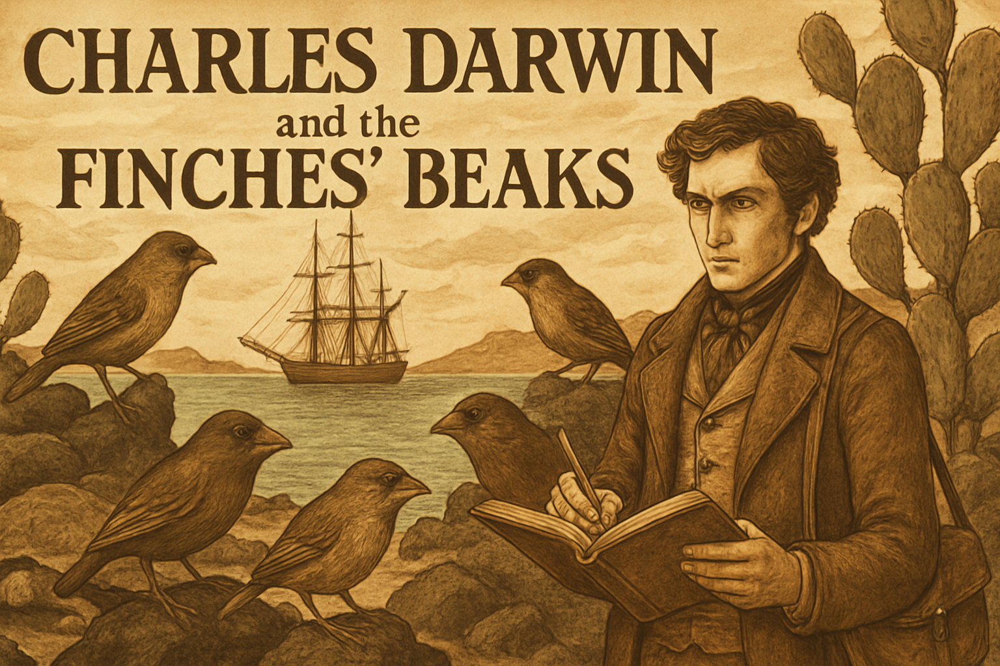
    Darwin sailed home from the Galápagos with notebooks full of observations that troubled him deeply. The finches had different beaks on different islands. He sat on his theory for twenty years — then published the most important book in the history of biology.

- **[Carl Sagan — The Baloney Detection Kit](https://dmccreary.github.io/theory-of-knowledge/stories/carl-sagan/)**

    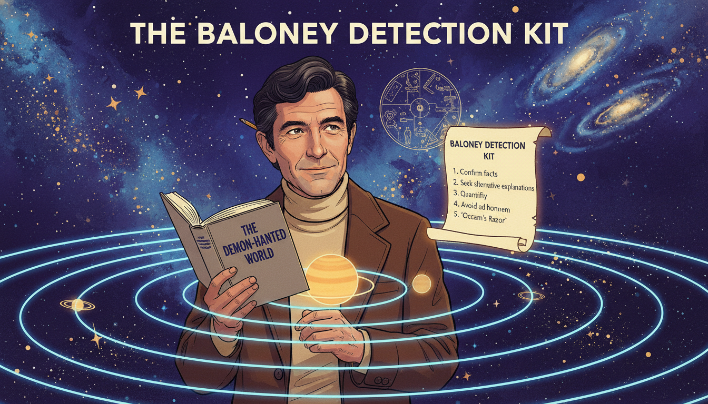
    A five-year-old boy from Brooklyn visited the World's Fair and fell in love with the universe. Decades later, racing a fatal illness, he wrote a book giving ordinary citizens the tools to tell real science from nonsense. Essential reading for evaluating environmental claims.

- **[Mary Anning — The Dragons in the Cliffs](https://dmccreary.github.io/theory-of-knowledge/stories/mary-anning/)**

    
    A poor girl from Lyme Regis who never went to school taught herself anatomy and geology, then pulled monsters from the cliffs that proved extinction was real and the Earth was vastly older than anyone believed.

## New Stories for This Textbook

These stories were developed specifically for the ecology textbook. See [Story Ideas](story-ideas.md) for the full list.

- **[John Snow — Mapping Cholera](john-snow/)**

    
    London, 1854. Cholera kills hundreds per week and doctors blame "bad air." Dr. John Snow doesn't buy it. He maps every death on a street grid and discovers they cluster around a single water pump. His dot map becomes one of the most famous data visualizations in history — and the founding moment of epidemiology.

- **[Darwin's Earthworms — The Power of the Small](darwins-earthworms/)**

    
    Darwin's last book wasn't about finches or evolution — it was about earthworms. For forty years, he studied how these humble creatures turn dead leaves into soil, bury stones, and reshape the English landscape. His radical conclusion: the most important forces in nature are often the smallest and slowest.

- **[Aldo Leopold — Thinking Like a Mountain](aldo-leopold/)**

    
    As a young forest ranger, Aldo Leopold shot wolves because the government told him to. Then he watched the deer multiply, strip the mountains bare, and starve. In one transformative moment, he watched a "fierce green fire" die in a wolf's eyes — and became the father of modern conservation.

- **[Paul Müller — The Miracle That Became a Warning](paul-muller/)**

    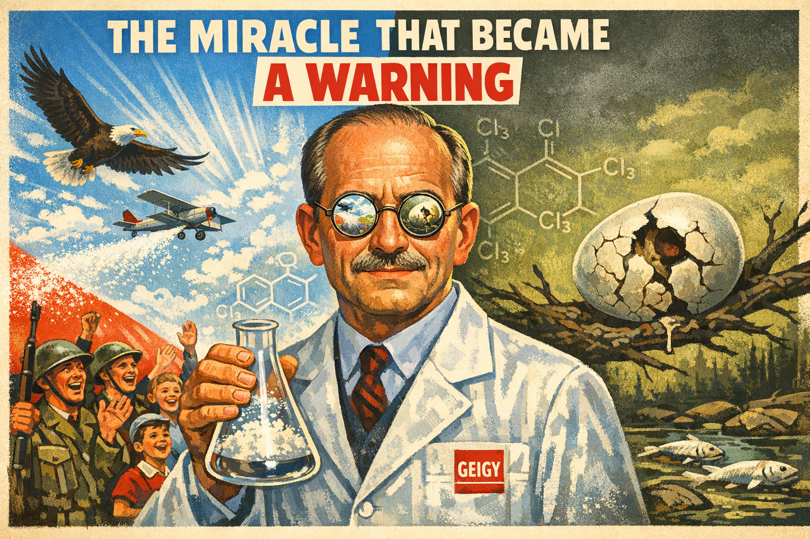
    A Swiss chemist discovers that DDT kills insects on contact and wins the 1948 Nobel Prize. His miracle powder saves millions from malaria. But within two decades, DDT accumulates up food chains through biomagnification and eagle populations collapse. This is not a story about a villain — it's about what happens when no one asks "what happens next?"

- **[Clair Patterson — The Man Who Counted Lead](clair-patterson/)**

    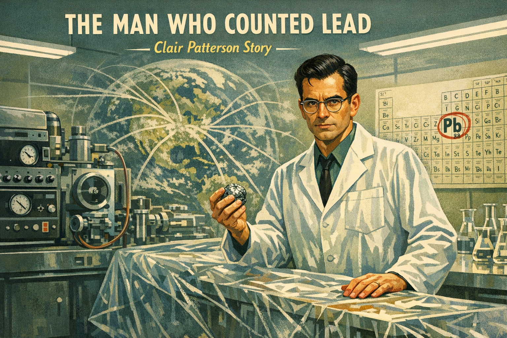
    A geochemist trying to date the age of the Earth keeps getting contaminated results. Tracing the contamination, he discovers that leaded gasoline has poisoned the entire planet. When the Ethyl Corporation tries to destroy his career, Patterson fights back with twenty years of meticulous data — and wins.

- **[The Ozone Detectives — Rowland and Molina](rowland-molina/)**

    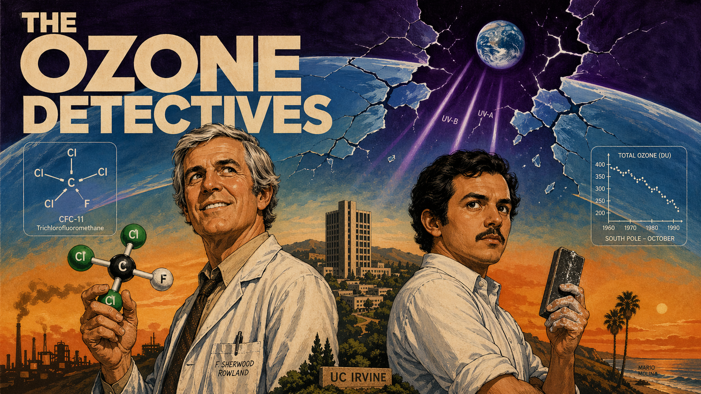
    A senior chemist and his young Mexican postdoc predict that CFCs will destroy the ozone layer. The chemical industry calls them alarmists. Eleven years later, a hole appears over Antarctica — exactly as predicted. Their work leads to the Montreal Protocol, the most successful environmental treaty in history.

- **[Charles David Keeling — Measuring the Invisible](charles-keeling/)**

    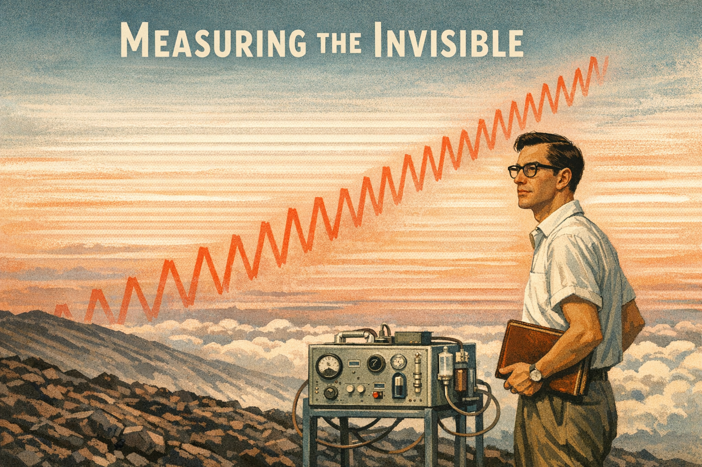
    In 1958, a young chemist drives to the top of Mauna Loa with a homemade CO₂ analyzer and starts measuring. Funding agencies repeatedly try to cut his "boring" monitoring program. Keeling fights to keep it alive for forty-seven years. The Keeling Curve becomes the single most important graph in climate science.

- **[E.O. Wilson — The Man Who Loved Ants](eo-wilson/)**

    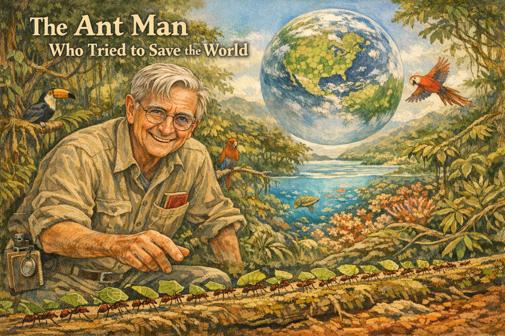
    A boy in Alabama, blind in one eye, studies the small things he can see up close — ants. His obsession leads to island biogeography, the concept of "biophilia," and the most ambitious conservation proposal in history: protect half the Earth to save 85% of species.

- **[Roger Payne — The Songs That Saved the Whales](roger-payne/)**

    
    In 1967, Roger Payne discovered that humpback whales sing complex, evolving songs. His 1970 album became a bestseller, was sent into interstellar space on the Voyager Golden Record, and transformed whales from oil and meat into fellow musicians. His work helped drive the international moratorium on commercial whaling.

- **[Sylvia Earle — Her Deepness](sylvia-earle/)**

    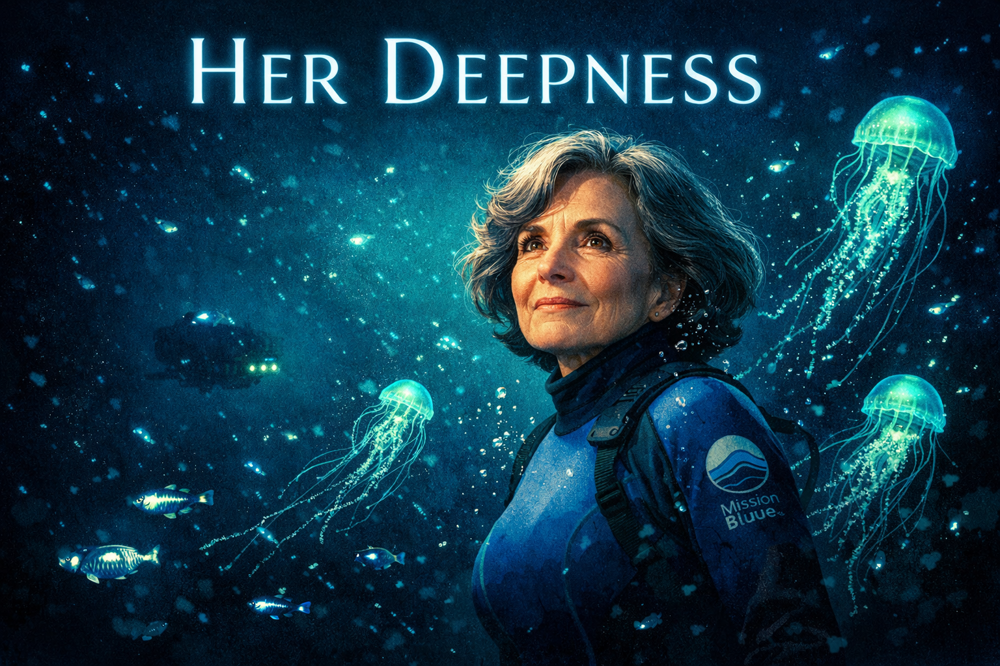
    She led the first all-female team of aquanauts, walked untethered on the seafloor at 1,250 feet, and became NOAA's first female chief scientist. Now in her nineties, "Her Deepness" campaigns tirelessly for marine protected areas, warning that we've explored more of Mars than our own ocean floor.

- **[Wangari Maathai — The Woman Who Planted Millions](wangari-maathai/)**

    
    A Kenyan biologist starts paying rural women a few shillings to plant native trees. The government calls her a madwoman and has her beaten and jailed. But the Green Belt Movement grows — fifty million trees planted, thousands of women empowered, and entire watersheds restored. In 2004, Maathai becomes the first African woman to win the Nobel Peace Prize.

- **[Cary Fowler — The Seed Vault Guardian](cary-fowler/)**

    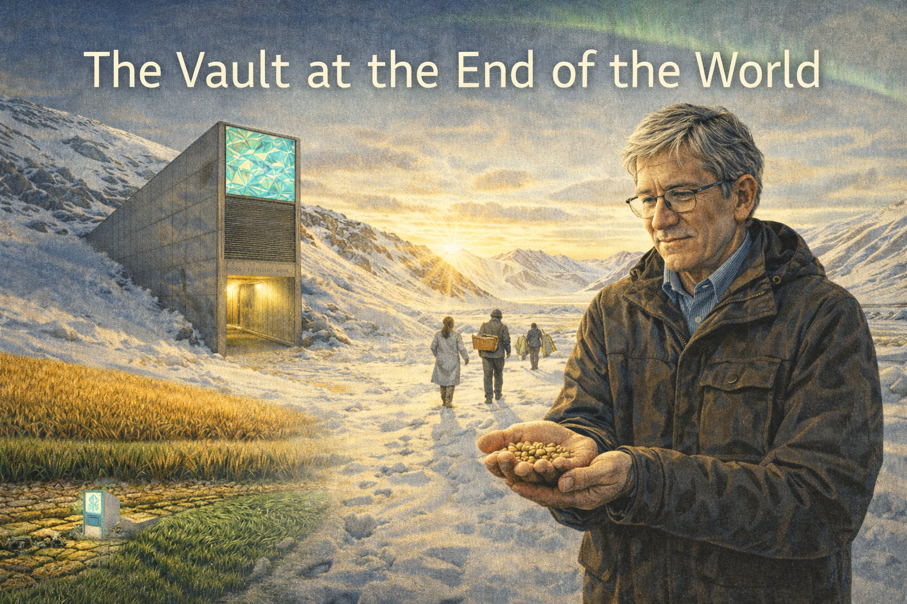
    75% of the world's crop genetic diversity has been lost in the past century. A Tennessee farm boy spends decades persuading governments to build the Svalbard Global Seed Vault — a frozen bunker inside an Arctic mountain holding over a million seed samples. When Syria's civil war destroys the Aleppo seed bank, Svalbard's backup saves irreplaceable crop varieties.

- **[Suzanne Simard — The Wood Wide Web](suzanne-simard/)**

    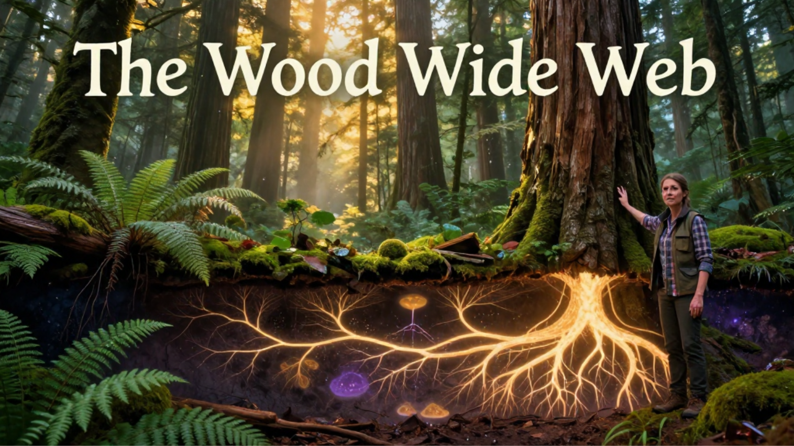
    A forestry researcher in British Columbia proves that trees share nutrients through underground fungal networks — mother trees feeding their offspring through what the press dubs the "Wood Wide Web." The logging industry tries to silence her. Simard persists, publishing decades of data showing forests are cooperative communities, not collections of competing individuals.

- **[Ruth Gates — The Coral Whisperer](ruth-gates/)**

    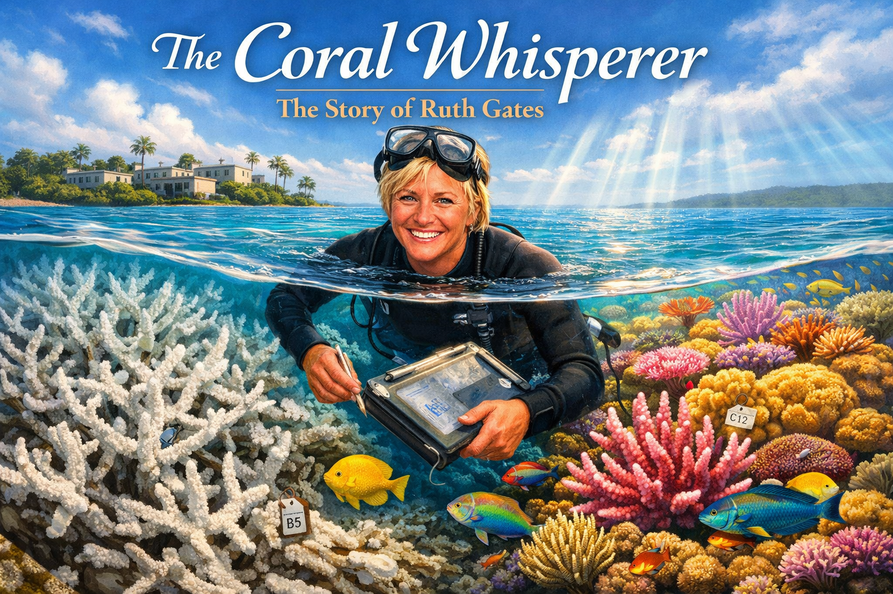
    While most coral scientists publish obituaries for dying reefs, Ruth Gates asks: Can we breed corals tough enough to survive climate change? Working in Hawaiʻi, she pioneers "assisted evolution." Critics call it playing God. Gates argues that doing nothing is a choice too. Her Super Coral project continues after her death, offering hope for reef survival.

- **[The River That Caught Fire — The Cuyahoga Story](cuyahoga-river/)**

    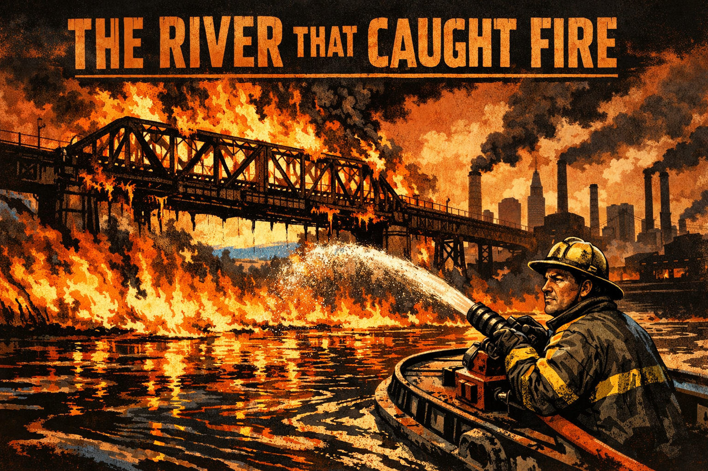
    For a hundred years, Cleveland's Cuyahoga River caught fire repeatedly — and nobody cared. The 1969 fire sparked Earth Day, the creation of the EPA, and the Clean Water Act. This is the story of how a burning river forced America to confront a century of environmental neglect.

- **[Wolves, Rivers, and Trophic Cascades — The Yellowstone Story](yellowstone-wolves/)**

    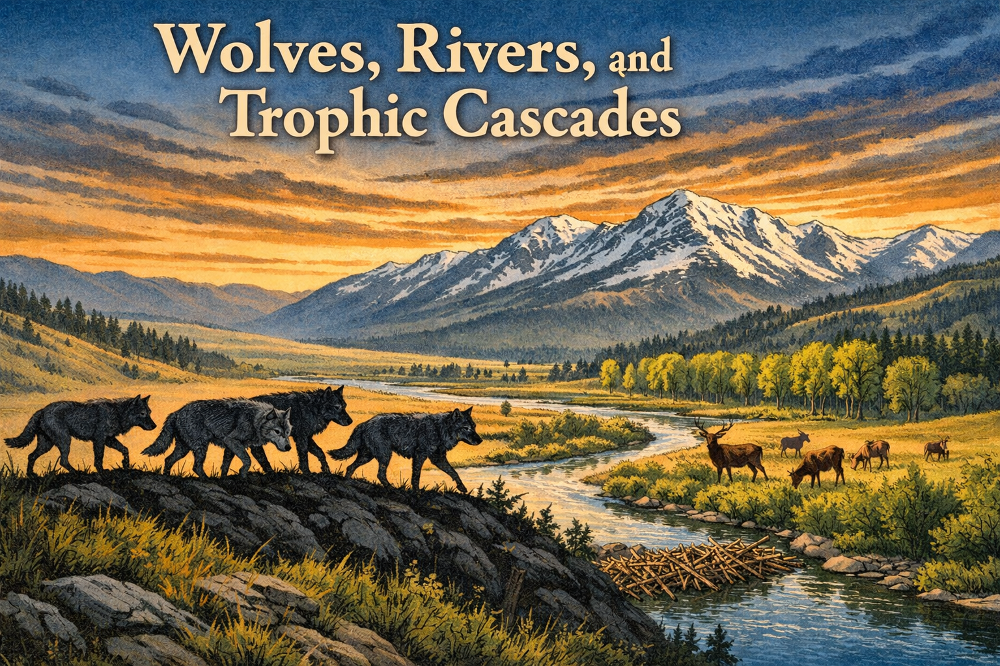
    In 1926, the last wolf in Yellowstone was killed. Elk exploded, willows vanished, rivers eroded. In 1995, fourteen wolves were reintroduced — and the most famous trophic cascade in history began. This ensemble story shows how one species reshaped an entire landscape.

## How to Read These Stories

Each story follows the same structure: a brief prologue setting up the historical moment, twelve illustrated panels with narrative captions, an epilogue that draws out the lessons for modern readers, and a few memorable quotes from the subject. Every panel is built around a question Bailey might ask: *How is this connected to the bigger system?*

As you read, try to notice the patterns. Ecologists and environmental defenders across centuries share surprising habits — they measure carefully, they follow the data wherever it leads, they think in systems rather than straight lines, and they are willing to fight powerful interests when the evidence demands it.
