# The Ghost Map

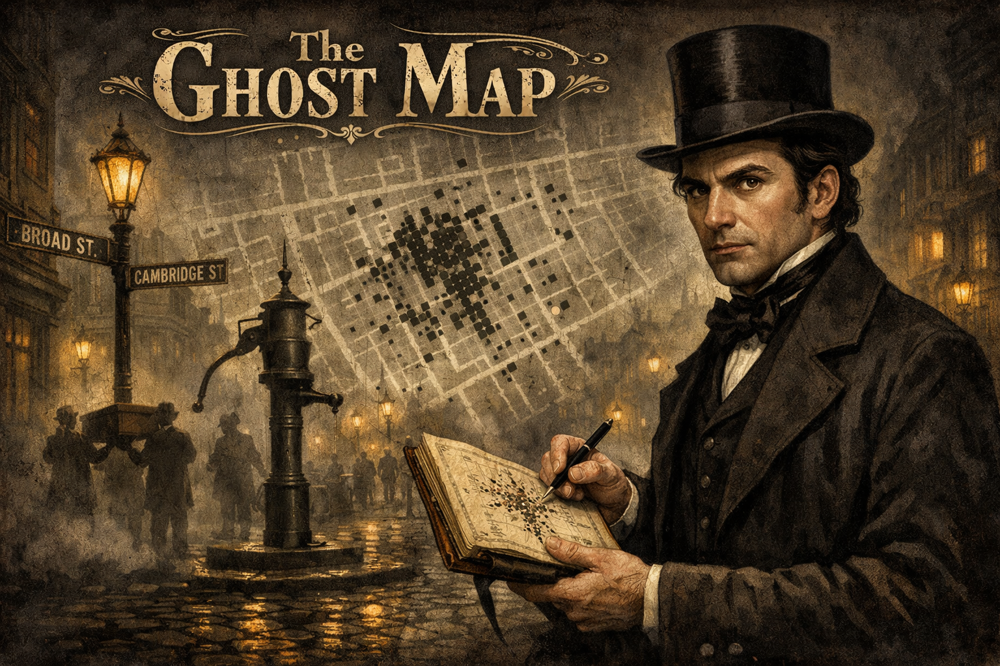

Cover Image Prompt

Please generate a wide-landscape 16:9 cover image for a graphic novel titled "The Ghost Map" in a Victorian London art style — dark, atmospheric, Dickensian, reminiscent of 19th-century engravings and gas-lit illustrations. Show Dr. John Snow, a serious, clean-shaven young man in his early 40s with sharp dark eyes, dark hair parted to one side, wearing a dark Victorian frock coat and top hat, standing at the intersection of Broad Street and Cambridge Street in Soho, London, 1854. He holds an open leather-bound notebook in one hand and a pen in the other, plotting data points. Behind him, a ghostly translucent overlay of his famous dot map floats in the fog — black dots clustering densely around the Broad Street pump. The street is cobblestoned, fog-shrouded, lit by gas lamps casting sickly yellow pools. Shadowy figures carry coffins in the background. The Broad Street pump stands prominent in the middle distance, an iron hand-pump with a long handle. The title text "The Ghost Map" is rendered in Victorian serif typography at the top, with ornate flourishes. Color palette: deep coal-smoke browns, gas-lamp yellows, fog grays, with stark white for the map overlay and occasional flashes of medical blue. Emotional tone: detective-story tension, the courage of one man standing between a city and a plague. Include: (1) Snow's intense, observant expression and clean-shaven jaw, (2) the leather notebook with hand-drawn map visible, (3) the Broad Street pump silhouetted in fog, (4) the ghostly dot-map overlay showing death clusters, (5) coffin-bearers in the misty background, (6) gas lamps reflecting off wet cobblestones. Generate the image immediately without asking clarifying questions.

Narrative Prompt

This is a 12-panel graphic novel about Dr. John Snow (1813-1858), the English physician who traced the 1854 Broad Street cholera outbreak to a contaminated water pump and founded the science of epidemiology. The story spans from the 1830s to the legacy era after Snow's death, set in Newcastle, Soho London, and the corridors of Victorian medical power. The art style throughout is Victorian London — dark, atmospheric, Dickensian. Deep browns, gas-lamp yellows, coal-smoke grays, with occasional stark white for Snow's map and medical scenes. Think Charles Dickens illustrations meets medical-history engraving. Gritty, fog-shrouded, claustrophobic in the disease panels; clear and precise in the mapping panels. Snow should be drawn consistently across panels: a serious, clean-shaven young man with sharp dark eyes, dark hair, wearing a dark Victorian frock coat; he carries a leather-bound notebook everywhere. Central ecology theme: water quality as the hidden infrastructure of public health — how contaminated water systems spread disease through urban populations, and how spatial data analysis can reveal invisible environmental hazards. The story emphasizes the detective-story quality of epidemiological investigation, the power of data visualization to defeat entrenched dogma, and the courage required to challenge a scientific establishment that preferred a comfortable theory to an uncomfortable truth.

### Prologue -- The Invisible Killer

In the summer of 1854, London was the largest city on Earth and one of the filthiest. A quarter-million cesspools festered beneath its streets. The River Thames was an open sewer. And cholera — a disease that could kill a healthy adult in twelve hours — was stalking the city for the third time in twenty years. The doctors of London were certain they understood the enemy. Cholera, they said, was caused by miasma — poisonous vapors rising from rotting organic matter. The theory made intuitive sense: the disease struck hardest in the foulest-smelling neighborhoods. But one physician, a coal miner's son from Yorkshire who had clawed his way into the medical profession through sheer brilliance, thought the miasma theory was wrong. He believed cholera was in the water. He had no microscope powerful enough to prove it, no germ theory to support him, and no establishment allies. What he had was a notebook, a street map, and the most dangerous weapon in science: a willingness to count.

## Panel 1: The Coal Miner's Son

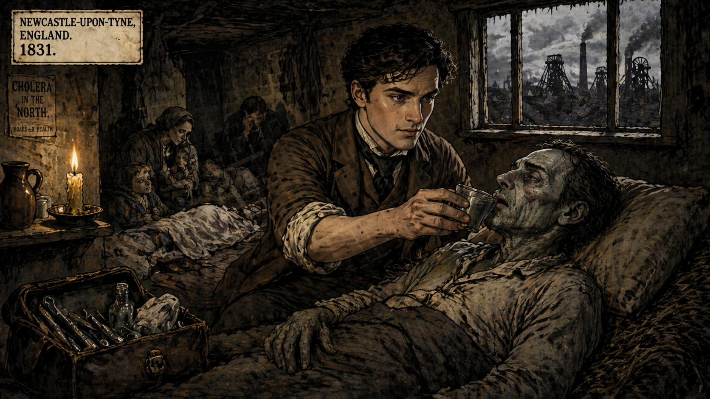

Image Prompt

(This is panel 1.  Do not put the panel number in the image.) I am about to ask you to generate a series of images for a graphic novel. Please make the images have a consistent style and consistent characters. Do not ask any clarifying questions. Just generate the image immediately when asked.

Please generate a 16:9 image in a Victorian London art style — dark, atmospheric, Dickensian — depicting panel 1 of 12. The scene shows Newcastle-upon-Tyne, England, 1831. A young John Snow, age 18, lean and serious with sharp dark eyes and dark hair, wearing a plain brown apprentice surgeon's coat with rolled-up sleeves, is tending to cholera patients in a crowded coal-mining village. The room is a cramped workers' cottage with low ceilings and a single smoky tallow candle. A miner lies on a straw pallet, his face gray and sunken from dehydration, while Snow holds a cup of water to the man's cracked lips. Other patients are visible in the background — women and children huddled on the floor, a second body covered with a sheet. Through the small window, the chimneys and pithead wheels of the Killingworth colliery are visible against a slate-gray sky. Color palette: coal black, ash gray, tallow-candle amber, sickly yellow-green for the patients' skin, dark brown for the cottage walls. Emotional tone: horror witnessed young — the formative trauma that will drive a lifetime of investigation. Specific details: (1) Snow's young, clean-shaven face showing both compassion and clinical observation, (2) the cholera patient's characteristic sunken eyes and blue-gray skin, (3) the cramped, squalid mining cottage interior, (4) the cup of water Snow is offering — water, already at the center of the story, (5) a medical kit bag open on the floor with rudimentary surgical tools, (6) through the window, the industrial skyline of a Northern English mining town. Generate the image immediately without asking clarifying questions.

John Snow was born in 1813 in York, the eldest son of a laborer who worked the coal yards. At fourteen, he was apprenticed to a surgeon in Newcastle — a grim industrial city where the mines ate men alive and the cholera ate what was left. In 1831, when Snow was just eighteen, cholera swept through the mining villages of Killingworth. The senior surgeon sent his youngest apprentice to tend the dying. There was almost nothing Snow could do. Cholera killed with terrifying speed — violent purging, catastrophic dehydration, death sometimes in less than a day. But Snow watched. He noticed that the disease struck whole households that shared the same water supply, while neighboring houses on different wells were spared. He noticed that the miners who worked deepest in the pits, drinking from underground seepage, sickened first. He was too young and too junior to challenge anyone. But he never forgot what the water told him.

## Panel 2: The Miasma Theory

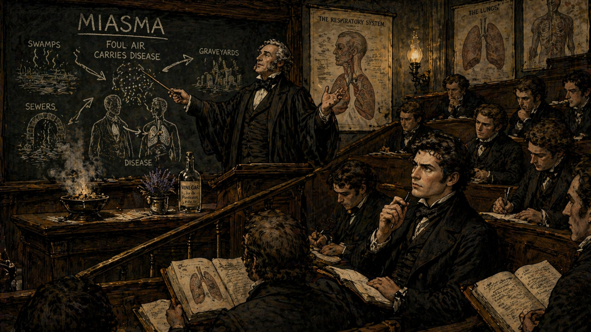

Image Prompt

(This is panel 2.  Do not put the panel number in the image.) Please generate a 16:9 image in a Victorian London art style — dark, atmospheric, Dickensian — depicting panel 2 of 12. Make the characters and style consistent with the prior panel. The scene shows a grand lecture hall at a London medical school in the early 1840s. A distinguished professor in a black academic gown stands at a podium, gesturing dramatically at a large anatomical chart while lecturing on the miasma theory of disease. Behind him, a chalkboard displays the word "MIASMA" in large letters with arrows showing how "bad air" supposedly carries disease from swamps, sewers, and graveyards to human lungs. In the tiered wooden seats of the lecture hall, rows of young medical students in dark coats take notes — among them, John Snow, now in his late 20s, clean-shaven with sharp dark eyes, his expression skeptical, his pen paused above his notebook as he listens with visible doubt. Other students nod dutifully. On the professor's desk sit a bowl of burning lavender and a bottle of vinegar — anti-miasma remedies. Color palette: lecture-hall mahogany, chalkboard green, gas-lamp amber, academic black, cream paper. Emotional tone: institutional authority versus private skepticism — the lone doubter in a room of true believers. Specific details: (1) the professor's confident, theatrical gestures, (2) the miasma diagram on the chalkboard with arrows from "foul air" to human figures, (3) Snow's skeptical expression in the audience — pen paused, brow furrowed, (4) obedient students nodding around him, (5) the burning lavender and vinegar on the professor's desk, (6) anatomical charts on the walls showing lungs and respiratory system prominently. Generate the image immediately without asking clarifying questions.

The miasma theory was not a fringe idea — it was the foundation of Victorian public health. The most eminent physicians in England believed that disease was caused by noxious vapors generated by decomposing matter — the stench of sewers, the reek of graveyards, the poisonous exhalations of swamps. The theory had a long pedigree stretching back to Hippocrates, and it seemed to explain the obvious fact that epidemics struck hardest in the foulest neighborhoods. London's doctors prescribed burning tar in the streets, carrying nosegays of flowers, and sprinkling chloride of lime on everything. When cholera came, they sealed windows and fumigated rooms. The miasma men had answers for everything — and their answers were wrong. But questioning them required more than suspicion. It required a different kind of evidence, and John Snow was beginning to imagine what that evidence might look like.

## Panel 3: The Logical Flaw

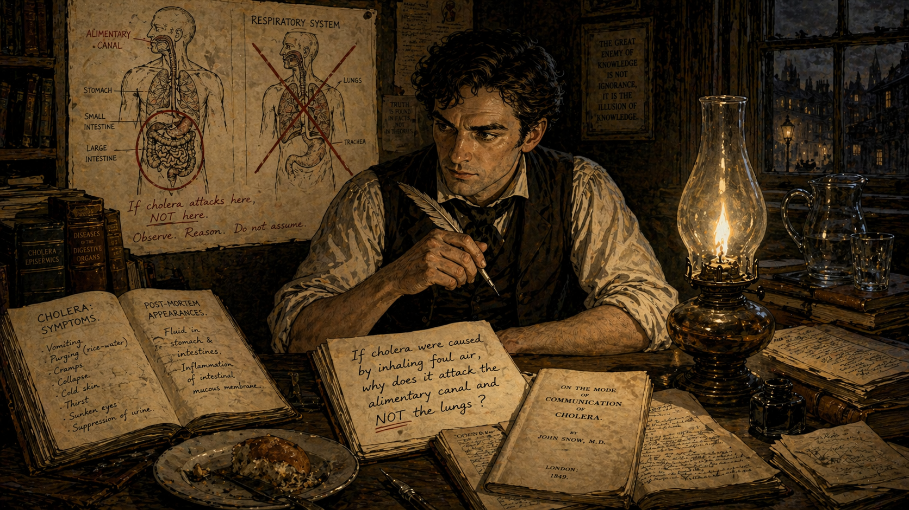

Image Prompt

(This is panel 3.  Do not put the panel number in the image.) Please generate a 16:9 image in a Victorian London art style — dark, atmospheric, Dickensian — depicting panel 3 of 12. Make the characters and style consistent with the prior panel. The scene shows John Snow's modest study in his Soho lodgings, London, early 1849. Snow, now in his mid-30s, clean-shaven with sharp dark eyes and dark hair, sits at a writing desk piled with medical journals and handwritten notes. He wears a white shirt with rolled-up sleeves, waistcoat unbuttoned. On the wall behind him, he has pinned a hand-drawn anatomical diagram of the human body with two systems highlighted: the digestive tract (stomach, intestines) circled in red ink, and the respiratory system (lungs, throat) crossed out with a large X. His notebook is open to a page where he has written in firm handwriting: "If cholera were caused by inhaling foul air, why does it attack the alimentary canal and NOT the lungs?" A gas lamp casts a warm yellow cone of light over the desk; the rest of the room fades into shadow. A copy of his pamphlet "On the Mode of Communication of Cholera" is being drafted on the desk. Color palette: warm amber lamplight, deep brown shadows, cream paper, red ink annotations, dark wood furniture. Emotional tone: the electric moment of a breakthrough insight — logic cutting through decades of assumption. Specific details: (1) the anatomical diagram with gut highlighted and lungs crossed out, (2) Snow's handwritten question in the notebook, (3) medical journals open to articles on cholera symptoms, (4) a half-eaten meal beside the desk — Snow barely eats when thinking, (5) a water pitcher and glass on a side table — water, always present, (6) a quill pen in Snow's hand, poised mid-thought. Generate the image immediately without asking clarifying questions.

The flaw in the miasma theory was so simple that Snow could not believe no one else had noticed it. If cholera were an airborne disease — a poison breathed in through the lungs — then it should attack the respiratory system. Victims should cough, wheeze, suffocate. But cholera did none of these things. It attacked the gut. The symptoms were violently gastrointestinal: explosive diarrhea, uncontrollable vomiting, catastrophic fluid loss. Every single symptom pointed to something swallowed, not something inhaled. In 1849, Snow published a pamphlet titled *On the Mode of Communication of Cholera*, arguing that the disease was transmitted through contaminated water that carried some unknown agent from the excretions of the sick to the mouths of the healthy. The medical establishment ignored him. A coal miner's son with a theory that contradicted every authority in the land? Preposterous.

## Panel 4: The Outbreak

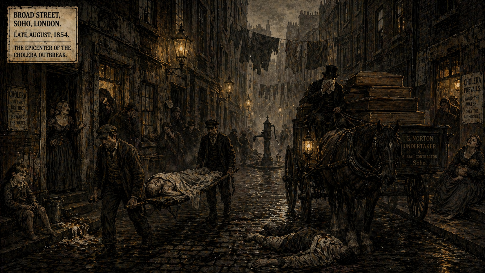

Image Prompt

(This is panel 4.  Do not put the panel number in the image.) Please generate a 16:9 image in a Victorian London art style — dark, atmospheric, Dickensian — depicting panel 4 of 12. Make the characters and style consistent with the prior panel. The scene shows Broad Street, Soho, London, late August 1854 — the epicenter of the worst cholera outbreak in the city's history. The narrow, cobblestoned street is a scene of nightmarish chaos. Bodies are being carried out of doorways on makeshift stretchers. A horse-drawn death cart loaded with plain wooden coffins moves slowly down the street, its driver covering his face with a rag. Women wail in doorways; a child sits alone on a stoop beside a bucket of vomit. The buildings are tall, grimy Georgian tenements pressing in on both sides, laundry hanging between them. A thick yellow-gray fog hangs over everything. In the middle distance, partially obscured by fog, the Broad Street pump is visible — an ordinary cast-iron street pump with a long handle, unremarkable, innocent-looking. Color palette: sickly yellow-green fog, coal-gray buildings, death-cart black, corpse-pale white, gas-lamp amber pools. Emotional tone: apocalyptic urban horror — a neighborhood dying in real time. Specific details: (1) bodies being carried on stretchers from doorways, (2) the horse-drawn death cart with stacked coffins, (3) a woman collapsing in a doorway, (4) the Broad Street pump standing quietly in the middle distance, (5) a terrified child sitting alone, (6) the claustrophobic, canyon-like street of tall tenements with the sky barely visible above. Generate the image immediately without asking clarifying questions.

On the night of August 31, 1854, cholera exploded in Soho with a violence that shocked even a city accustomed to epidemics. In the cramped blocks surrounding Broad Street, 127 people died in the first three days. By the end of the first week, three-quarters of the residents had fled in terror, and the bodies of those who could not flee were stacking up faster than the death carts could carry them away. The smell was indescribable — but that was exactly the problem. To the miasma doctors, the smell *was* the explanation. Of course cholera was raging here — could you not smell the pestilence in the air? The worse the stench, the worse the disease. Case closed. But John Snow, who lived just blocks away on Sackville Street, heard about the outbreak and reached for his notebook. He did not reach for lavender or vinegar. He reached for data.

## Panel 5: The Investigation

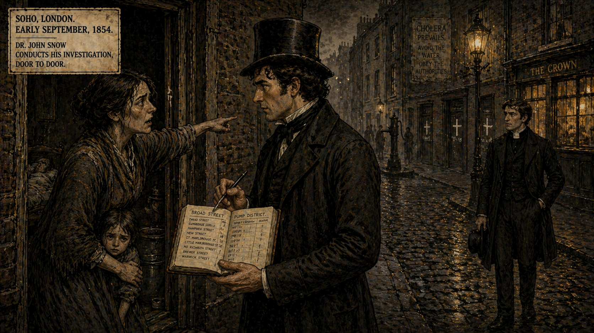

Image Prompt

(This is panel 5.  Do not put the panel number in the image.) Please generate a 16:9 image in a Victorian London art style — dark, atmospheric, Dickensian — depicting panel 5 of 12. Make the characters and style consistent with the prior panel. The scene shows Dr. John Snow going door to door on the streets of Soho in early September 1854, conducting his investigation. Snow stands at the threshold of a working-class tenement, wearing his dark Victorian frock coat and top hat, his leather-bound notebook open in one hand, a pen in the other, interviewing a haggard, grief-stricken woman in a shawl who leans against the doorframe. Behind her, the dark interior of the dwelling is visible — a sickbed, a child clinging to the woman's skirt. Snow's expression is compassionate but intensely focused — he is recording every detail. Further down the street, other doors are marked with chalk crosses indicating cholera deaths. A local Reverend Henry Whitehead, a young Anglican clergyman in a clerical collar, watches Snow from across the street with curious interest. Color palette: slate-gray cobblestones, sooty brown buildings, amber gaslight from a pub window, Snow's dark coat contrasted against pale fog. Emotional tone: the detective at work — methodical, relentless, humane. Specific details: (1) Snow's notebook open with tally marks and addresses visible, (2) the grieving woman pointing down the street toward the pump, (3) chalk crosses on doors marking cholera houses, (4) the young Reverend Whitehead observing from across the street, (5) a water bucket visible inside the doorway, (6) Snow's top hat slightly askew — he has been at this for hours. Generate the image immediately without asking clarifying questions.

Snow walked into the killing zone. While other doctors fumigated from a safe distance, Snow knocked on doors. At every house that had suffered a cholera death, he asked the same questions: Where did you get your drinking water? Which pump did you use? When did the symptoms begin? He talked to the grief-shattered, the terrified, the dying. He talked to publicans and shopkeepers and street vendors. He recorded every answer in his notebook with the meticulous precision of a man building a case. The Reverend Henry Whitehead, the young curate of St. Luke's Church who knew every family in the parish, initially thought Snow's water theory was nonsense — but he joined the investigation out of curiosity and a desire to help his flock. Whitehead would become Snow's most important ally, because Whitehead knew things about the neighborhood that no outsider could.

## Panel 6: The Dot Map

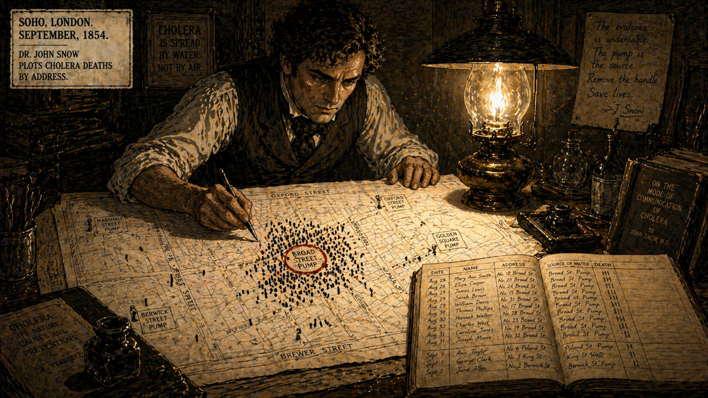

Image Prompt

(This is panel 6.  Do not put the panel number in the image.) Please generate a 16:9 image in a Victorian London art style — dark, atmospheric, Dickensian — depicting panel 6 of 12. Make the characters and style consistent with the prior panel. The scene shows John Snow in his study, leaning over a large street map of Soho spread across his desk. The map is illuminated by a bright gas lamp directly above, making it the brightest element in the scene — a pool of clarity in the surrounding darkness. Snow is carefully placing small black rectangular marks (representing deaths) on the map with a pen, each mark positioned at the address of a cholera victim. The pattern is unmistakable: the marks cluster in a dense, terrifying constellation around one point — the Broad Street pump, which Snow has circled in red ink. On the edges of the map, where other pumps are marked, there are almost no death marks at all. Snow's expression is one of grim confirmation — he knows what this means. Beside the map, his notebook lies open with columns of names, addresses, and water sources. Color palette: stark white map paper under bright gaslight, deep brown and black shadows everywhere else, red ink circle around the pump, black ink death marks. Emotional tone: the eureka moment — data revealing a pattern that was invisible without visualization. Specific details: (1) the dense cluster of death marks around the Broad Street pump, (2) the red circle marking the pump location, (3) other pump locations marked but with far fewer deaths, (4) Snow's hand placing another mark with deliberate precision, (5) the notebook beside the map with tallied data, (6) the bright lamp making the map glow like a revelation against the dark room. Generate the image immediately without asking clarifying questions.

The map changed everything. Snow obtained a detailed street map of Soho and began plotting every cholera death as a small black bar at the address where the victim had lived. As the marks accumulated, a pattern emerged that was impossible to ignore. The deaths were not scattered randomly across the neighborhood. They were not concentrated along the most foul-smelling streets or near the largest cesspools. They clustered, with terrifying density, around a single point: the water pump at the intersection of Broad Street and Cambridge Street. At addresses near the pump, nearly every household had lost someone. At addresses just a few blocks away — closer to different pumps — the death rate plummeted to almost nothing. The map was not just data. It was a picture of an invisible killer, caught in the act. Snow had invented something that did not yet have a name: spatial epidemiology.

## Panel 7: The Hampstead Widow

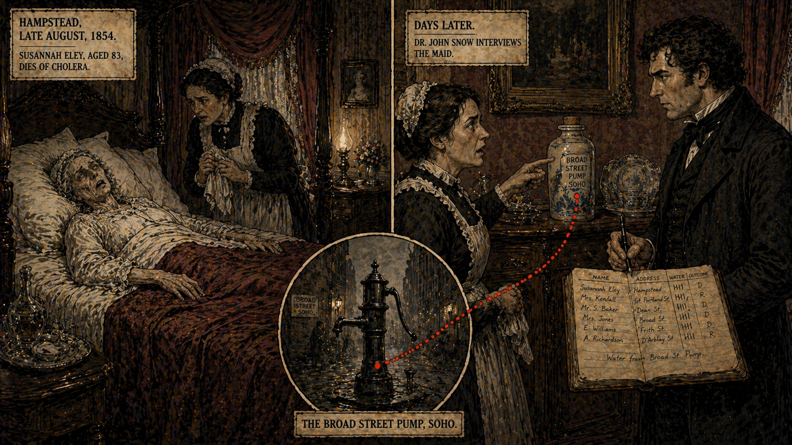

Image Prompt

(This is panel 7.  Do not put the panel number in the image.) Please generate a 16:9 image in a Victorian London art style — dark, atmospheric, Dickensian — depicting panel 7 of 12. Make the characters and style consistent with the prior panel. The scene is a split composition. On the left side: a comfortable parlor in Hampstead, a wealthy suburb miles from Soho, where an elderly widow, Susannah Eley, lies dying of cholera in a four-poster bed. Her maid stands at the bedside wringing her hands. The room is well-furnished — lace curtains, polished mahogany, china ornaments — a stark contrast to the Soho slums. On the right side: John Snow stands in the same parlor days later, interviewing the maid, his notebook open. The maid points to a large ceramic water bottle on a sideboard — the bottle that held water delivered daily from the Broad Street pump, because the old widow preferred its taste. A visual line — a thin red dotted trail — connects the water bottle across the split to a small inset image of the Broad Street pump in Soho. Color palette: the Hampstead side in warm, wealthy burgundy, cream, and polished wood; the connecting visual element in stark red against fog gray. Emotional tone: the detective's crucial breakthrough — the impossible case that proves the theory. Specific details: (1) the dying widow in her wealthy bed — cholera does not respect class when the water connects, (2) the ceramic water bottle on the sideboard, (3) Snow's expression of intense focus as he listens to the maid, (4) the maid pointing at the water bottle, (5) the red dotted line connecting the bottle to the Broad Street pump, (6) the contrast between Hampstead wealth and Soho squalor. Generate the image immediately without asking clarifying questions.

Then came the case that sealed the argument. An elderly widow named Susannah Eley died of cholera in Hampstead — a clean, prosperous suburb five miles from Soho. She had not visited Soho. She had no contact with anyone who had. By the miasma theory, she should have been perfectly safe; the air in Hampstead was fresh and sweet. Snow investigated and discovered something extraordinary: Mrs. Eley had once lived on Broad Street and had always preferred the taste of its pump water. Every day, a cart delivered a large bottle of Broad Street pump water to her Hampstead home. Her niece, who shared the water, also died. No one else in their Hampstead neighborhood fell ill. The water had carried cholera five miles across London, to a woman who drank it for no reason other than habit and taste. If cholera were in the air, this case was impossible. If cholera were in the water, this case was proof.

## Panel 8: The Pump Handle

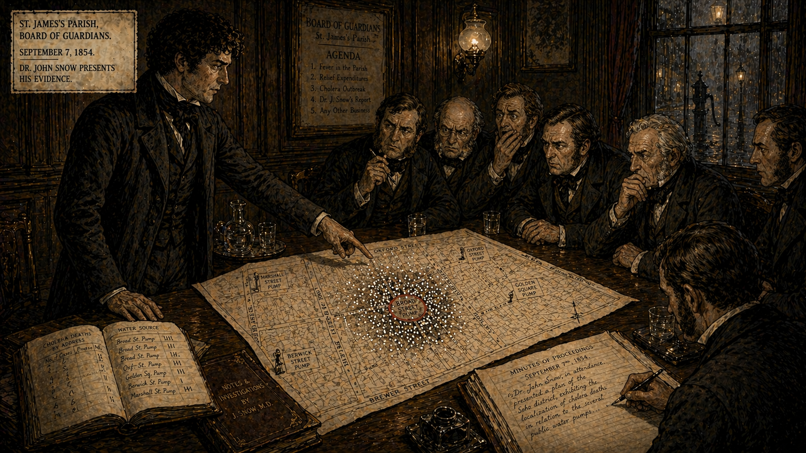

Image Prompt

(This is panel 8.  Do not put the panel number in the image.) Please generate a 16:9 image in a Victorian London art style — dark, atmospheric, Dickensian — depicting panel 8 of 12. Make the characters and style consistent with the prior panel. The scene shows the most famous moment in the history of public health: the meeting of the Board of Guardians of St. James's Parish, September 7, 1854. The setting is a wood-paneled vestry room with a long oak table. John Snow stands at one end, his frock coat buttoned, his famous dot map unrolled on the table before the board members. He points to the cluster of deaths around the Broad Street pump with calm, measured authority. The board members — middle-aged Victorian gentlemen in mutton-chop whiskers and dark suits — lean forward, examining the map with expressions ranging from alarm to reluctant conviction. One board member has his hand over his mouth in shock. At the far end of the table, a clerk takes minutes. Through the window, the gas-lit street outside is visible, with the silhouette of the Broad Street pump just discernible in the fog. Color palette: dark mahogany paneling, cream map paper, amber gas-lamp glow, institutional dark green, the white dots on the map standing out starkly. Emotional tone: the moment of persuasion — data compelling action from reluctant authority. Specific details: (1) Snow's dot map spread on the table as the centerpiece of the scene, (2) Snow's confident, restrained posture — letting the data speak, (3) the board members' varied reactions — shock, doubt, dawning realization, (4) the clerk recording the proceedings, (5) through the window, the silhouette of the pump, (6) Snow's leather notebook beside the map, open to supporting data. Generate the image immediately without asking clarifying questions.

On September 7, 1854, Snow brought his map to the Board of Guardians of St. James's Parish. He did not grandstand. He did not attack the miasma theory. He simply unrolled the map, pointed to the cluster, and presented his evidence: the addresses, the death counts, the water sources, the Hampstead widow, the brewery workers who drank beer instead of water and were untouched, the workhouse with its own private well that had almost no deaths despite being in the heart of the outbreak zone. The board members were not scientists. They were local officials watching their parish die. They did not need to understand germ theory. They needed to understand the map. After deliberation, they voted to remove the handle of the Broad Street pump. The next morning, a workman unbolted it. The most famous public health intervention in history was an act of subtraction — taking away a pump handle.

## Panel 9: The Epidemic Fades

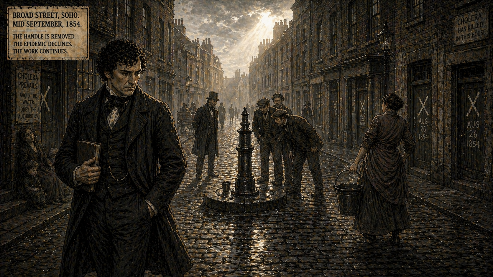

Image Prompt

(This is panel 9.  Do not put the panel number in the image.) Please generate a 16:9 image in a Victorian London art style — dark, atmospheric, Dickensian — depicting panel 9 of 12. Make the characters and style consistent with the prior panel. The scene shows the Broad Street pump in the days after the handle was removed. The pump stands in the middle of the cobblestoned street, its handle conspicuously absent — a metal stump where the handle was. A few curious neighbors gather around it, peering at the disabled pump. A woman who had been approaching with a bucket sees the missing handle and turns away. The street is quieter now — still grim, still marked by chalk crosses on doors, but the frantic pace of death has slowed. In the foreground, John Snow walks away from the pump toward the viewer, his notebook under his arm, his expression not triumphant but thoughtful and sober. He knows the epidemic was already declining before the handle was removed — the evidence is more complicated than a simple before-and-after story. A thin ray of watery sunlight breaks through the fog for the first time in the series. Color palette: the same coal grays and browns, but slightly lighter — the fog beginning to thin, a hint of pale blue sky, weak sunlight on wet cobblestones. Emotional tone: qualified hope — the worst is over, but the real battle is just beginning. Specific details: (1) the pump with its handle missing — the central, iconic image, (2) curious neighbors examining the disabled pump, (3) the woman turning away with her empty bucket, (4) Snow walking away, thoughtful rather than triumphant, (5) chalk crosses still visible on doors, (6) the first break of sunlight through the fog. Generate the image immediately without asking clarifying questions.

Snow was an honest scientist, and he knew the truth was complicated. The epidemic had already begun to decline before the pump handle was removed — largely because so many residents had fled the neighborhood. Removing the handle did not dramatically stop the outbreak in real time. But Snow's investigation did something more important than stopping one epidemic. It produced the first rigorous, data-driven demonstration that cholera was waterborne. The Reverend Whitehead, who had initially been skeptical, continued investigating and found the final piece of the puzzle: a cesspool at 40 Broad Street, just three feet from the well that fed the pump, had been contaminated by the infected diaper washings of a baby who had fallen ill with cholera before the main outbreak began. The cesspool had leaked into the well. The well had fed the pump. The pump had killed the neighborhood.

## Panel 10: The Grand Experiment

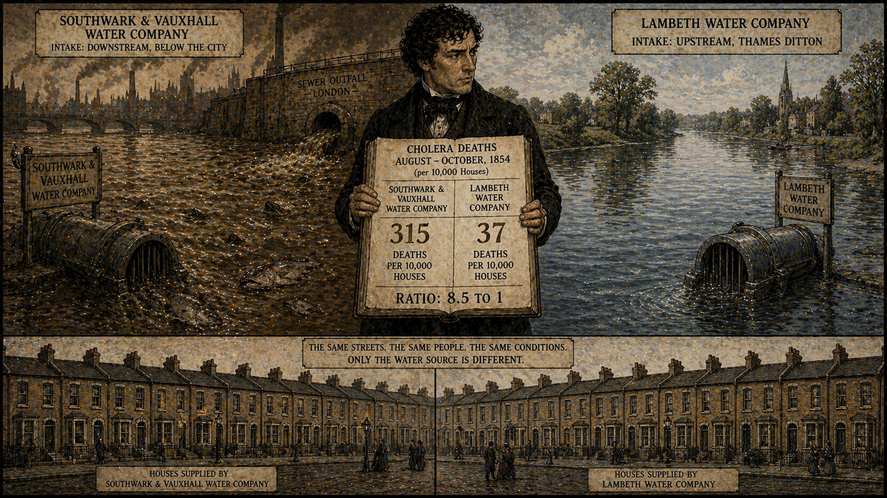

Image Prompt

(This is panel 10.  Do not put the panel number in the image.) Please generate a 16:9 image in a Victorian London art style — dark, atmospheric, Dickensian — depicting panel 10 of 12. Make the characters and style consistent with the prior panel. The scene shows a split composition representing Snow's "Grand Experiment" comparing two London water companies. On the left side: the Southwark and Vauxhall Water Company's intake pipe, plunging into the filthy Thames downstream of London's sewer outfalls. The water is brown, viscous, choked with sewage. A company sign is visible. Dead fish float near the intake. On the right side: the Lambeth Water Company's intake, relocated upstream to Thames Ditton, drawing from comparatively cleaner water above the city. Between the two halves, Snow stands with a large ledger showing two columns of numbers — the cholera death rates for households served by each company. The Southwark column shows 315 deaths per 10,000 houses; the Lambeth column shows 37. The ratio is unmistakable. Below both images, a row of identical London terrace houses stretches across the frame — the same streets, the same neighborhoods, the same class of residents, served by different water companies with eight times the difference in death rates. Color palette: on the Southwark side, foul brown water, sickly yellow-green; on the Lambeth side, clearer blue-gray water; Snow's ledger in stark black and white. Emotional tone: the elegance of a natural experiment — the same population, the same conditions, one variable changed. Specific details: (1) the filthy Thames water at the Southwark intake, (2) the cleaner water at the Lambeth intake upstream, (3) Snow's ledger with the stark numerical comparison, (4) the row of identical houses below — same streets, different water, (5) a sewer outfall pipe dumping waste between the two intakes, (6) Snow's expression of controlled satisfaction at the clarity of the evidence. Generate the image immediately without asking clarifying questions.

The Broad Street investigation was dramatic, but Snow's most scientifically powerful evidence came from an even more elegant study. In South London, two water companies — the Southwark and Vauxhall Company and the Lambeth Company — supplied water to houses on the same streets, in the same neighborhoods, to residents of the same social class. The only difference was where they drew their water. Southwark and Vauxhall drew from the Thames downstream of London's sewage outfalls. Lambeth had recently moved its intake upstream, above the sewage. Snow went door to door through South London, determined which company supplied each house, and counted the cholera deaths. The results were devastating. Households supplied by Southwark and Vauxhall — drinking sewage-contaminated water — had a cholera death rate eight times higher than those supplied by Lambeth. Same streets. Same air. Same miasma. Eight times the death rate. The only difference was the water.

## Panel 11: The Establishment Resists

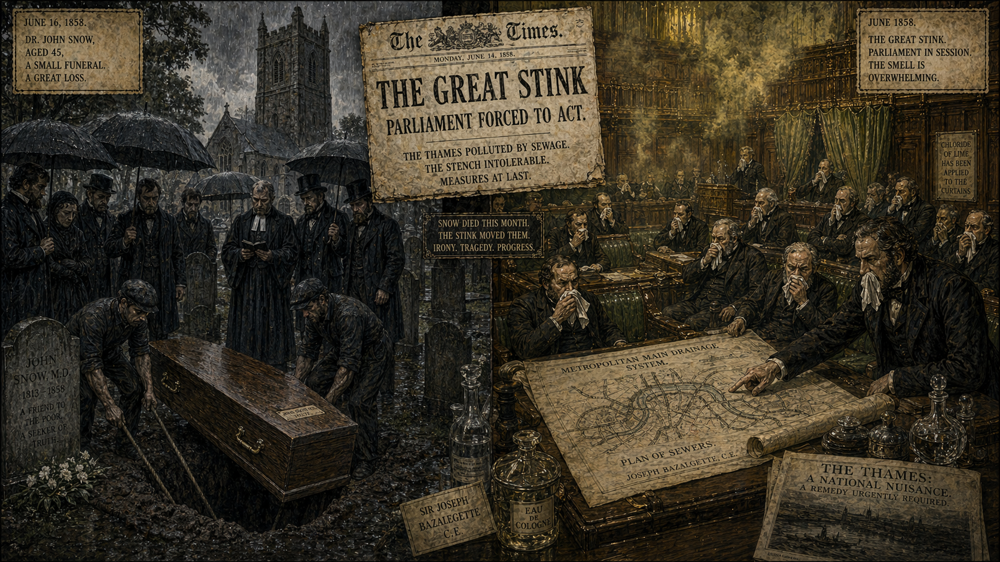

Image Prompt

(This is panel 11.  Do not put the panel number in the image.) Please generate a 16:9 image in a Victorian London art style — dark, atmospheric, Dickensian — depicting panel 11 of 12. Make the characters and style consistent with the prior panel. The scene shows two moments in time connected across the frame. On the left: John Snow's modest funeral in June 1858 — a small group of mourners at a churchyard, Snow's plain coffin being lowered into the ground. Snow has died at just 45, worn out from overwork. Only a handful of colleagues attend. The scene is somber, understated, almost neglected. On the right, taking place simultaneously: the Great Stink of 1858 — Parliament in session as the overwhelming stench of the Thames forces MPs to hold perfumed handkerchiefs to their faces. The curtains of the House of Commons are soaked in chloride of lime but the smell is still unbearable. A newspaper headline reads "THE GREAT STINK — Parliament Forced to Act." Joseph Bazalgette's sewer plans are unrolled on a table. The irony is visual: the miasma theory finally forces action on water sanitation — Snow was right, but London built the sewers for the wrong reason. Color palette: funeral side in muted grays and blacks with rain; Parliament side in sickly yellow-green haze, mahogany paneling, white handkerchiefs. Emotional tone: the bitter irony of delayed vindication — a prophet unrecognized in his own time. Specific details: (1) Snow's small, modest funeral with few mourners, (2) Snow's coffin — plain, simple, befitting a man who cared nothing for status, (3) across the frame, Parliament overwhelmed by the Great Stink, (4) MPs holding perfumed handkerchiefs, (5) Bazalgette's sewer engineering plans visible, (6) the newspaper headline connecting the two events — Snow died the same month the Great Stink forced Parliament to act. Generate the image immediately without asking clarifying questions.

John Snow died on June 16, 1858, at the age of forty-five — likely from a stroke brought on by years of overwork. He died believing that his water theory had been proven beyond reasonable doubt. The medical establishment disagreed. The Board of Health had officially rejected Snow's findings in 1855, declaring that the Broad Street outbreak was caused by miasma from the foul-smelling sewers of Soho. The *Lancet*, the most prestigious medical journal in Britain, dismissed Snow's work. The miasma theory was too deeply entrenched, too comforting, too aligned with the prejudices of powerful men. But in a bitter irony, the very month Snow died, the Great Stink descended on London — the Thames became so overwhelmingly foul in the summer heat that Parliament could not function. The MPs, holding perfumed handkerchiefs to their faces, finally authorized Joseph Bazalgette's massive sewer construction project. They built the sewers to fix the smell. But by separating sewage from drinking water, they fixed the cholera too. Snow was right, even if London acted for the wrong reasons.

## Panel 12: The Legacy

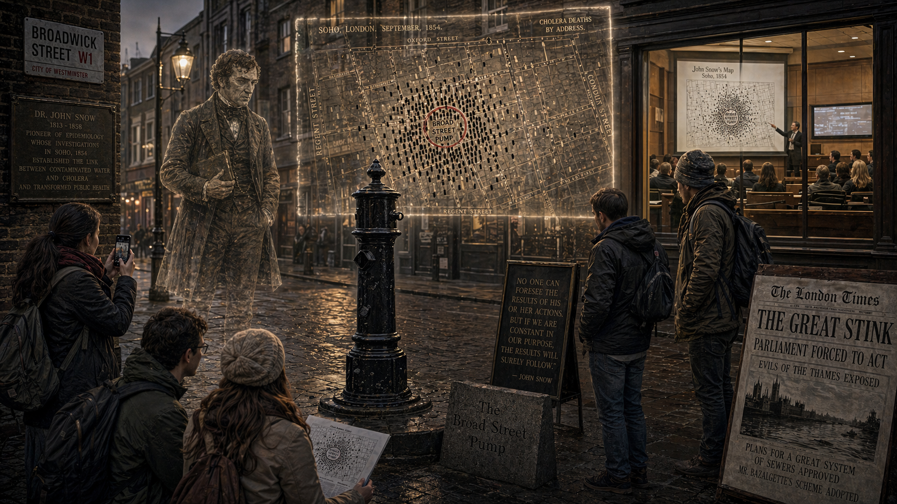

Image Prompt

(This is panel 12.  Do not put the panel number in the image.) Please generate a 16:9 image in a Victorian London art style — dark, atmospheric, Dickensian — depicting panel 12 of 12. Make the characters and style consistent with the prior panel. The scene shows a modern tribute layered over Victorian Soho. In the foreground, the John Snow memorial pump — a replica of the Broad Street pump with no handle, installed as a monument — stands on the corner of what is now Broadwick Street, London. A granite kerbstone marker nearby reads "The Broad Street Pump." Behind and above the pump, a ghostly, translucent overlay shows Snow's original 1854 dot map floating in the air like a hologram — the black bars of death still clustering around this very spot. Modern public health students and tourists gather around the pump, some taking photos, some studying the map overlay with academic intensity. In the background, a university lecture hall is visible through a window where a modern epidemiologist projects Snow's map on a screen for a class. The ghost of John Snow — translucent, in his dark frock coat and top hat, notebook in hand — stands behind the pump, observing the scene with quiet satisfaction. Color palette: the modern street in muted contemporary colors; the ghostly overlay in the Victorian browns, yellows, and grays of the earlier panels; Snow's ghost in translucent sepia. Emotional tone: legacy and continuity — one man's careful counting saved millions and built an entire science. Specific details: (1) the memorial pump with its absent handle, (2) the granite kerbstone marker, (3) Snow's translucent dot map floating like a hologram, (4) modern students studying the map, (5) the university lecture hall in the background, (6) Snow's ghost — quiet, observant, notebook in hand — exactly as he was in life. Generate the image immediately without asking clarifying questions.

Today, the John Snow memorial pump stands on Broadwick Street in Soho — a replica with no handle, marking the spot where epidemiology was born. The original pump is gone, but the ghost map endures. It is taught in every public health course on Earth. It appears in every textbook on data visualization. It demonstrated, for the first time, that plotting data on a map could reveal a cause of disease that was invisible to the naked eye and to the theories of the most learned physicians in the world. Snow is now recognized as the father of modern epidemiology — the science of tracking diseases through populations to identify causes and prevent outbreaks. Every time a public health team maps an outbreak, every time an epidemiologist traces a disease to its source, every time a data visualization reveals a pattern that saves lives, they are walking in the footsteps of a coal miner's son who believed that counting matters, that maps don't lie, and that water — the most ordinary substance on Earth — can carry death or life depending on whether anyone bothers to look.

### Epilogue -- What Made John Snow Different?

Snow was not the only doctor in London. He was not the most famous or the best-connected. What made him different was a combination of qualities that are as rare today as they were in 1854: the willingness to question a theory that everyone else accepted, the discipline to gather systematic evidence rather than rely on intuition, and the imagination to visualize data in a way that made the invisible visible. He did not have a microscope powerful enough to see the cholera bacterium — *Vibrio cholerae* would not be conclusively identified until 1884 by Robert Koch. Snow did not need to see the killer. He needed to see the pattern. And the pattern was in the map.

| Challenge | How Snow Responded | Lesson for Today |
|-----------|-------------------|------------------|
| The medical establishment was committed to miasma theory | Used logic: cholera attacks the gut, not the lungs — it must be swallowed, not inhaled | When the dominant theory doesn't fit the symptoms, question the theory, not the symptoms |
| No technology to identify the cholera bacterium | Mapped the pattern of deaths instead — spatial data revealed what microscopes could not | You don't always need to understand the mechanism to identify the cause |
| The Broad Street pump looked clean and tasted fine | Traced the cesspool contamination underground and tracked distant cases back to the pump | Invisible contamination is the most dangerous kind — test the water, don't just taste it |
| The establishment rejected his findings even after the evidence | Kept gathering more data (the Grand Experiment) and published everything | When authority rejects evidence, produce more evidence — and make it public |

### Call to Action

John Snow's story is not just a historical curiosity — it is a blueprint for how environmental health investigations work today. When communities suspect their water is making them sick, the first step is always the same: map the cases, identify the source, follow the water. The tools have improved enormously since 1854 — geographic information systems, genetic sequencing, satellite imagery — but the logic is identical. Right now, communities around the world face water contamination from industrial chemicals, agricultural runoff, aging infrastructure, and inadequate sewage treatment. The question Snow asked in 1854 — *Is it in the water?* — is still being asked in Flint, Michigan, in rural India, in coastal communities after hurricanes. The next time someone tells you the water is safe, remember Snow's lesson: safe for whom? Tested by whom? Compared to what? A coal miner's son with a notebook and a street map changed the world because he refused to accept a comfortable theory when the data told a different story. The data is still out there, waiting to be mapped.

---

*"The most terrible outbreak of cholera which ever occurred in this kingdom is probably that which took place in Broad Street and the adjoining streets, a few weeks ago."*
—John Snow, 1854

*"I found that nearly all the deaths had taken place within a short distance of the pump."*
—John Snow, *On the Mode of Communication of Cholera*, 1855

*"In consequence of what I said, the handle of the pump was removed on the following day."*
—John Snow, describing the events of September 7-8, 1854

---

## References

1. [Wikipedia: John Snow](https://en.wikipedia.org/wiki/John_Snow) - Biography of the physician who traced cholera to contaminated water and is considered the father of modern epidemiology
2. [Wikipedia: 1854 Broad Street cholera outbreak](https://en.wikipedia.org/wiki/1854_Broad_Street_cholera_outbreak) - Detailed account of the Soho cholera outbreak, Snow's investigation, and the removal of the pump handle
3. [Wikipedia: Miasma theory](https://en.wikipedia.org/wiki/Miasma_theory) - The pre-germ-theory belief that diseases were caused by noxious air from decomposing matter
4. [UCLA Department of Epidemiology: John Snow](https://www.ph.ucla.edu/epi/snow.html) - Academic resource on Snow's contributions to epidemiology, including interactive versions of his original maps
5. [Encyclopaedia Britannica: John Snow](https://www.britannica.com/biography/John-Snow-British-physician) - Reference overview of Snow's life, medical career, and lasting public health legacy
