# The Miracle That Became a Warning

Cover Image Prompt

Please generate a wide-landscape 16:9 cover image for a graphic novel titled "The Miracle That Became a Warning" in a style that blends 1940s propaganda-poster optimism with emerging 1960s unease. The image is split diagonally: the left half is bright and heroic, showing a white powder being dusted over grateful crowds under a brilliant blue sky; the right half is muted and ominous, showing a cracked eagle egg on a barren branch against a sickly yellow-green sky. In the center stands Paul Hermann Muller, a neat Swiss chemist in his late 40s with round wire-rimmed glasses, a receding hairline, a trim mustache, and a crisp white lab coat, holding a glass flask of white crystalline powder. He looks directly at the viewer with a complicated expression — pride and dawning uncertainty. The title text "The Miracle That Became a Warning" is rendered in bold sans-serif typeface at the top, reminiscent of mid-century Swiss poster design. Color palette: the left side uses bold primary reds, blues, and whites; the right side uses muted olive greens, grays, and pale sickly yellows. Emotional tone: triumph fracturing into doubt. Include: (1) Muller's round glasses reflecting the two contrasting scenes, (2) a DDT molecular structure faintly visible in the background, (3) a healthy bald eagle soaring on the left side and a thin-shelled broken egg on the right, (4) 1940s soldiers and children cheering on the left, (5) dead fish floating in a stream on the right, (6) the Geigy chemical company logo on Muller's lab coat pocket. Generate the image immediately without asking clarifying questions.

Narrative Prompt

This is a 12-panel graphic novel about Paul Hermann Muller (1899-1965), the Swiss chemist who won the 1948 Nobel Prize in Physiology or Medicine for discovering that DDT kills insects on contact. The story traces the arc from humanitarian triumph to ecological catastrophe — not because Muller was wrong, but because nobody asked what would happen next. The art style begins as bright 1940s propaganda-poster aesthetic (bold primary colors, heroic compositions, Norman Rockwell optimism) and gradually shifts to darker, more complex tones (muted greens, sickly yellows, grays) as the unintended consequences emerge, ending in the visual register of Rachel Carson's warnings. Muller should be drawn consistently across panels: a neat Swiss man with round wire-rimmed glasses, a receding hairline with some remaining dark hair, a small trim mustache, and a white lab coat. He has a modest, scholarly bearing — more craftsman than celebrity. Central ecology theme: unintended consequences, bioaccumulation, biomagnification, insect resistance, and the critical importance of systems thinking. The story emphasizes that the lesson is not "pesticides are evil" but "always ask what happens next."

### Prologue -- The Best Intentions

In the 1930s, the world was losing a war it barely knew it was fighting. Malaria killed more than two million people a year, most of them children. Typhus ravaged armies and refugee camps. Crop-eating insects devoured harvests across Asia, Africa, and Latin America. The insecticides available were either too weak, too expensive, or too poisonous to humans. What the world needed was a miracle — a cheap, effective compound that killed insects and left people unharmed. A quiet Swiss chemist named Paul Hermann Muller found exactly that. The miracle worked. And then, because no one asked what would happen next, the miracle became one of the greatest cautionary tales in the history of science.

## Panel 1: The Search Begins

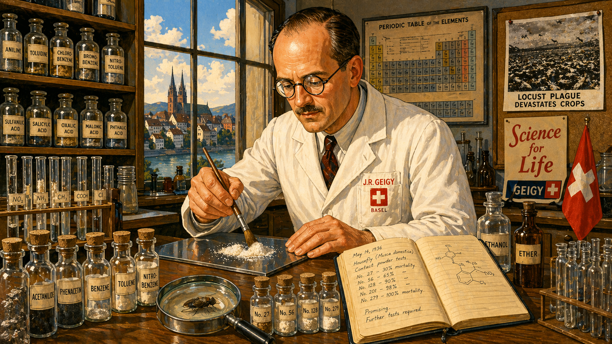

Image Prompt

(This is panel 1.  Do not put the panel number in the image.) I am about to ask you to generate a series of images for a graphic novel. Please make the images have a consistent style and consistent characters. Do not ask any clarifying questions. Just generate the image immediately when asked.

Please generate a 16:9 image in bright 1940s propaganda-poster style with bold primary colors depicting panel 1 of 12. The scene shows a modest chemistry laboratory at the J.R. Geigy company in Basel, Switzerland, in the mid-1930s. Paul Hermann Muller, a neat man in his late 30s with round wire-rimmed glasses, a receding hairline, a small trim mustache, and a white lab coat, stands at a long wooden bench covered with hundreds of labeled glass vials and test tubes. He is carefully brushing a white powder onto a glass plate. A window behind him shows the rooftops of Basel and the Rhine River. The color palette is warm amber, laboratory white, polished wood brown, and Swiss-flag red accents. Emotional tone: determined optimism and methodical patience. Include: (1) rows of neatly labeled chemical compounds on shelves, (2) a dead housefly under a magnifying glass on the bench, (3) a notebook open to a page of meticulous handwritten notes, (4) a periodic table poster on the wall, (5) a framed photograph of farmland devastated by locusts pinned to a corkboard, (6) Muller's careful, focused expression as he works alone. Generate the image immediately without asking clarifying questions.

Paul Hermann Muller was not a glamorous scientist. He was a careful one. Working alone in a basement laboratory at the J.R. Geigy chemical company in Basel, Switzerland, he had set himself a seemingly impossible task: find a compound that killed insects quickly, lasted a long time, was cheap to manufacture, and did not harm humans or plants. By the mid-1930s, he had tested over three hundred compounds and failed every time. But Muller was Swiss in the best sense of the word — patient, precise, and unwilling to cut corners. He kept testing.

## Panel 2: The Discovery

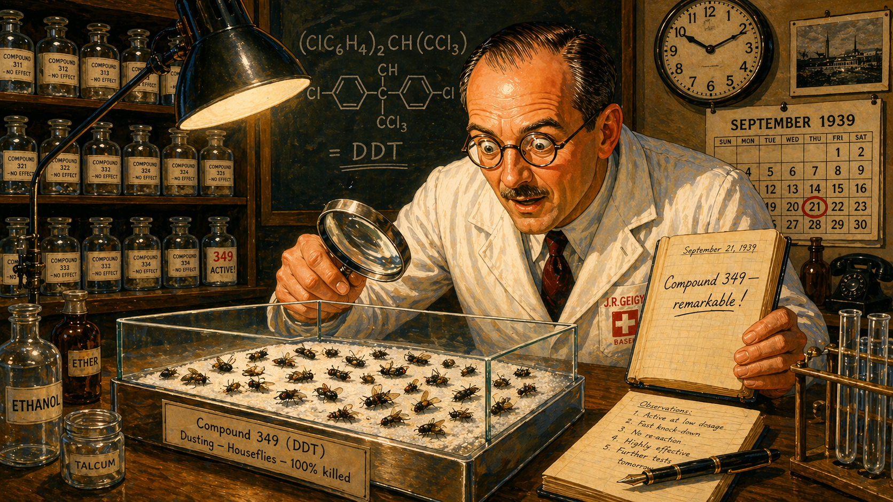

Image Prompt

(This is panel 2.  Do not put the panel number in the image.) Please generate a 16:9 image in bright 1940s propaganda-poster style with bold primary colors depicting panel 2 of 12. Make the characters and style consistent with the prior panel. The scene shows Paul Muller in his Basel laboratory in September 1939, leaning forward with wide eyes and an expression of astonished excitement. On the glass plate before him, dozens of houseflies lie dead after a single dusting of a white crystalline powder. He holds a magnifying glass in one hand and a notebook in the other. A calendar on the wall shows September 1939. The color palette is bright laboratory white, vivid amber, clean blue, and the gleaming white of the DDT powder. Emotional tone: the electric moment of discovery. Include: (1) the glass test chamber with dead flies clearly visible, (2) a chemical formula written on a chalkboard behind him (ClC6H4)2CH(CCl3), (3) his notebook open to a page where he has written "Compound 349 — remarkable!", (4) clean rows of previously tested and rejected compounds on the shelf, (5) a clock showing late evening, (6) a single desk lamp illuminating the scene with dramatic light. Generate the image immediately without asking clarifying questions.

On his 349th attempt, Muller dusted a glass chamber with a white crystalline compound called dichlorodiphenyltrichloroethane — DDT. The flies died. He cleaned the chamber and put in new flies. They died too. He cleaned it again. Still lethal. The compound kept killing insects for weeks after a single application. Muller stared at the glass plate and understood he was looking at something that had never existed before: an insecticide that was cheap, stable, long-lasting, and — as far as anyone could tell — harmless to mammals. He had found his miracle.

## Panel 3: The War Against Typhus

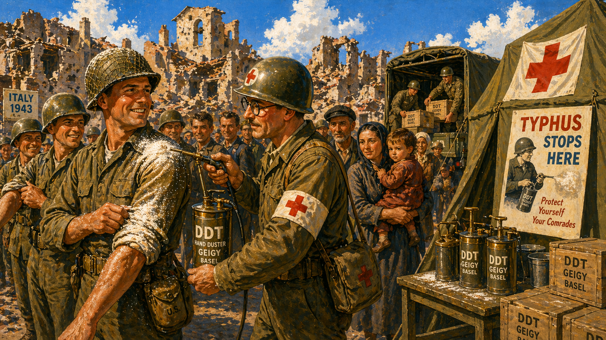

Image Prompt

(This is panel 3.  Do not put the panel number in the image.) Please generate a 16:9 image in heroic 1940s wartime propaganda-poster style depicting panel 3 of 12. Make the characters and style consistent with the prior panels. The scene shows Allied military medics in 1943 Italy dusting DDT powder onto a long line of soldiers and civilian refugees. A medic holds a hand-pump duster and applies white powder to a grateful soldier's collar and sleeves. Behind them, a bombed-out Italian village is visible. The color palette is bold military olive green, stark white DDT powder, warm skin tones, and a brilliant blue sky suggesting hope. Emotional tone: wartime heroism and relief. Include: (1) the hand-pump DDT dusters clearly visible, (2) soldiers rolling up their sleeves for treatment, (3) a Red Cross flag on a tent in the background, (4) crates stenciled "DDT — GEIGY — BASEL" being unloaded from a military truck, (5) a mother holding a child waiting in line, (6) a poster on the tent reading "TYPHUS STOPS HERE." Generate the image immediately without asking clarifying questions.

When World War II reached Naples in 1943, typhus was killing more people than bombs. The disease spread by body lice, and the refugee camps were infested. Allied military authorities dusted more than a million civilians with DDT powder in January 1944 alone. For the first time in history, a typhus epidemic was stopped in its tracks. Soldiers on every front were dusted before deployment. The lice died. The soldiers lived. Word spread through the military like the powder itself: DDT was a weapon that saved lives instead of taking them.

## Panel 4: The Tropical Triumph

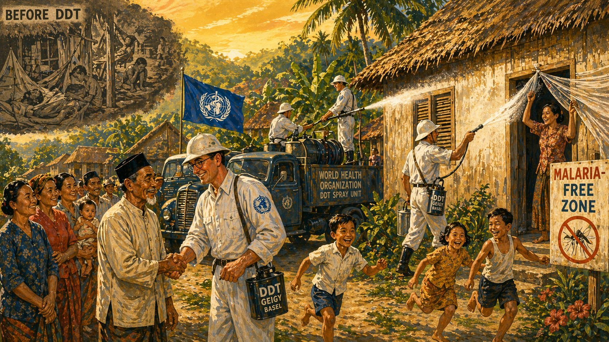

Image Prompt

(This is panel 4.  Do not put the panel number in the image.) Please generate a 16:9 image in bright, optimistic 1940s-style illustration depicting panel 4 of 12. Make the characters and style consistent with the prior panels. The scene shows a post-war tropical village in Southeast Asia, circa 1946, being sprayed with DDT by a World Health Organization team. Workers in white uniforms operate truck-mounted sprayers, coating the walls of thatched-roof homes with DDT. Villagers watch with expressions of hope and gratitude. The color palette is lush tropical green, brilliant white spray, warm earth tones, and a golden sunset. Emotional tone: salvation and gratitude. Include: (1) a WHO flag on the spray truck, (2) mosquito netting being taken down from a doorway (no longer needed), (3) a village elder shaking hands with a health worker, (4) children playing freely outside for the first time, (5) a hand-painted sign reading "MALARIA-FREE ZONE", (6) a dramatic before/after contrast — one side of the village looks vibrant while a faded background shows sick people in hammocks. Generate the image immediately without asking clarifying questions.

After the war, DDT was deployed against humanity's oldest killer. Malaria had claimed millions of lives every year for centuries, spread by mosquitoes that bred in tropical waters. Now those mosquitoes could be exterminated cheaply. Sri Lanka's malaria cases dropped from 2.8 million in 1948 to just 17 in 1963. India, Greece, Italy, and dozens of other nations saw similar collapses. Children who would have died of fever grew up healthy. Entire regions that had been uninhabitable were opened to farming and settlement. DDT was not just a chemical — it was hope in a white powder.

## Panel 5: The Nobel Prize

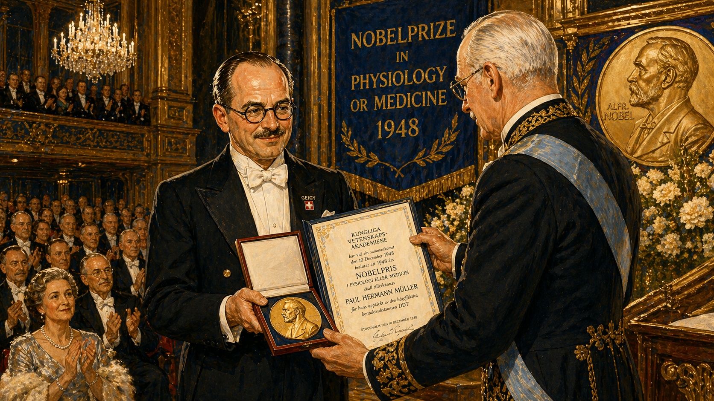

Image Prompt

(This is panel 5.  Do not put the panel number in the image.) Please generate a 16:9 image in elegant 1940s formal portrait style depicting panel 5 of 12. Make the characters and style consistent with the prior panels. The scene shows the Nobel Prize ceremony in Stockholm, Sweden, in December 1948. Paul Hermann Muller, wearing a formal black tuxedo that looks slightly too large for his modest frame, receives the Nobel Prize in Physiology or Medicine from King Gustav V of Sweden on an ornate stage. The audience in the grand hall applauds. The color palette is rich gold, deep navy blue, cream white, polished mahogany, and the gleam of the Nobel medal. Emotional tone: the pinnacle of scientific recognition and quiet personal pride. Include: (1) the Nobel medal and diploma being presented, (2) Muller's characteristic round glasses and slightly nervous but proud smile, (3) the ornate Swedish Academy hall with chandeliers, (4) distinguished audience members in formal attire applauding, (5) a banner reading "Nobelprize in Physiology or Medicine 1948", (6) Muller's white lab coat visible in spirit — perhaps a small Geigy pin on his lapel. Generate the image immediately without asking clarifying questions.

On December 10, 1948, Paul Hermann Muller stood on the stage of the Stockholm Concert Hall and received the Nobel Prize in Physiology or Medicine. The Nobel Committee praised DDT for saving "hundreds of thousands, perhaps millions" of lives. Muller, a quiet man who had never sought fame, accepted the medal with characteristic modesty. He believed he had given the world a tool to defeat disease and hunger. He was right. But the story was only half written, and the second half would be nothing like the first.

## Panel 6: The Fog of Progress

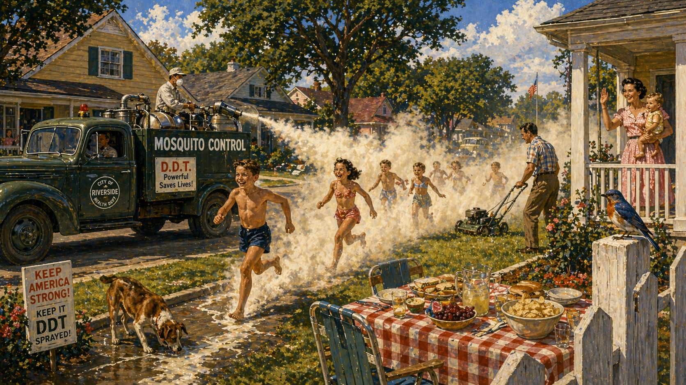

Image Prompt

(This is panel 6.  Do not put the panel number in the image.) Please generate a 16:9 image in 1950s American suburban illustration style, still bright but with the first hints of unease, depicting panel 6 of 12. Make the characters and style consistent with the prior panels. The scene shows a 1950s American suburban neighborhood where a municipal truck sprays a thick white fog of DDT down a tree-lined street. Children in swimsuits run laughing through the fog behind the truck. Mothers wave from porches. A man mows his lawn nearby. The color palette is still primarily bright — cheerful pastel houses, green lawns, blue sky — but the DDT fog has a slightly unnatural white-yellow tint that hints at something wrong. Emotional tone: innocent enthusiasm with the first visual whisper of danger. Include: (1) the municipal spray truck with "MOSQUITO CONTROL" painted on its side, (2) children running directly through the dense chemical fog, (3) a mother holding a baby on a porch, smiling, (4) a picnic table with uncovered food near the spray path, (5) a dog drinking from a puddle of runoff, (6) a songbird perched on a fence post, still alive but positioned ominously. Generate the image immediately without asking clarifying questions.

With the Nobel Prize as its endorsement, DDT went everywhere. American cities sprayed it from trucks that rolled through neighborhoods while children chased the fog like an ice cream van. Farmers dusted crops by the ton. Suburbs were blanketed to kill mosquitoes before backyard barbecues. Beaches were sprayed before holiday weekends. DDT was added to wallpaper paste, shelf paper, and paint. No one questioned it. After all, a Nobel Prize winner had made it, and the government said it was safe. What could possibly go wrong?

## Panel 7: The First Cracks

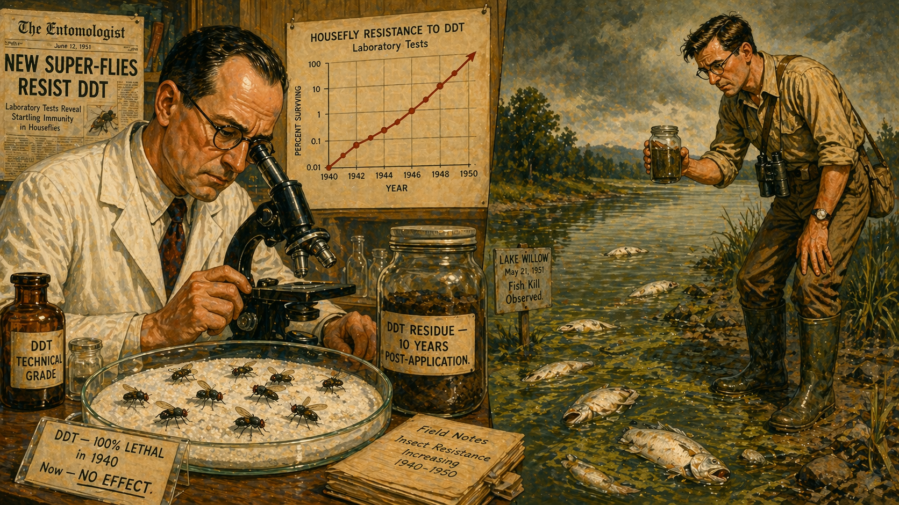

Image Prompt

(This is panel 7.  Do not put the panel number in the image.) Please generate a 16:9 image in a transitional style — still 1950s illustration but with the color palette shifting toward muted, uneasy tones — depicting panel 7 of 12. Make the characters and style consistent with the prior panels. The scene shows a split composition. On the left, a 1950s entomologist in a university laboratory peers through a microscope at houseflies that are walking unharmed across a DDT-dusted surface, his expression troubled. On the right, a field biologist in rubber boots stands at the edge of a lake, holding a jar of murky water and looking at dead fish floating near the shore. The color palette shifts from warm laboratory amber on the left to sickly green-gray on the right. Emotional tone: the dawning realization that something is wrong. Include: (1) the living flies walking on DDT powder, (2) a chart on the lab wall showing rising insect resistance over years, (3) the dead fish with pale bellies floating in greenish water, (4) a soil sample jar labeled "DDT residue — 10 years post-application", (5) a newspaper clipping pinned to the lab wall reading "NEW SUPER-FLIES RESIST DDT", (6) the field biologist's mud-stained boots and worried expression. Generate the image immediately without asking clarifying questions.

By the mid-1950s, the miracle was developing cracks. Houseflies in Italy — the same country DDT had saved from typhus — were now walking across DDT-dusted surfaces without dying. Mosquitoes in the tropics were breeding resistance even faster. Meanwhile, soil scientists were finding something alarming: DDT did not break down. A single application persisted in soil for ten years or more, washing into streams, lakes, and eventually the ocean. The chemical that was supposed to disappear after doing its job was instead becoming a permanent part of the environment. Nobody had tested for that.

## Panel 8: The Invisible Poison Ladder

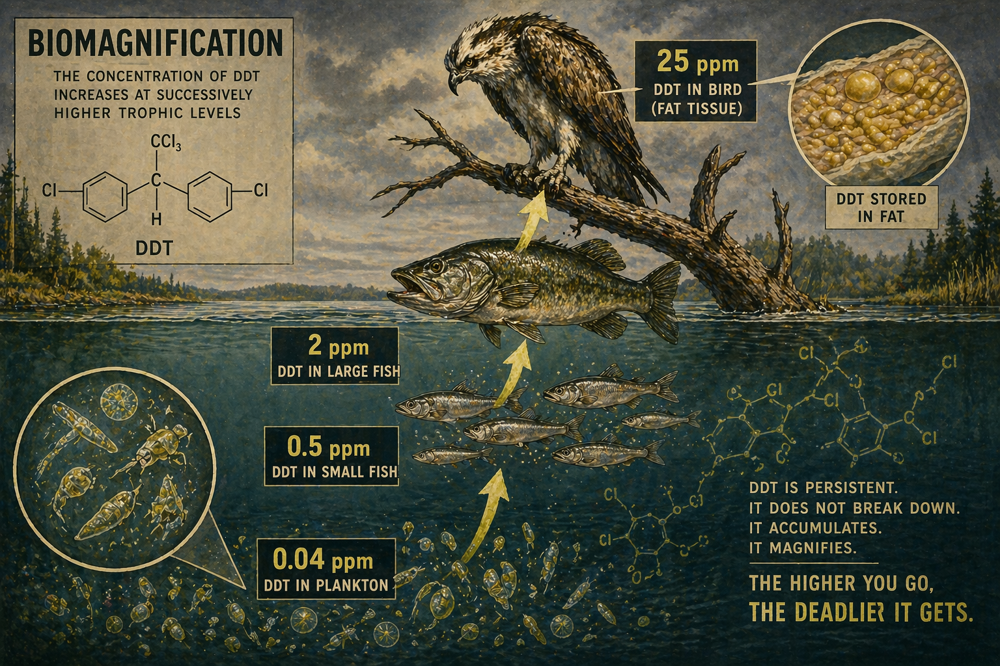

Image Prompt

(This is panel 8.  Do not put the panel number in the image.) Please generate a 16:9 image in a darker, more scientific illustration style with muted, unsettling colors depicting panel 8 of 12. Make the characters and style consistent with the prior panels. The scene is a large educational diagram come to life — a cross-section of a lake ecosystem showing DDT bioaccumulation through trophic levels. At the bottom, microscopic plankton glow faintly in water tinted with traces of DDT (labeled "0.04 ppm"). Small fish eating the plankton are shown with slightly higher concentrations ("0.5 ppm"). Larger fish eating the small fish show higher levels still ("2 ppm"). At the top, a fish-eating bird — an osprey — perches on a dead branch with the highest concentration ("25 ppm"), looking sickly and thin. Arrows connect each level showing the magnification. The color palette is deep lake blue, sickly yellow-green for the DDT concentration, cool gray, and muted olive. Emotional tone: the horror of an invisible chain reaction. Include: (1) clear numerical labels at each trophic level showing DDT concentration multiplying, (2) the plankton, small fish, large fish, and bird in a clear vertical food chain, (3) a faint molecular diagram of DDT dissolved in the water, (4) the osprey's feathers looking dull and unhealthy, (5) a magnified inset showing DDT stored in fatty tissue, (6) the phrase "BIOMAGNIFICATION" written as a scientific label. Generate the image immediately without asking clarifying questions.

Here is where the story becomes a lesson in systems thinking. DDT dissolved in water at tiny concentrations — parts per billion, almost undetectable. But plankton absorbed it and stored it in their fat. Small fish ate thousands of plankton and concentrated the DDT further. Larger fish ate the small fish. At each step up the food chain, the concentration multiplied — a process scientists would name biomagnification. By the time a fish-eating bird consumed its daily meals, the DDT in its body was tens of thousands of times more concentrated than the DDT in the water. The dose that seemed safe at the bottom of the food chain had become lethal at the top. No one had imagined this, because no one had thought in systems.

## Panel 9: The Eggshell Crisis

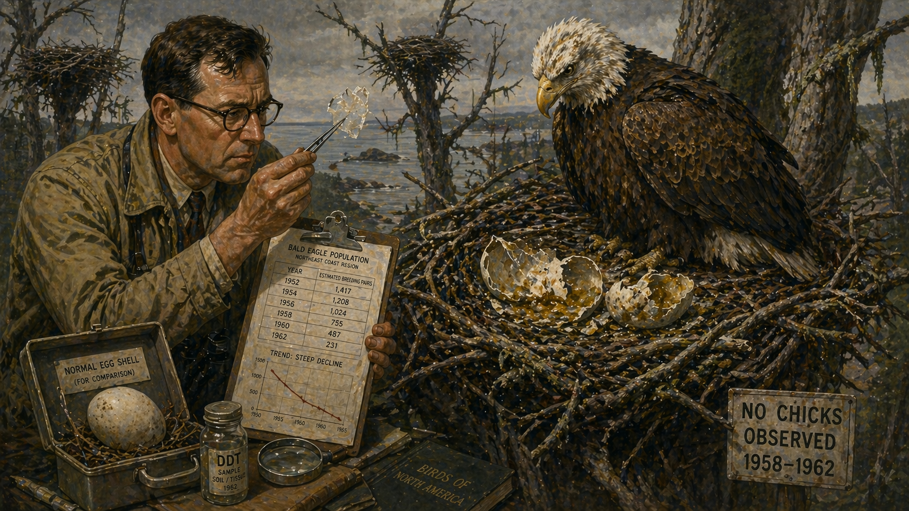

Image Prompt

(This is panel 9.  Do not put the panel number in the image.) Please generate a 16:9 image in a somber, muted style with desaturated colors depicting panel 9 of 12. Make the characters and style consistent with the prior panels. The scene shows a wildlife biologist in the early 1960s kneeling at the base of a massive tree, carefully examining a crushed bald eagle egg in the nest above. The eggshell is paper-thin and has collapsed under the weight of the adult eagle, who sits on the nest looking gaunt and bewildered. Broken, oozing eggs are visible in the nest. The landscape is a gray-green coastal forest. The color palette is muted olive, pale eggshell white, somber gray sky, and the faded brown of the eagle's feathers. Emotional tone: grief and scientific alarm. Include: (1) the crushed eggshell, translucent and impossibly thin, (2) the adult bald eagle on the nest looking confused and diminished, (3) the biologist holding a fragment of shell up to the light with tweezers, (4) a clipboard with data showing declining eagle population numbers, (5) a normal-thickness eggshell sample in the biologist's kit for comparison, (6) empty nests visible in neighboring trees — no chicks anywhere. Generate the image immediately without asking clarifying questions.

The first sign of catastrophe came from the birds. Peregrine falcons vanished from the eastern United States entirely. Brown pelicans along the California coast laid eggs that shattered before they could hatch. Bald eagles — the national symbol — were disappearing from state after state. Biologists discovered the horrifying mechanism: DDT metabolites interfered with calcium deposition in eggshells. The shells became so thin that they crushed under the weight of the nesting mother. An entire generation of raptors was being destroyed not by poison in the traditional sense, but by a chemical that made their own bodies betray them. The eagles were not being killed. They were being prevented from being born.

## Panel 10: Silent Spring

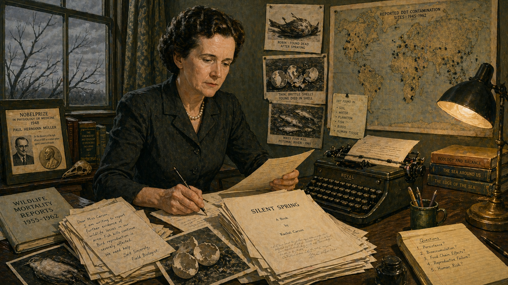

Image Prompt

(This is panel 10.  Do not put the panel number in the image.) Please generate a 16:9 image in a mid-century American editorial illustration style with muted, literary colors depicting panel 10 of 12. Make the characters and style consistent with the prior panels, now introducing a new character. The scene shows Rachel Carson, a woman in her mid-50s with short dark wavy hair, warm brown eyes, and a tailored dark dress, seated at her writing desk in her Maryland home in 1962. She is surrounded by scientific papers, correspondence, and her typewriter with a nearly finished manuscript. Through her window, bare branches are visible against a gray sky — no birds. On a shelf behind her sits a copy of the Nobel Prize announcement for Paul Muller, along with stacks of wildlife mortality reports. The color palette is muted sage green, paper cream, soft gray, and a single amber lamp glow. Emotional tone: quiet determination connecting all the evidence. Include: (1) the manuscript pages of "Silent Spring" on her desk, (2) photographs of dead birds and thin eggshells pinned to a board, (3) a letter from a field biologist on top of her correspondence, (4) Carson's expression of focused resolve, (5) a world map with pins showing DDT contamination sites, (6) the contrast between the silent, birdless window and the evidence-filled room. Generate the image immediately without asking clarifying questions.

In 1962, a marine biologist named Rachel Carson published a book called *Silent Spring* that connected all the dots. Carson traced DDT from the spray trucks in suburban neighborhoods through the soil, into the water, up the food chain, and into the eggs of dying birds. She documented insect resistance, groundwater contamination, and the deaths of non-target species — bees, butterflies, songbirds — that no one had intended to kill. The chemical industry spent millions attacking her. They called her hysterical, unscientific, a woman who wanted children to die of malaria. But every claim in her book was footnoted, peer-reviewed, and true. Carson did not say DDT was evil. She said that using it without understanding the system was reckless — and that the system was now fighting back.

## Panel 11: The Ban

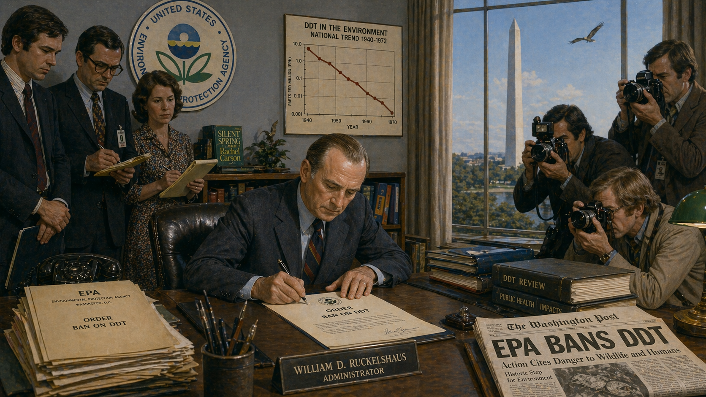

Image Prompt

(This is panel 11.  Do not put the panel number in the image.) Please generate a 16:9 image in early 1970s American documentary style with a mix of institutional and natural colors depicting panel 11 of 12. Make the characters and style consistent with the prior panels. The scene shows the headquarters of the newly created Environmental Protection Agency in Washington, D.C., in 1972. EPA Administrator William Ruckelshaus sits at his desk signing the order banning DDT, surrounded by aides and press photographers. Through a large window behind him, the Washington Monument is visible against a clearing sky. In the foreground, a newspaper on a side table shows the headline "EPA BANS DDT." The color palette is institutional gray-blue, document cream, clearing-sky blue, and cautious green. Emotional tone: sober institutional action and the slow turning of a ship. Include: (1) the official EPA document being signed, (2) press photographers with 1970s cameras, (3) the EPA seal on the wall, (4) a copy of Silent Spring on the bookshelf behind the desk, (5) a timeline chart on the wall showing DDT contamination levels, (6) outside the window, a single bird in flight against the clearing sky. Generate the image immediately without asking clarifying questions.

On June 14, 1972, EPA Administrator William Ruckelshaus signed the order banning most uses of DDT in the United States. Other nations followed. It had taken a decade of scientific evidence, a presidential commission, congressional hearings, and one of the most expensive disinformation campaigns in corporate history before the political system caught up with the ecological evidence. The ban was not the end of DDT's story — the compound was already embedded in ecosystems worldwide and would take decades to decline. But the tide had turned. Slowly, tentatively, the birds began to come back.

## Panel 12: The Complex Legacy

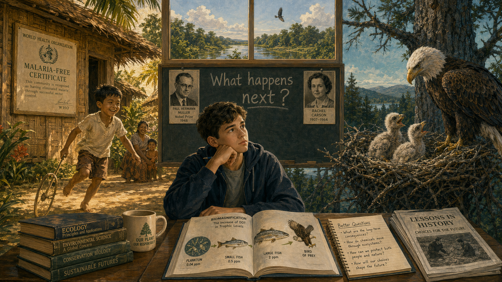

Image Prompt

(This is panel 12.  Do not put the panel number in the image.) Please generate a 16:9 image in a modern, reflective illustration style that balances warm and cool tones depicting panel 12 of 12. Make the characters and style consistent with the prior panels. The scene is a split composition representing the complex legacy of DDT. On the left side, in warm golden light, a healthy child in a tropical village plays outside a home with a WHO malaria-free certificate on the wall — representing the millions of lives DDT saved. On the right side, in cool blue-green light, a bald eagle feeds its chicks in a healthy nest high in a tree — representing the ecological recovery after the ban. In the center foreground, a modern high school student sits at a desk looking at both scenes, with an open ecology textbook showing a diagram of biomagnification. Behind the student, a chalkboard reads: "What happens next?" The color palette balances warm amber-gold on the left with cool teal-green on the right, unified by the neutral tones of the student's desk. Emotional tone: thoughtful complexity — not simple triumph or simple tragedy, but the wisdom of asking better questions. Include: (1) the healthy child playing freely, (2) the eagle family thriving, (3) the student's textbook open to a food-chain diagram, (4) the chalkboard question "What happens next?", (5) a small portrait of Paul Muller on one side of the chalkboard and Rachel Carson on the other, (6) a window behind the chalkboard showing a healthy, living ecosystem. Generate the image immediately without asking clarifying questions.

Paul Hermann Muller died in 1965, three years before the evidence against DDT became undeniable and seven years before the ban. He was not a villain. He was a careful chemist who solved the problem he was asked to solve — and solved it brilliantly. DDT saved millions of lives from malaria and typhus. That is not in dispute. But DDT also accumulated in food chains, thinned the eggshells of raptors, contaminated ecosystems worldwide, and drove multiple species toward extinction. That is also not in dispute. The lesson of Muller's story is not that pesticides are evil or that science is dangerous. The lesson is that every intervention in a complex system has consequences beyond the ones you intended — and if you do not ask "what happens next?", the system will answer for you, in ways you never imagined and cannot easily undo.

### Epilogue -- Always Ask the Next Question

The DDT story is the most important cautionary tale in modern ecology, not because it proves that technology is bad but because it proves that technology deployed without systems thinking is a gamble with planetary stakes. Muller asked the right first question: "Does this kill insects?" But no one asked the second question — "What happens to this chemical after it kills the insects?" — or the third — "What happens when it accumulates in organisms that were never the target?" Systems thinking demands that we follow every intervention through the web of connections, feedbacks, and trophic levels that make up an ecosystem. The DDT story is what happens when we do not.

| What Seemed True | What Was Actually True | The Systems Thinking Lesson |
|------------------|----------------------|----------------------------|
| DDT breaks down harmlessly after use | DDT persists in soil and water for decades | Always ask how long a chemical lasts in the environment |
| Low doses in water are safe | Low doses biomagnify to lethal concentrations at higher trophic levels | Trace amounts can become catastrophic through food chains |
| DDT only kills target insects | DDT kills bees, butterflies, fish, and indirectly devastates bird populations | Every organism is connected to others in a web, not a line |
| Insects will always be vulnerable to DDT | Insects evolve resistance within years, requiring ever-higher doses | Evolution is a feedback loop that responds to selection pressure |
| A Nobel Prize means the science is settled | The Nobel recognized DDT's benefits before the long-term costs were understood | Science is a process, not a verdict — new evidence changes the picture |

### Call to Action

The next time someone tells you a new technology is perfectly safe, or that a new chemical will solve a problem with no side effects, remember Paul Muller's story. Ask the questions he never got to ask: What happens to this substance after it does its job? Where does it go? What eats what in the system it enters? How do organisms adapt? What are the second-order and third-order effects? You do not need a Nobel Prize to think in systems. You just need the habit of asking one more question — and the courage to act on the answer, even when it is inconvenient.

---

*"DDT was a triumph for the human desire to solve problems quickly. Its failure was a lesson in how quickly nature outpaces our solutions."*
— Paul Hermann Muller (paraphrased from his Nobel lecture, 1948)

*"The 'control of nature' is a phrase conceived in arrogance, born of the Neanderthal age of biology and philosophy, when it was supposed that nature exists for the convenience of man."*
— Rachel Carson, *Silent Spring*, 1962

---

## References

1. [Wikipedia: Paul Hermann Muller](https://en.wikipedia.org/wiki/Paul_Hermann_M%C3%BCller) - Biography of the Swiss chemist who won the Nobel Prize for discovering DDT's insecticidal properties
2. [Wikipedia: DDT](https://en.wikipedia.org/wiki/DDT) - Comprehensive article on DDT's chemistry, use, environmental impact, and ban
3. [Wikipedia: Biomagnification](https://en.wikipedia.org/wiki/Biomagnification) - The process by which chemical concentrations increase at each trophic level
4. [Nobel Prize: Paul Hermann Muller](https://www.nobelprize.org/prizes/medicine/1948/muller/biographical/) - Official Nobel Prize biography and lecture
5. [Encyclopaedia Britannica: DDT](https://www.britannica.com/science/DDT) - Curated reference overview of DDT's development, use, and environmental legacy
