# The Song That Saved the Whales

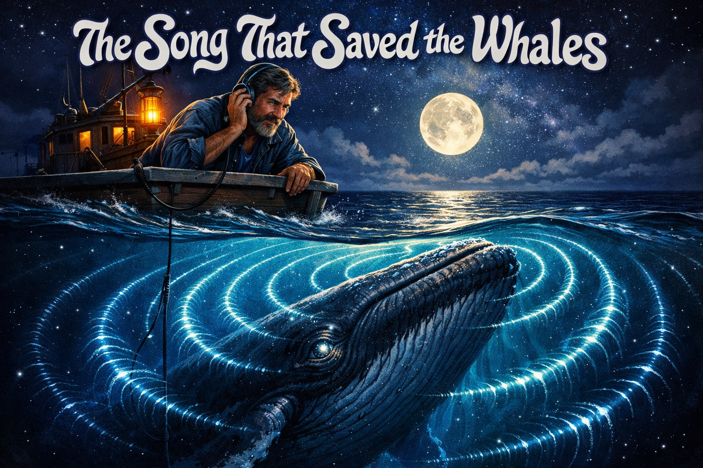

Cover Image Prompt

Please generate a wide-landscape 16:9 cover image for a graphic novel titled "The Song That Saved the Whales" in an ocean-and-sound aesthetic — deep navy blues, silver moonlight on water, luminous sound-wave visualizations rendered as glowing patterns rippling through dark ocean water. Think 1970s album cover art: organic, flowing, psychedelic-meets-scientific. Show Roger Payne, a lean, weathered, bearded man in his mid-30s with kind eyes and sun-darkened skin, leaning over the rail of a small research vessel at night, one hand holding a pair of headphones to his ear, the other gripping the ship's rail. Below the surface, a massive humpback whale rises toward him, mouth slightly open, surrounded by luminous arcs of sound — visible as silver-blue wave patterns radiating outward through the water. The whale is immense, filling the lower two-thirds of the frame, while the small boat and Payne occupy the upper third. The title text "The Song That Saved the Whales" is rendered in flowing, organic 1970s typography at the top. Color palette: deep navy, midnight blue, silver moonlight, bioluminescent cyan, warm amber from a lantern on the boat. Emotional tone: awe, intimacy between a man and a creature vastly larger than himself, the loneliness of open ocean at night. Include: (1) Payne's weathered, bearded face illuminated by moonlight, headphones pressed to one ear, (2) the humpback whale rising from below with one visible eye reflecting the moonlight, (3) luminous sound-wave arcs radiating from the whale's head through the water, (4) the small wooden research vessel with a hydrophone cable trailing into the water, (5) a full moon casting a silver path across the ocean surface, (6) stars visible in the night sky above, with the Milky Way faintly suggested. Generate the image immediately without asking clarifying questions.

Narrative Prompt

This is a 12-panel graphic novel about Roger Payne (1935-2023), the American bioacoustician who discovered that humpback whales sing complex, structured songs — and whose 1970 album Songs of the Humpback Whale transformed public attitudes toward whaling and helped drive the international moratorium on commercial whaling. The story spans from the early 1960s to 2023, set in locations including a New England beach, Bermuda, the Paynes' home laboratory, recording studios, American living rooms, the open ocean, Greenpeace protests, and NASA's Jet Propulsion Laboratory. The art style throughout is an ocean-and-sound aesthetic — deep navy blues, silver moonlight on water, sound-wave visualizations rendered as luminous patterns in the water. Think 1970s album cover art: organic, flowing, psychedelic-meets-scientific. The whale panels should feel simultaneously immense and intimate. Payne should be drawn consistently across panels: a lean, weathered, bearded man with kind eyes and sun-darkened skin, wearing functional sailing clothes in ocean scenes and casual academic attire in indoor scenes. In early panels he is in his early 30s with dark hair; in later panels his hair and beard go silver-white. Katy Payne, his wife and research partner, appears in panels 3 and 4 — a slender woman with long dark hair and an intent, focused expression. Central ecology theme: how emotional connection to other species — not just rational argument — can transform human behavior and drive conservation policy. The story emphasizes marine ecosystems, acoustic ecology, biodiversity, the tragedy of overexploitation, and the power of public engagement in environmental protection.

### Prologue -- A Silence Beneath the Waves

For most of human history, the ocean was silent to us. We sailed on its surface, hauled creatures from its depths, and rendered their bodies into oil and bone meal — all without the faintest idea that beneath the hull, the sea was alive with music. Whales had been singing for millions of years before the first human ear ever heard them. When we finally listened, in the late 1960s, the sound was so beautiful, so complex, so clearly the product of an intelligence we had never bothered to imagine, that it changed everything. One man heard those songs and understood what they meant — not just for science, but for the survival of the largest animals that have ever lived. His name was Roger Payne, and the album he released in 1970 did something that decades of scientific data alone had failed to do: it made people *care*.

## Panel 1: The Whale on the Beach

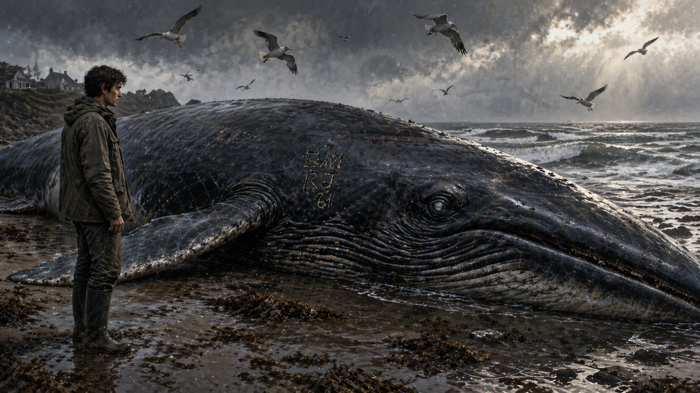

Image Prompt

I am about to ask you to generate a series of images for a graphic novel. Please make the images have a consistent style and consistent characters. Do not ask any clarifying questions. Just generate the image immediately when asked.

Please generate a 16:9 image in an ocean-and-sound aesthetic — deep navy blues, silver moonlight, luminous sound-wave visualizations, 1970s album-art style — depicting panel 1 of 12. The scene shows a rocky New England beach in the early 1960s, late afternoon, overcast sky. Roger Payne, a young bioacoustician in his late 20s — lean, clean-shaven at this point, wearing a field jacket and boots — stands alone on the wet sand before the enormous carcass of a dead fin whale that has washed ashore. The whale is massive, perhaps fifty feet long, lying on its side with one eye visible, clouded in death. Payne stands with his hands at his sides, staring at the whale with an expression of devastation and something deeper — a dawning sense of purpose. Seagulls wheel overhead. The surf rolls in gray and cold. Someone has carved initials into the whale's flank with a knife. Color palette: stormy gray sky, wet sand brown, the dark slate-blue of the whale's skin, cold ocean green, muted silver light through clouds. Emotional tone: grief, outrage, and the beginning of a calling. Specific details: (1) the immense scale of the dead whale against the lone human figure, (2) the whale's clouded eye, still and glassy, (3) crude initials carved into the whale's skin by vandals, (4) Payne's stricken expression — jaw tight, eyes wide, (5) seagulls circling above the carcass, (6) the cold New England surf breaking on the shore behind them. Generate the image immediately without asking clarifying questions.

He had come to the beach to think. Roger Payne was a young bioacoustician at Tufts University, studying the echolocation of bats and moths — elegant work, precise and satisfying. But what he found on that gray New England shore shattered something inside him. A dead fin whale, fifty feet of magnificence, had washed up on the rocks. Someone had carved their initials into its skin. Someone else had stubbed out a cigar in its blowhole. Payne stood in the cold wind and stared at what humanity had done to the largest animal on Earth, and he made a decision that would reshape his entire life. He would find a way to save the whales. He just didn't know how yet.

## Panel 2: The Secret Recordings

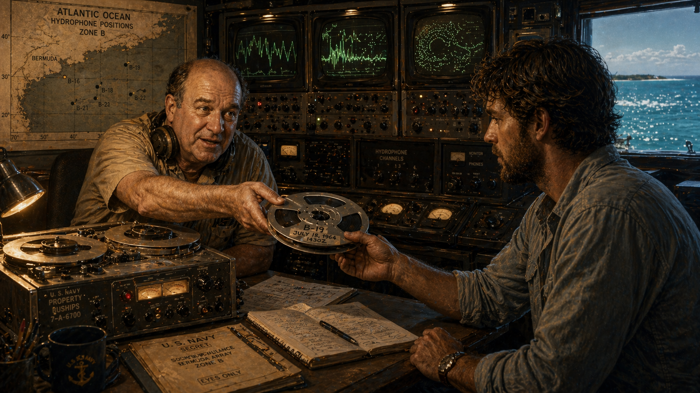

Image Prompt

Please generate a 16:9 image in an ocean-and-sound aesthetic depicting panel 2 of 12. Make the characters and style consistent with the prior panel. The scene shows a dimly lit office at a U.S. Navy listening station near Bermuda, circa 1966. Frank Watlington, a stocky, balding Navy acoustic engineer in his 50s wearing a short-sleeved khaki shirt and military-issue headphones, sits before a bank of reel-to-reel tape recorders and oscilloscope screens. He is reaching across the console to hand a reel of magnetic tape to Roger Payne, who now has a short beard beginning to grow and wears a rumpled sport shirt. Watlington's expression is conspiratorial and excited — he has been holding onto these recordings for years and finally has someone who understands what they mean. On the oscilloscope screens behind them, strange waveform patterns scroll — not the submarine signatures the equipment was designed to detect, but something far more complex and organic. Color palette: warm amber from console lights, deep navy shadows, the green glow of oscilloscope screens, institutional khaki and gray. Emotional tone: a secret being shared, the thrill of a mystery handed from one curious mind to another. Specific details: (1) the reel-to-reel tape recorder with military markings, (2) Watlington's headphones pushed back around his neck, (3) the oscilloscope showing complex organic waveforms unlike any mechanical signal, (4) the reel of tape being passed between the two men, (5) a map of the Atlantic Ocean on the wall with hydrophone positions marked, (6) through a window, the turquoise Bermuda ocean glittering in the sun. Generate the image immediately without asking clarifying questions.

The answer came from an unlikely source. Frank Watlington was a Navy acoustic engineer stationed in Bermuda, tasked with listening for Soviet submarines using underwater hydrophones. The Cold War had wired the Atlantic with listening devices, and Watlington spent his days monitoring the deep sound channel for the mechanical signatures of enemy vessels. But his hydrophones kept picking up something else — strange, haunting sounds that rose and fell in elaborate patterns, sometimes lasting for hours. Watlington knew they came from humpback whales. He had been quietly recording them on the side for years, unsure what to do with them. When he heard that a bioacoustician named Payne was interested in whale sounds, he handed over the tapes. It was the most consequential handoff in the history of conservation.

## Panel 3: The Discovery

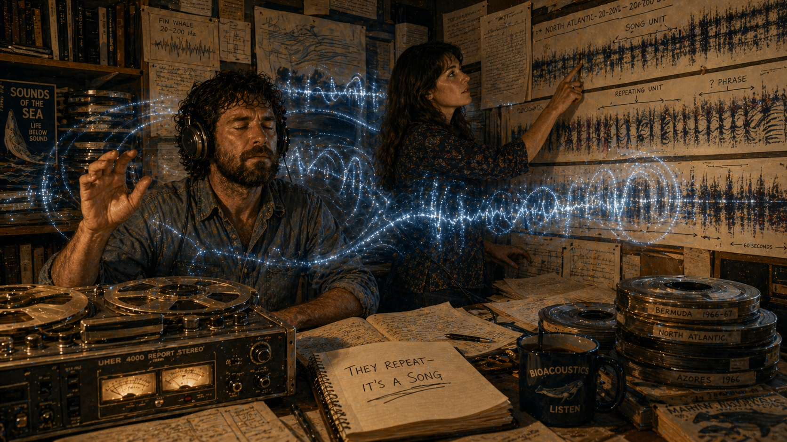

Image Prompt

Please generate a 16:9 image in an ocean-and-sound aesthetic depicting panel 3 of 12. Make the characters and style consistent with the prior panels. The scene shows Roger and Katy Payne in their home study in Lincoln, Massachusetts, in 1967, surrounded by stacks of reel-to-reel tape recordings and spectrograms pinned to every wall. Roger, now with a fuller beard, sits at a desk with headphones on, eyes closed in concentration, one hand raised as if conducting invisible music. Katy Payne — a slender woman with long dark hair, intense eyes, and an expression of focused wonder — stands beside a wall covered in long paper spectrograms, tracing a repeating pattern with her finger. The spectrograms show the visual shape of whale songs: rising sweeps, descending moans, rhythmic clicking patterns that repeat in clear sequences. Between them, visible as a translucent artistic overlay, luminous sound waves flow from the tape recorder through the room, suggesting the whale songs filling the space. Color palette: warm lamplight amber, the white of spectrogram paper, deep navy shadows, luminous cyan and silver for the sound-wave overlay, book-brown shelves. Emotional tone: the eureka moment — two scientists realizing they are hearing something no human has ever understood before. Specific details: (1) Roger with headphones and closed eyes, transported by what he hears, (2) Katy tracing repeating patterns on the wall-mounted spectrograms, (3) reel-to-reel tape player spinning on the desk, (4) spectrograms pinned to every available wall surface, (5) luminous sound-wave patterns flowing through the room as an artistic overlay, (6) a notebook on the desk where Katy has written "THEY REPEAT — IT'S A SONG" with an underline. Generate the image immediately without asking clarifying questions.

Night after night, Roger and Katy Payne sat in their Massachusetts home, headphones on, listening to Watlington's recordings and unspooling miles of spectrogram paper. The sounds were mesmerizing — deep moans that seemed to come from the center of the Earth, high keening wails, rhythmic pulses, cascading runs of notes that climbed and fell like phrases of music. But it was Katy who saw the pattern first. Tracing her finger along the spectrograms, she realized the sounds were not random. They repeated. The whales were singing *songs* — structured, organized compositions with themes, phrases, and verses, performed in the same sequence, over and over. Roger confirmed it: each song lasted between six and thirty minutes, and then the whale started again from the beginning. These were not calls or grunts. These were performances.

## Panel 4: The Living Compositions

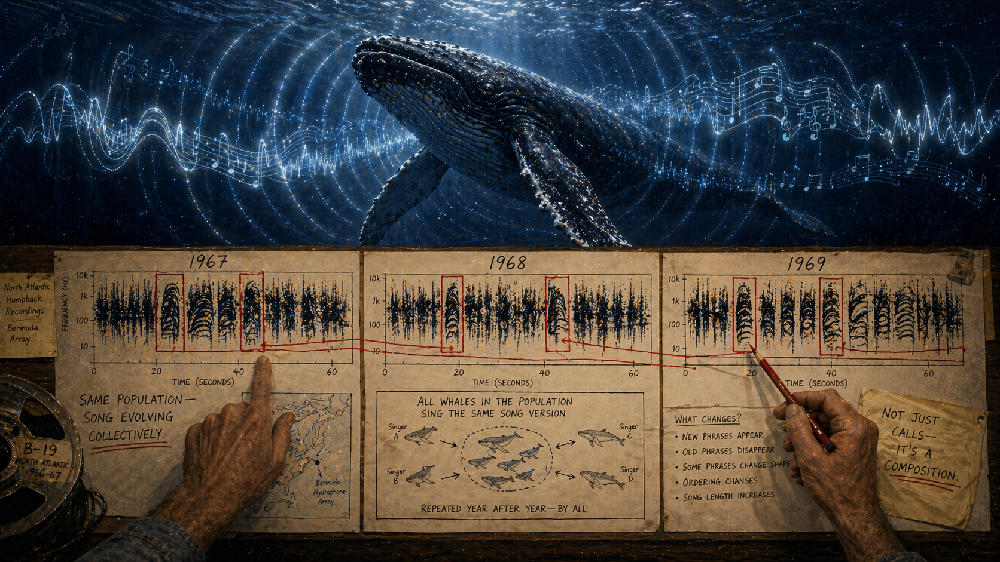

Image Prompt

Please generate a 16:9 image in an ocean-and-sound aesthetic depicting panel 4 of 12. Make the characters and style consistent with the prior panels. The scene is a split composition showing the passage of time. The upper half shows a breathtaking underwater view of a lone humpback whale suspended in deep blue water, mouth slightly open, surrounded by luminous visualizations of its song — silver and cyan wave patterns radiating outward in concentric arcs, with musical notation-like patterns embedded in the waves to suggest structure and complexity. The lower half shows a timeline spanning 1967 to 1969, with three sets of spectrograms side by side, each from a different year, showing how the song has changed — same overall structure, but specific phrases have been modified, expanded, or replaced. Roger Payne's hands are visible at the bottom of the frame, pointing from one spectrogram to the next, connecting the evolving passages with red pencil lines. Color palette: deep ocean navy and midnight blue for the whale, luminous silver-cyan for the sound waves, warm amber for the spectrogram section, red pencil marks bright against white paper. Emotional tone: wonder at the scale of the discovery — these are not fixed calls but evolving compositions, evidence of culture and learning. Specific details: (1) the humpback whale in deep blue water with one visible eye, (2) luminous sound-wave arcs radiating outward from the whale, (3) three spectrograms from different years showing song evolution, (4) Payne's hands with red pencil connecting changed passages, (5) notation reading "Same population — song evolving collectively," (6) small diagrams showing how all whales in a population sing the same version of the current song. Generate the image immediately without asking clarifying questions.

What the Paynes discovered next was even more astonishing. The songs were not fixed — they evolved. Comparing recordings made months and years apart, they could track how each song changed over time. A phrase would be modified slightly. A new theme would appear. An old passage would be dropped. And here was the stunning part: every whale in a population sang the same version of the song at the same time. When one phrase changed, all the whales changed it together. They were not just singing — they were *composing collectively*, continuously revising a shared musical tradition that was passed from whale to whale across hundreds of miles of ocean. It was, Roger Payne wrote, "the most complex and beautiful sound in nature." It was also, unmistakably, evidence of culture.

## Panel 5: Songs of the Humpback Whale

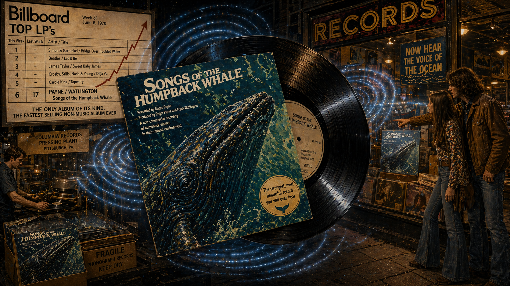

Image Prompt

Please generate a 16:9 image in an ocean-and-sound aesthetic depicting panel 5 of 12. Make the characters and style consistent with the prior panels. The scene shows the iconic 1970 album Songs of the Humpback Whale being pressed and released. In the center of the frame, a large vinyl LP record is shown at an angle, with the album's distinctive cover art visible — an abstract painting of a whale in blues and greens. Around the record, the scene shows a 1970 record store with the album displayed prominently in the front window. A young couple in early-1970s clothing — bell-bottoms, long hair — stands outside the store window, pointing at the album with curiosity. In the background, a Billboard-style chart is visible showing the album climbing sales rankings. Luminous sound waves flow out from the record like ripples in water, spreading outward through the scene. Color palette: the rich black of vinyl, album-art blues and greens, warm record-store amber lighting, 1970s earth tones on the clothing, luminous cyan sound ripples. Emotional tone: a cultural moment — something unprecedented is about to reach millions of ears. Specific details: (1) the vinyl LP with the Songs of the Humpback Whale cover art, (2) a record store window display with the album featured prominently, (3) the young couple in 1970s clothing reacting with curiosity, (4) a sales chart showing the album rising, (5) luminous sound waves emanating from the record, (6) a small sticker on the album reading "The strangest, most beautiful record you will ever hear." Generate the image immediately without asking clarifying questions.

In 1970, Roger Payne did something no scientist had ever done before. He released the whale songs as a commercial album. *Songs of the Humpback Whale* appeared on Capitol Records — a major label, not an academic curiosity. The LP was forty-five minutes of unedited whale song: deep, eerie, magnificent, unlike anything anyone had heard before. It sold over ten million copies, making it the bestselling nature recording in history. People put it on their turntables and sat in their living rooms, stunned. The sounds were at once alien and deeply familiar — music made by a brain the size of a car, in an ocean humans could barely visit, by an animal that had been singing these songs for millions of years before the first human walked upright. A record album was an odd weapon against an industry. It turned out to be devastating.

## Panel 6: Ten Million Living Rooms

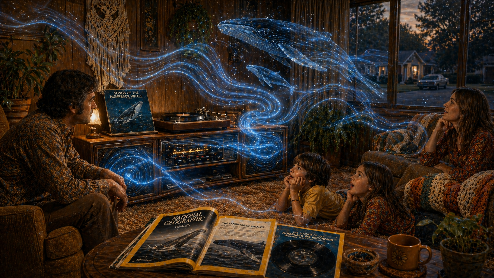

Image Prompt

Please generate a 16:9 image in an ocean-and-sound aesthetic depicting panel 6 of 12. Make the characters and style consistent with the prior panels. The scene shows a 1970s American living room — shag carpet, wood-paneled walls, a large console stereo. A family is gathered around the stereo: a father sitting in an armchair, a mother on the couch, two children lying on the carpet — all listening with expressions of rapt wonder. On the turntable, the Songs of the Humpback Whale album spins. From the stereo speakers, luminous sound waves flow outward into the room like underwater currents, filling the space with translucent blue-silver wave patterns. On the coffee table, an open National Geographic magazine shows the flexi-disc insert of whale songs that came bundled with the January 1979 issue. The room feels simultaneously ordinary and magical — whale songs filling a suburban home. Color palette: warm 1970s amber and brown for the living room, luminous ocean blues and silvers for the sound waves, the yellow border of the National Geographic magazine. Emotional tone: the private, quiet revolution happening in millions of homes — the moment ordinary people first heard whale songs and felt something shift inside them. Specific details: (1) the vinyl record spinning on the turntable, (2) the family listening with genuine wonder — the father leaning forward, the children wide-eyed, (3) luminous sound-wave patterns flowing from the speakers into the room, (4) the open National Geographic with the flexi-disc visible, (5) 1970s decor — macrame, houseplants, earth tones, (6) through the living room window, an ordinary suburban street, emphasizing the contrast between the mundane setting and the otherworldly sound. Generate the image immediately without asking clarifying questions.

Then came the masterstroke of distribution. In January 1979, *National Geographic* magazine included a thin, flexible "flexi-disc" of whale songs tucked into the pages of its issue — sent to over ten million subscribers. Suddenly, whale songs were not just in record stores; they were lying on kitchen tables and coffee tables in every state in America. Schoolteachers played them in classrooms. Families gathered around console stereos and listened together. The sounds bypassed every rational argument about marine biology and conservation policy and went straight to something deeper. You did not need to understand acoustic ecology to feel the whale songs. You needed only to be human and to listen. And when you listened, you could not unhear what you had heard: another intelligence, vast and strange and singing in the dark.

## Panel 7: From Oil to Song

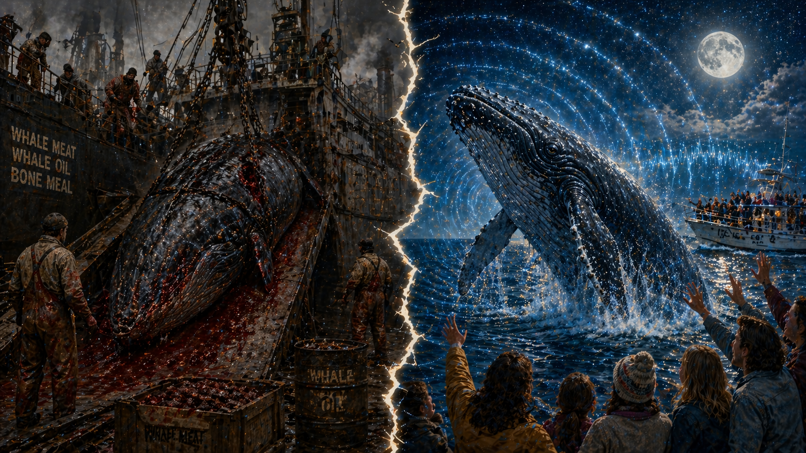

Image Prompt

Please generate a 16:9 image in an ocean-and-sound aesthetic depicting panel 7 of 12. Make the characters and style consistent with the prior panels. The scene is a dramatic split composition showing the transformation of public perception. On the left half: a dark, industrial whaling scene — a factory whaling ship from the 1960s with a dead whale being hauled up a slipway by chains, workers in blood-stained overalls standing on the flensing deck, steam rising from the rendering works. The whale is reduced to a commodity — meat, oil, bone. The color palette on this side is grim: industrial gray, rust red, blood-dark crimson, oily black, cold steel. On the right half: the same species of whale, alive and luminous, breaching out of a silver-moonlit ocean, surrounded by radiating sound waves rendered as luminous arcs of light. Its eye is visible — intelligent, aware, ancient. People on a whale-watching boat in the background reach toward it with expressions of wonder and joy. The color palette on this side is alive: deep ocean navy, silver moonlight, bioluminescent cyan, warm amber. A jagged dividing line between the two halves cracks like breaking ice. Emotional tone: the before and after of a revolution in consciousness — from exploitation to reverence. Specific details: (1) the factory ship with chains hauling a dead whale, (2) blood-stained workers on the flensing deck, (3) the living whale breaching with sound waves radiating, (4) the whale's intelligent eye on the right side, (5) whale watchers reaching out in wonder, (6) the cracking dividing line suggesting the old world breaking apart. Generate the image immediately without asking clarifying questions.

The transformation was almost chemical in its speed. Before the album, whales were commodities. The whaling industry processed them by the thousands each year — harpooned with explosive-tipped spears, hauled aboard factory ships, and rendered into margarine, machine oil, pet food, and cosmetics. A whale was worth its weight in barrels. The International Whaling Commission, supposedly a conservation body, routinely set quotas that scientists warned were unsustainable, and the whaling nations exceeded even those. Humpback populations had been driven down by over ninety percent. But after millions of people heard the songs, something cracked open. A whale was no longer a barrel of oil. A whale was a musician, a composer, a mind in the deep. You cannot render a musician into margarine without feeling that you have committed a crime. Roger Payne had not just made a recording. He had made it *impossible to not care*.

## Panel 8: Save the Whales

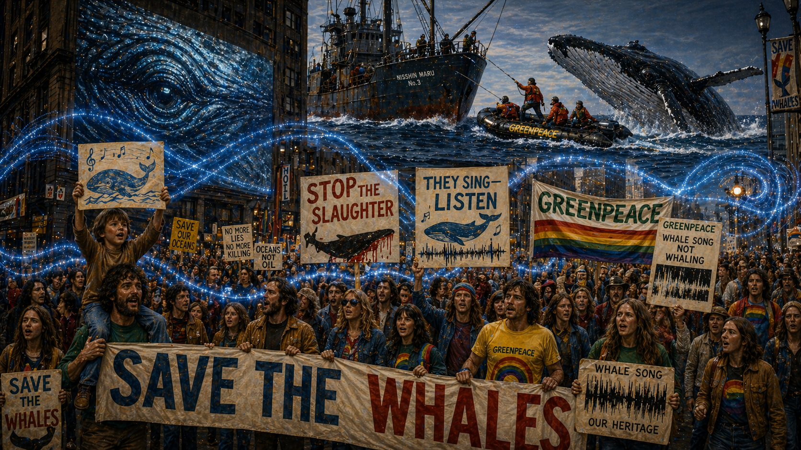

Image Prompt

Please generate a 16:9 image in an ocean-and-sound aesthetic depicting panel 8 of 12. Make the characters and style consistent with the prior panels. The scene shows the explosion of the Save the Whales movement in the mid-1970s. In the foreground, a massive protest march fills a city street — hundreds of people carrying banners reading "SAVE THE WHALES," "STOP THE SLAUGHTER," and "THEY SING — LISTEN." Prominent in the crowd: Greenpeace activists in their signature rainbow colors holding signs with spectrogram images of whale songs. Behind the marchers, projected onto the side of a building, is a giant image of a humpback whale's eye. In the upper portion of the frame, a small Greenpeace Zodiac inflatable boat positions itself between a harpoon vessel and a fleeing whale — one of the iconic confrontation images of the era. Luminous sound-wave patterns thread through the scene like a visual leitmotif, connecting the whale to the protesters. Color palette: protest-sign bright colors — red, yellow, green — against urban gray, with the luminous ocean-blue sound waves weaving through as a reminder of what started it all. Emotional tone: righteous energy, the power of a movement that found its voice through another species' voice. Specific details: (1) the massive protest march with Save the Whales banners, (2) Greenpeace activists with spectrogram signs, (3) the giant whale eye projected on a building, (4) the Zodiac-versus-harpoon-ship confrontation in the upper frame, (5) luminous sound waves threading through the crowd, (6) a child on a parent's shoulders holding a hand-drawn picture of a whale with musical notes. Generate the image immediately without asking clarifying questions.

The movement erupted with a force that stunned even its own architects. "Save the Whales" became the rallying cry of the 1970s environmental movement — printed on bumper stickers, painted on banners, chanted at rallies from San Francisco to Stockholm. Greenpeace sent its small inflatable boats directly between harpoon ships and fleeing whales, and the footage electrified the world. But underneath the drama of confrontation, it was Payne's recordings that provided the emotional engine. Greenpeace played whale songs at every rally, every press conference, every fundraiser. Musicians incorporated them into symphonies and rock albums. Judy Collins, Pete Seeger, and Paul Winter wove whale songs into their performances. The songs became the soundtrack of a moral awakening. For the first time in the history of conservation, an entire species was being saved not by data alone, but by the sound of its own voice.

## Panel 9: The Voyager Golden Record

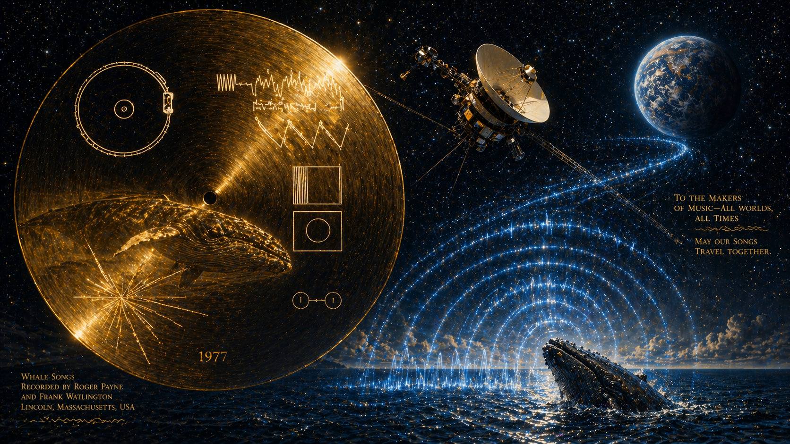

Image Prompt

Please generate a 16:9 image in an ocean-and-sound aesthetic depicting panel 9 of 12. Make the characters and style consistent with the prior panels. The scene shows a breathtaking cosmic composition. In the foreground, the Voyager Golden Record is depicted in gleaming gold, with its iconic cover diagram of a hydrogen atom, a pulsar map, and the stylus instructions visible. Reflected in the gold surface of the record, a humpback whale is visible, as if the whale's image were encoded in the metal itself. Behind the record, the Voyager 1 spacecraft is shown small but detailed, sailing away from Earth into the vastness of interstellar space, with a blue-white Earth receding in the distance. Below, the ocean surface is visible on Earth, with luminous sound waves rising from the water, arcing upward through the atmosphere and into space, connecting the whale songs to the spacecraft. Stars fill the background. Color palette: gold of the record, deep space black, Earth blue-white, luminous cyan sound waves bridging ocean and cosmos, silver starlight. Emotional tone: the sublime — whale songs traveling not just across oceans but across the galaxy, a message from one form of intelligence to whatever other intelligences may exist. Specific details: (1) the Voyager Golden Record in gleaming detail, (2) a whale reflected in the gold surface, (3) the Voyager spacecraft sailing into deep space, (4) Earth receding in the background with oceans visible, (5) luminous sound waves arcing from the ocean surface through the atmosphere into space, (6) the year "1977" inscribed subtly in the composition. Generate the image immediately without asking clarifying questions.

In 1977, NASA launched two Voyager spacecraft on a journey out of the solar system. Affixed to each was a gold-plated phonograph record — a message in a bottle cast into the cosmic ocean, carrying sounds and images chosen to represent life on Earth to any civilization that might find it. Carl Sagan and his team selected greetings in fifty-five languages, music by Bach, Beethoven, and Chuck Berry, the sound of a human heartbeat — and the songs of humpback whales. Roger Payne's recordings were among them. Somewhere beyond the orbit of Neptune, right now, whale songs are traveling through interstellar space at eleven miles per second. The whales that humans had hunted nearly to extinction had become Earth's ambassadors to the universe. It is difficult to imagine a more complete reversal of fortune.

## Panel 10: The Moratorium

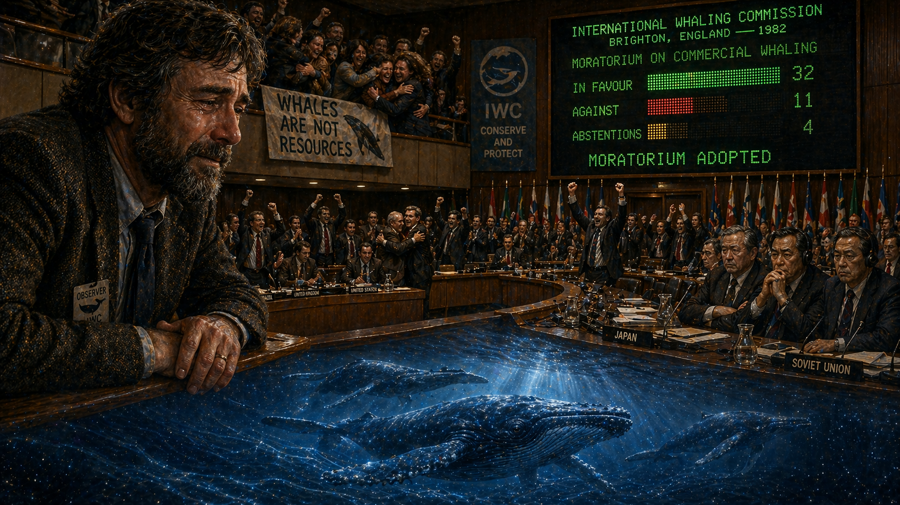

Image Prompt

Please generate a 16:9 image in an ocean-and-sound aesthetic depicting panel 10 of 12. Make the characters and style consistent with the prior panels. The scene shows the International Whaling Commission meeting hall in Brighton, England, in 1982, at the moment the moratorium on commercial whaling is voted through. The hall is formal — wood-paneled walls, long curved delegate tables arranged in a semicircle, national flags and nameplates. Delegates are on their feet: some celebrating with raised fists and embraces, others sitting stone-faced in protest (the Japanese and Soviet delegations). A large electronic voting board on the wall shows the tally — a clear majority in green for the moratorium. In the gallery above, conservation activists are weeping and hugging. Roger Payne, now in his late 40s with a fuller, graying beard, sits in the observer gallery, leaning forward with both hands on the rail, his expression one of exhausted, tearful relief. Below the scene, as a ghostly overlay, a pod of humpback whales swims through a luminous ocean, free. Color palette: formal wood-brown and diplomatic navy in the hall, green lights on the voting board, luminous ocean blue-silver for the whale overlay, warm amber on Payne's face. Emotional tone: the culmination of a decades-long fight — relief, triumph, and the awareness that the battle is not truly over. Specific details: (1) the IWC voting board showing the moratorium passing, (2) celebrating delegates on their feet, (3) stone-faced whaling-nation delegates, (4) Payne in the observer gallery with tears on his weathered face, (5) conservation activists embracing in the gallery, (6) the ghostly overlay of free-swimming humpback whales below the scene. Generate the image immediately without asking clarifying questions.

On July 23, 1982, the International Whaling Commission voted to impose a moratorium on all commercial whaling, effective in 1986. It was the culmination of twenty years of scientific evidence, diplomatic pressure, public protest — and whale songs playing in living rooms around the world. The moratorium was not solely Roger Payne's doing; hundreds of scientists, activists, and diplomats had fought for it. But Payne had done something no one else could. He had given the whales a voice that humans could hear, and that voice had changed the terms of the debate forever. Before the songs, the argument against whaling was about population models and sustainable yield — numbers on paper, easily contested by industry scientists. After the songs, the argument was about whether humanity had the right to silence a sixty-million-year-old chorus. That was a much harder case to argue against.

## Panel 11: The Ocean-Wide Voice

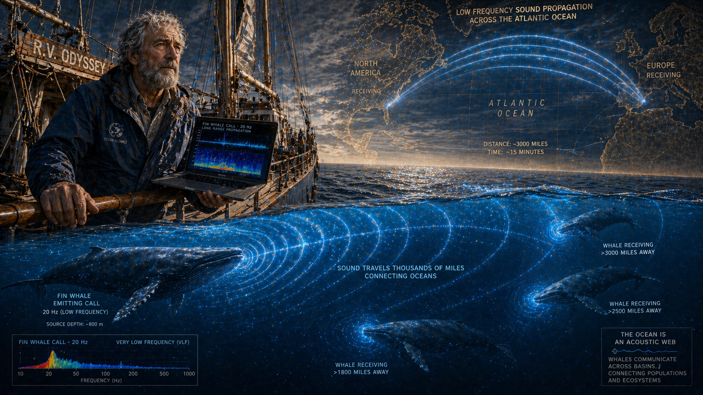

Image Prompt

Please generate a 16:9 image in an ocean-and-sound aesthetic depicting panel 11 of 12. Make the characters and style consistent with the prior panels. The scene shows Roger Payne in the 1990s and 2000s, continuing his life's work aboard a research vessel. Payne is now in his 60s — lean, deeply weathered, with a full silver-white beard and the same kind eyes. He stands at the bow of a sailing research vessel (the RV Odyssey, which he used for his Ocean Alliance expeditions), one hand on the rail, the other holding a laptop showing acoustic data. Below the ship, a cutaway view reveals the underwater world: a fin whale hundreds of meters below the surface is emitting a low-frequency call, and the sound waves — rendered as vast, luminous blue arcs — are spreading outward across an entire ocean basin, spanning thousands of miles. A map overlay shows the sound wave reaching from one side of the Atlantic to the other. Other whales at enormous distances are shown receiving the call, their bodies glowing faintly as the sound reaches them. Color palette: deep ocean navy, silver-white for Payne's hair and beard, luminous blue for the low-frequency sound arcs, warm deck-wood amber, map-overlay in translucent gold. Emotional tone: the vastness of whale communication — an acoustic web spanning entire oceans, a discovery that reframes our understanding of animal intelligence and connectivity. Specific details: (1) older Payne with silver beard and weathered skin at the ship's bow, (2) the laptop showing acoustic frequency data, (3) the cutaway underwater view showing a whale's low-frequency call, (4) luminous sound arcs spreading across the entire ocean basin, (5) distant whales receiving the signal thousands of miles away, (6) a map overlay showing the Atlantic Ocean with sound-propagation paths traced across it. Generate the image immediately without asking clarifying questions.

Payne never stopped listening. In the decades after the moratorium, he continued studying whale communication and made another breathtaking discovery: some whale species, particularly fin whales and blue whales, produce sounds so low in frequency — below the threshold of human hearing — that they can travel across entire ocean basins. A single whale call, reverberating through the deep sound channel, could theoretically reach another whale thousands of miles away. The ocean itself was an acoustic network, and whales had been using it to communicate across continental distances for millions of years. Payne founded Ocean Alliance and launched a five-year global research expedition aboard the sailing vessel *Odyssey*, collecting data on whale health, ocean pollution, and acoustic ecology from every ocean on Earth. The whales, he insisted, were not just worth saving for sentimental reasons. They were indicators of the health of the entire marine ecosystem. Their songs carried information about the state of the sea.

## Panel 12: The Quiet Legacy

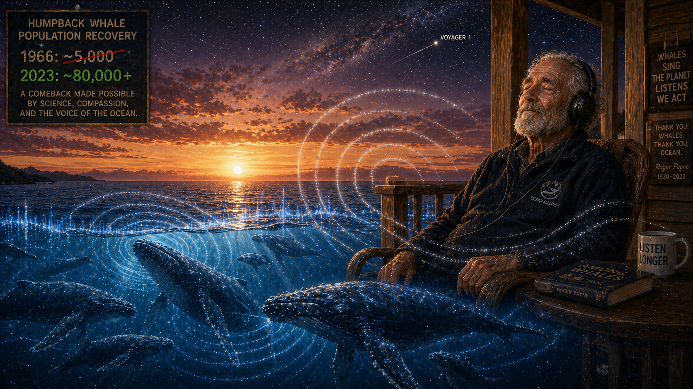

Image Prompt

Please generate a 16:9 image in an ocean-and-sound aesthetic depicting panel 12 of 12. Make the characters and style consistent with the prior panels. The scene is a quiet, luminous composition showing Roger Payne's legacy. In the center, an elderly Payne — now in his late 80s, frail but with the same kind eyes and white beard — sits in a chair on a porch overlooking the ocean at sunset. His eyes are closed, and he is wearing headphones, listening one last time. Below and around him, the ocean comes alive: a pod of humpback whales — mothers with calves, singers with their heads angled downward in the singing posture — fill the underwater space beneath the porch, surrounded by luminous sound waves that radiate outward and upward, enveloping Payne in light. A counter in the corner of the frame shows humpback whale populations: "1966: ~5,000" crossed out and replaced with "2023: ~80,000+" — the recovery that his work helped make possible. The sky is a magnificent sunset — deep orange, purple, and gold — transitioning into a star-filled night sky where, faintly, the tiny spark of the Voyager spacecraft is visible, still carrying whale songs into the cosmos. Color palette: sunset gold and deep purple sky, luminous ocean blue beneath, silver-white sound waves, the warm amber of Payne's porch, starlight. Emotional tone: peace, completion, gratitude — a life that heard something beautiful and made sure the world heard it too. Specific details: (1) elderly Payne with headphones and closed eyes, at peace, (2) humpback whales with calves swimming in the luminous water below, (3) sound waves rising from the whales and enveloping Payne, (4) the population recovery counter showing the comeback, (5) the sunset transitioning to a starry sky, (6) the faint spark of Voyager in the upper corner, still carrying the songs outward. Generate the image immediately without asking clarifying questions.

Roger Payne died on June 10, 2023, at the age of eighty-eight. By then, humpback whale populations had recovered from an estimated five thousand individuals in the late 1960s to over eighty thousand — one of the great conservation success stories in history. He had lived long enough to see his life's work vindicated in the most tangible way possible: in living, breathing, singing whales. But Payne's deepest legacy was not a policy or a population number. It was a shift in human consciousness. He proved that conservation is not just a matter of charts and quotas and rational arguments — it is a matter of the heart. People saved the whales not because they understood the population dynamics, but because they had *heard* them. "If we can't save the whales," Payne once said, "we can't save anything." He showed us how: not by shouting louder, but by handing us a pair of headphones and letting the whales speak for themselves.

### Epilogue -- What Made Roger Payne Different?

Payne was a scientist who understood something that most scientists overlook: data changes minds, but emotion changes behavior. His whale-song research was rigorously scientific — peer-reviewed, replicated, built on meticulous acoustic analysis. But he did not stop at publishing papers. He put the evidence where ordinary people could feel it, in their living rooms, through their speakers, in the vibrations of a vinyl record on a turntable. He understood that the whales' most powerful argument for their own survival was their own voice.

| Challenge | How Payne Responded | Lesson for Today |
|-----------|---------------------|------------------|
| Whales were being hunted to extinction and the public was indifferent | Released whale songs as a commercial album that reached millions | Scientific data is necessary but not sufficient — people need to *feel* the stakes |
| Whaling industry framed whales as renewable resources to be managed | Revealed whales as complex cultural beings with evolving shared songs | Challenge the framing, not just the numbers — language shapes perception |
| Conservation arguments were trapped in technical, policy-wonk language | Used music, media, and storytelling to reach beyond the scientific community | Meet people where they are — a record album reached more minds than a hundred papers |
| International cooperation seemed impossible with competing economic interests | The moratorium passed because public pressure made whaling politically untenable | When enough people care, policy follows — emotional engagement drives political will |

### Call to Action

Roger Payne spent his life listening. In a world that rewards loudness, his greatest tool was a pair of headphones and the patience to hear what the ocean was trying to tell us. Today, the oceans face new threats that Payne spent his final decades warning about — shipping noise that drowns out whale communication, warming waters that disrupt migration patterns, plastic pollution that accumulates in the bodies of marine mammals, and the slow acidification of the seas. The moratorium on commercial whaling still holds, but it is not permanent, and some nations still hunt whales under exemptions for "scientific research." The whales are still singing. The question Payne would ask you is simple: *Are you listening?* You do not need a hydrophone or a research vessel. You need curiosity, a willingness to care about creatures you may never see, and the understanding that the health of the ocean is inseparable from the health of everything else on Earth — including you. Everything is connected. The whales have been singing that truth for sixty million years.

---

*"For the first time in my life, I heard a sound I knew I would carry to my grave. It was the voice of a creature that was at once the most beautiful and the most terrible sound I had ever heard."*
—Roger Payne, on first hearing humpback whale songs

*"If we can't save the whales, we can't save anything."*
—Roger Payne

*"The world is full of magic things, patiently waiting for our senses to grow sharper."*
—Roger Payne, reflecting on ocean acoustics

---

## References

1. [Wikipedia: Roger Payne](https://en.wikipedia.org/wiki/Roger_Payne) — Biography of the bioacoustician who discovered humpback whale songs and catalyzed the Save the Whales movement
2. [Wikipedia: Songs of the Humpback Whale](https://en.wikipedia.org/wiki/Songs_of_the_Humpback_Whale_(album)) — The bestselling nature recording in history and its impact on conservation
3. [Wikipedia: International Whaling Commission](https://en.wikipedia.org/wiki/International_Whaling_Commission) — The intergovernmental body that imposed the 1986 moratorium on commercial whaling
4. [Wikipedia: Voyager Golden Record](https://en.wikipedia.org/wiki/Voyager_Golden_Record) — The phonograph record aboard the Voyager spacecraft carrying whale songs into interstellar space
5. [Ocean Alliance: Roger Payne's Legacy](https://whale.org/) — The organization Payne founded to study and protect whales through research and public education
