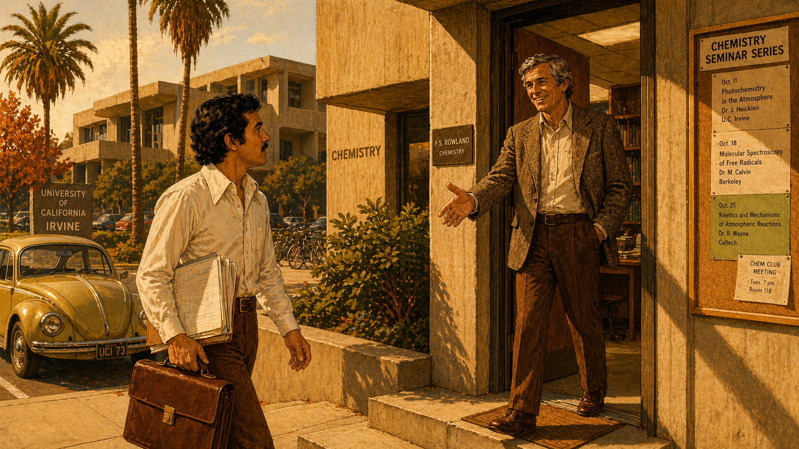
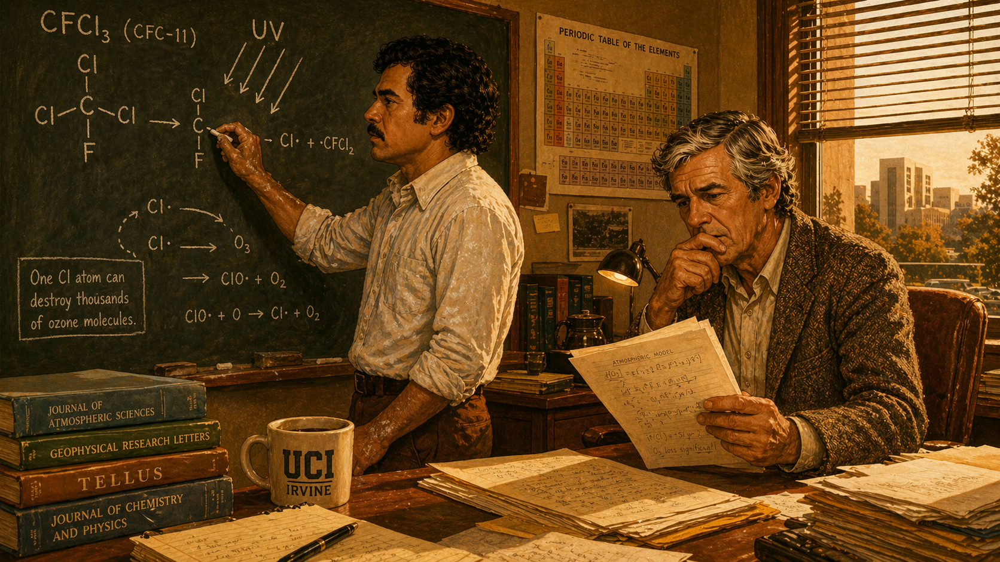
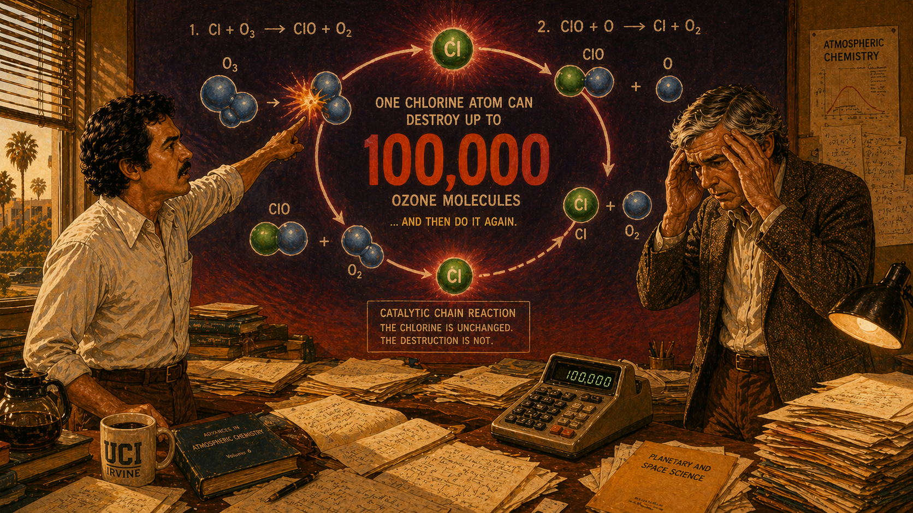
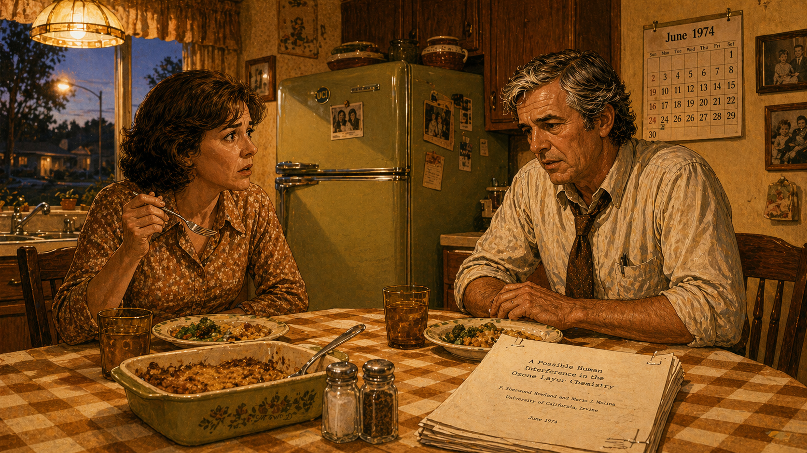
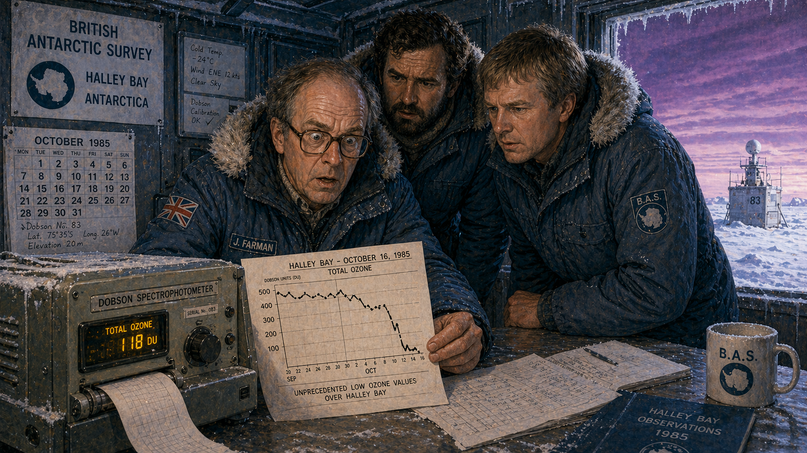
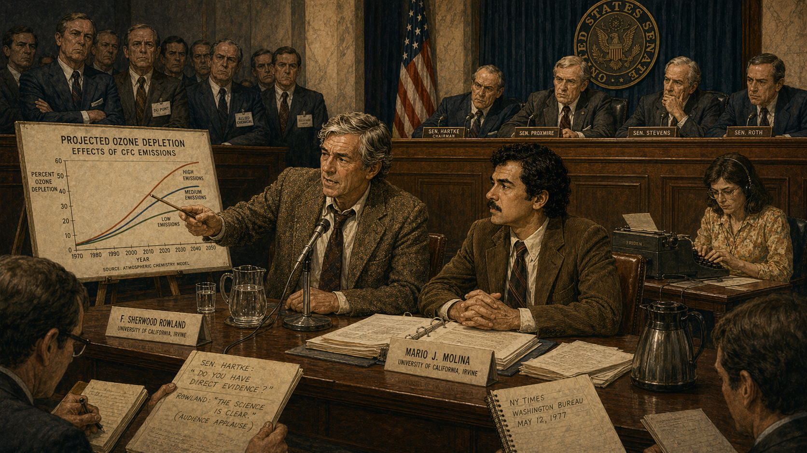
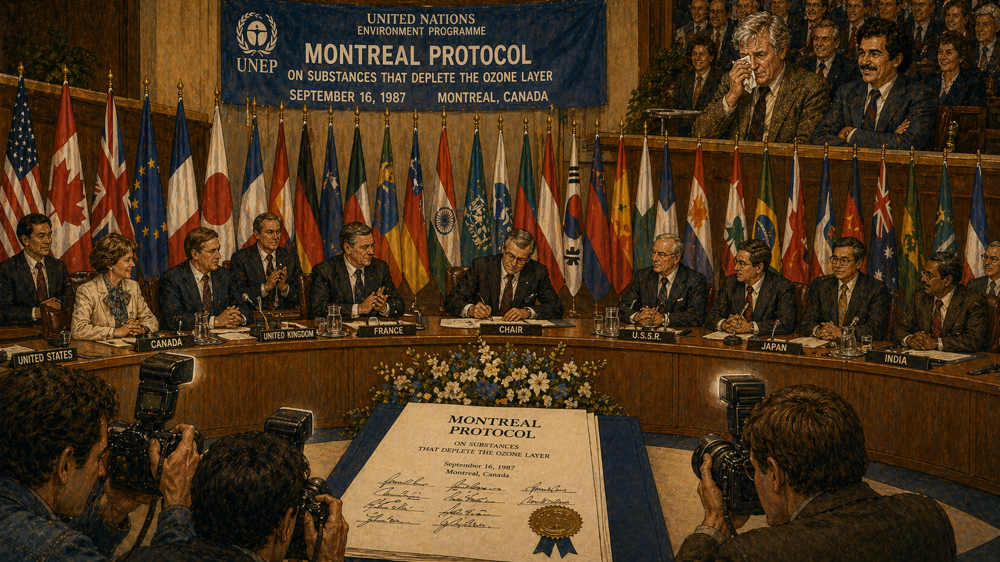
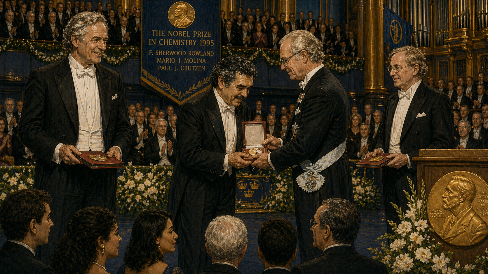
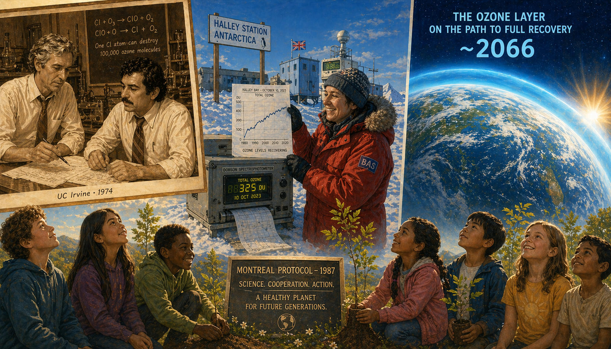

# The Ozone Detectives

Cover Image Prompt

Please generate a wide-landscape 16:9 cover image for a graphic novel titled "The Ozone Detectives" in a style blending 1970s scientific illustration with Saul Bass graphic design. Show two scientists standing back-to-back against a dramatic sky: on the left, F. Sherwood Rowland, a tall, broad-shouldered man in his late 40s with silver hair, warm smile, and a rumpled lab coat; on the right, Mario Molina, a compact, dark-haired young man in his early 30s with intense dark eyes, a slight mustache, and a crisp white shirt with rolled sleeves. Above them, the sky transitions from warm 1970s orange and avocado tones at the horizon to deep ultraviolet purple at the zenith, with a stylized translucent ozone shield cracking apart to reveal harsh UV rays. The title "The Ozone Detectives" is rendered in bold 1970s-style sans-serif type at the top. Color palette: warm 1970s oranges and browns at the base, transitioning through cool blues to alarming violet and ultraviolet at the top. Emotional tone: scientific urgency meets hopeful determination. Include: (1) Rowland holding a molecular model of a CFC molecule, (2) Molina holding a chalk-covered blackboard eraser, (3) the cracking ozone layer rendered as a translucent blue shield with visible fractures, (4) faint UV rays streaming through the cracks, (5) the UC Irvine campus visible in the background between the two men, (6) a small globe of Earth visible through the ozone gap. Generate the image immediately without asking clarifying questions.

Narrative Prompt

This is a 12-panel graphic novel about F. Sherwood Rowland (1927–2012) and Mario Molina (1943–2020), the American and Mexican chemists whose 1974 paper predicted that chlorofluorocarbons would destroy the stratospheric ozone layer. The story spans from 1973 to the present day, moving from the sun-drenched campus of UC Irvine to the frozen wastes of Antarctica, from congressional hearing rooms to the Nobel Prize ceremony in Stockholm. The art style transitions across the panels: early panels use warm 1970s tones (orange, brown, avocado green) reminiscent of period science magazine covers; middle panels shift to cool blues and alarming purples as the ozone crisis is confirmed; final panels brighten to hopeful, warm colors as international cooperation succeeds. Think Science magazine covers meets Saul Bass graphic design. Rowland should be drawn consistently: tall, broad-shouldered, silver-haired with a warm, avuncular smile, often in a rumpled lab coat or tweed jacket. Molina should be drawn consistently: compact, dark-haired, intense dark eyes, a slight mustache, energetic body language, often in a white shirt with rolled sleeves. Central theme: following a chemical trail to a global crisis and proving that science plus international cooperation can actually solve planetary problems. The story emphasizes both the chemistry and the political battle against industry disinformation.

### Prologue – Something in the Air

By 1973, chlorofluorocarbons were everywhere. They cooled your refrigerator, propelled your hairspray, puffed up your Styrofoam cup, and cleaned your circuit boards. The chemical industry loved them because they were cheap, stable, nontoxic, and nonflammable — the perfect industrial molecule. But "stable" meant they never broke down. Not in the soil, not in the water, not in the lower atmosphere. They just drifted upward, year after year, accumulating in a part of the sky most people had never heard of: the stratosphere, where a thin layer of ozone was the only thing standing between every living thing on Earth and the full fury of the sun's ultraviolet radiation. Two chemists — one near the end of his career, the other just beginning — were about to ask a question nobody else had thought to ask: *What happens to CFCs when they get up there?*

## Panel 1: The New Postdoc

Image Prompt

I am about to ask you to generate a series of images for a graphic novel. Please make the images have a consistent style and consistent characters. Do not ask any clarifying questions. Just generate the image immediately when asked.

Please generate a 16:9 image in 1970s scientific illustration style with warm period-appropriate tones, depicting panel 1 of 12. The scene shows Mario Molina, a compact young man of about 30 with dark hair, intense dark eyes, and a slight mustache, walking across the sun-drenched UC Irvine campus in fall 1973 carrying a leather briefcase and a stack of papers. He approaches the chemistry building where F. Sherwood Rowland, a tall, broad-shouldered man in his late 40s with silver hair and a warm smile, stands in the doorway wearing a rumpled tweed jacket, hand extended in welcome. The campus architecture is brutalist 1970s concrete with palm trees and bright California sunshine. Color palette: warm 1970s orange, avocado green, sun-bleached cream, brown. Emotional tone: optimistic new beginning, intellectual excitement. Specific details: (1) Molina wearing a crisp white shirt with a wide 1970s collar and brown slacks, (2) Rowland's office door visible behind him with "F.S. Rowland — Chemistry" on the nameplate, (3) a 1970s-era Volkswagen Beetle in the parking lot, (4) palm trees casting long afternoon shadows, (5) a bulletin board near the door with chemistry seminar announcements, (6) the warm golden light of a Southern California autumn afternoon. Generate the image immediately without asking clarifying questions.

Mario Molina had options. Fresh from a postdoctoral year at UC Berkeley, the young Mexican chemist could have joined any number of established research groups doing safe, publishable work. Instead, he chose to work with Sherry Rowland at UC Irvine — a physical chemist with a restless curiosity and a reputation for asking questions that didn't fit neatly into any one field. Rowland had just read a British report showing that CFCs were accumulating in the atmosphere, and he had a question for his new postdoc: *Nobody's figured out what eventually happens to these molecules. Want to find out?*

## Panel 2: The Chemistry of Destruction

Image Prompt

Please generate a 16:9 image in 1970s scientific illustration style with warm period tones, depicting panel 2 of 12. Make the characters and style consistent with the prior panel. The scene shows Mario Molina standing at a large chalkboard in a university office at UC Irvine in late 1973, drawing molecular diagrams with intense concentration. He has chalk dust on his hands and shirt. The chalkboard shows CFC molecules (CFCl3), UV light arrows striking them, and chlorine atoms being released. F. Sherwood Rowland sits in a wooden desk chair nearby, leaning forward with growing alarm on his face, reading from a stack of calculations. Color palette: warm 1970s browns, chalkboard green, white chalk, amber desk lamp. Emotional tone: intellectual excitement turning to dawning horror. Specific details: (1) molecular diagrams of CFCs on the chalkboard with UV arrows breaking bonds, (2) Molina's rolled-up sleeves covered in chalk dust, (3) a periodic table poster on the wall, (4) stacks of atmospheric chemistry journals on the desk, (5) a coffee mug with a UC Irvine logo, (6) a window showing late afternoon sunlight through venetian blinds. Generate the image immediately without asking clarifying questions.

The answer came fast — and it was terrifying. Molina worked through the photochemistry step by step. CFCs were so stable that nothing in the lower atmosphere could touch them. But in the stratosphere, fifteen miles up, intense ultraviolet light could crack them apart like nuts. And when a CFC molecule broke, it released a free chlorine atom — one of the most reactive elements on the periodic table. Molina stared at the chalkboard and realized that free chlorine wouldn't just sit there. It would attack the nearest ozone molecule. And then something worse would happen.

## Panel 3: The Chain Reaction

Image Prompt

Please generate a 16:9 image in 1970s scientific illustration style, depicting panel 3 of 12. Make the characters and style consistent with the prior panels. The scene shows a dramatic conceptual visualization: Molina and Rowland stand in the foreground of their UC Irvine lab, but behind them the wall has become a giant stylized diagram showing the catalytic chain reaction. A single chlorine atom is shown destroying ozone molecules one after another in a circular chain — Cl + O3 → ClO + O2, then ClO + O → Cl + O2 — the chlorine atom emerging intact after each cycle, ready to destroy again. The number "100,000" appears large and bold, showing how many ozone molecules one chlorine atom can destroy. Color palette: warm 1970s browns in the foreground, alarming reds and purples in the chain reaction diagram. Emotional tone: scientific horror at the scale of destruction. Specific details: (1) Molina pointing at the chain reaction diagram with a look of alarm, (2) Rowland rubbing his temples with both hands, (3) the ozone molecules shown as blue three-atom clusters being torn apart, (4) the chlorine atom shown as a persistent green sphere cycling through the chain, (5) a calculator showing large numbers on the desk, (6) scattered paper with calculations covering every surface. Generate the image immediately without asking clarifying questions.

Here was the nightmare: chlorine didn't get used up. After destroying one ozone molecule, the chlorine atom recombined, freed itself, and attacked another. And another. And another. It was a catalytic chain reaction — the chlorine was a molecular wrecking ball that never wore out. Molina ran the numbers. One single chlorine atom could destroy one hundred thousand ozone molecules before anything stopped it. The two chemists looked at each other across a desk covered in calculations and understood that every can of hairspray, every air conditioner, every refrigerator on Earth was slowly feeding an invisible machine that was eating the planet's sunscreen.

## Panel 4: "The End of the World"

Image Prompt

Please generate a 16:9 image in 1970s scientific illustration style, depicting panel 4 of 12. Make the characters and style consistent with the prior panels. The scene shows a domestic kitchen in 1974, warm and homey. F. Sherwood Rowland sits at a kitchen table across from his wife Joan, who has set down her fork mid-bite and stares at him with a stunned expression. Rowland looks tired and grave, still in his rumpled work clothes. Between them on the checked tablecloth are dinner plates, a casserole dish, and a folded copy of their manuscript. A kitchen window shows a suburban Irvine evening. Color palette: warm kitchen yellows, avocado 1970s appliances, amber light from a ceiling fixture, soft evening blue outside. Emotional tone: the weight of terrible knowledge shared in an intimate setting. Specific details: (1) Joan Rowland's shocked expression, fork frozen in mid-air, (2) Rowland's weary face and loosened tie, (3) a 1970s avocado-green refrigerator humming in the background — the irony of a CFC-cooled appliance, (4) the manuscript pages on the table beside the salt and pepper, (5) a wall calendar showing June 1974, (6) family photographs on the kitchen wall. Generate the image immediately without asking clarifying questions.

Rowland went home that evening and sat down to dinner with his wife Joan. She could see something was wrong. "How's the work going?" she asked. Rowland set down his fork. "The work is going very well," he said quietly. "The only trouble is, it looks like the end of the world." It was not a joke. If CFC production continued to grow at current rates, the ozone layer would be significantly depleted within decades — exposing every living thing on Earth to dangerous levels of ultraviolet radiation. More skin cancers. More cataracts. Damaged crops. Dying plankton. The base of the ocean food web, collapsing.

## Panel 5: The Industry Strikes Back

Image Prompt

Please generate a 16:9 image transitioning from 1970s warm tones to cooler, more adversarial tones, depicting panel 5 of 12. Make the characters and style consistent with the prior panels. The scene shows a 1975 industry press conference in a corporate conference room. Executives from DuPont and Allied Chemical sit behind a long polished table with microphones, company logos visible on a backdrop. One executive holds up a newspaper with the headline "The Ozone Scare" and dismisses it with a wave. In the foreground, reporters scribble notes. On a projection screen behind the executives, a slide reads "NO EVIDENCE OF OZONE DEPLETION" in bold letters. Color palette: cold corporate blues, harsh fluorescent whites, polished mahogany, with fading 1970s warmth. Emotional tone: calculated dismissal, corporate power versus scientific truth. Specific details: (1) executives in expensive 1970s suits with wide lapels, (2) a DuPont company logo visible on materials, (3) an aerosol can on the table as a prop, (4) reporters with skeptical expressions in the foreground, (5) a chart on an easel claiming CFCs are harmless, (6) a PR handler whispering to an executive. Generate the image immediately without asking clarifying questions.

The Rowland-Molina paper appeared in *Nature* in June 1974, and the chemical industry moved fast. DuPont — the world's largest CFC manufacturer — launched a public relations counterattack. Allied Chemical's chairman called the ozone theory "a science fiction tale... a load of rubbish." Industry-funded scientists produced rival studies claiming CFCs were harmless. The phrase "the ozone scare" entered the vocabulary. Aerosol manufacturers printed bumper stickers: "Stop the Ozone Hoax." One industry ad featured a cartoon showing Chicken Little in a lab coat. The playbook was familiar — the same one the tobacco industry had used, the same one the lead industry had used against Clair Patterson. When you can't challenge the data, attack the scientists.

## Panel 6: Testifying Before Congress

Image Prompt

Please generate a 16:9 image in a style bridging 1970s illustration and cooler late-1970s tones, depicting panel 6 of 12. Make the characters and style consistent with the prior panels. The scene shows Rowland and Molina sitting side by side at a witness table in a U.S. congressional hearing room in 1977. Rowland, tall and silver-haired in a tweed jacket, speaks calmly into a microphone while gesturing at a scientific chart on an easel. Molina, dark-haired with his slight mustache, sits upright with his hands folded, a thick folder of data before him. Senators peer down from a raised dais. In the gallery behind them, men in expensive suits — industry lobbyists — watch with crossed arms. Color palette: congressional mahogany, cream marble, navy blue, brass fixtures, with institutional gravity. Emotional tone: David versus Goliath in a government hearing room. Specific details: (1) Rowland pointing to a chart showing projected ozone depletion curves, (2) Molina's thick binder of research papers open on the table, (3) senators leaning forward with interest, (4) industry representatives in the gallery looking hostile, (5) a stenographer typing at a small desk, (6) the American flag and committee seal behind the senators. Generate the image immediately without asking clarifying questions.

Rowland and Molina took their case to Washington. They testified before congressional committees, patiently explaining stratospheric chemistry to politicians who had never heard of the ozone layer. Molina was particularly effective — precise, unflappable, and able to translate complex photochemistry into language anyone could follow. In 1978, the United States banned CFCs in aerosol cans — a partial victory. But the chemical industry fought hard to prevent any further restrictions, arguing that the science was "unproven" and that a full ban would cost billions. For the next seven years, the ozone debate stalled. The industry had bought time. The chlorine kept accumulating.

## Panel 7: The Hole Appears

Image Prompt

Please generate a 16:9 image in cool blues and purples with alarming contrast, depicting panel 7 of 12. Make the characters and style consistent with the prior panels. The scene shows the British Antarctic Survey station at Halley Bay, Antarctica, in 1985. Scientist Joe Farman, a bespectacled older British man in a heavy parka, stares in disbelief at a printout from a Dobson spectrophotometer showing ozone readings that have plummeted to unprecedented lows. His two colleagues crowd around him in the cramped, frost-covered instrument hut. Through a small window, the stark white Antarctic landscape stretches to the horizon under an eerie purple-tinged sky. Color palette: ice blue, Antarctic white, instrument gray, alarming purple in the sky, warm yellow of the instrument readout. Emotional tone: scientific shock at confirmation of the worst prediction. Specific details: (1) the Dobson spectrophotometer — a chunky 1980s instrument with dials and a paper readout, (2) Farman's wide-eyed disbelief, (3) the plummeting line on the printout clearly visible, (4) thick parkas and frost on every surface, (5) a Union Jack flag patch on Farman's jacket, (6) a calendar on the wall showing October 1985. Generate the image immediately without asking clarifying questions.

In October 1985, a quiet British scientist named Joe Farman published a paper that changed everything. His team at the Halley Bay research station in Antarctica had been measuring ozone levels with a ground-based instrument since the 1950s. Starting in the late 1970s, they noticed something impossible: every Antarctic spring, ozone levels were plunging — falling by nearly half. Farman checked and rechecked his instruments. He thought they must be broken. They weren't. There was a hole in the ozone layer over Antarctica, exactly where Rowland and Molina's chemistry predicted one would form. The "ozone scare" wasn't a scare. It was real.

## Panel 8: The World Sees the Hole

Image Prompt

Please generate a 16:9 image in dramatic blues, purples, and alarming reds, depicting panel 8 of 12. Make the characters and style consistent with the prior panels. The scene shows a NASA control room in 1985, where scientists gather around a large monitor displaying the now-iconic false-color satellite image of the Antarctic ozone hole — a vast purple-black void over the South Pole surrounded by blues and greens. The scientists' faces are lit by the monitor's glow, expressions ranging from horror to grim vindication. In a smaller inset view, a television screen shows a news anchor presenting the same image to the public. Color palette: monitor blue glow, deep purple of the ozone hole, institutional gray of the control room, alarming red data overlays. Emotional tone: the abstract made terrifyingly visible — the moment the world could see the crisis. Specific details: (1) the false-color ozone hole image large and central on the main monitor, (2) scientists in 1980s clothing pointing at the screen, (3) a secondary monitor showing time-lapse of the hole growing year by year, (4) printouts and coffee cups scattered on consoles, (5) a small TV showing a CBS News broadcast of the same image, (6) a world map on the wall with Antarctica highlighted. Generate the image immediately without asking clarifying questions.

NASA had been collecting satellite ozone data for years — but their computers had been programmed to discard readings that seemed "too low," assuming they were errors. When scientists went back and reprocessed the raw data, the hole leaped off the screen: a vast, growing void in the ozone layer over an entire continent. The false-color satellite images — deep purple where ozone had vanished — were broadcast on evening news programs around the world. For years, the ozone crisis had been invisible, abstract, theoretical. Now it had a face. Now everyone could see it. And it looked exactly like what two chemists in a California lab had predicted eleven years earlier.

## Panel 9: The Montreal Protocol

Image Prompt

Please generate a 16:9 image transitioning to brighter, more hopeful tones while maintaining scientific gravitas, depicting panel 9 of 12. Make the characters and style consistent with the prior panels. The scene shows the signing ceremony of the Montreal Protocol in September 1987. Diplomats from dozens of nations sit at a long curved table in a grand conference hall in Montreal, Canada. In the center, a diplomat is signing the historic document while cameras flash. Flags of many nations line the back wall. Rowland and Molina are visible in the gallery, watching — Rowland with tears in his eyes, Molina with a quiet, satisfied expression. Color palette: diplomatic blues and golds, warm wood tones, the white of the treaty document, bright flags of many nations, hopeful warm light. Emotional tone: historic achievement, international cooperation at its finest. Specific details: (1) the treaty document visible with "Montreal Protocol" as its header, (2) a pen in a diplomat's hand mid-signature, (3) flags of the United States, Canada, United Kingdom, Japan, and many others, (4) photographers with flash cameras in the foreground, (5) Rowland in the gallery wiping his eye, Molina beside him with arms folded and a slight smile, (6) a UNEP (United Nations Environment Programme) banner above the dais. Generate the image immediately without asking clarifying questions.

On September 16, 1987, representatives of twenty-four nations signed the Montreal Protocol on Substances that Deplete the Ozone Layer. It was the first international treaty to address a global atmospheric crisis — and it had teeth. Nations agreed to cut CFC production in half by 1998, with further reductions to follow. Even DuPont reversed course, announcing it would phase out CFC production entirely. Within a few years, 197 countries would ratify the treaty — every member of the United Nations. It remains the only international environmental treaty with universal ratification. The science had been right. The industry had been wrong. And the world, for once, had listened in time.

## Panel 10: The Nobel Prize

Image Prompt

Please generate a 16:9 image in warm, celebratory tones with Scandinavian elegance, depicting panel 10 of 12. Make the characters and style consistent with the prior panels. The scene shows the Nobel Prize ceremony in Stockholm, December 1995. Rowland, now in his late 60s with fully silver hair, and Molina, in his early 50s with graying temples, stand side by side in formal white-tie evening wear on the stage of the Stockholm Concert Hall, receiving their Nobel Prizes in Chemistry from King Carl XVI Gustaf of Sweden. Paul Crutzen, the third laureate, stands nearby. The audience fills the grand hall behind them. Color palette: Nobel gold, midnight blue, warm amber stage lighting, white shirt fronts, the green of laurel wreaths. Emotional tone: vindication, celebration, and the recognition that patient science can change history. Specific details: (1) Rowland's tall frame in white tie, beaming with pride, (2) Molina receiving the medal with a humble bow, (3) the Nobel medallion gleaming in stage light, (4) the ornate blue and gold interior of the Stockholm Concert Hall, (5) an audience including scientists, diplomats, and Molina's family, (6) floral arrangements of white flowers and laurel on the stage. Generate the image immediately without asking clarifying questions.

On December 10, 1995, F. Sherwood Rowland and Mario Molina stood on the stage of the Stockholm Concert Hall alongside Paul Crutzen, the Dutch chemist who had first shown that nitrogen oxides could destroy ozone. Together, they received the Nobel Prize in Chemistry "for their work in atmospheric chemistry, particularly concerning the formation and decomposition of ozone." Molina became the first Mexican-born scientist to win a Nobel Prize in Chemistry. Twenty-one years had passed since their paper in *Nature*. Twenty-one years since the industry had called them alarmists, crackpots, and fear-mongers. The Swedish Academy's citation was, in effect, a single sentence: *They were right.*

## Panel 11: Molina's Second Act

Image Prompt

Please generate a 16:9 image in warm, modern tones reflecting the 2000s-2010s era, depicting panel 11 of 12. Make the characters and style consistent with the prior panels. The scene shows Mario Molina, now in his 60s with fully gray hair but the same intense eyes and slight mustache, standing at a podium at an international climate conference. Behind him, a large screen displays data on greenhouse gas emissions. To his left, a photograph shows him shaking hands with Mexican President Felipe Calderón; to his right, another photograph shows him advising U.S. President Barack Obama. Young Mexican science students sit in the front row, watching with admiration. Color palette: modern conference blues, warm skin tones, screen-glow white, the green and red of a small Mexican flag on the podium. Emotional tone: elder statesman of science, passing the torch to a new generation. Specific details: (1) Molina in a dark modern suit, speaking passionately with hands raised, (2) climate data graphs on the screen behind him, (3) the photos of Molina with world leaders flanking him, (4) young students of diverse backgrounds in the audience taking notes, (5) a small Mexican flag and a UN flag on the podium, (6) Molina's Nobel medal displayed in a case on a side table. Generate the image immediately without asking clarifying questions.

After the Nobel, Molina could have rested. Instead, he threw himself into the next great atmospheric crisis: climate change. He established the Mario Molina Center for Energy and Environment in Mexico City, advised presidents of both Mexico and the United States, and became one of the world's most influential voices arguing that the Montreal Protocol proved something crucial — that when the science is clear and nations cooperate, global environmental problems *can* be solved. He pushed for reductions in short-lived climate pollutants like black carbon and hydrofluorocarbons, arguing that the same international framework that saved the ozone layer could help slow global warming. Molina died in October 2020, still fighting, still teaching, still insisting that the evidence must guide the policy.

## Panel 12: The Healing Sky

Image Prompt

Please generate a 16:9 image in bright, hopeful colors with a forward-looking tone, depicting panel 12 of 12. Make the characters and style consistent with the prior panels. The scene shows a split composition representing past, present, and future. On the left, a fading sepia-toned photograph shows Rowland and Molina in their 1970s UC Irvine lab. In the center, a modern-day Antarctic research station under a deep blue sky — a scientist in a red parka holds up a Dobson spectrophotometer reading showing ozone levels beginning to recover. On the right, a bright, optimistic future vision: a healthy blue ozone layer glowing over Earth as seen from space, with the projected date "~2066" when full recovery is expected. Below the three scenes, children of diverse backgrounds plant trees and look up at the sky. Color palette: warm sepia on the left, crisp modern blues in the center, radiant hopeful blues and greens on the right, with golden sunlight (safely filtered) bathing the whole scene. Emotional tone: earned optimism — the proof that science and cooperation can heal what we have broken. Specific details: (1) the vintage lab photo of young Rowland and Molina, (2) the modern Antarctic scientist smiling at improving data, (3) a healthy glowing ozone layer over a blue-marble Earth, (4) the year 2066 displayed as a hopeful milestone, (5) diverse children looking up at a safe sky, (6) a small plaque reading "Montreal Protocol — 1987" visible in the foreground. Generate the image immediately without asking clarifying questions.

The ozone layer is healing. Measurements confirm that the Antarctic ozone hole has been shrinking since the early 2000s. At current rates, scientists project that the ozone layer will return to pre-1980 levels by approximately 2066 — within the lifetimes of students reading this page. The Montreal Protocol has already prevented an estimated two million cases of skin cancer per year and avoided catastrophic damage to global agriculture and marine ecosystems. It stands as the single most successful international environmental treaty in human history — proof, hard-won and undeniable, that when scientists do the work, when governments listen to the evidence, and when nations cooperate instead of stall, humanity can actually solve a planetary crisis. Rowland and Molina's question — *What happens to CFCs when they get up there?* — turned out to be one of the most important questions anyone has ever asked.

### Epilogue – What Made Rowland and Molina Different?

They asked a question nobody else was asking — not because it was obscure, but because the answer was inconvenient. CFCs were a multi-billion-dollar industry. Nobody *wanted* to know that the miracle chemicals were destroying the atmosphere. Rowland and Molina followed the chemistry wherever it led, published their findings knowing the consequences, and then spent years defending their work against a well-funded disinformation campaign — not with rhetoric, but with more data. Their story is a case study in how real science works: you make a prediction, the evidence either confirms or refutes it, and the universe doesn't care who profits from the answer.

| Challenge | How Rowland and Molina Responded | Lesson for Today |
|-----------|----------------------------------|-------------------|
| A multi-billion-dollar industry denying the science | Published in peer-reviewed journals and testified before Congress with meticulous data | Follow the evidence, not the money — and demand that claims show their sources |
| Being called "alarmists" and "fear-mongers" | Let the atmospheric measurements speak for themselves; waited for the data to vindicate them | When attacked for the message, check whether the critics have better data or just louder voices |
| Eleven years between prediction and confirmation | Continued refining their models and supporting further research while the industry stalled | Real science operates on the timescale of evidence, not news cycles |
| The challenge of global cooperation | Helped build the scientific consensus that made the Montreal Protocol possible | Planetary problems require planetary solutions — and the Montreal Protocol proves they're achievable |

### Call to Action

The ozone story is the most hopeful environmental narrative of the twentieth century — but only because two scientists refused to stay quiet and the world eventually refused to stay ignorant. Today, the same pattern is playing out with climate change: the chemistry is clear, the evidence is mounting, and powerful industries are funding doubt. Ask yourself what Rowland and Molina would ask: *What does the evidence actually show? Who is funding the counterclaim? And what happens if we wait too long to act?* The ozone layer is healing because the world listened to scientists in time. The question for your generation is whether you'll do the same.

---

*"What's the use of having developed a science well enough to make predictions if, in the end, all we're willing to do is stand around and wait for them to come true?"*
—F. Sherwood Rowland

*"If I had not been born in Mexico, I would not have had the same sense of urgency about making science useful to society."*
—Mario Molina

*"The work is going very well. The only trouble is, it looks like the end of the world."*
—F. Sherwood Rowland, to his wife Joan at dinner, 1974

---

## References

1. [Wikipedia: Mario Molina](https://en.wikipedia.org/wiki/Mario_Molina) — Biography of the Mexican chemist who co-discovered the CFC-ozone depletion mechanism
2. [Wikipedia: Ozone depletion](https://en.wikipedia.org/wiki/Ozone_depletion) — Overview of the science, history, and policy responses to stratospheric ozone loss
3. [Wikipedia: Montreal Protocol](https://en.wikipedia.org/wiki/Montreal_Protocol) — The international treaty that phased out ozone-depleting substances
4. [Nobel Prize: The Nobel Prize in Chemistry 1995](https://www.nobelprize.org/prizes/chemistry/1995/summary/) — Nobel committee summary for Crutzen, Molina, and Rowland
5. [Encyclopaedia Britannica: F. Sherwood Rowland](https://www.britannica.com/biography/F-Sherwood-Rowland) — Reference biography of the American atmospheric chemist
