# The Wood Wide Web

Cover Image Prompt

Please generate a wide-landscape 16:9 cover image for a graphic novel titled "The Wood Wide Web" in a Pacific Northwest forest art style reminiscent of Miyazaki's luminous forests meets scientific illustration. Show Suzanne Simard, a sturdy, practical woman in her 40s with brown hair pulled back, wearing a plaid flannel shirt, field vest, and hiking boots, standing at the base of an enormous old-growth Douglas fir in a British Columbia forest. One hand rests on the bark of the tree. The scene is split: above ground, towering conifers with dappled golden-green light filtering through the canopy, sword ferns, and mossy logs; below ground, a luminous cross-section reveals a vast mycorrhizal network rendered as softly glowing golden-white threads connecting the root systems of trees of all sizes. The largest tree's roots glow brightest, acting as the hub. The title text "The Wood Wide Web" is rendered in organic, root-like typography at the top. Color palette: deep forest green, Douglas fir brown, dappled gold, moss emerald, rich soil umber above ground; warm bioluminescent gold, amber, and soft violet for the underground fungal network. Emotional tone: wonder, interconnection, and the hidden life beneath our feet. Include: (1) Simard's bright, determined eyes and practical field clothing, (2) towering old-growth Douglas firs with textured bark, (3) the cross-section revealing the underground root and fungal network, (4) glowing mycorrhizal threads connecting large and small trees, (5) a young seedling above ground visibly connected to the mother tree's root network below, (6) Pacific Northwest forest floor details — sword ferns, mossy nurse logs, shelf fungi on a snag. Generate the image immediately without asking clarifying questions.

Narrative Prompt

This is a 12-panel graphic novel about Suzanne Simard (1960-present), the Canadian forest ecologist who discovered that trees share nutrients through underground mycorrhizal fungal networks — the "Wood Wide Web." The story spans from the 1960s to the 2020s, set primarily in the forests and clearcuts of British Columbia, university laboratories, and academic conference halls. The art style throughout is Pacific Northwest forest palette — towering Douglas firs, dappled light through canopy, rich browns and greens above ground; below ground, luminous mycorrhizal networks rendered as glowing threads connecting root systems. Think Miyazaki's Forest Spirit meets scientific illustration. Ethereal underground scenes contrast with rugged above-ground logging landscapes. Simard should be drawn consistently across panels: a sturdy, practical woman with brown hair (graying in later panels), bright determined eyes, often in forestry field gear — plaid shirt, field vest, hiking boots, hard hat when on logging sites. In early childhood panels she is a small, curious girl with brown braids. Central ecology theme: forests are cooperative networks, not collections of competing individuals — trees share carbon, water, and chemical signals through fungal partners, with the largest "mother trees" acting as network hubs. The story emphasizes mutualism, nutrient cycling, systems thinking, feedback loops, and the courage required to challenge an entrenched scientific and industrial paradigm.

### Prologue -- The Forest Beneath the Forest

Walk into an old-growth forest in British Columbia and you will feel it before you understand it — a sense of presence, of life layered upon life, of something vast and quiet breathing all around you. The air smells of cedar and decay and new growth all at once. Suzanne Simard grew up in this forest. She climbed its trees, swam its creeks, ate huckleberries from its clearings. Her family had logged it for generations. But Simard would discover something about these forests that nobody in her family, nobody in the forestry industry, and nobody in the scientific establishment had ever imagined: the trees were talking to each other. Beneath the forest floor, connected by an ancient partnership with fungal networks millions of years old, the trees were sharing food, sending warnings, and nurturing their young through a web of life so vast and intricate that scientists would come to call it the Wood Wide Web. Proving it would take decades of radioactive isotopes, plastic bags over seedlings, and a stubbornness that the logging industry and the academic establishment could not break.

## Panel 1: A Logger's Daughter

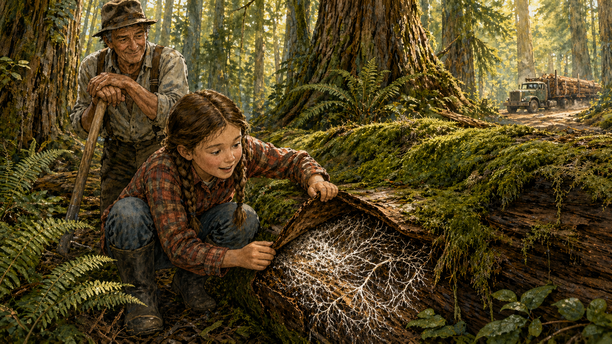

Image Prompt

I am about to ask you to generate a series of images for a graphic novel. Please make the images have a consistent style and consistent characters. Do not ask any clarifying questions. Just generate the image immediately when asked.

Please generate a 16:9 image in Pacific Northwest forest art style (Miyazaki's luminous forests meets scientific illustration) depicting panel 1 of 12. The scene shows 1960s-1970s British Columbia. A young girl, about 8 years old — Suzanne Simard as a child, with brown braids, bright curious eyes, wearing a flannel shirt, jeans, and rubber boots — crouches on the forest floor beside a massive fallen nurse log covered in thick emerald moss. She is peeling back a section of bark to reveal the fine white threads of fungal mycelium underneath, her face alight with wonder. Behind her, her grandfather, a weathered logger in suspenders and a battered hat, leans on a peavey and watches her with an amused, affectionate expression. Towering old-growth Douglas fir and western red cedar rise into a canopy that filters golden-green light onto the scene. A logging truck is visible on a dirt road in the far background. Color palette: deep forest green, golden dappled light, rich bark brown, emerald moss, the white threads of mycelium bright against the dark decomposing wood. Emotional tone: childhood wonder and a deep, inherited love of the forest. Specific details: (1) young Suzanne's brown braids and curious expression as she examines the mycelium, (2) the nurse log covered in moss with visible fungal threads under the bark, (3) grandfather's weathered face and logger's clothing, (4) towering old-growth trees with shaggy bark, (5) sword ferns and salal on the forest floor, (6) a logging truck on a distant dirt road connecting the family to the timber industry. Generate the image immediately without asking clarifying questions.

Suzanne Simard was born into the forest. Her family had been horse loggers in the Monashee Mountains of British Columbia for generations — not the industrial clearcutters who would come later, but selective loggers who took individual trees and left the forest standing. As a girl, she roamed the woods with her grandfather, learning to read the forest the way other children learn to read books. She dug in the dirt and marveled at the white threads she found woven through the soil, connecting roots to roots. She watched her dog dig up truffles — the fruiting bodies of underground fungi — and noticed that the truffles always grew near the biggest trees. She didn't have the vocabulary yet, but she was already seeing the mycorrhizal network. She was already asking the question that would define her life: *What connects everything in a forest?*

## Panel 2: Something Wrong in the Clearcuts

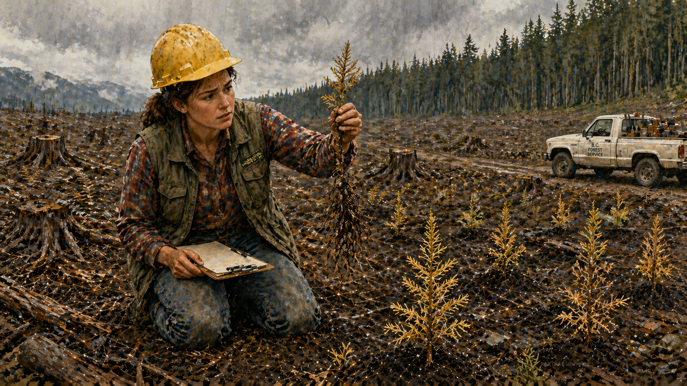

Image Prompt

Please generate a 16:9 image in Pacific Northwest forest art style depicting panel 2 of 12. Make the characters and style consistent with the prior panel. The scene shows 1980s British Columbia. A young woman in her mid-20s — Suzanne Simard, now with her brown hair in a practical ponytail under a yellow hard hat, wearing a forestry field vest over a plaid shirt, carrying a clipboard — stands in the middle of a devastated clearcut. The landscape is shocking: stumps and slash piles stretch to the horizon under a gray, overcast sky. In the foreground, rows of newly planted seedlings — small Douglas fir and pine — are visibly struggling, their needles yellowed and browning. Simard kneels beside one dying seedling, pulling it gently from the soil to examine its roots. Her expression is troubled, searching. In the far background, a strip of intact old-growth forest stands dark and green at the clearcut's edge — a stark contrast. Color palette: bleak clearcut browns and grays in the foreground — mud, slash, gray sky, yellowed needles; deep vital green of the surviving forest strip in the background. Emotional tone: devastation, wrongness, and a young scientist's first realization that something important is being destroyed. Specific details: (1) Simard in hard hat and field vest kneeling beside a dying seedling, (2) rows of failed replanted seedlings with yellowed needles, (3) stumps and slash piles across the barren clearcut, (4) the healthy forest strip in the far background for contrast, (5) Simard examining the seedling's bare, fungus-free roots, (6) a BC Forest Service truck parked on a logging road at the edge of the cut. Generate the image immediately without asking clarifying questions.

After studying forestry at the University of British Columbia, Simard went to work for the British Columbia Forest Service in the 1980s. Her job was to check on replanted clearcuts — the vast, barren stretches where old-growth forest had been leveled and replaced with neat rows of commercial seedlings. What she found troubled her deeply. The seedlings were dying. Not all of them, and not immediately, but at rates far higher than anyone expected. They were yellowed, stunted, and sickly. The foresters had followed the textbook: remove the old forest, eliminate the "competing" brush species — birch, alder, everything that wasn't a commercial conifer — spray herbicides to keep the ground clear, and plant rows of Douglas fir. It was supposed to work like a farm. But a forest is not a farm, and the seedlings were telling Simard something the textbooks had missed.

## Panel 3: The Heretical Question

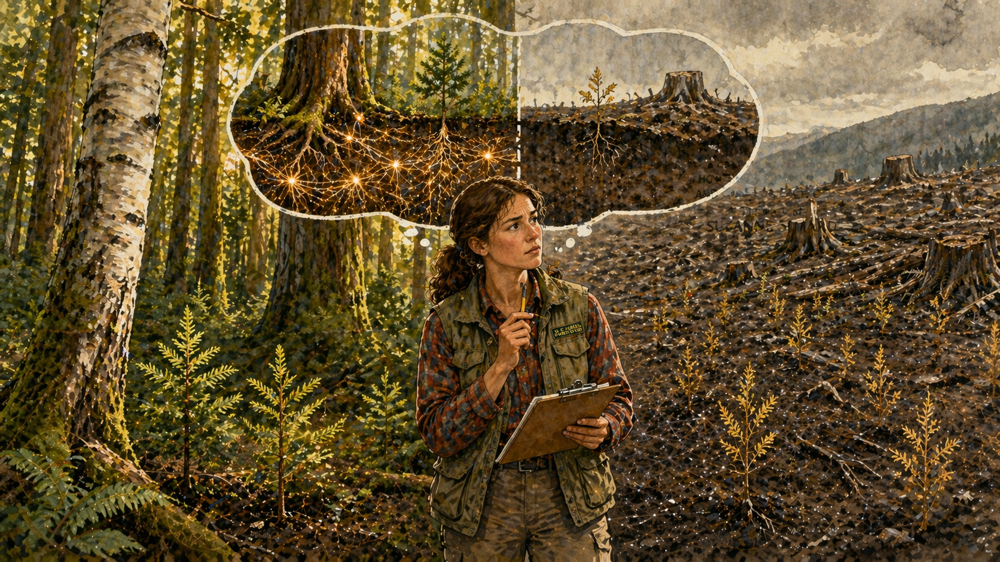

Image Prompt

Please generate a 16:9 image in Pacific Northwest forest art style depicting panel 3 of 12. Make the characters and style consistent with the prior panel. The scene shows Simard in a split composition. On the left side, she stands at the edge of an intact forest in British Columbia, looking at healthy seedlings growing in the dappled shade of mature birch and fir trees — the seedlings are vibrant green, thriving. On the right side, she looks across a clearcut where seedlings planted in open ground without any neighboring mature trees are sickly and yellowing. Between the two halves, a thought bubble or visual overlay shows the underground: on the forest side, glowing golden fungal threads connect the roots of old trees to young seedlings; on the clearcut side, the soil is bare and dark, the fungal threads severed and absent. Simard stands in the center with an expression of dawning realization. Color palette: the forest side glows with warm green-gold dappled light; the clearcut side is washed-out gray-brown; the underground fungal network glows warm gold on the forest side, absent on the clearcut side. Emotional tone: the flash of insight — a hypothesis forming. Specific details: (1) healthy seedlings under mature trees on the forest side, (2) dying seedlings in bare ground on the clearcut side, (3) the glowing underground fungal network visible on the forest side, (4) bare, severed soil on the clearcut side, (5) Simard in the center with her clipboard, expression shifting from puzzlement to understanding, (6) a mature paper birch tree on the forest side with its distinctive white bark. Generate the image immediately without asking clarifying questions.

The pattern was unmistakable. Seedlings planted in clearcuts — stripped of every other plant species, isolated in bare soil — were struggling and dying. But seedlings growing naturally in intact forests, surrounded by mature trees and the "weedy" birch and alder that the foresters tried to eliminate, were thriving. Simard asked the question that no one in the forestry establishment wanted to hear: *What if the old trees are helping the young ones? What if the birch trees aren't competitors — what if they're partners?* Her supervisors told her she was wrong. The established science was clear: trees compete for light, water, and nutrients. The forest is a battlefield. Removing competitors should help seedlings grow faster. That was the theory. Simard looked at the dying seedlings and thought the theory might be the problem.

## Panel 4: The Radical Experiment

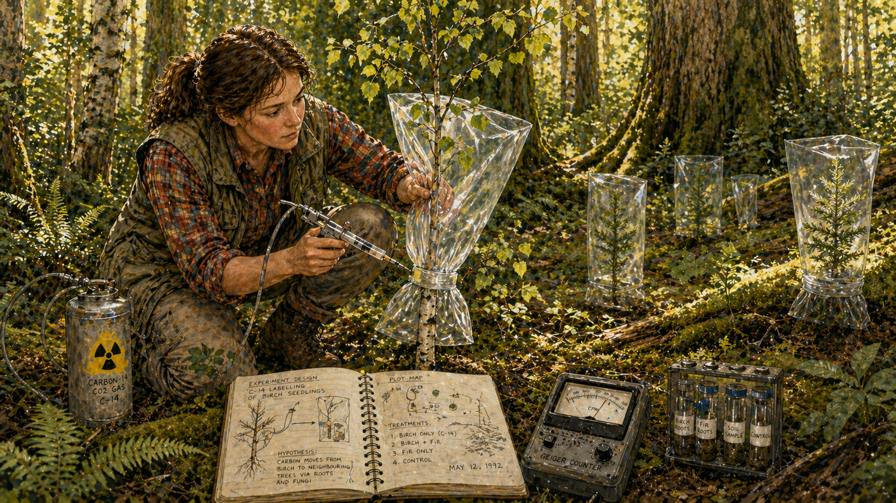

Image Prompt

Please generate a 16:9 image in Pacific Northwest forest art style depicting panel 4 of 12. Make the characters and style consistent with the prior panel. The scene shows Simard conducting her landmark experiment in a British Columbia forest in the early 1990s. She crouches in a sun-dappled clearing, carefully placing a clear plastic bag over a young paper birch seedling, sealing it around the base. Nearby, Douglas fir seedlings also have bags over them. She holds a syringe-like injection device connected to a small canister labeled with a radioactivity symbol — carbon-14 gas. The forest around her is alive with green — ferns, moss, birch saplings with trembling leaves, and the massive trunks of mature conifers. A field notebook lies open on the ground beside her, along with a Geiger counter and sample vials. Color palette: vibrant forest greens, the translucent shimmer of the plastic bags, bright white birch bark, warm golden light, and the yellow-black radioactivity warning symbol providing a pop of color. Emotional tone: meticulous scientific care combined with the thrill of testing a revolutionary idea. Specific details: (1) Simard carefully sealing the plastic bag around the birch seedling, (2) the carbon-14 injection device with radioactivity symbol, (3) Douglas fir seedlings nearby also bagged, (4) her open field notebook with sketched experimental diagrams, (5) a Geiger counter on the ground, (6) the lush forest setting — this experiment happens inside the living forest, not a laboratory. Generate the image immediately without asking clarifying questions.

To prove her hunch, Simard designed an experiment that her colleagues called crazy. In a forest in British Columbia, she covered young birch and Douglas fir seedlings with plastic bags to create sealed atmospheres. Into the bag over the birch, she injected carbon dioxide made with radioactive carbon-14 — a traceable isotope that the birch would absorb through photosynthesis. Into the bags over the fir seedlings, she injected a different stable isotope, carbon-13. If the trees were truly isolated individuals competing for resources, the radioactive carbon should stay in the tree that absorbed it. If something else was happening — if the trees were connected — the carbon would move. Simard sealed the bags, set her Geiger counter to ready, and waited.

## Panel 5: The Carbon Moves

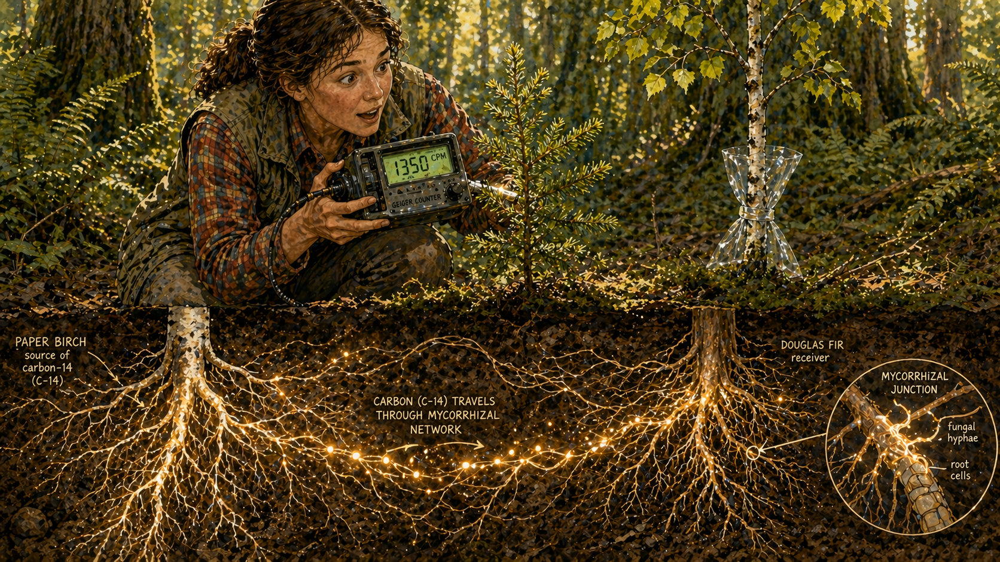

Image Prompt

Please generate a 16:9 image in Pacific Northwest forest art style depicting panel 5 of 12. Make the characters and style consistent with the prior panel. The scene shows the moment of discovery. Simard kneels beside a Douglas fir seedling, holding a Geiger counter against its needles. The counter's display shows a strong reading — the needles are clicking with radioactive carbon that came from the birch tree. Simard's face shows stunned elation, her eyes wide, mouth slightly open. The scene has a magical realist quality: below ground, rendered as a luminous cross-section, we see the fungal mycorrhizal network — delicate, branching golden-white threads — carrying tiny glowing particles of carbon from the birch tree's roots through the soil to the fir tree's roots. The fungal threads wrap around and penetrate the fine root tips of both trees. Above ground, the birch and fir seedlings stand a few meters apart, looking like separate organisms. Below ground, they are one connected system. Color palette: warm forest greens and browns above ground; below ground, bioluminescent gold, amber, and soft white for the fungal network against rich dark soil. The Geiger counter display glows green. Emotional tone: pure scientific wonder — the moment the invisible becomes visible. Specific details: (1) the Geiger counter showing a strong reading against the fir needles, (2) Simard's expression of stunned joy, (3) the luminous underground cross-section showing mycorrhizal threads, (4) glowing carbon particles traveling along the fungal threads from birch roots to fir roots, (5) the fine root tips where fungal hyphae interface with tree roots (the mycorrhizal junction), (6) the birch seedling in the background, source of the carbon, looking ordinary above ground while extraordinary below. Generate the image immediately without asking clarifying questions.

The Geiger counter sang. When Simard held it against the needles of the Douglas fir seedling, the clicks came fast and strong — the fir was loaded with radioactive carbon-14 that had been injected into the birch. The carbon had traveled from one tree species to another, through the soil, in a matter of hours. When she checked the birch, she found carbon-13 from the fir moving in the opposite direction. The trees were not just connected — they were *trading*. And the medium of exchange was the mycorrhizal network: a vast web of fungal threads, thinner than a human hair, that wrapped around and penetrated the fine root tips of both trees. The fungi took a small sugar commission for their trouble. Every other party benefited. Simard had proven that the forest was not a collection of competing individuals. It was a cooperative network, connected underground by an infrastructure older than the dinosaurs.

## Panel 6: The Two-Way Street

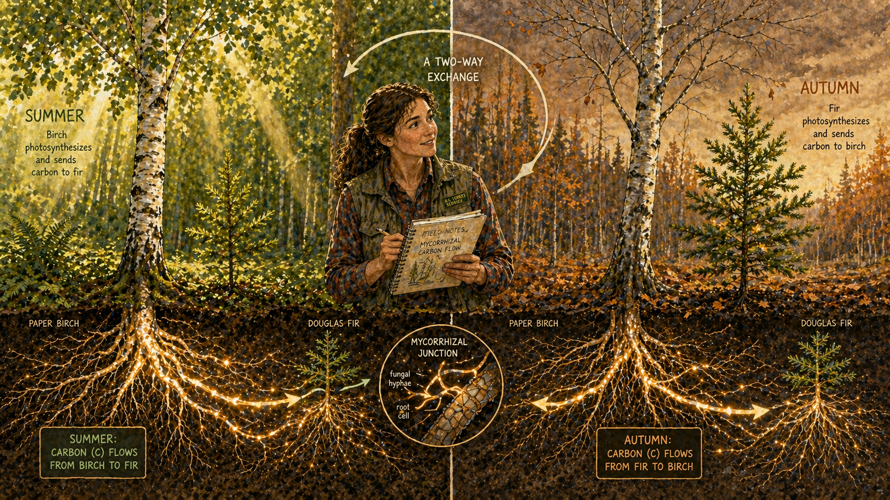

Image Prompt

Please generate a 16:9 image in Pacific Northwest forest art style depicting panel 6 of 12. Make the characters and style consistent with the prior panel. The scene is a seasonal split showing the two-way exchange between birch and fir. On the left half, it is summer: a paper birch tree in full green leaf is photosynthesizing vigorously in bright sunlight, and below ground, glowing golden carbon flows along mycorrhizal threads FROM the birch TO a shaded Douglas fir seedling struggling for light under the canopy. On the right half, it is autumn: the same birch tree has lost its leaves and stands bare, and now the flow reverses — the Douglas fir, still green and photosynthesizing, sends glowing golden carbon back TO the leafless birch through the same underground network. Simard stands in the center foreground, field notebook in hand, smiling as she observes both seasons. A visual arrow or flow diagram connects the two halves. Color palette: summer side has bright greens and golden sunlight; autumn side has amber, russet, and bare gray branches; underground network glows gold in both scenes with directional flow indicated. Emotional tone: elegance, reciprocity, and the beauty of mutual aid. Specific details: (1) the birch in full summer leaf on the left, bare in autumn on the right, (2) the fir receiving carbon in summer shade, sending carbon in autumn, (3) glowing directional arrows in the underground network showing flow reversal, (4) the mycorrhizal fungal threads connecting both trees in both seasons, (5) Simard in the center with her notebook observing, (6) seasonal forest floor details — green ferns in summer, fallen golden leaves in autumn. Generate the image immediately without asking clarifying questions.

The exchange was not charity — it was reciprocity tuned to the seasons. In summer, when the paper birch was photosynthesizing at full capacity in the bright sun, it sent surplus carbon through the fungal network to Douglas fir seedlings struggling in deep shade. The birch had more than it needed; the fir was starving for light. The fungal network moved the carbon from surplus to deficit, like a forest-wide circulatory system. But when autumn came and the birch dropped its leaves, the equation reversed. Now the evergreen Douglas fir was the one photosynthesizing, and it sent carbon back to the leafless birch, sustaining it through the dormant season. Two species, conventionally classified as competitors, were keeping each other alive through an underground partnership brokered by fungi. The forest was not a war. It was an economy of mutual aid.

## Panel 7: Mother Trees

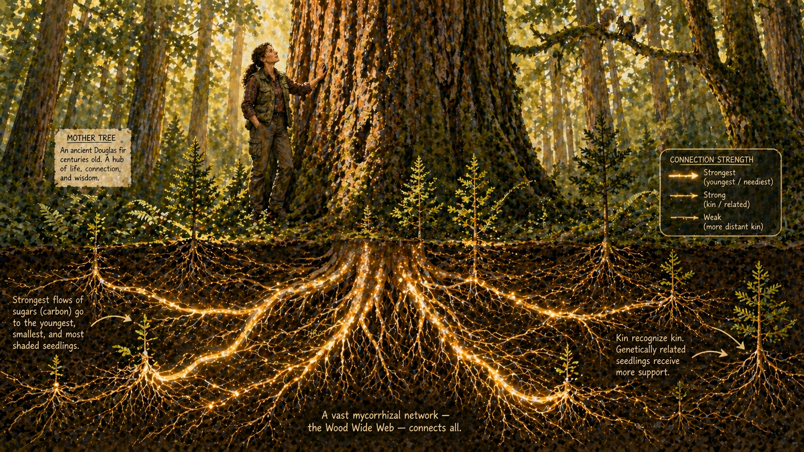

Image Prompt

Please generate a 16:9 image in Pacific Northwest forest art style depicting panel 7 of 12. Make the characters and style consistent with the prior panel. The scene centers on an enormous, ancient Douglas fir — a "mother tree" — towering in an old-growth forest. The tree is majestic: massive trunk with deeply furrowed bark, a crown reaching into golden light far above. The scene splits above and below ground. Above ground, seedlings of various sizes cluster around the mother tree's base, healthy and green, surrounded by ferns and moss. Below ground, rendered in luminous cross-section, the mother tree's root system is a vast hub of the mycorrhizal network — dozens of glowing golden fungal threads radiate outward from her roots to connect with the roots of surrounding seedlings. The thickest, brightest connections go to the smallest, most struggling seedlings and to nearby kin (genetically related seedlings). Simard, now in her late 30s, stands beside the mother tree with one hand on its bark, looking up at its crown with an expression of awe and recognition. Color palette: deep forest greens, golden canopy light, massive brown bark, rich dark soil; underground, the mycorrhizal network radiates gold and amber from the mother tree's roots like a neural network. Emotional tone: reverence, the majesty of a system larger than any individual, and the recognition that intelligence exists in forms we never imagined. Specific details: (1) the enormous mother tree dominating the composition, (2) healthy seedlings of various sizes clustered around its base, (3) the underground network radiating outward like a hub-and-spoke system, (4) thicker/brighter connections to the smallest seedlings, (5) Simard touching the bark with awe, (6) a Douglas squirrel on a branch above — another member of the forest community. Generate the image immediately without asking clarifying questions.

As Simard's research expanded, she discovered something even more remarkable. Not all trees were equal in the network. The largest, oldest trees — the ones she came to call "mother trees" — were the hubs. A single mother tree could be connected to hundreds of other trees through the fungal network, and she sent more carbon to her own offspring than to strangers. She could recognize her own kin through chemical signals in the mycorrhizal threads. When a neighboring seedling was struggling — attacked by insects, starved for light, stressed by drought — the mother tree increased her shipments of carbon and defensive compounds to that seedling through the network. When a mother tree was dying, she dumped her remaining carbon stores into the network in a final act of generosity, feeding the next generation. The forest, Simard realized, was not just connected. It was *organized* — organized around ancient, massive hub trees that functioned as the memory and circulatory system of the whole community.

## Panel 8: The Backlash

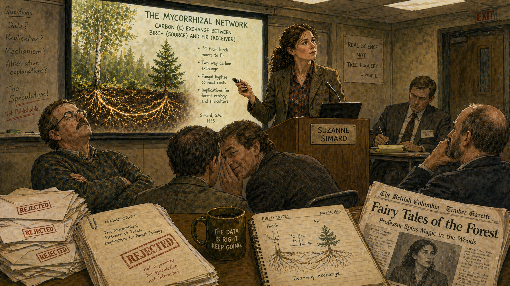

Image Prompt

Please generate a 16:9 image in Pacific Northwest forest art style depicting panel 8 of 12. Make the characters and style consistent with the prior panel. The scene shows Simard facing hostility from multiple directions. In a university seminar room in the 1990s, she stands at a podium presenting a slide of her mycorrhizal network data. The room's atmosphere is hostile: a male professor in the front row has his arms crossed and is shaking his head dismissively. Another leans over to whisper to a colleague with a smirk. In the back of the room, a man in a suit (timber industry representative) takes notes with a cold expression. On one side of the frame, a stack of rejection letters and a returned manuscript with "REJECTED" stamped in red are visible on a table. On the other side, a newspaper clipping headline reads "Fairy Tales of the Forest" — mocking her work. Simard's face shows hurt but also iron determination — her jaw is set, her eyes bright and defiant. Her brown hair is pulled back practically, and she wears a professional blazer over her characteristic plaid shirt. Color palette: institutional beige and fluorescent-lit seminar room contrasts with the warm forest greens of her presentation slide; the rejection letters and hostile faces create a cold, unwelcoming atmosphere. Emotional tone: isolation, dismissal, and the fierce resolve of someone who knows the data is right. Specific details: (1) Simard presenting her data with determined expression, (2) dismissive male colleagues in the front row, (3) timber industry representative in a suit taking notes, (4) rejected manuscript with red stamp on the table, (5) a mocking newspaper headline visible, (6) the warm, beautiful forest data on the projector screen — a stark contrast to the cold room. Generate the image immediately without asking clarifying questions.

The forestry establishment came at her from every angle. The timber industry, which had built its entire economic model on clearcutting and replanting monocultures, called her research "fairy tales." If Simard was right — if old-growth trees were essential hubs that sustained the forest network — then clearcutting wasn't just ugly, it was ecological sabotage. That conclusion threatened billions of dollars in logging revenue. But the attacks also came from inside the academy. Male colleagues dismissed her as sentimental, accused her of anthropomorphizing trees, and blocked her publications. Her concept of "mother trees" was ridiculed as unscientific — too maternal, too emotional, too much like storytelling and not enough like hard science. One reviewer wrote that her findings were "not consistent with current theory." Simard wrote back: "Then perhaps current theory is wrong."

## Panel 9: Nature Publishes

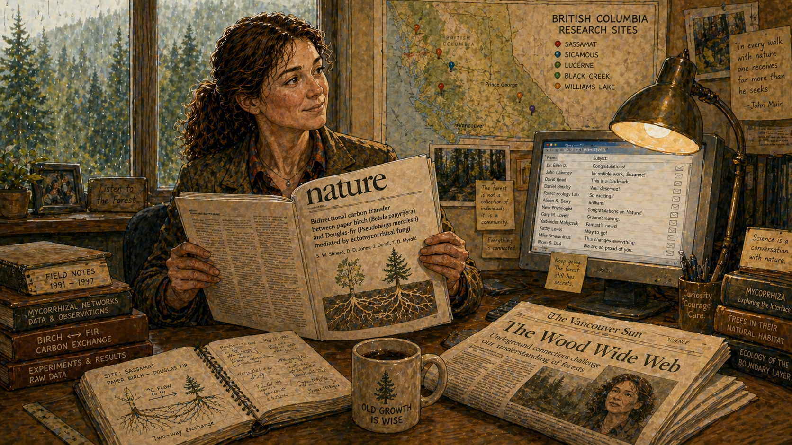

Image Prompt

Please generate a 16:9 image in Pacific Northwest forest art style depicting panel 9 of 12. Make the characters and style consistent with the prior panel. The scene shows a triumphant moment in 1997. Simard sits at a desk in her university office, holding a copy of the journal Nature open to her published paper. Her expression is one of quiet, fierce vindication — not gloating, but the deep satisfaction of someone who has been proved right. On the desk beside her, a newspaper is open to a science section with the headline "The Wood Wide Web" in bold type — the phrase the press has coined for her discovery. Her computer screen shows emails of congratulations flooding in. On the wall behind her, she has pinned a map of her experimental forest sites across British Columbia, marked with colored pins. Through the window, a Pacific Northwest forest is visible in rain-softened green. Color palette: the warm cream of the Nature journal pages, the black and white of newsprint with the bold headline, the soft gray-green of the rainy BC landscape outside, warm wood tones of the office, a golden desk lamp glow. Emotional tone: hard-won vindication, quiet triumph, and the knowledge that the real work is just beginning. Specific details: (1) the Nature journal open to her paper in Simard's hands, (2) the newspaper headline "The Wood Wide Web," (3) congratulatory emails on the computer screen, (4) the BC forest site map with pins on the wall, (5) Simard's expression of fierce satisfaction, (6) stacks of field notebooks and data binders on her desk — representing years of work behind this moment. Generate the image immediately without asking clarifying questions.

In 1997, the journal *Nature* — the most prestigious scientific publication in the world — published Simard's paper demonstrating carbon transfer between paper birch and Douglas fir through mycorrhizal networks. The press coverage was immediate and electric. A journalist coined the phrase "the Wood Wide Web," and the name stuck — a perfect metaphor for the internet age that made the underground fungal network instantly comprehensible to millions of people. The paper became one of the most cited in the history of forest ecology. Suddenly, the colleagues who had dismissed Simard were reading her work, and the data was undeniable. Trees share carbon. They share it through fungi. They share more with their kin. The largest, oldest trees are the hubs of the network. Everything the forestry industry had assumed about how forests work — that trees are isolated competitors fighting a zero-sum war for resources — was wrong.

## Panel 10: Decades of Proof

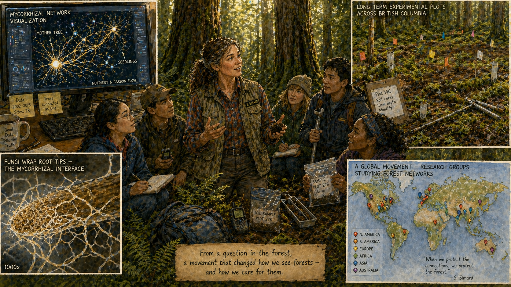

Image Prompt

Please generate a 16:9 image in Pacific Northwest forest art style depicting panel 10 of 12. Make the characters and style consistent with the prior panel. The scene shows a montage-style composition of Simard's expanding research over the 2000s-2010s. In the center, a slightly older Simard (early 50s, brown hair now streaked with gray, still in field gear) stands in an old-growth forest surrounded by graduate students of diverse backgrounds, all equipped with field instruments. Around this central scene, smaller vignette panels show: (upper left) a lab screen displaying a computer-mapped mycorrhizal network that looks like a neural network diagram; (upper right) a forest floor with dozens of small flags and soil cores marking experimental plots; (lower left) a cross-section of soil under a microscope showing fungal hyphae wrapped around root tips; (lower right) a world map with pins showing research groups around the globe now studying forest networks inspired by Simard's work. Color palette: rich forest greens and browns for the field scenes, blue-white for the lab screens, warm amber light tying the vignettes together. Emotional tone: a scientific movement growing from one woman's insight — collaboration, expansion, and the joy of training the next generation. Specific details: (1) Simard mentoring diverse graduate students in the field, (2) computer visualization of a mycorrhizal network resembling a neural map, (3) experimental forest plots with flags and instruments, (4) microscopic view of fungal hyphae on root tips, (5) world map showing global research expansion, (6) field equipment — soil corers, GPS units, sample bags — visible throughout. Generate the image immediately without asking clarifying questions.

Over the next two decades, Simard and a growing community of researchers confirmed and expanded the findings far beyond what anyone had imagined. The mycorrhizal network didn't just move carbon — it moved water, nitrogen, phosphorus, and chemical defense signals. When a Douglas fir was attacked by budworm, it sent chemical alarm signals through the fungal network, and neighboring trees ramped up their own defenses *before the insects arrived*. The network had memory: forests that had been connected for centuries had denser, more efficient fungal networks than recently established ones. And the scale was staggering — a single mother tree could be connected to hundreds of neighbors through a network involving dozens of fungal species, with hundreds of kilometers of fungal threads packed into every cubic meter of soil. The forest floor, it turned out, was the most densely wired communication network on Earth.

## Panel 11: Finding the Mother Tree

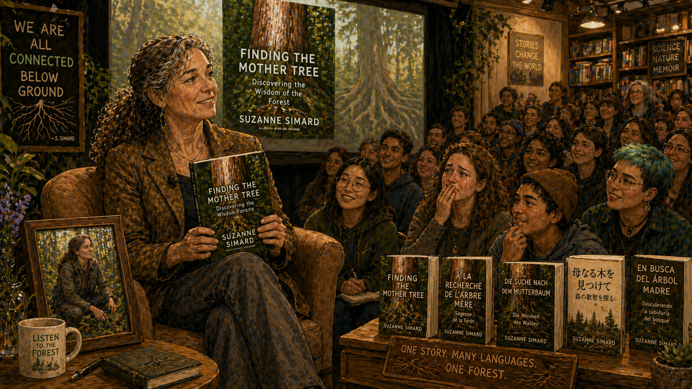

Image Prompt

Please generate a 16:9 image in Pacific Northwest forest art style depicting panel 11 of 12. Make the characters and style consistent with the prior panel. The scene shows Simard in 2021, now in her early 60s with gray-streaked brown hair, sitting in a comfortable chair for a book event or public lecture. She holds a copy of her bestselling memoir "Finding the Mother Tree" — the cover visible. Behind her, a large screen shows the cover projected to an audience. The audience is engaged and emotional — diverse faces, many young people, some taking notes, some with tears in their eyes. The setting is warm and contemporary — a bookstore or lecture hall with wooden accents. To one side, a display table holds translated editions of the book in multiple languages. On the other side, a framed photograph shows a young Simard in the forest from Panel 1 — connecting past to present. Color palette: warm contemporary wood tones, the green and brown of the book cover, soft stage lighting in amber and cream, the audience in varied colors. Emotional tone: arrival, recognition, and the power of a story that has finally reached the world. Specific details: (1) Simard holding her book with a warm, open expression, (2) the "Finding the Mother Tree" cover clearly visible, (3) an engaged, diverse audience including young students, (4) translated editions on a display table, (5) the framed photo of young Simard connecting to Panel 1, (6) warm, welcoming lighting — a far cry from the hostile seminar room of Panel 8. Generate the image immediately without asking clarifying questions.

In 2021, Simard published *Finding the Mother Tree*, a memoir that wove together her scientific discoveries, the personal cost of fighting the establishment, and a love letter to the forests that had taught her everything she knew. The book became an international bestseller and was translated into dozens of languages. It reached far beyond the scientific community — into living rooms, classrooms, book clubs, and the hands of a generation of young people hungry for a new story about the natural world. The old story — nature as a battlefield, survival of the fittest, every organism for itself — was giving way to something richer and truer. Simard's forests were communities, not battlefields. Cooperation was not a weakness. Connection was not sentimentality. It was the operating system of the living world, and it had been running beneath our feet for four hundred million years.

## Panel 12: The Paradigm Shift

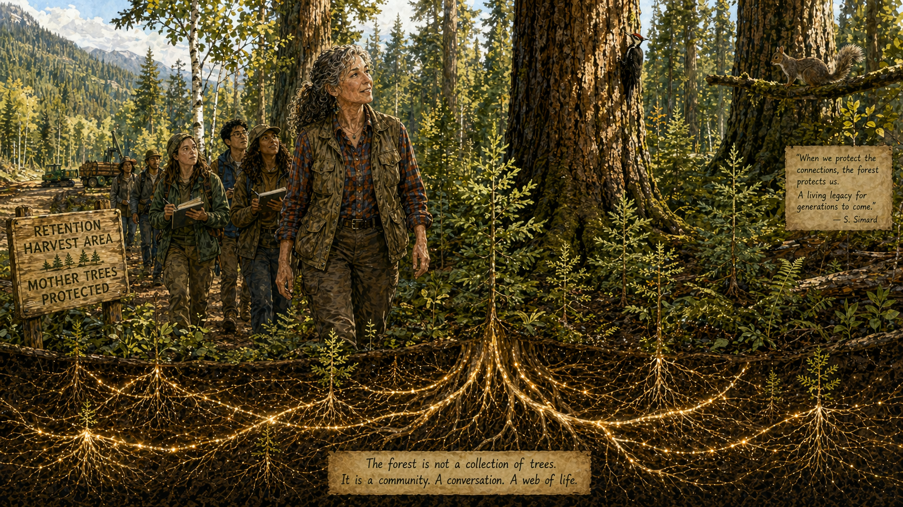

Image Prompt

Please generate a 16:9 image in Pacific Northwest forest art style depicting panel 12 of 12. Make the characters and style consistent with the prior panel. The scene is a hopeful, visionary composition set in a British Columbia forest in the present day. In the foreground, Simard — gray hair now, still in her plaid shirt and field vest, still with those bright determined eyes — walks through a forest that has been logged using the new "retention forestry" approach she championed: the largest mother trees have been left standing, their massive trunks rising like pillars among a mix of younger trees, seedlings, birches, and natural undergrowth. The forest is regenerating, alive, diverse. Below ground, rendered as a luminous cross-section along the bottom of the image, the mycorrhizal network is intact and glowing — the mother trees' roots radiate golden connections outward to the young trees growing around them. A sign at the edge of the logging road reads "Retention Harvest Area — Mother Trees Protected." In the background, a group of forestry students follows Simard into the forest, notebooks in hand, representing the future. Color palette: vibrant, hopeful forest greens and golden light above ground; warm bioluminescent gold and amber underground; the scene is sunlit and optimistic. Emotional tone: hope, continuity, the vindication of a life's work, and the knowledge that the forest will endure because we finally learned to listen to it. Specific details: (1) the standing mother trees left as network hubs in the retention harvest, (2) young trees and natural diversity regenerating around them, (3) the intact glowing underground network in the cross-section, (4) the "Mother Trees Protected" sign on the logging road, (5) Simard walking forward with forestry students behind her, (6) a Douglas squirrel and a woodpecker visible in the retained trees — the ecosystem is intact and functioning. Generate the image immediately without asking clarifying questions.

The forests are changing because Simard changed how we see them. British Columbia has begun implementing "retention forestry" — a logging approach that protects mother trees and maintains the underground fungal network, instead of clearcutting everything to bare soil. Other provinces and countries are following. Forestry schools that once taught students to view birch and alder as weeds to be eliminated now teach the mycorrhizal network as foundational ecology. The paradigm has shifted: from forests as collections of competing individuals to forests as cooperative communities organized around ancient hub trees and connected by fungal networks older than the age of mammals. Simard's vision is not sentimental. It is empirical, replicable, and published in the most rigorous journals in the world. But it is also beautiful — a vision of nature in which the oldest and largest give the most, in which different species sustain each other across seasons, and in which the network that holds everything together is invisible unless you know how to look.

### Epilogue -- What Suzanne Simard Taught Us

Simard did not just discover the Wood Wide Web. She changed the metaphor by which we understand forests — and in doing so, she challenged one of the deepest assumptions in Western ecology: that nature is fundamentally competitive. Her work shows that competition and cooperation are not opposites; they coexist in every forest, every ecosystem, every relationship. But when we build our forestry policies on competition alone — when we clearcut the old trees, spray out the "weeds," and plant monocultures in bare soil — we sever the underground network that makes the forest resilient. The lesson extends far beyond trees.

| Challenge | How Simard Responded | Lesson for Today |
|-----------|----------------------|------------------|
| Seedlings dying in clearcuts while thriving in intact forests | Asked whether old trees were helping young ones — against all established doctrine | When reality contradicts the textbook, trust reality |
| Colleagues and industry dismissed cooperation between trees as impossible | Designed a radioactive isotope experiment that made the invisible visible | Extraordinary claims need extraordinary evidence — and Simard provided it |
| Academic gatekeepers blocked her publications and ridiculed "mother trees" | Persisted for decades, publishing in *Nature* and building an undeniable body of data | Paradigm shifts do not come easy; the scientist who sees first often suffers most |
| Logging industry called her work "fairy tales" threatening their profits | Let the data speak and trained a new generation of forest ecologists to carry the work forward | Industries that profit from a false model will always fight the truth — bring data, not anger |

### Call to Action

The next time you walk through a forest, pause and look down. Beneath your feet, in every cubic meter of soil, there are hundreds of kilometers of fungal threads connecting every tree to its neighbors. You are standing on the Wood Wide Web. Every time an old-growth forest is clearcut, that network is destroyed — and with it, the ability of the forest to regenerate itself, share resources, and respond to stress. Simard's work tells us something that indigenous peoples in British Columbia and around the world have known for millennia: the forest is not a resource to be extracted. It is a community to be respected. Protecting mother trees is not sentimentality. It is systems thinking. It is the recognition that in a connected system, the hubs matter most — and destroying them destroys everything downstream. You don't need a Geiger counter to think like Suzanne Simard. You need the willingness to look beneath the surface — and the courage to say what you see, even when the powerful would rather you stayed silent.

---

*"A forest is so much more than what you see. The real action is happening underground, where trees and fungi are connected in a web of interdependence."*
— Suzanne Simard

*"The mother trees are the biggest, oldest trees in the forest. They are the glue that holds the forest together."*
— Suzanne Simard

*"I was told over and over that my ideas were wrong, that trees don't cooperate, that I was anthropomorphizing. But the data kept telling a different story."*
— Suzanne Simard, *Finding the Mother Tree*

---

## References

1. [Wikipedia: Suzanne Simard](https://en.wikipedia.org/wiki/Suzanne_Simard) — Biography of the forest ecologist who discovered mycorrhizal carbon-sharing networks between trees
2. [Wikipedia: Mycorrhizal network](https://en.wikipedia.org/wiki/Mycorrhizal_network) — Overview of the underground fungal networks that connect trees in forest ecosystems
3. [Wikipedia: Common mycorrhizal network](https://en.wikipedia.org/wiki/Common_mycorrhizal_network) — Detailed scientific entry on the shared fungal networks linking plants of different species
4. [TED Talk: Suzanne Simard — How trees talk to each other](https://www.ted.com/talks/suzanne_simard_how_trees_talk_to_each_other) — Simard's 2016 TED Talk explaining the Wood Wide Web to a general audience
5. [Encyclopaedia Britannica: Mycorrhiza](https://www.britannica.com/science/mycorrhiza) — Reference overview of mycorrhizal symbiosis, the fungal-root partnerships underlying forest networks
