# Her Deepness — Sylvia Earle and the Ocean Frontier

Cover Image Prompt

Please generate a wide-landscape 16:9 cover image for a graphic novel titled "Her Deepness — Sylvia Earle and the Ocean Frontier" in a deep-ocean art style blending Jacques Cousteau film stills with deep-sea photography art. Show Sylvia Earle, a petite woman in her 60s with silver hair and warm brown eyes, wearing a blue wetsuit, floating in the deep ocean surrounded by bioluminescent jellyfish and glowing deep-sea creatures. She gazes outward with wonder and fierce determination. The vast dark blue water stretches in every direction, punctuated by pinpoints of living light — blues, teals, ghostly greens, and electric purples. The title text "Her Deepness" is rendered in a clean, luminous typeface at the top. Color palette: midnight blue, deep teal, bioluminescent cyan and green, with warm golden highlights on Earle's face from the living light around her. Emotional tone: awe, courage, and the immensity of the unknown. Include: (1) Earle's calm, wonder-filled expression, (2) bioluminescent jellyfish trailing long tentacles of light, (3) the wetsuit with subtle Mission Blue logo, (4) tiny deep-sea fish with glowing photophores, (5) the vast darkness of the deep ocean fading to black at the edges, (6) a faint silhouette of a submersible in the distant background. Generate the image immediately without asking clarifying questions.

Narrative Prompt

This is a 12-panel graphic novel about Sylvia Earle (1935–present), the American marine biologist, oceanographer, and explorer known as "Her Deepness." The story spans from her childhood on the Gulf Coast of Florida in the late 1940s through her record-setting deep-sea walks, her leadership of NOAA, and her ongoing Mission Blue campaign to protect the world's oceans. The art style transitions from warm 1950s Gulf Coast pastels in the early panels to rich underwater blues, teals, and blacks with bioluminescent highlights in the deep-ocean scenes, evoking Jacques Cousteau film stills crossed with deep-sea photography. Sylvia Earle should be drawn consistently across panels: in early panels, a young brunette woman with warm brown eyes, petite build, and an infectious smile, wearing period-appropriate 1960s-70s dive gear; in later panels, silver-haired with the same energetic spark, often in a blue wetsuit or inside a submersible cockpit. Central ecology theme: the ocean covers 71% of Earth's surface, drives our climate, and harbors most of life on the planet — yet we have explored less of it than the surface of Mars. The story emphasizes wonder, discovery, and the urgent need for marine conservation.

### Prologue – A Backyard Called the Gulf

In the autumn of 1947, a twelve-year-old girl stepped out of a car after a long drive from New Jersey and looked at her new backyard. It was not a yard at all. It was the Gulf of Mexico — warm, turquoise, and infinite. She waded in up to her knees and felt the sand shift under her feet, felt something brush her ankle that she could not name. She did not scream. She looked down. That was the moment that would define the next eight decades of her life — not fear, but curiosity. Sylvia Earle would spend the rest of her days going deeper, seeing more, and fighting harder than almost anyone alive to protect what she found in the blue world beneath the waves.

## Panel 1: The Gulf at Her Doorstep

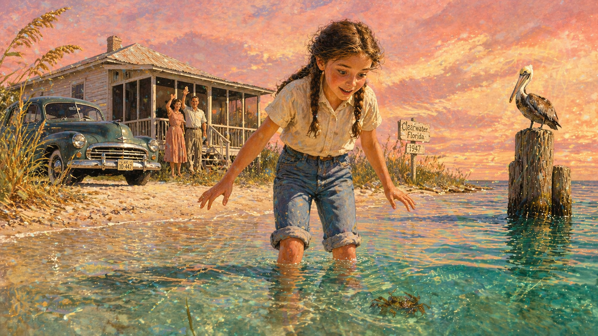

Image Prompt

(This is panel 1.  Do not put the panel number in the image.) I am about to ask you to generate a series of images for a graphic novel. Please make the images have a consistent style and consistent characters. Do not ask any clarifying questions. Just generate the image immediately when asked.

Please generate a 16:9 image in a warm 1950s Gulf Coast pastel style depicting panel 1 of 12. The scene shows twelve-year-old Sylvia Earle, a petite girl with brown hair in braids and warm brown eyes, wading knee-deep into the turquoise shallows of the Gulf of Mexico near Clearwater, Florida in 1947. She is looking down into the water with wide-eyed wonder, her hands slightly spread at her sides. Behind her on the sandy shore, a 1940s sedan is parked near a modest clapboard house with a screened porch. Her parents stand on the porch waving. The sky is enormous and streaked with sunset pinks and golds. Color palette: warm pastels — soft coral, turquoise water, sandy gold, pale pink sky, white clapboard. Emotional tone: wonder, freedom, a life beginning. Specific details: (1) young Sylvia's expression of delighted fascination looking into the water, (2) a small crab visible just beneath the surface near her feet, (3) sea oats and dune grass framing the shore, (4) the modest Florida house with a tin roof, (5) a pelican perched on a weathered dock piling, (6) her rolled-up cotton pants and bare feet in the clear water. Generate the image immediately without asking clarifying questions.

The Earle family had traded the cold winters of New Jersey for the warm Gulf Coast, and twelve-year-old Sylvia felt something click into place the moment she touched the water. The Gulf of Mexico became her first laboratory — no walls, no ceiling, just an endless horizon of things she did not yet understand. She spent every free hour wading through seagrass beds, collecting shells, watching hermit crabs negotiate for new homes. Other kids played in the water. Sylvia studied it.

## Panel 2: First Breath Underwater

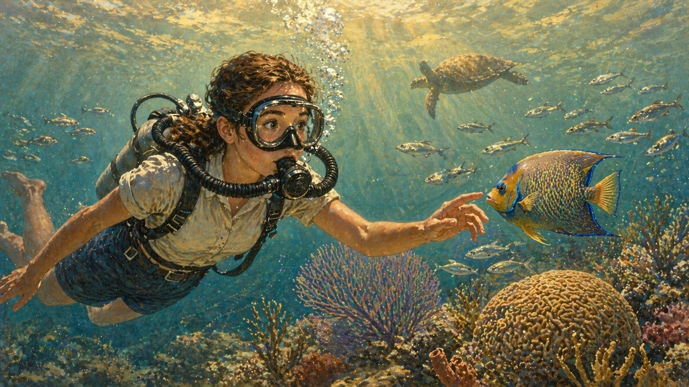

Image Prompt

(This is panel 2.  Do not put the panel number in the image.) Please generate a 16:9 image transitioning from warm pastels to richer underwater tones, depicting panel 2 of 12. Make the characters and style consistent with the prior panel. The scene shows seventeen-year-old Sylvia Earle, a petite young woman with brown hair pulled back, taking her first scuba dive in the early 1950s using borrowed gear — a bulky double-hose regulator and a simple rubber mask. She is suspended a few feet above a shallow coral reef off the Florida coast, her eyes wide behind the mask, one hand reaching toward a school of silvery fish. Sunlight filters down in golden shafts through the water. Color palette: transitional — warm gold surface light giving way to turquoise and teal below, coral pinks and oranges on the reef. Emotional tone: transformation, revelation. Specific details: (1) the vintage 1950s double-hose regulator and oval mask, (2) a chain of silver bubbles rising from the regulator, (3) a queen angelfish hovering close to her outstretched fingers, (4) brain coral and sea fans on the reef below, (5) a sea turtle gliding in the mid-distance, (6) her expression of pure astonishment visible through the mask. Generate the image immediately without asking clarifying questions.

At seventeen, Sylvia borrowed scuba gear and slipped beneath the surface for the first time. Everything changed. The muffled underwater world was not silent at all — it crackled and clicked and hummed with life. Fish she had only seen dead on docks were alive and luminous, moving in formations as precise as any orchestra. She could breathe down here. She could stay. Years later she would say that her first dive was like being born into a different planet — one that had been right beneath her feet the whole time.

## Panel 3: The Algae Hunter

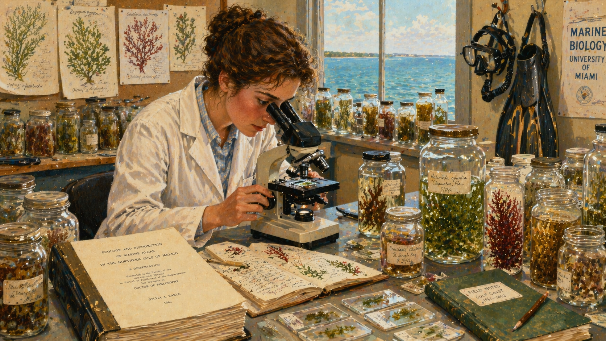

Image Prompt

(This is panel 3.  Do not put the panel number in the image.) Please generate a 16:9 image in a style blending mid-century scientific illustration with underwater photography tones, depicting panel 3 of 12. Make the characters and style consistent with the prior panels. The scene shows Sylvia Earle in her late twenties, a young woman with brown hair pinned up, working in a university marine biology lab in the early 1960s. She is bent over a microscope examining Gulf of Mexico algae specimens, surrounded by glass jars of preserved seaweed, field notebooks, and specimen slides. Through a window, the blue Gulf is visible. Color palette: laboratory whites and creams, the rich greens and reds of algae specimens in jars, warm wood tones, ocean blue through the window. Emotional tone: meticulous passion, scientific rigor. Specific details: (1) a microscope with an algae slide, (2) dozens of labeled glass specimen jars with colorful algae, (3) hand-drawn scientific illustrations of algae species pinned to a corkboard, (4) a thick doctoral dissertation manuscript on the desk, (5) Earle wearing a white lab coat over a 1960s blouse, (6) a dive mask and flippers hanging on a hook by the door. Generate the image immediately without asking clarifying questions.

While other marine biologists focused on the charismatic megafauna — dolphins, sharks, whales — Earle chose algae. Seaweed. The foundation of the ocean's food web, the quiet engine of marine ecosystems that most people stepped over on the beach. For her PhD, she cataloged species of algae across the Gulf of Mexico with a thoroughness that bordered on obsession, documenting over 20,000 specimens. She was building a baseline — a record of what the Gulf looked like before the pollution she could already sense was coming. Many of those species would later vanish. Her meticulous notes would be the only proof they had ever existed.

## Panel 4: Aquanauts — The Tektite Mission

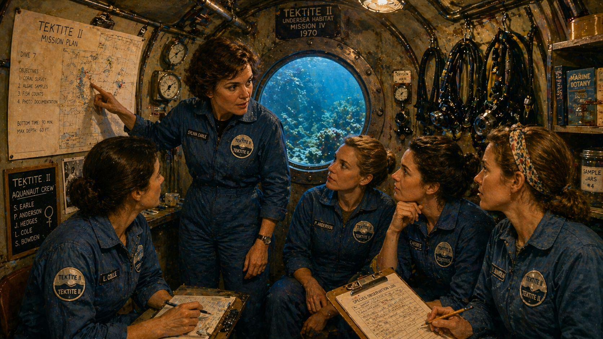

Image Prompt

(This is panel 4.  Do not put the panel number in the image.) Please generate a 16:9 image in rich underwater blues and teals with warm interior lighting, depicting panel 4 of 12. Make the characters and style consistent with the prior panels. The scene shows Sylvia Earle, now in her mid-thirties with brown hair in a practical short cut, leading a team of four women aquanauts inside the Tektite II underwater habitat in 1970. They are gathered around a porthole window in the cramped but well-lit cylindrical habitat, reviewing dive plans. Outside the porthole, a coral reef is visible bathed in filtered blue light. Earle is pointing at a chart while the other women listen intently. Color palette: warm amber interior lighting contrasting with deep blue-green visible through the porthole, steel gray habitat walls, the women in matching blue jumpsuits. Emotional tone: camaraderie, professional focus, quiet defiance of the era's sexism. Specific details: (1) the cylindrical steel interior of the Tektite habitat with exposed pipes and gauges, (2) a porthole showing the coral reef outside, (3) Earle pointing at a dive chart on the wall, (4) four women aquanauts in matching blue mission jumpsuits, (5) diving equipment hanging neatly on wall hooks, (6) a clipboard with species observation logs. Generate the image immediately without asking clarifying questions.

In 1970, NASA and the U.S. Navy ran Project Tektite II — an experiment in living underwater, partly to test how humans handle confined isolation before sending astronauts into space. Earle applied to lead a team and was told no — the earlier missions had been all male, and officials worried about, as one put it, the "problems" of men and women living together underwater. So Earle proposed an all-female team. They said yes. The media dubbed them "aquababes" and sent reporters to ask what they wore to bed. Earle ignored the nonsense and led the most productive scientific mission of the entire Tektite program, logging more underwater research hours than any previous team.

## Panel 5: Walking on the Ocean Floor

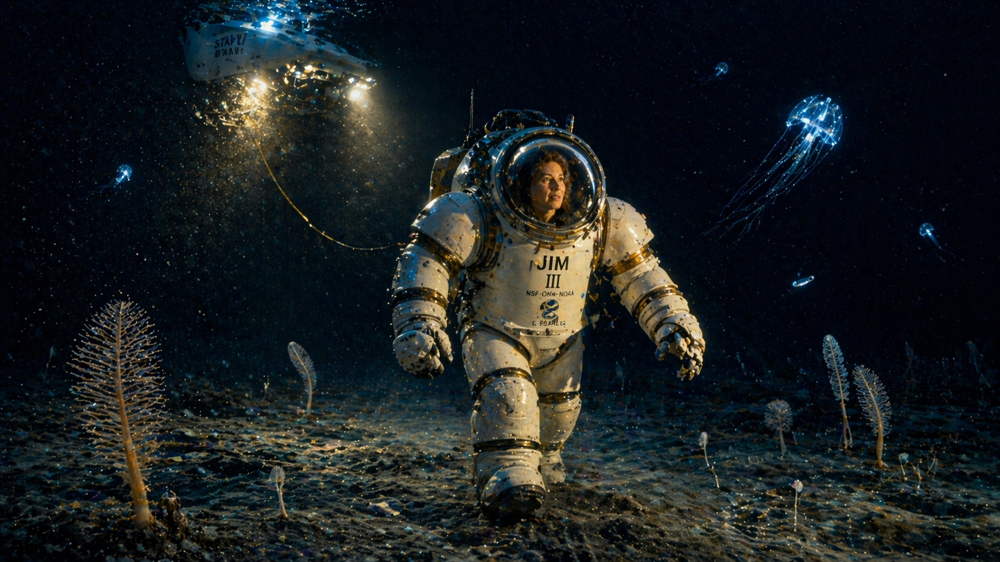

Image Prompt

(This is panel 5.  Do not put the panel number in the image.) Please generate a 16:9 image in deep ocean art style with dramatic bioluminescent lighting, depicting panel 5 of 12. Make the characters and style consistent with the prior panels. The scene shows Sylvia Earle in 1979, encased in the massive white JIM atmospheric diving suit, walking untethered on the ocean floor at 1,250 feet (381 meters) depth near Oahu, Hawaii. The suit is a bulky, armored, humanoid shape with articulated joints and a domed helmet with a small viewport through which Earle's face is faintly visible. She is walking across a dark seafloor scattered with pale sediment and strange formations. A faint glow comes from the submersible that delivered her, hovering above and behind. The surrounding water is deep indigo fading to black. Color palette: deep midnight blue, black, the white of the JIM suit, faint golden glow from the submersible's lights, ghostly blue-white bioluminescence. Emotional tone: awe, isolation, the courage of stepping into the unknown. Specific details: (1) the massive JIM suit with its distinctive domed helmet and articulated arms, (2) Earle's face faintly visible through the viewport, expression of wonder, (3) the dark seafloor with rippled sediment and sea pens, (4) the submersible Star II hovering above trailing a tether line, (5) a few bioluminescent organisms drifting in the water column, (6) the vast black emptiness of the deep ocean beyond the lights. Generate the image immediately without asking clarifying questions.

On September 19, 1979, off the coast of Oahu, Hawaii, Sylvia Earle was lowered to the ocean floor inside a one-thousand-pound atmospheric diving suit called JIM. At 1,250 feet — deeper than any human had ever walked untethered — the submersible that carried her down detached, and she stepped off into darkness. She was alone on the bottom of the Pacific Ocean, farther from the surface than the height of the Empire State Building, in a pressure that would crush an unprotected human instantly. She stayed for two and a half hours. She was not afraid. She was enchanted.

## Panel 6: The Alien World Below

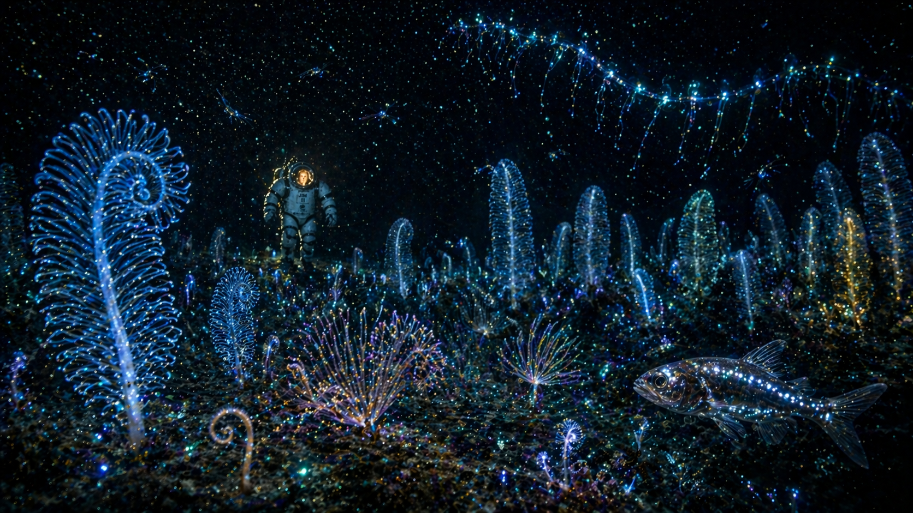

Image Prompt

(This is panel 6.  Do not put the panel number in the image.) Please generate a 16:9 image in deep-sea photography art style with rich bioluminescent highlights, depicting panel 6 of 12. Make the characters and style consistent with the prior panels. The scene shows what Sylvia Earle saw during her 1979 JIM suit walk — a vast, alien landscape of the deep ocean floor teeming with bioluminescent life. The JIM suit (with Earle inside, her face barely visible through the viewport) stands in the background while the foreground explodes with living light: bamboo coral glowing soft blue, spiral crinoids, luminous sea pens standing like an underwater forest, a lanternfish with glowing photophores, and a siphonophore trailing chains of blue-green light through the water column. The seafloor is covered in delicate organisms never seen by human eyes before. Color palette: deep black background, electric cyan, soft blue, luminous green, purple bioluminescence, warm amber from the suit's viewport. Emotional tone: wonder at an alien world on our own planet. Specific details: (1) eighteen-inch bamboo coral spirals glowing blue, (2) a forest of bioluminescent sea pens, (3) a lanternfish with rows of photophores, (4) a siphonophore chain drifting like a living chandelier, (5) the JIM suit small in the background emphasizing the vastness of the scene, (6) tiny crustaceans flashing with light in the water column. Generate the image immediately without asking clarifying questions.

What she found down there shattered everything she thought she knew. The deep ocean floor was not a barren wasteland — it was a forest of living light. Eighteen-inch bamboo coral spirals pulsed with blue fire at her touch. Sea pens stood in groves like luminous underwater trees. A lanternfish drifted past with rows of photophores glowing along its body like the portholes of a tiny ship. Siphonophores — colonial organisms that can stretch longer than a blue whale — trailed chains of electric blue-green light through the darkness. She realized, standing in that alien cathedral, that human beings had explored more of the moon's surface than this landscape right here on Earth. We were ignoring the largest living space on our own planet.

## Panel 7: Chief Scientist of the Ocean

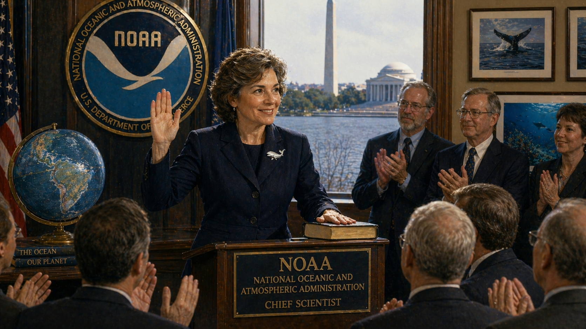

Image Prompt

(This is panel 7.  Do not put the panel number in the image.) Please generate a 16:9 image in a style blending official Washington D.C. gravitas with ocean imagery, depicting panel 7 of 12. Make the characters and style consistent with the prior panels. The scene shows Sylvia Earle in 1990, now in her mid-fifties with silver-streaked brown hair, being sworn in as NOAA's first female chief scientist in a government office in Washington, D.C. She stands at a podium with the NOAA seal behind her, one hand raised for the oath, the other on a book. Behind her, through a large window, the Potomac River is visible. She wears a navy blue suit but her lapel pin is a small silver whale. Color palette: official navy blue and white, warm wood paneling, silver-gray of the Potomac through the window, gold accents on the NOAA seal. Emotional tone: institutional authority, a barrier broken, restless energy barely contained by the formality. Specific details: (1) the NOAA seal prominently displayed, (2) Earle's silver whale lapel pin, (3) an audience of scientists and officials applauding, (4) a globe prominently showing the Pacific Ocean on a side table, (5) Earle's characteristic warm smile breaking through the formality, (6) framed ocean photographs on the office walls. Generate the image immediately without asking clarifying questions.

In 1990, President George H.W. Bush named Sylvia Earle chief scientist of the National Oceanic and Atmospheric Administration — the first woman to hold the position. She arrived in Washington with an agenda: push for more marine protected areas, increase ocean research funding, and make the government treat the ocean with the same seriousness it gave to space exploration. She would later say the job was like trying to steer an aircraft carrier by leaning on the railing. The bureaucracy moved slowly. The ocean was changing fast.

## Panel 8: The Ocean in Crisis

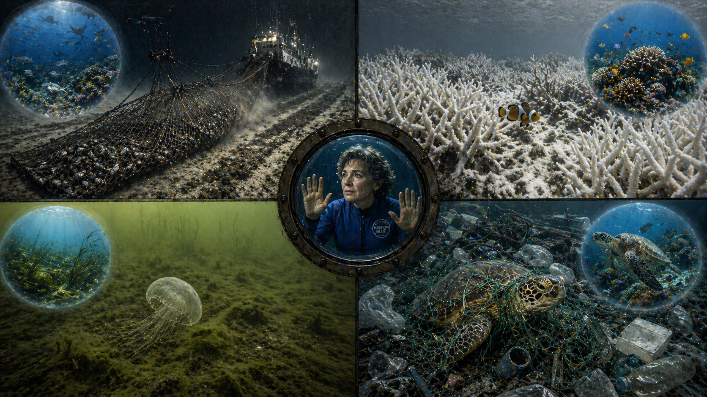

Image Prompt

(This is panel 8.  Do not put the panel number in the image.) Please generate a 16:9 image in a stark, documentary-style underwater art that contrasts beauty with devastation, depicting panel 8 of 12. Make the characters and style consistent with the prior panels. The scene is a split composition showing four quadrants of ocean destruction that Sylvia Earle has witnessed over her career: top-left shows a massive industrial trawler dragging a net across the seafloor, leaving a barren scar; top-right shows bleached white coral on a reef that was once vibrant, with a lone clownfish searching for its anemone; bottom-left shows a dead zone — murky green water devoid of life with a single jellyfish; bottom-right shows marine debris — plastic bags, bottles, and fishing nets tangled around a sea turtle. In the center where the four quadrants meet, a small figure of silver-haired Earle in a blue wetsuit floats, hands pressed to the glass of a submersible viewport, watching it all. Color palette: sickly greens, bleached whites, murky browns contrasting with the remembered blues and teals of healthy ocean — a palette of loss. Emotional tone: grief, urgency, moral outrage. Specific details: (1) the trawl net bulging with bycatch, (2) the ghostly white bleached coral branches, (3) the green algal bloom of the dead zone, (4) a sea turtle entangled in plastic netting, (5) Earle's anguished expression visible through the viewport, (6) a faint ghost overlay of the same scenes as they once looked — vibrant and alive. Generate the image immediately without asking clarifying questions.

Over the decades, Earle watched the ocean she loved come under siege. Industrial trawlers dragged nets across the seafloor, turning complex ecosystems into barren mud in minutes — the underwater equivalent of clear-cutting a forest. Coral reefs she had studied as a young scientist bleached white and died as ocean temperatures rose. Dead zones — vast stretches of water so depleted of oxygen that nothing can survive — spread at the mouths of rivers choked with agricultural runoff. And everywhere, plastic. Plastic bags drifting like ghost jellyfish. Microplastics in the stomachs of creatures living miles below the surface. She had seen the ocean at its most magnificent. Now she was watching it unravel.

## Panel 9: Mission Blue and the Hope Spots

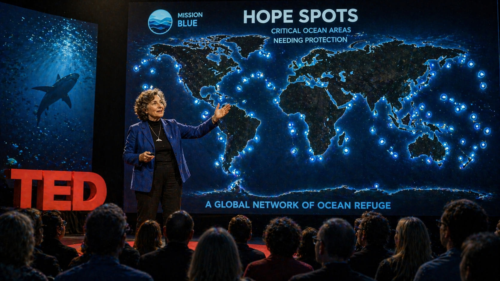

Image Prompt

(This is panel 9.  Do not put the panel number in the image.) Please generate a 16:9 image in a hopeful, campaign-poster style blended with ocean art, depicting panel 9 of 12. Make the characters and style consistent with the prior panels. The scene shows Sylvia Earle, now in her early seventies with silver hair and bright eyes, standing on a TED conference stage in 2009, gesturing passionately toward a massive screen behind her displaying a world map dotted with glowing blue markers — her "Hope Spots," critical ocean areas needing protection. The audience is silhouetted in the foreground, captivated. The map glows with blue light that spills across the stage. Color palette: deep stage black, the luminous blue of the Hope Spots map, warm spotlight gold on Earle, teal and cyan accents. Emotional tone: passionate urgency, visionary hope, a call to action. Specific details: (1) the world map with dozens of glowing blue Hope Spot markers across all oceans, (2) Earle in a characteristic blue outfit gesturing toward the Pacific, (3) the TED logo visible on stage, (4) the Mission Blue logo on the screen, (5) audience members leaning forward in their seats, (6) Earle's expression combining fierce determination with infectious optimism. Generate the image immediately without asking clarifying questions.

In 2009, when she won the TED Prize, Earle used her wish to launch Mission Blue — a global campaign to establish a network of marine protected areas she called "Hope Spots." The concept was simple and radical: just as we protect national parks on land, we need to protect critical areas of the ocean. At the time, less than four percent of the ocean had any protection at all. Earle identified dozens of Hope Spots around the world — places where protecting the water could preserve entire ecosystems, from the Coral Triangle in Southeast Asia to the deep canyons off New England. She gave speeches, made films, met with heads of state, and refused to accept that the ocean was too big to save.

## Panel 10: Seven Thousand Hours Under the Sea

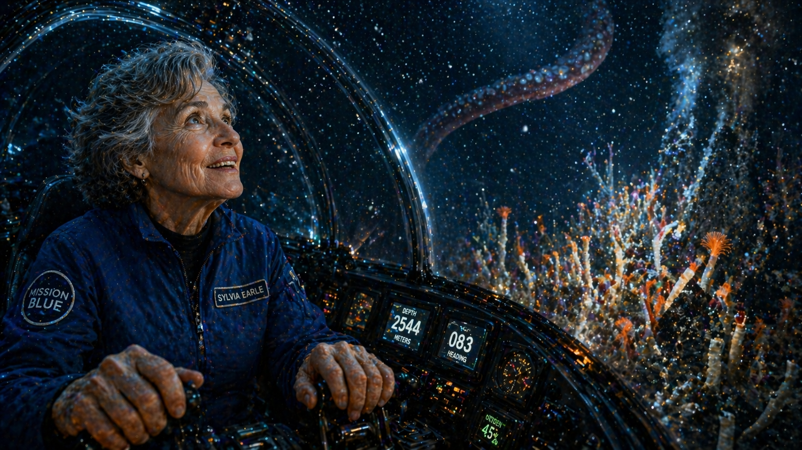

Image Prompt

(This is panel 10.  Do not put the panel number in the image.) Please generate a 16:9 image in deep-sea photography art style with intimate submarine cockpit lighting, depicting panel 10 of 12. Make the characters and style consistent with the prior panels. The scene shows Sylvia Earle in her early eighties, silver-haired but radiantly alert, sitting inside the transparent cockpit of a modern deep-sea submersible. She is peering out through the curved acrylic dome at a scene of deep-ocean wonder: a giant squid tentacle curling at the edge of the light, a field of hydrothermal vent tube worms glowing orange and white, and particles of marine snow drifting like stars. Her hands rest on the submersible controls with practiced ease. Color palette: warm amber cockpit lighting on Earle's face, deep indigo and black ocean outside, the orange-white of tube worms, the pale drift of marine snow. Emotional tone: inexhaustible curiosity, the joy of discovery that age cannot diminish. Specific details: (1) Earle's weathered hands on the submersible controls, (2) the curved acrylic dome of the cockpit, (3) instrument panels with depth gauges reading deep numbers, (4) hydrothermal vent tube worms in the submersible's lights, (5) marine snow drifting through the beam like underwater stars, (6) Earle's face lit from outside by bioluminescence, her eyes wide with the same wonder as the twelve-year-old in Panel 1. Generate the image immediately without asking clarifying questions.

Into her eighties, Earle kept diving. She logged over 7,000 hours underwater — more than most commercial divers accumulate in a career. She piloted submersibles to depths that would make younger scientists nervous and came back every time with the same report: "I saw something I've never seen before." She was not being sentimental. The deep ocean is so vast and so unexplored that every expedition genuinely does reveal species unknown to science. Earle understood something that most people never grasp — that the age of exploration is not over. The greatest frontier on Earth is not in space. It is straight down.

## Panel 11: A Message to the Builders

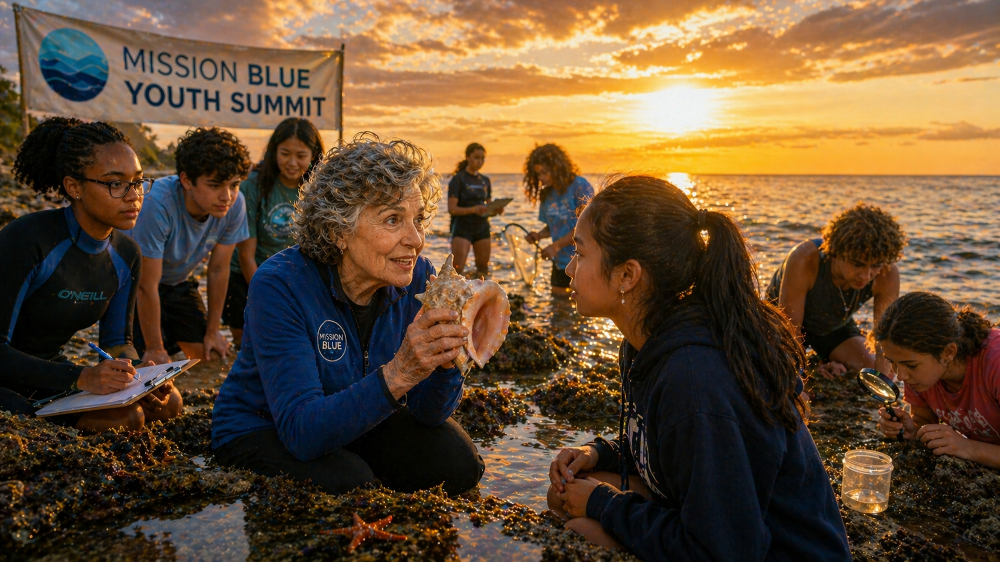

Image Prompt

(This is panel 11.  Do not put the panel number in the image.) Please generate a 16:9 image in a warm, inspiring style that bridges ocean imagery with youthful energy, depicting panel 11 of 12. Make the characters and style consistent with the prior panels. The scene shows Sylvia Earle, silver-haired and energetic in her late eighties, speaking to a diverse group of teenagers on a beach at golden hour. She kneels at the water's edge, holding up a conch shell for a young student to examine. Behind them, the ocean stretches to the horizon under a spectacular sunset. Other students wade in the shallows, some holding clipboards and specimen jars. A banner reads "Mission Blue Youth Summit." Color palette: warm golden sunset, deep blue ocean, the warm brown and silver of Earle's features, the bright colors of the students' clothing, sand gold. Emotional tone: intergenerational hope, urgency tempered by warmth, the passing of a torch. Specific details: (1) Earle kneeling at eye level with a teenage student, holding up the conch shell, (2) diverse group of students — different ethnicities, some in wetsuits, some in regular clothes, (3) the spectacular sunset over the ocean, (4) students in the background examining tide pools with magnifying glasses, (5) the Mission Blue Youth Summit banner, (6) a sea star visible in a tide pool in the foreground. Generate the image immediately without asking clarifying questions.

Earle has spent the last decade delivering one message with the urgency of someone who has watched the clock for eighty years: "The next ten years may be the most important in the next ten thousand years." She is not being dramatic. She has the data. She has seen the reefs that are gone, the fish populations that have collapsed, the ice that has melted. But she does not deal in despair. She deals in agency. She tells young people that they are the first generation with the knowledge to understand what is happening to the ocean — and the last generation with the time to do something about it. Every speech ends the same way: not with fear, but with an invitation. Go look. Go see. Fall in love with the ocean the way she did at twelve, wading into the Gulf of Mexico with nothing but curiosity and bare feet.

## Panel 12: The Blue Heart of the Planet

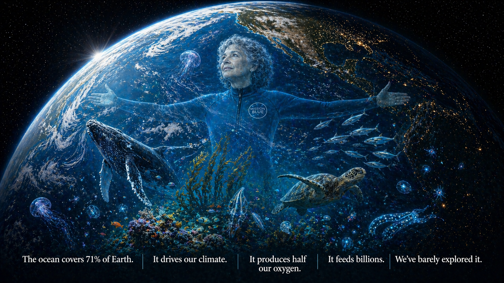

Image Prompt

(This is panel 12.  Do not put the panel number in the image.) Please generate a 16:9 image in a majestic, planetary-scale ocean art style, depicting panel 12 of 12. Make the characters and style consistent with the prior panels. The scene is a grand final composition: viewed from space, the Earth hangs in darkness, overwhelmingly blue — 71% ocean. Superimposed over the Pacific, transparent and luminous like a ghost image, is Sylvia Earle in her blue wetsuit, arms spread wide as if embracing the planet. Around her float the creatures of her lifetime of discovery: a humpback whale, a sea turtle, bioluminescent jellyfish, coral formations, a school of tuna, a giant kelp forest, and tiny glowing deep-sea creatures. At the bottom of the image, text reads: "The ocean covers 71% of Earth. It drives our climate. It produces half our oxygen. It feeds billions. We've barely explored it." Color palette: the blue marble of Earth from space — deep ocean blues, swirling cloud whites, land greens — with bioluminescent accents of cyan, green, and purple around the marine life. Emotional tone: the sublime vastness of the ocean, the smallness and significance of one human life devoted to its protection, hope and responsibility in equal measure. Specific details: (1) Earth from space dominated by ocean blue, (2) Earle's transparent figure embracing the planet, (3) a humpback whale breaching through the overlay, (4) bioluminescent deep-sea creatures scattered like stars, (5) a coral reef formation glowing with life, (6) the text statement at the bottom in clean white typography. Generate the image immediately without asking clarifying questions.

Here is the truth that Sylvia Earle has spent her life trying to make the world understand: the ocean is not a backdrop. It is not a resource to be extracted or a dumping ground to be filled. The ocean covers 71 percent of our planet. It drives our weather and regulates our climate. Phytoplankton in its surface waters produce roughly half the oxygen we breathe — every other breath you take comes from the sea. It feeds billions of people. It absorbs a quarter of the carbon dioxide we pump into the atmosphere. And we have explored less than twenty percent of it. We have better maps of Mars than we do of our own ocean floor. Sylvia Earle waded into the Gulf of Mexico at twelve years old, looked down, and never stopped looking. Eight decades later, her message has not changed: the ocean is alive, it is in trouble, and it is not too late — but only if we go see it for ourselves. Only if we care enough to look down.

### Epilogue – Why the Ocean Matters to Everyone

Sylvia Earle did not become "Her Deepness" because she was fearless. She became Her Deepness because she understood, earlier and more completely than almost anyone of her generation, that the ocean is not separate from human life — it is the foundation of it. Every systems thinker knows that you cannot understand a system by studying only the parts you can see. The ocean is the largest, deepest, most biodiverse part of the Earth system, and for most of human history we have treated it as if it were infinite and indestructible. Earle proved it is neither.

| Challenge | How Sylvia Earle Responded | Lesson for Today |
|-----------|----------------------------|------------------|
| Sexism in ocean science and exploration | Formed all-female aquanaut team; outperformed all-male predecessors | Excellence is the best response to exclusion |
| The ocean floor was considered barren and uninteresting | Walked deeper than any human and found forests of bioluminescent life | Never assume you know what you haven't explored |
| Less than 4% of the ocean was protected | Launched Mission Blue's Hope Spots network to identify critical areas | Protection starts with mapping what matters |
| Public indifference to ocean health | Gave thousands of talks, made films, wrote books — made the ocean personal | Science needs storytellers as much as it needs data |
| Despair about environmental destruction | Refused to stop diving, exploring, or hoping — even in her nineties | Sustained optimism is a strategic choice, not naivety |

### Call to Action

You do not need a submersible or a JIM suit to start. You need curiosity. The next time you eat seafood, ask where it came from and how it was caught. The next time you see a plastic bag in a parking lot, pick it up before the rain carries it to a storm drain and then to the sea. Learn about your nearest Hope Spot. Watch what happens in a tide pool for ten minutes — really watch. Sylvia Earle fell in love with the ocean because she paid attention. That is where every act of conservation begins: with someone who looks down into the water and decides that what lives there matters.

---

*"No water, no life. No blue, no green."*
— Sylvia Earle

*"The best time to do something to protect the ocean was fifty years ago. The second-best time is now."*
— Sylvia Earle

*"I wish you would use all means at your disposal — films, expeditions, the web, new submarines — to create a campaign to ignite public support for a global network of marine protected areas, Hope Spots large enough to save and restore the ocean, the blue heart of the planet."*
— Sylvia Earle, TED Prize wish, 2009

*"Every time I slip into the ocean, it's like going home."*
— Sylvia Earle

---

## References

1. [Wikipedia: Sylvia Earle](https://en.wikipedia.org/wiki/Sylvia_Earle) — Biography of the American marine biologist, oceanographer, and explorer known as "Her Deepness"
2. [Wikipedia: Mission Blue](https://en.wikipedia.org/wiki/Mission_Blue) — Earle's global initiative to establish marine protected areas called Hope Spots
3. [Wikipedia: Deep-sea exploration](https://en.wikipedia.org/wiki/Deep-sea_exploration) — Overview of the history and technology of exploring the ocean depths
4. [National Geographic: Sylvia Earle Explorer Profile](https://www.nationalgeographic.com/explorers/directory/sylvia-earle) — National Geographic Explorer-in-Residence profile and ocean conservation work
5. [Encyclopaedia Britannica: Sylvia Earle](https://www.britannica.com/biography/Sylvia-Earle) — Curated reference overview of Earle's life, career, and contributions to marine science
