# The Woman Who Planted Millions

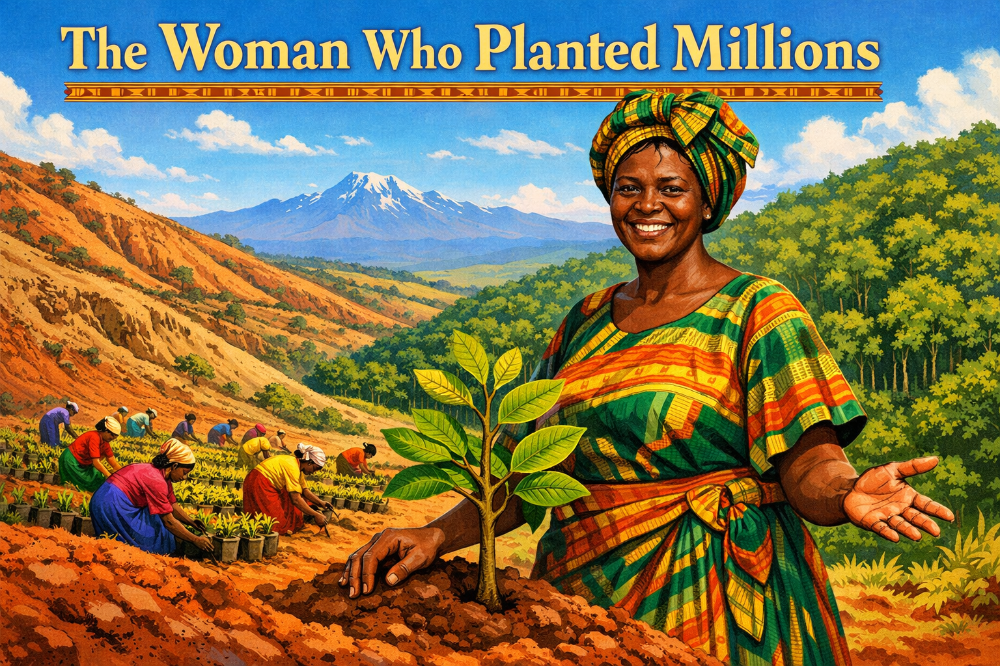

Cover Image Prompt

Please generate a wide-landscape 16:9 cover image for a graphic novel titled "The Woman Who Planted Millions" in a vibrant East African illustrated style — warm earth tones (terracotta, sienna, coffee brown), lush greens, bright sky blues, with patterns inspired by Kenyan textiles (kikoy fabric). Think Ngũgĩ wa Thiong'o book cover illustration meets National Geographic photography. Show Wangari Maathai, a tall, strong-featured Kenyan woman in her early 60s with high cheekbones and a warm, resolute smile, wearing a colorful African wrap dress and a patterned headwrap in greens and golds. She stands on a hillside in the Kenyan central highlands, one hand resting on a young native fig tree she has just planted, the other hand open in a welcoming gesture. Behind her, a panorama stretches from bare, eroded slopes on the left to lush restored forest on the right, symbolizing transformation. Dozens of women in bright dresses work among rows of seedlings in the middle distance. The title text "The Woman Who Planted Millions" is rendered in bold serif typeface at the top. Color palette: terracotta, sienna, coffee brown, emerald green, bright sky blue, gold, with kikoy-stripe accents. Emotional tone: celebration, strength, and hope. Include: (1) Maathai's dignified posture and infectious smile, (2) the young fig tree with fresh green leaves, (3) the contrast between barren hillside and restored forest, (4) women planting seedlings in the background, (5) red Kenyan soil visible on the hillside, (6) Mount Kenya's silhouette on the distant horizon under a wide blue sky. Generate the image immediately without asking clarifying questions.

Narrative Prompt

This is a 12-panel graphic novel about Wangari Maathai (1940–2011), the Kenyan biologist, environmentalist, and political activist who founded the Green Belt Movement in 1977, mobilized tens of thousands of rural women to plant over fifty million trees, and became the first African woman — and the first environmentalist — to win the Nobel Peace Prize in 2004. The story spans from the 1940s through 2011, set in Kenya's central highlands, Nairobi, the University of Nairobi campus, rural tree nurseries, Uhuru Park, and the Nobel ceremony in Oslo. The art style throughout is vibrant East African illustration — warm earth tones (terracotta, sienna, coffee brown), lush greens, bright sky blues, with patterns inspired by Kenyan kikoy textiles. Wangari Maathai should be drawn consistently across panels: a tall, strong-featured Kenyan woman with high cheekbones, warm brown eyes, and a broad, confident smile. She ages from a young girl in the highlands to a student in America, to a professor in Nairobi, to a beaten activist, to a distinguished Nobel laureate — but her upright bearing and fierce warmth remain constant. She often wears colorful African wrap dresses and headwraps. Central themes: environmental restoration through community empowerment, the deep connection between ecological health and human dignity, and the courage to resist a government that saw tree-planting as subversion. The story emphasizes both the ecological science (deforestation, soil erosion, watershed degradation, native biodiversity loss) and the social revolution (women's economic independence, democratic resistance, grassroots organizing).

### Prologue – The Trees Remember

In the highlands of central Kenya, the Kikuyu people had a name for the wild fig tree: *mũgumo*. It was sacred — you did not cut it down. The fig trees held the soil, shaded the streams, and fed the birds whose songs woke the village every morning. When Wangari Maathai was born in 1940, those trees still stood. By the time she returned from studying in America, they were gone — replaced by tea and coffee plantations that made money for a few and left the land bleeding red soil into dying rivers. Maathai decided to put the trees back. The government of Kenya decided to stop her. What followed was one of the most remarkable environmental movements in human history — fought not with lawsuits or laboratories, but with seedlings, women's hands, and a stubbornness that no jail cell could contain.

## Panel 1: A Girl Among the Fig Trees

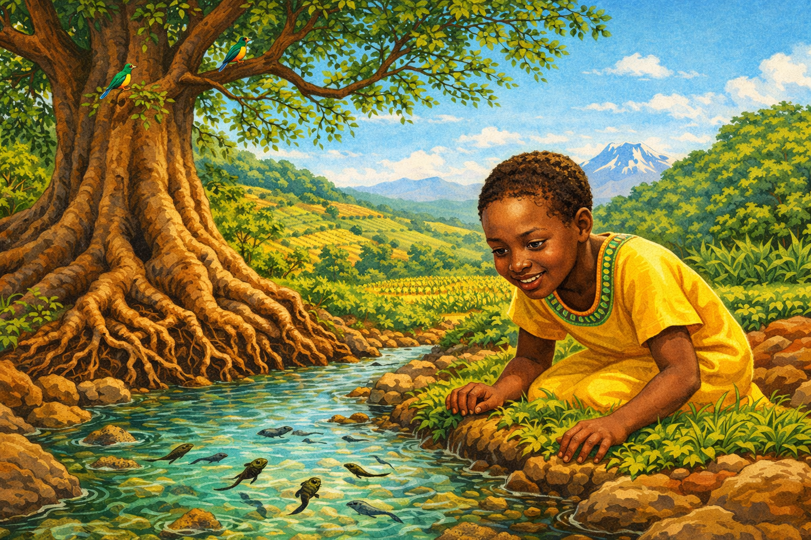

Image Prompt

I am about to ask you to generate a series of images for a graphic novel. Please make the images have a consistent style and consistent characters. Do not ask any clarifying questions. Just generate the image immediately when asked.

Please generate a 16:9 image in vibrant East African illustration style — warm earth tones (terracotta, sienna, coffee brown), lush greens, bright sky blues, with kikoy textile patterns as accents — depicting panel 1 of 12. The scene shows young Wangari Maathai, around age 8, a bright-eyed Kikuyu girl with close-cropped hair, kneeling beside a clear stream in the central highlands of Kenya in the late 1940s. She watches tadpoles in the water with fascination. A massive sacred fig tree (*mũgumo*) towers behind her, its roots holding the stream bank. The landscape is lush — green hills, terraced farms in the distance, birdsong implied by small colorful sunbirds perched in the fig branches. Color palette: deep emerald green, rich brown soil, clear turquoise stream water, bright blue sky, golden sunlight. Emotional tone: childhood wonder and abundance. Specific details: (1) young Wangari's curious, joyful expression as she peers into the water, (2) the enormous gnarled roots of the fig tree gripping the bank, (3) tadpoles and small fish visible in the clear stream, (4) iridescent sunbirds in the fig canopy, (5) a small farm with maize and beans on the hillside behind, (6) Mount Kenya's snow-capped peak visible in the far distance through morning mist. Generate the image immediately without asking clarifying questions.

Little Wangari grew up in Ihithe village in the Nyeri district, where the streams ran so clear you could count the stones on the bottom. She fetched water for her mother and played among the roots of the great fig trees that lined every watercourse. The elders told her the *mũgumo* was sacred — it held the water in the ground and the soil on the hills. She did not yet know the science behind their words. But her body remembered: cool water, dark soil, green shade, and the sound of flowing streams. That memory would change Africa.

## Panel 2: The Kennedy Airlift

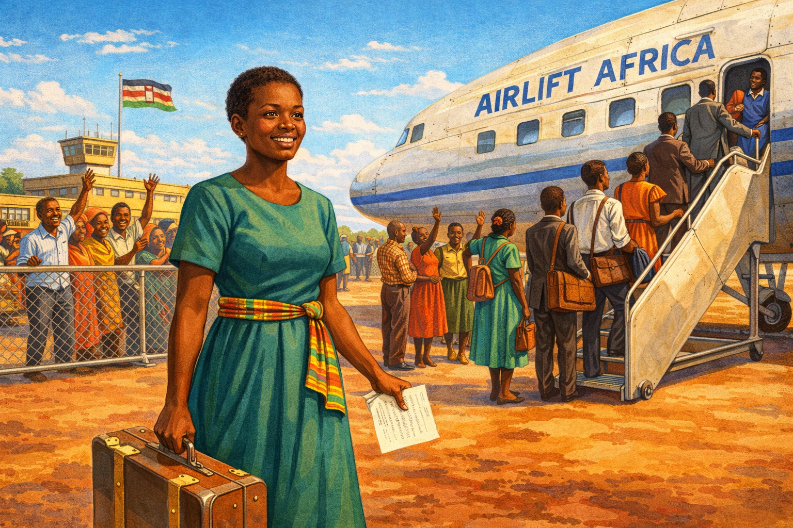

Image Prompt

Please generate a 16:9 image in vibrant East African illustration style — warm earth tones, lush greens, bright sky blues, kikoy textile accents — depicting panel 2 of 12. Make the characters and style consistent with the prior panel. The scene shows young Wangari Maathai, now 20, a tall, striking Kenyan woman with high cheekbones and an eager expression, standing on the tarmac at Nairobi airport in 1960, about to board a charter plane with a group of other young Kenyan students. She wears a modest traveling dress and carries a small suitcase. The plane has "AIRLIFT AFRICA" visible on its side. Other students — men and women, excited and nervous — wave goodbye to families behind a fence. Color palette: warm terracotta airport ground, silver airplane, bright blue sky, colorful clothing on the students, golden afternoon light. Emotional tone: hope, excitement, the threshold of possibility. Specific details: (1) Wangari clutching a letter of admission in one hand and her suitcase in the other, (2) the charter plane on the tarmac, (3) families waving behind a chain-link fence, (4) fellow students in a mix of Western and Kenyan dress, (5) the Kenyan flag (newly designed, pre-independence) visible on a terminal building, (6) the wide open sky suggesting the journey ahead. Generate the image immediately without asking clarifying questions.

In 1960, Wangari Maathai won a scholarship on the "Kennedy Airlift" — a program that flew hundreds of young East Africans to American universities. She landed at Mount St. Scholastica College in Atchison, Kansas, a world away from Nyeri. She studied biology and saw something that stopped her in her tracks: Americans were planting trees on purpose. Soil conservation was a government program, not a dream. Streams were protected by law. She earned her degree, then a master's in biology at the University of Pittsburgh, and carried a question home with her: *If Americans can restore their land, why can't Kenyans?*

## Panel 3: The Land That Forgot Its Trees

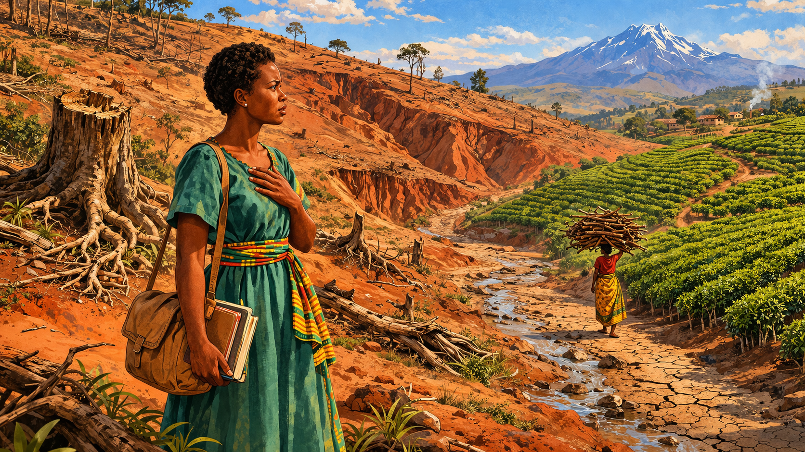

Image Prompt

Please generate a 16:9 image in vibrant East African illustration style — warm earth tones, lush greens contrasted with barren browns, bright sky blues, kikoy textile accents — depicting panel 3 of 12. Make the characters and style consistent with the prior panels. The scene shows Wangari Maathai, now around 26, standing on a hillside in the Kenyan central highlands in the late 1960s, staring in shock at the devastation before her. The once-forested slopes are now bare — red, eroded gullies cut through the hillside. Rows of commercial tea bushes cover the lower slopes in monotonous lines. A dry streambed, cracked and empty, runs through the valley where a stream once flowed. A woman in the distance walks with a massive bundle of firewood on her head. Color palette: harsh terracotta and raw sienna for the eroded earth, dull green for the monoculture tea, washed-out blue sky, muted palette conveying loss. Emotional tone: grief and determination. Specific details: (1) Maathai in a simple dress, one hand over her heart in dismay, (2) deep erosion gullies scoring the bare red hillside, (3) rows of commercial tea or coffee replacing native forest, (4) the empty, cracked streambed, (5) a woman carrying firewood in the far distance, (6) a single tree stump where a fig tree once stood, its roots exposed. Generate the image immediately without asking clarifying questions.

Maathai returned to Kenya with a PhD — the first East African woman to earn a doctorate — and a heart full of plans. But the land she remembered was gone. The colonial government had replaced native forests with commercial tea and coffee plantations. The post-independence government continued the pattern, handing forest land to political allies. Streams that had run year-round were dry. Women walked miles for firewood and clean water. The soil, without roots to hold it, bled downhill in every rain. Maathai understood what had happened in the language of ecology: remove the trees, and you unravel the entire system — water, soil, food, health, and hope.

## Panel 4: Seven Trees on a Hillside

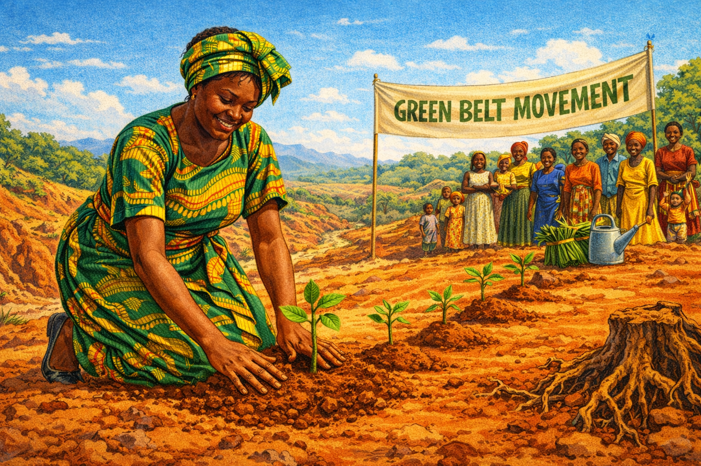

Image Prompt

Please generate a 16:9 image in vibrant East African illustration style — warm earth tones, lush greens, bright sky blues, kikoy textile accents — depicting panel 4 of 12. Make the characters and style consistent with the prior panels. The scene shows Wangari Maathai, now 37, kneeling on a bare hillside on June 5, 1977 — World Environment Day — planting a seedling in red Kenyan soil. Six other small seedlings are already planted in a row behind her, each with a small mound of fresh earth. A small crowd of women and children watch from nearby. Maathai wears a bright green and gold African wrap dress and headwrap, her sleeves rolled up, her hands in the soil. A hand-painted banner reads "GREEN BELT MOVEMENT." Color palette: rich red-brown soil, vivid green seedlings, bright fabrics, golden sunlight, blue sky. Emotional tone: humble beginning, quiet revolution. Specific details: (1) Maathai's hands pressing soil around a tiny seedling, (2) six other seedlings already planted in a line, (3) the hand-painted banner, (4) women in colorful dresses watching and smiling, (5) children peeking from behind their mothers, (6) a watering can and a bundle of seedlings wrapped in banana leaves nearby. Generate the image immediately without asking clarifying questions.

On June 5, 1977 — World Environment Day — Wangari Maathai planted seven trees in a park in Nairobi. It was not a ceremony anyone noticed. No officials attended. No cameras came. But those seven seedlings were the first act of the Green Belt Movement, and they contained an idea so simple it was revolutionary: ordinary women, paid a small fee for every seedling that survived, could reforest an entire country. Maathai did not wait for government funding or international grants. She started with what she had — seeds, soil, and the knowledge that trees hold everything together.

## Panel 5: The Women's Nurseries

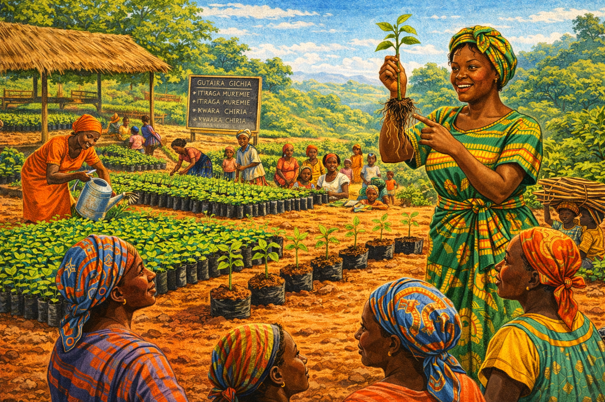

Image Prompt

Please generate a 16:9 image in vibrant East African illustration style — warm earth tones, lush greens, bright sky blues, kikoy textile accents — depicting panel 5 of 12. Make the characters and style consistent with the prior panels. The scene shows a thriving open-air tree nursery in rural Kenya in the early 1980s. Dozens of women in brightly colored dresses and headwraps tend rows of seedlings in polythene tubes arranged on raised beds. Wangari Maathai, now in her early 40s, stands among them teaching, holding up a seedling and pointing to its roots while the women listen intently. The nursery is on a gentle slope with a thatched shelter for shade. Color palette: vivid greens of thousands of seedlings, rich earth browns, bright kikoy colors on the women's clothing, warm golden light. Emotional tone: joy, community, purpose. Specific details: (1) Maathai holding a seedling and explaining root structure, (2) hundreds of seedlings in black polythene tubes, (3) women of various ages smiling and working, (4) a woman watering seedlings with a tin can, (5) a simple chalkboard with tree-planting instructions in Kikuyu, (6) children helping to sort seedlings nearby. Generate the image immediately without asking clarifying questions.

The idea spread like roots through soil. Maathai trained rural women to collect seeds from native trees, grow them in simple nurseries, and plant them on deforested hillsides. For every tree that survived three months, the women earned a small payment — often their first independent income. The genius was in the design: the women were not charity recipients but foresters, nursery managers, and small business owners. They learned to identify native species, prepare soil, and monitor survival rates. Within a few years, thousands of women across Kenya were running Green Belt nurseries, and the seedling count was climbing toward the millions.

## Panel 6: The Government Strikes Back

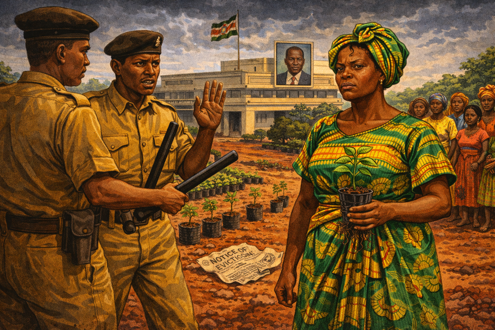

Image Prompt

Please generate a 16:9 image in vibrant East African illustration style — warm earth tones, but darker and more ominous — depicting panel 6 of 12. Make the characters and style consistent with the prior panels. The scene shows Wangari Maathai, now in her late 40s, being confronted by Kenyan government police on a Nairobi street in the late 1980s. Two officers in khaki uniforms block her path. Behind them, a government building displays a portrait of President Daniel arap Moi. Maathai stands tall and defiant, wearing a bright green headwrap, her jaw set, her eyes fierce. Supporters — mostly women — watch from behind, some frightened, some angry. Color palette: muted grays and harsh khaki for the authorities, contrasted with Maathai's vivid green and gold clothing, stormy sky, red soil. Emotional tone: intimidation meeting unbreakable resolve. Specific details: (1) Maathai's defiant stance and direct gaze, (2) the police officers with batons, (3) the portrait of Moi on the government building, (4) women supporters clustered behind Maathai, (5) a crumpled government notice on the ground — an eviction or ban order, (6) a single small seedling in a pot that Maathai carries in one hand, refusing to put it down. Generate the image immediately without asking clarifying questions.

President Daniel arap Moi's government saw Maathai not as a tree-planter but as a threat. A woman who organized rural communities, who gave poor women economic power, who spoke openly about deforestation caused by government corruption — that was dangerous. Officials called her "a crazy woman" and "a threat to the order and security of the country." She was publicly mocked in Parliament. Her marriage was pressured until it collapsed — her husband said she was "too educated, too strong, too successful, too stubborn, and too hard to control." She was beaten by police, arrested, and thrown in jail. She kept planting.

## Panel 7: The Battle for Uhuru Park

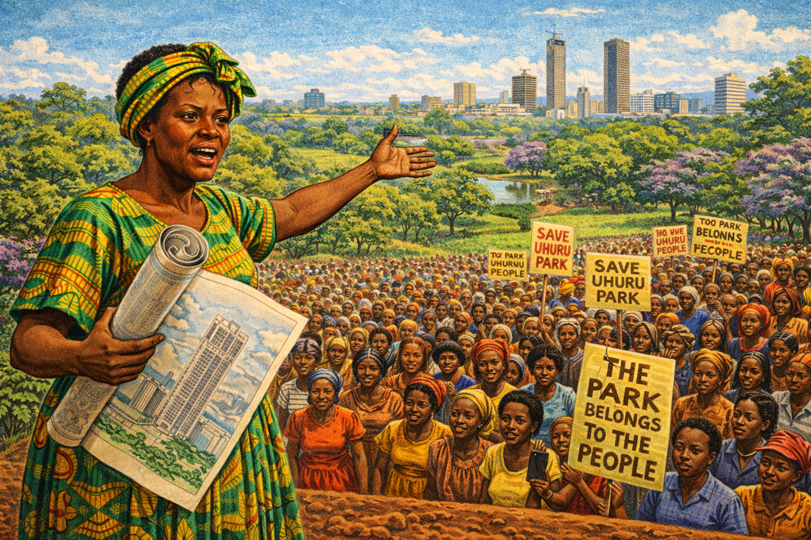

Image Prompt

Please generate a 16:9 image in vibrant East African illustration style — warm earth tones, lush greens, bright sky blues, kikoy textile accents — depicting panel 7 of 12. Make the characters and style consistent with the prior panels. The scene shows Wangari Maathai in 1989 standing before a massive crowd in Uhuru Park, Nairobi, giving a passionate speech against the proposed 60-story Kenya Times Media Trust building that would destroy the park. She holds architectural plans rolled up in one hand and gestures with the other toward the green park behind her. The crowd is a mix of women, students, and workers, many holding hand-painted signs reading "SAVE UHURU PARK" and "THE PARK BELONGS TO THE PEOPLE." The Nairobi skyline is visible in the background. Color palette: lush park greens, bright protest signs in red and yellow, warm terracotta tones in the crowd's clothing, blue sky. Emotional tone: righteous defiance and democratic energy. Specific details: (1) Maathai mid-speech with commanding presence, (2) the crowd stretching back into the park, (3) protest signs in English and Swahili, (4) architectural plans visible showing the proposed tower, (5) Nairobi's skyline behind the park, (6) jacaranda trees in purple bloom along the park edge. Generate the image immediately without asking clarifying questions.

In 1989, President Moi announced plans to build a sixty-story skyscraper — the tallest in Africa — in the middle of Uhuru Park, Nairobi's most beloved green space. The building would house his political party's media empire. Maathai wrote letters, organized protests, and told the international press that a dictator was stealing the people's park. Moi called her "a mad woman" in Parliament. But foreign investors, embarrassed by the publicity, pulled their funding. The tower was never built. Uhuru Park still stands — Nairobi's green heart — because one woman refused to be silent.

## Panel 8: Bloodied but Unbowed

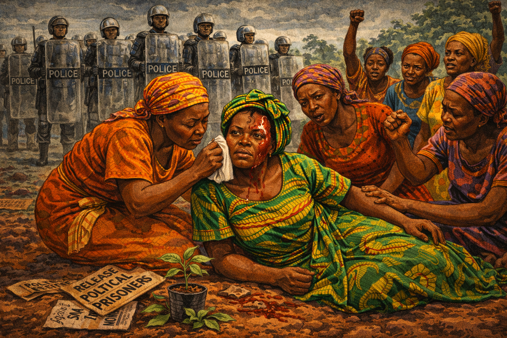

Image Prompt

Please generate a 16:9 image in vibrant East African illustration style — warm earth tones darkened for tension, muted palette — depicting panel 8 of 12. Make the characters and style consistent with the prior panels. The scene shows Wangari Maathai in 1992, sitting on the ground in Uhuru Park after being beaten unconscious by police during a hunger strike for the release of political prisoners. Other women — the mothers of the prisoners — surround her, some tending to her injuries, some raising their fists in defiance. Maathai's green headwrap is askew, there is blood on her forehead, but her eyes are open and fierce. Riot police stand in the background with shields. Color palette: somber earth tones, deep shadows, the women's bright clothing standing out against the gray of the police line, a streak of red on Maathai's face. Emotional tone: pain, solidarity, unbroken courage. Specific details: (1) Maathai on the ground, injured but conscious and defiant, (2) women of the "Release Political Prisoners" group around her, (3) one woman pressing a cloth to Maathai's wound, (4) riot police with shields in the background, (5) trampled protest signs on the ground, (6) a single green seedling in a broken pot nearby — symbolism of resilience. Generate the image immediately without asking clarifying questions.

The beatings did not stop her. In 1992, Maathai joined the mothers of political prisoners in a hunger strike in Uhuru Park. Police attacked them with clubs and tear gas. Maathai was beaten unconscious. Photographs of her bloodied face went around the world. She lost her university professorship. The government froze her bank accounts. She moved into a tiny apartment and kept organizing. When asked why she did not stop, she answered with a question of her own: "It's the people who are suffering. Should I sit and watch?"

## Panel 9: Fifty Million Trees

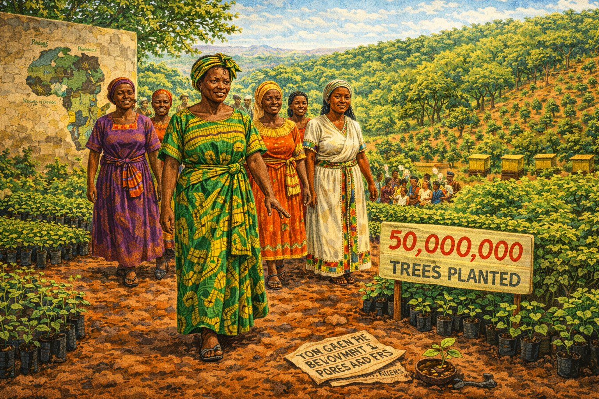

Image Prompt

Please generate a 16:9 image in vibrant East African illustration style — warm earth tones, lush greens, bright sky blues, kikoy textile accents — depicting panel 9 of 12. Make the characters and style consistent with the prior panels. The scene shows a wide panoramic view of the Green Belt Movement's impact across East Africa in the late 1990s. In the foreground, Maathai, now in her late 50s with graying temples, walks through a thriving tree nursery with women leaders from multiple African countries — women from Tanzania, Uganda, Ethiopia, and beyond, distinguishable by their varied traditional dress. Behind them, a hillside shows trees at various stages of growth — from seedlings to young forests. A hand-painted sign reads "50,000,000 TREES PLANTED." Color palette: rich spectrum of greens from seedling to canopy, warm earth browns, brilliant kikoy colors on every woman, golden afternoon light. Emotional tone: triumph and continental solidarity. Specific details: (1) Maathai walking confidently with African women leaders, (2) the painted milestone sign, (3) trees at every growth stage on the hillside, (4) a training session visible in the background with women learning nursery skills, (5) beehives placed among the young trees showing diversified livelihoods, (6) a map of Africa painted on a nursery wall showing Green Belt chapters in multiple countries. Generate the image immediately without asking clarifying questions.

The Green Belt Movement became something no government could contain. It spread from Kenya to Tanzania, Uganda, Ethiopia, and beyond. By the late 1990s, the numbers were staggering: over fifty million trees planted, more than thirty thousand women trained not just in forestry but in beekeeping, food processing, and civic leadership. The movement had become a school for democracy disguised as a tree-planting program. Women who started by growing seedlings ended up running for local office, managing community water projects, and demanding government accountability. Maathai had understood from the beginning what ecologists know: in a healthy system, everything connects to everything else.

## Panel 10: The Streams Return

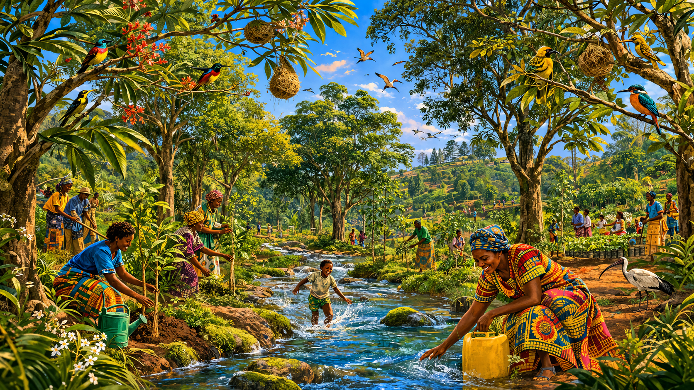

Image Prompt

Please generate a 16:9 image in vibrant East African illustration style — warm earth tones, lush greens, bright sky blues, kikoy textile accents — depicting panel 10 of 12. Make the characters and style consistent with the prior panels. The scene shows a restored watershed in the Kenyan central highlands in the early 2000s. A stream that was dry in Panel 3 now flows again — clear water running over mossy stones. Young native trees line both banks, their roots holding the soil. Birds — sunbirds, weavers, and ibis — fill the branches. A woman fills a water container directly from the stream without walking miles. In the background, reforested hillsides show a mosaic of native species. Color palette: rich emerald greens, clear turquoise water, deep brown soil, bright bird plumage, golden dappled sunlight through the canopy. Emotional tone: ecological healing and quiet joy. Specific details: (1) the flowing stream with clear water over stones — echoing Panel 1, (2) native trees lining the restored banks, (3) colorful birds in the canopy, (4) a woman filling a water jug at the stream's edge, (5) healthy dark topsoil visible at the bank where erosion has stopped, (6) a child wading in the stream, playing just as young Wangari once did. Generate the image immediately without asking clarifying questions.

And the land healed. In watershed after watershed across Kenya, the pattern was the same: plant native trees, and within a decade the streams begin to flow again. The roots held the soil. The canopy slowed the rain. The leaf litter rebuilt the topsoil. The birds returned, and with them the insects that pollinated the crops. Women who had walked four hours for water now filled their jugs from streams a few minutes from home. This was not magic — it was ecology. Maathai had simply given the land back what had been taken: its native trees, its root networks, its capacity to hold water and life.

## Panel 11: The Nobel Prize

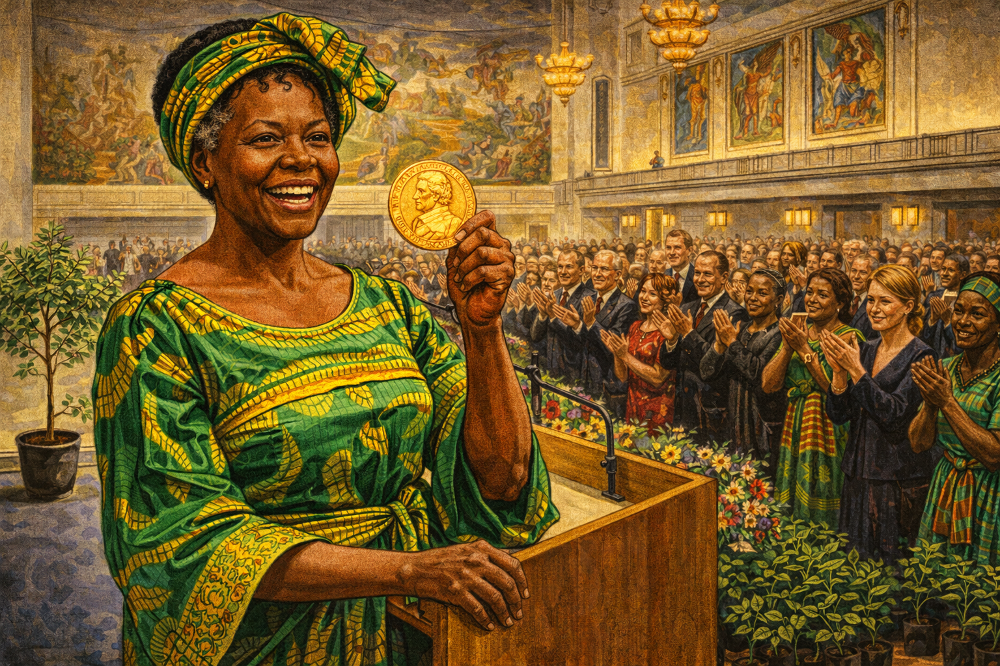

Image Prompt

Please generate a 16:9 image in vibrant East African illustration style — warm earth tones, lush greens, bright sky blues, gold accents for the ceremony — depicting panel 11 of 12. Make the characters and style consistent with the prior panels. The scene shows Wangari Maathai at the Nobel Peace Prize ceremony in Oslo, Norway, December 2004. She stands at the podium in a magnificent emerald-green African gown and gold-embroidered headwrap, holding the Nobel medal. She is 64, with distinguished graying hair visible under her headwrap, high cheekbones, and an incandescent smile. The audience — diplomats, royalty, journalists — fills the ornate Oslo City Hall behind her. Color palette: rich emerald green and gold of her dress, warm wood tones of the hall, golden medal, soft chandelier light, cream and burgundy of the formal setting. Emotional tone: historic triumph, global recognition, personal vindication. Specific details: (1) Maathai's radiant smile as she holds the medal, (2) the ornate interior of Oslo City Hall with murals visible, (3) a standing ovation in progress, (4) the Norwegian royals in the front row, (5) a small potted tree on the stage beside the podium — her request, (6) tears visible on the faces of Green Belt women in the audience who traveled from Kenya. Generate the image immediately without asking clarifying questions.

On October 8, 2004, the Nobel Committee announced that Wangari Maathai had won the Nobel Peace Prize — the first African woman, and the first environmentalist, to receive the honor. The committee said she had taken "a holistic approach to sustainable development that embraces democracy, human rights, and women's rights in particular." When reporters asked for her reaction, Maathai did not talk about herself. She talked about the trees. "We owe it to ourselves and to the next generation to conserve the environment so that we can bequeath our children a sustainable world," she said. Then she went back to planting.

## Panel 12: The Seeds She Left Behind

Image Prompt

Please generate a 16:9 image in vibrant East African illustration style — warm earth tones, lush greens, bright sky blues, kikoy textile accents — depicting panel 12 of 12. Make the characters and style consistent with the prior panels. The scene shows a sunlit hillside in Kenya in the present day, years after Maathai's death in 2011. A new generation of young Kenyan women — teenagers and young adults — plant seedlings on a hillside, continuing the Green Belt Movement. In the foreground, a young girl kneels beside a stream, watching tadpoles — exactly as young Wangari did in Panel 1, completing the visual circle. A mature native forest rises behind them — the trees that Maathai's generation planted, now tall and thriving. A simple stone marker reads: "We are called to assist the Earth to heal her wounds." Color palette: the full vibrant spectrum — rich greens, warm earth tones, bright sky blue, golden light, colorful clothing — the palette at its most alive. Emotional tone: continuity, hope, living legacy. Specific details: (1) the young girl by the stream echoing Panel 1's composition, (2) young women planting seedlings on the hillside, (3) the mature forest planted by Maathai's generation, (4) the memorial stone with her quote, (5) a Green Belt Movement flag flying from a nursery shelter, (6) Mount Kenya visible in the background under a clear sky, the same mountain from Panel 1 — full circle. Generate the image immediately without asking clarifying questions.

Wangari Maathai died on September 25, 2011, at the age of seventy-one. But the Green Belt Movement did not die with her. Today, new generations of women across Africa tend the nurseries, plant the seedlings, and teach the next class of foresters. The trees Maathai planted in the 1970s are now towering canopies sheltering streams that flow year-round. Her life proved something that every ecologist knows but most politicians forget: that the health of the land and the dignity of the people who live on it are the same thing. You cannot restore one without the other. And sometimes the most powerful act of resistance is planting a tree.

### Epilogue – What Made Wangari Maathai Different?

Wangari Maathai did not have a laboratory or a billion-dollar budget. She had seedlings, women's hands, and an ecologist's understanding that everything is connected. She saw what the politicians and the plantation owners could not: that deforestation was not just an environmental problem — it was a human rights crisis, a water crisis, a food crisis, and a democracy crisis, all braided together like the roots of a fig tree. Her genius was in designing a movement that addressed all of these at once. Plant a tree, and you hold the soil. Pay a woman for the tree, and you build her independence. Organize the women, and you build a democracy. Maathai understood feedback loops before she ever used the term.

| Challenge | How Wangari Maathai Responded | Lesson for Today |
|-----------|-------------------------------|-------------------|
| Massive deforestation driven by government corruption | Started small — seven trees — and scaled through community networks | Systemic problems can be addressed with simple, replicable solutions |
| Women excluded from economic and political power | Made women the foresters, nursery managers, and decision-makers | Environmental solutions work best when they empower the people closest to the land |
| Government intimidation, beatings, and imprisonment | Refused to stop; used international media to expose abuses | Courage and transparency can outlast authoritarian power |
| Ecological devastation — eroded soil, dry streams, lost biodiversity | Planted native species and let natural succession restore the watersheds | Nature can heal if we give it back the pieces that were taken |

### Call to Action

You do not have to fly to Kenya to follow Wangari Maathai's example. Look at the land around you. Is there a stream that has been paved over? A hillside that has been stripped? A vacant lot where a forest once stood? Ecological restoration starts with the same question Maathai asked: *What did this place look like before we changed it — and what would it take to bring it back?* You do not need permission from a government or a grant from a foundation. You need a seedling, a patch of soil, and the stubbornness to keep going when someone tells you it cannot be done.

---

*"It's the little things citizens do. That's what will make the difference. My little thing is planting trees."*
— Wangari Maathai

*"In the course of history, there comes a time when humanity is called to shift to a new level of consciousness, to reach a higher moral ground. A time when we have to shed our fear and give hope to each other. That time is now."*
— Wangari Maathai, Nobel Lecture, 2004

*"We owe it to ourselves and to the next generation to conserve the environment so that we can bequeath our children a sustainable world that benefits all."*
— Wangari Maathai

---

## References

1. [Wikipedia: Wangari Maathai](https://en.wikipedia.org/wiki/Wangari_Maathai) — Biography of the Kenyan environmentalist, political activist, and Nobel laureate
2. [Wikipedia: Green Belt Movement](https://en.wikipedia.org/wiki/Green_Belt_Movement) — The grassroots environmental organization Maathai founded in 1977
3. [Wikipedia: Nobel Peace Prize 2004](https://en.wikipedia.org/wiki/2004_Nobel_Peace_Prize) — The award recognizing Maathai's contribution to sustainable development, democracy, and peace
4. [NobelPrize.org: Wangari Maathai — Biographical](https://www.nobelprize.org/prizes/peace/2004/maathai/biographical/) — Official Nobel biography and lecture
5. [Encyclopaedia Britannica: Wangari Maathai](https://www.britannica.com/biography/Wangari-Maathai) — Curated reference overview of Maathai's life and legacy
