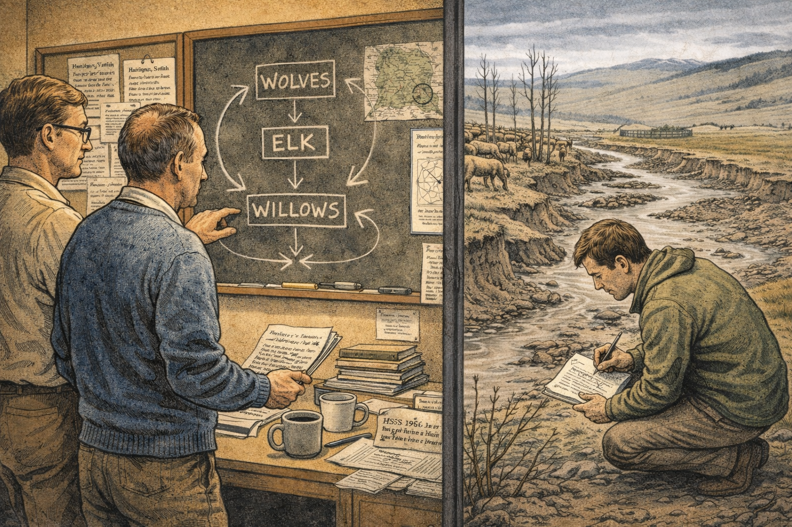
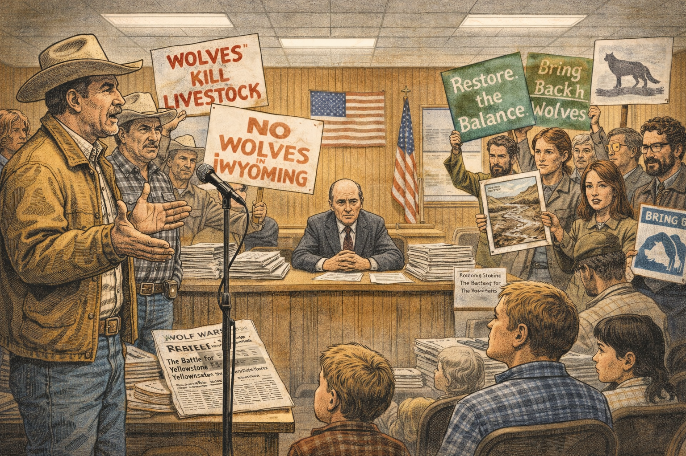
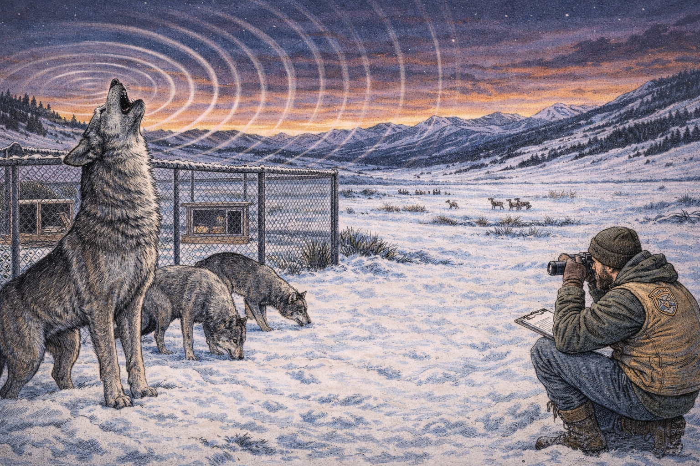
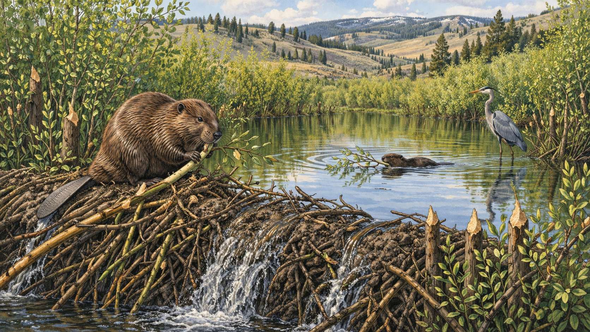

# Wolves, Rivers, and Trophic Cascades

Cover Image Prompt

Please generate a wide-landscape 16:9 cover image in contemporary American naturalist illustration style with a National Geographic field-guide feel. The scene shows a panoramic view of Yellowstone's Lamar Valley at golden hour, with a pack of gray wolves traversing a ridge in the foreground, silhouetted against a sky streaked with amber and deep blue. Below them, a restored river corridor winds through green willows and aspens, with elk grazing cautiously in the middle distance and a beaver dam visible along the creek. Snow-capped peaks frame the background. Include the title text "Wolves, Rivers, and Trophic Cascades" rendered in a rugged serif typeface at the top. Color palette: forest green, amber gold, river blue, wolf gray, snow white. Emotional tone: majestic, hopeful, interconnected. Generate the image immediately without asking clarifying questions.

Narrative Prompt

This is a 12-panel graphic novel about the Yellowstone wolf reintroduction — the most famous trophic cascade in ecological history. The story spans from 1926, when the last wolves were killed in Yellowstone, through the decades of ecological decline, the political battle over reintroduction, the 1995 release of fourteen Canadian wolves, and the extraordinary cascade of ecological recovery that followed. The art style is contemporary American naturalist illustration with a National Geographic field-guide feel: rich earth tones (forest green, amber, river blue, wolf gray), wide landscape compositions emphasizing Yellowstone's dramatic geography. Think Thomas Mangelsen wildlife photography translated into painterly illustration. Recurring characters include Doug Smith, a bearded wildlife biologist in rugged field gear (tan vest, binoculars, radio collar antenna), and the wolves themselves — powerful gray and black animals with intelligent amber eyes. The tone is scientific but awe-struck, written for grades 9-12 students. The central theme is systems thinking: how removing or adding a single species sends ripple effects through an entire ecosystem, changing everything from elk behavior to river morphology.

### Prologue — The Thread That Holds the Web

In 1995, a bearded wildlife biologist named Doug Smith helped carry a metal crate into Yellowstone's Lamar Valley. Inside the crate, a wolf was breathing. It was the first wolf to set foot in the park in nearly seventy years. What happened next would become the most studied, most debated, and most astonishing example of a trophic cascade ever recorded. Wolves did not just change the number of elk. They changed the trees, the birds, the beavers, the fish, and — almost unbelievably — the rivers themselves. This is the story of how one species, removed and then returned, reshaped an entire landscape.

## Panel 1: The Last Wolves

Image Prompt

(This is panel 1.  Do not put the panel number in the image.) I am about to ask you to generate a series of images for a graphic novel. Please make the images have a consistent style and consistent characters. Do not ask any clarifying questions. Just generate the image immediately when asked.

Please generate a 16:9 image in contemporary American naturalist illustration style depicting panel 1 of 12. The scene is set in Yellowstone National Park, 1926. Two park rangers in early-20th-century uniforms (olive drab, flat-brimmed hats, leather boots) stand over a den in a rocky hillside. Two small wolf pups lie motionless at their feet. The rangers look grim but dutiful — they are following orders. In the background, the vast Yellowstone landscape stretches toward the Absaroka Range under a cold gray sky. A wooden sign reads "U.S. National Park Service — Predator Control." Color palette: muted grays, cold blues, faded olive, pale snow on distant peaks. Emotional tone: somber, final, heavy with consequence. Visual details: (1) the rocky den entrance with claw marks, (2) the rangers' rifles slung over shoulders, (3) a logbook in one ranger's hand with tally marks, (4) wolf tracks in the mud leading to the den, (5) a raven perched on a nearby snag watching, (6) distant elk already visible grazing openly on a bare hillside.
Generate the image immediately without asking clarifying questions.

In 1926, park rangers killed the last two wolf pups in Yellowstone. They were not acting out of cruelty — they were following official policy. The United States government had declared war on predators decades earlier, convinced that killing wolves, cougars, and coyotes would protect livestock and boost game populations. Across the West, tens of thousands of wolves were poisoned, trapped, and shot. Yellowstone, supposedly a sanctuary for wildlife, was no exception. The rangers logged the kill and moved on. They had no idea they had just pulled a keystone from the arch of an entire ecosystem.

## Panel 2: The Elk Take Over

Image Prompt

(This is panel 2.  Do not put the panel number in the image.) Please generate a 16:9 image in contemporary American naturalist illustration style depicting panel 2 of 12. Make the characters and style consistent with the prior panel. The scene is set in Yellowstone's Northern Range, 1950s–1960s. Hundreds of elk crowd a river valley, standing shoulder to shoulder, stripping every willow and aspen within reach. The hillsides are bare — no shrubs, no young trees, just cropped grass and exposed soil. Eroded riverbanks crumble into a wide, shallow, braided stream. The landscape looks exhausted. Color palette: dusty brown, pale tan, washed-out green, muddy water, overcast sky. Emotional tone: degraded, monotonous, ecologically impoverished. Visual details: (1) elk chewing the last willow shoots to stubs, (2) bare aspen trunks with no low branches — a visible "browse line" at exactly elk-head height, (3) eroded cutbanks slumping into the river, (4) no beavers, no beaver dams, (5) a single dead cottonwood snag with no songbirds, (6) comparison element — a fenced exclosure in the distance where willows grow tall and green behind wire, showing what the landscape could look like without overbrowsing.
Generate the image immediately without asking clarifying questions.

Without wolves, elk had nothing to fear. They stopped moving. They lingered in the river valleys year-round, eating willows and aspens down to nubs, stripping bark from cottonwoods, and trampling streambanks into mud. Ecologists later called this "ecological release" — when a prey species, freed from predation, explodes in number and hammers its food sources. By the 1950s, Yellowstone's Northern Range looked like a different place. The browse line on aspens told the story: below six feet — the height an elk can reach — nothing grew. Above it, branches survived untouched. The park was being eaten alive from the bottom up.

## Panel 3: The Idea Takes Root

Image Prompt

(This is panel 3.  Do not put the panel number in the image.) Please generate a 16:9 image in contemporary American naturalist illustration style depicting panel 3 of 12. Make the characters and style consistent with the prior panels. The scene is set in a university ecology lab in the late 1960s, transitioning to a Yellowstone field site. On one side, ecologists in a cluttered office examine a chalkboard diagram of a three-level trophic cascade: WOLVES arrow down to ELK arrow down to WILLOWS, with feedback arrows. Papers and journals are pinned to a corkboard, including titles like "Hairston, Smith, and Slobodkin 1960 — HSS Hypothesis" and "Community Structure, Population Control." On the other side, a younger ecologist kneels beside a degraded streambank in Yellowstone, sketching the eroded landscape in a field notebook. Color palette: warm interior lighting (amber, cream) contrasting with the cool degraded landscape outside (gray-green, brown). Emotional tone: intellectual awakening, the birth of an idea. Visual details: (1) the trophic cascade diagram on the chalkboard, (2) a copy of the HSS 1960 paper visible, (3) the ecologist's field notebook with sketches of bare aspens and elk, (4) a map of Yellowstone on the wall with the Northern Range circled, (5) stacked journals and coffee mugs, (6) a window connecting the lab to the landscape outside.
Generate the image immediately without asking clarifying questions.

In 1960, three ecologists — Nelson Hairston, Frederick Smith, and Lawrence Slobodkin — published a landmark paper arguing that predators control herbivores, which in turn controls plants. The idea was elegant: the world is green because predators keep herbivores in check. If you remove the predators, herbivores devour the green. A new generation of ecologists looked at Yellowstone and saw the theory playing out in real time. The park had become an accidental experiment — remove the top predator, watch the system collapse. Quietly, in academic journals and park service memos, a radical idea began to circulate: what if we brought the wolves back?

## Panel 4: The Political Battlefield

Image Prompt

(This is panel 4.  Do not put the panel number in the image.) Please generate a 16:9 image in contemporary American naturalist illustration style depicting panel 4 of 12. Make the style consistent with prior panels. The scene is a heated public hearing in a Wyoming community hall, late 1980s to early 1990s. On one side, ranchers in cowboy hats and work jackets stand at a microphone, faces angry, holding signs reading "Wolves Kill Livestock" and "No Wolves in Wyoming." On the other side, environmentalists and wildlife biologists hold signs reading "Restore the Balance" and "Bring Back the Wolves." In the center, a weary federal official sits behind a long table stacked with comment documents and Environmental Impact Statements. An American flag hangs behind the panel. Color palette: warm wood paneling, blue jeans, plaid flannel, fluorescent overhead lighting, red and white protest signs. Emotional tone: contentious, passionate, democracy in action. Visual details: (1) the rancher at the microphone gesturing emphatically, (2) a wildlife biologist holding up a photo of degraded Yellowstone streambanks, (3) stacks of public comments on the table, (4) a newspaper headline visible — "Wolf Wars: The Battle for Yellowstone," (5) children sitting in the audience watching the adults argue, (6) a wolf silhouette logo on a conservation group's banner.
Generate the image immediately without asking clarifying questions.

Before a single wolf could return to Yellowstone, the idea had to survive politics. Ranchers were furious — wolves would kill cattle and sheep, they said, and the government had no right to unleash predators on their land. Hunting outfitters worried wolves would reduce elk herds and destroy their business. Environmental groups pushed back with ecological data, arguing that the park was dying without its top predator. Congress held hearings. Lawsuits were filed. The Environmental Impact Statement ran to over a thousand pages and drew more than 160,000 public comments — more than any wildlife proposal in American history. The wolves had become a symbol: of wilderness versus ranching, federal power versus state rights, ecology versus economics. It took over a decade of political combat before the decision was finally made.

## Panel 5: The Wolves Arrive

Image Prompt

(This is panel 5.  Do not put the panel number in the image.) Please generate a 16:9 image in contemporary American naturalist illustration style depicting panel 5 of 12. Make the characters and style consistent with prior panels. The scene is set on January 12, 1995, in Yellowstone's Lamar Valley. Wildlife biologist Doug Smith — a tall man in his late 30s with a dark beard, tan field vest, wool cap, and heavy winter boots — helps carry a large aluminum shipping crate off the back of a flatbed truck. Several other biologists and park rangers assist. Through the crate's air holes, a pair of amber wolf eyes gleam in the shadows. Snow covers the ground. The Lamar Valley stretches behind them — vast, white, and waiting. A small crowd of media and officials watches from a distance. Color palette: snow white, steel gray of the crate, forest green parkas, amber wolf eyes, cold winter blue sky. Emotional tone: historic, reverent, a turning point. Visual details: (1) Doug Smith gripping the crate handle with gloved hands, (2) wolf eyes visible through the crate's ventilation slats, (3) steam rising from the biologists' breath in the cold air, (4) a National Park Service truck with the arrowhead logo, (5) the vast Lamar Valley landscape with snow-covered peaks, (6) a small "Yellowstone Wolf Restoration Project" patch visible on Smith's vest.
Generate the image immediately without asking clarifying questions.

On January 12, 1995, fourteen gray wolves from Jasper, Alberta arrived in Yellowstone in aluminum shipping crates. Doug Smith, the young wildlife biologist chosen to lead the wolf restoration project, helped carry the first crate off the truck. He could hear the wolf breathing inside. "We were shaking," Smith later recalled — "not from the cold." After decades of debate, lawsuits, and political warfare, the moment was almost absurdly simple: carry a box into the snow and open the door. The wolves that had been absent for sixty-nine years were coming home.

## Panel 6: First Howls in Lamar Valley

Image Prompt

(This is panel 6.  Do not put the panel number in the image.) Please generate a 16:9 image in contemporary American naturalist illustration style depicting panel 6 of 12. Make the characters and style consistent with prior panels. The scene is set in Yellowstone's Lamar Valley, winter 1995. A chain-link acclimation pen sits in a snowy meadow, and inside it, three gray wolves stand alert — one throws its head back in a full howl, mouth open to the sky. The sound seems to radiate outward in visible ripples across the valley. Outside the pen, Doug Smith crouches at a distance with binoculars and a clipboard, watching intently. The Lamar Valley stretches to the horizon under a twilight sky streaked with deep purple and orange. Other wolves in the pen are sniffing the ground, testing the fence, learning the new smells. Color palette: twilight purples, deep orange sky, snow white, wolf gray and black, dark green conifers on the hillsides. Emotional tone: primal, electrifying, a sound returned after seven decades of silence. Visual details: (1) the howling wolf with head tilted skyward, (2) sound ripples radiating across the valley, (3) Doug Smith crouching with binoculars at a respectful distance, (4) elk in the far background lifting their heads in alarm, (5) the acclimation pen with a feeding station inside, (6) stars beginning to appear in the darkening sky above the Absaroka Range.
Generate the image immediately without asking clarifying questions.

The wolves spent ten weeks in acclimation pens, learning the smells and sounds of their new territory before release. On the first night, one of them howled. The sound rolled across the Lamar Valley — a sound that had not been heard there since 1926. Doug Smith, listening from a distance, felt the hair rise on his arms. Elk grazing on a distant ridge lifted their heads. Something fundamental had shifted. The top of the food web had been restored, and every organism within earshot seemed to know it. Within weeks, the pen gates were opened and the wolves slipped into the wild, fanning out across the Northern Range to begin hunting, denning, and reshaping the ecosystem in ways no one fully anticipated.

## Panel 7: The Ecology of Fear

Image Prompt

(This is panel 7.  Do not put the panel number in the image.) Please generate a 16:9 image in contemporary American naturalist illustration style depicting panel 7 of 12. Make the style consistent with prior panels. The scene is a split composition showing Yellowstone's Lamar Valley in two time periods. LEFT HALF (before wolves, labeled "1990"): elk stand casually in a river valley, chewing willow stubs to the ground, banks eroded, no cover. RIGHT HALF (after wolves, labeled "2000"): the same valley but elk are moving quickly through in a tight herd, heads up and alert, and behind them, young willows and aspens are growing back — chest-high, vivid green. In the right half, a wolf is barely visible on a ridge above, watching. The contrast between the two halves is dramatic. Color palette: LEFT — dusty brown, bare tan, muddy water; RIGHT — vibrant green willows, clear blue water, deep forest green on the ridgeline. Emotional tone: revelation, cause and effect made visible. Visual details: (1) elk on the left relaxed and stationary vs. elk on the right alert and moving, (2) bare willows on the left vs. thriving willows on the right, (3) eroded banks left vs. stabilized vegetated banks right, (4) the barely-visible wolf silhouette on the ridge, (5) a "browse line" visible on aspens on the left, absent on the right, (6) a subtle dividing line or crack down the center separating the two eras.
Generate the image immediately without asking clarifying questions.

The wolves did not simply reduce elk numbers — they changed elk behavior. Ecologists call it the "ecology of fear." With wolves patrolling the valleys, elk could no longer stand in one spot for hours, lazily stripping every willow to the roots. They became vigilant. They moved. They avoided the low-lying areas near rivers where wolves could ambush them. And in those abandoned zones, something remarkable happened: the willows grew back. Aspens sprouted. Cottonwoods recovered. It was not just about how many elk there were — it was about where the elk dared to stand. Fear, it turned out, was an ecological force as powerful as any predator's jaws.

## Panel 8: The Beavers Return

Image Prompt

(This is panel 8.  Do not put the panel number in the image.) Please generate a 16:9 image in contemporary American naturalist illustration style depicting panel 8 of 12. Make the style consistent with prior panels. The scene is set along a Yellowstone creek, early 2000s. A beaver sits on a freshly built dam made of willow branches and mud, gnawing on a thick willow stem. Behind the dam, a new pond has formed — its still surface reflecting surrounding willows and aspens. Along the banks, dense young willows create a green corridor. A second beaver swims across the pond carrying a branch in its mouth. In the background, the broader Yellowstone landscape is visible with its characteristic rolling hills and scattered conifers. Color palette: rich greens, warm browns, clear blue water, golden willow bark, soft afternoon light. Emotional tone: industrious, hopeful, nature rebuilding. Visual details: (1) the beaver gnawing on a willow branch atop the dam, (2) the new pond with reflected vegetation, (3) a second beaver swimming with a branch, (4) dense young willows lining both banks, (5) a great blue heron standing in the shallows of the beaver pond, (6) evidence of beaver-chewed stumps among healthy regrowth.
Generate the image immediately without asking clarifying questions.

When the willows grew back, the beavers came home. Before the wolves were removed, Yellowstone's streams had supported thriving beaver populations. But beavers need willows — they eat the bark, and they build their dams from the branches. When elk destroyed the willows, the beavers disappeared. By the late 1990s, there was only one beaver colony left in Yellowstone's Northern Range. A decade after wolf reintroduction, as willows recovered along the streams, beavers began to recolonize. Their dams created ponds, which created wetlands, which created habitat for fish, amphibians, waterfowl, and insects. Each beaver dam was a tiny ecosystem engine — and the wolves had turned the key.

## Panel 9: A Web of Recovery

Image Prompt

(This is panel 9.  Do not put the panel number in the image.) Please generate a 16:9 image in contemporary American naturalist illustration style depicting panel 9 of 12. Make the style consistent with prior panels. The scene is a richly detailed view of a recovered Yellowstone stream corridor in summer, mid-2000s, teeming with life at every level. The composition is layered to show the full web of species that returned. Color palette: lush greens, wildflower purples and yellows, sky blue, warm browns, dappled sunlight. Emotional tone: abundance, complexity, the joy of a system working. Visual details: (1) a willow thicket along the stream with warblers and flycatchers nesting in the branches, (2) a cutthroat trout visible in the clear stream below an overhanging bank, (3) a red fox hunting voles in the meadow grass, (4) raptors — a red-tailed hawk circling above, (5) wildflowers blooming in the meadow (lupine, Indian paintbrush, arrowleaf balsamroot), (6) a bear in the middle distance turning over a log for insects, (7) dragonflies and butterflies over the stream, (8) the whole scene radiating biodiversity — a sense that every niche is filled.
Generate the image immediately without asking clarifying questions.

The cascade did not stop with beavers. As willows and aspens recovered, songbirds returned — warblers, flycatchers, and sparrows that had lost their nesting habitat decades earlier. Beaver ponds cooled the streams and created pools where cutthroat trout thrived. Berries grew in the recovering understory, feeding bears and small mammals. Raptors hunted the voles and rabbits that multiplied in the new meadow habitat. Scavengers feasted on wolf-killed elk carcasses — ravens, magpies, eagles, and grizzly bears all benefited from the wolves' leftovers. The system was not just recovering — it was complexifying. Every new species that returned created opportunities for others. This is what ecologists mean by a trophic cascade: a change at the top that ripples all the way to the bottom, and then back up again.

## Panel 10: The Rivers Changed Course

Image Prompt

(This is panel 10.  Do not put the panel number in the image.) Please generate a 16:9 image in contemporary American naturalist illustration style depicting panel 10 of 12. Make the style consistent with prior panels. The scene is an aerial-perspective view of a Yellowstone river section showing geomorphological change. The composition is split or transitional: one section shows the old braided, wide, shallow river channel with eroded bare banks (labeled "Before Wolves"), and the other shows the same stretch with a narrower, deeper, more sinuous channel with vegetated, stabilized banks (labeled "After Wolves"). Willow roots visibly grip the banks in the recovered section. The aerial view reveals how dramatically the river's path has changed. Color palette: river blue, earthy brown (eroded banks), rich green (vegetated banks), sandy tan, sky blue. Emotional tone: awe, the incredible reach of ecological connections. Visual details: (1) the eroded section with wide shallow braided channels, (2) the recovered section with a single deep sinuous channel, (3) willow and cottonwood roots gripping the stabilized banks, (4) beaver dams visible along the recovered section, (5) sediment plumes in the eroded section vs. clear water in the recovered section, (6) a small figure of a geomorphologist with surveying equipment on the bank for scale, showing this is being scientifically measured.
Generate the image immediately without asking clarifying questions.

Perhaps the most astonishing discovery was that the wolves changed the rivers. When elk had stripped the riverbanks bare, there were no roots to hold the soil. Banks eroded, channels widened and braided, and the rivers wandered. But as wolves pushed elk away from the valleys and vegetation recovered, roots stabilized the banks. Channels narrowed and deepened. Rivers that had been wide, shallow, and braided became narrower, deeper, and more sinuous. Geomorphologists documented the change with aerial photographs and cross-section surveys. The idea that a predator could alter the physical geography of a landscape — the very shape of a river — stunned even the ecologists who had predicted the trophic cascade. Wolves did not just change the biology of Yellowstone. They changed its geology.

## Panel 11: The Controversy Continues

Image Prompt

(This is panel 11.  Do not put the panel number in the image.) Please generate a 16:9 image in contemporary American naturalist illustration style depicting panel 11 of 12. Make the style consistent with prior panels. The scene is set on the boundary of Yellowstone National Park, present day. A wolf stands at the edge of an open meadow, one paw across an invisible line — the park boundary marked by a fence post and a sign reading "Leaving Yellowstone National Park." Beyond the boundary, ranch land stretches out with cattle grazing. A rancher watches from a pickup truck in the distance. On the park side, Doug Smith (now older, gray in his beard, still wearing field gear) stands with a radio telemetry antenna, tracking the wolf's signal. The composition captures the tension between wildness and human land use. Color palette: park side — rich greens and forest tones; ranch side — golden grassland, fence wire, dusty road. Emotional tone: unresolved tension, the complexity of coexistence. Visual details: (1) the wolf pausing at the boundary, (2) the park boundary sign, (3) cattle visible on ranch land, (4) the rancher's pickup truck in the distance, (5) Doug Smith with telemetry equipment on the park side, (6) a map overlay or inset showing wolf pack territories extending beyond park boundaries.
Generate the image immediately without asking clarifying questions.

The wolves did not read the park boundary signs. As packs grew and dispersed, wolves moved into Montana, Wyoming, and Idaho — and into conflict with ranchers. Livestock kills were real, and for families whose livelihoods depended on cattle and sheep, the losses were not abstract. Compensation programs helped, but they did not erase the anger. Wolves were delisted from the Endangered Species Act, then relisted, then delisted again as lawsuits bounced through federal courts. Hunters in surrounding states pushed for wolf seasons. Conservationists pushed back. Doug Smith, who had spent decades studying the wolves, tried to hold the middle ground, arguing that coexistence was possible but required honesty about costs. "You can't love wolves and ignore the rancher who lost a calf," he said. The ecological story was clear, but the human story remained tangled.

## Panel 12: A Living Laboratory

Image Prompt

(This is panel 12.  Do not put the panel number in the image.) Please generate a 16:9 image in contemporary American naturalist illustration style depicting panel 12 of 12. Make the characters and style consistent with prior panels. The scene is set in Yellowstone's Lamar Valley on a summer morning, present day. In the foreground, a group of college students with binoculars, spotting scopes, and field notebooks kneel on a hillside, watching a wolf pack move through the valley below. A professor points toward the wolves while explaining something. Doug Smith stands nearby, older now, silver-bearded, binoculars around his neck, smiling as he watches the next generation of ecologists. In the valley below, the full recovered ecosystem is visible: wolves, elk moving through green willows, a beaver pond glinting in the sunlight, birds in the aspens, a bear on a far hillside. The Lamar Valley stretches to the Absaroka Range under a wide blue sky. Color palette: full warm summer palette — forest green, wildflower colors, river blue, warm amber sunlight, wolf gray, sky blue. Emotional tone: hopeful, full circle, the power of long-term ecological thinking. Visual details: (1) students with spotting scopes and notebooks, (2) the professor pointing toward wolves, (3) Doug Smith with silver beard and binoculars, (4) wolves visible in the valley below, (5) the full recovered ecosystem — willows, beaver pond, birds, elk, (6) a student's notebook open to a trophic cascade diagram with arrows connecting wolves to elk to willows to rivers.
Generate the image immediately without asking clarifying questions.

Today, Yellowstone's Lamar Valley is the most-watched wildlife landscape in North America. Every summer, thousands of students, scientists, and visitors line the ridges at dawn with spotting scopes, hoping to see what Doug Smith first heard howling in the winter of 1995. The Yellowstone Wolf Project, which Smith led for over twenty-five years, has generated one of the longest and most detailed datasets on predator-prey dynamics in the world. Researchers come from every continent to study how a single species reshaped an entire ecosystem — from the behavior of elk to the chemistry of streams to the course of rivers. Yellowstone has become a living laboratory for trophic cascades, and its lesson is simple and profound: ecosystems are not collections of independent parts. They are webs. Pull one thread, and the whole fabric changes shape. Put it back, and the fabric can heal — in ways no one predicted.

### Epilogue — What the Wolves Taught Us

The Yellowstone wolf reintroduction did not just restore an ecosystem. It changed how ecologists think about ecosystems. Before 1995, most people — including many scientists — imagined nature as a collection of species, each doing its own thing. Yellowstone showed that nature is a system of connections, feedbacks, and cascades. Remove the wolf, and the elk change, and the willows vanish, and the beavers leave, and the rivers erode. Restore the wolf, and the whole cascade runs in reverse. The lesson is not that wolves are magic. The lesson is that connections are real, consequences are far-reaching, and no species exists alone.

| Challenge | How the Scientists Responded | Lesson for Today |
|-----------|------------------------------|-------------------|
| Decades of predator extermination destroyed the park's top-down regulation | Ecologists documented the decline and built the scientific case for trophic cascades | Removing a species is an experiment — whether you intended it or not |
| Political opposition from ranchers, hunters, and politicians nearly killed the reintroduction | Scientists engaged in public hearings, published data, and persisted through a decade of legal battles | Science alone is not enough — you need communication, patience, and political courage |
| The "ecology of fear" was an unexpected mechanism — behavior change, not just population reduction | Researchers tracked elk movement patterns and correlated them with vegetation recovery | Systems produce surprises — watch for indirect effects, not just direct ones |
| Wolves crossing park boundaries created real conflicts with livestock operations | Compensation programs, non-lethal deterrents, and honest dialogue about costs and tradeoffs | Coexistence requires acknowledging that ecological solutions have human consequences |

### Call to Action

The next time you look at a landscape — a river, a forest, a meadow — ask yourself: what is missing? What used to be here? And what would change if it came back? The Yellowstone wolves taught us that ecosystems have memories, and that restoration is possible even after decades of damage. You do not need to be a wildlife biologist to think in trophic cascades. You just need to ask: what is connected to what?

---

*"We didn't just bring back wolves. We brought back an ecological process."*
— Doug Smith, Yellowstone Wolf Project Leader

*"The wolves are doing what wolves do. It's the rest of the ecosystem that's surprising us."*
— Doug Smith

*"In wildness is the preservation of the world."*
— Henry David Thoreau

---

## References

1. [Wikipedia: History of wolves in Yellowstone](https://en.wikipedia.org/wiki/History_of_wolves_in_Yellowstone) — Comprehensive history of wolf extirpation and reintroduction in Yellowstone National Park
2. [Wikipedia: Trophic cascade](https://en.wikipedia.org/wiki/Trophic_cascade) — Overview of trophic cascade theory, including the Yellowstone case study
3. [Wikipedia: Yellowstone National Park](https://en.wikipedia.org/wiki/Yellowstone_National_Park) — General information about the park's ecology, geography, and management history
4. [National Park Service: Wolf Restoration](https://www.nps.gov/yell/learn/nature/wolf-restoration.htm) — Official NPS account of the Yellowstone wolf reintroduction program
5. [Yellowstone Wolf Project Annual Reports](https://www.nps.gov/yell/learn/nature/wolves.htm) — Ongoing monitoring data and research updates from the Yellowstone Wolf Project
